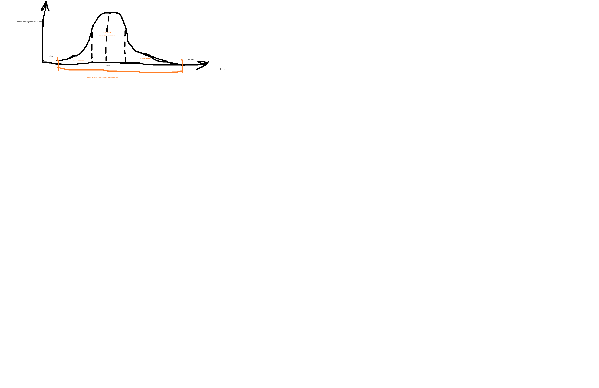
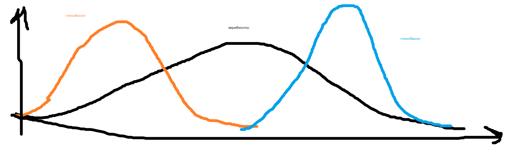
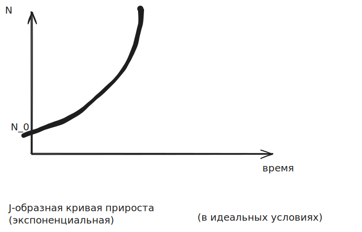
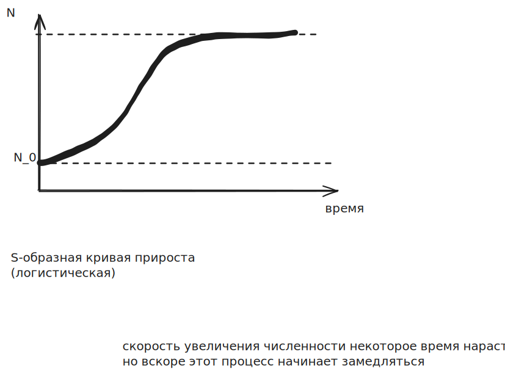

Введение, основные понятия, предметы, задачи экологии
===

__Вопрос 1.__ Определение, предмет, цели и задачи экологии.
Структура современной экологии
---

ойкос (жилище, дом) + логос  
'наука о доме'

Эрнст Геккель - первое упоминание термина (ввел понятие)
1966 г.

"Общая морфология организмов"

наука о взаимодействии живых организмов и их сообществ между собой и с окружающей средой

наука, изучающая условия существования живых организмов и взаимосвязи организмов
друг с другом и средой, в которой они существуют

__Предмет экологии__ - СОВОКупность и структура связей между организмами и средой

Главный объект изучения в экологии - экосистема

Современная экология:
- теоритическая (общая): взаимосвязи в природе (деятельность живых организмов
  на разных уровнях организации)
- прикладная: методы защиты от антропогенных факторов (изучает механизмы разрушения
  биосферы человека, способы предотвращения этого процесса и разрабатывает принципы
  рационального природопользования)

нефть, газ возобновляемы ТЕОРЕТИЧЕСКИ

Общая экология:
---

- Аутэкология: экология особи, вида
- Демэкология: популяции (изменения, отношения внутри популяционной группировки,  
  динамику популяции)
- Синэкология: сообществ (изучает биоценозы)
- Глобальная (биосферы): (Вернадский) взамодействие *-сфер

Другие классификации
---

по объектам изучения:
- растений
- животных
- микроорганизмов
- человека

по средам исследования:
- водоемов
- суши
- воздушной среды

по компонентам изучения:
- тропиков
- умеренной зоны
- полярной

Прикладная экология
---

по отраслям (сфере жизнедеятельности):
- горного производства
- строительства
- энергетики
- транспорта
- сельского хозяйства
- et cetera
- промыслового хозяйства
- биологических ресурсов
- жилищно-бытового хозяйства
- лесной промышленности

__Инженерная экология__ (инженерная защита окружающей среды, экологическая инженерия) --  
это система научно обоснованных инженерных и технических мероприятий, направленных на сохранение качества окружающей среды

Здоровье человека - это основной критерий состояния окружающей
природной среды

Задачи экологии
---
1. анализ физических, химических и биологических параметров
   функционирования природных экосистем и разработка
   методов оценки их устойчивости
   - физ: температура (_тепловое загрязнение_), цвет
2. Исследование, регуляция численности популяции,
   биотического разнообразия и механизмов его поддержания
3. Оценка состояния и динамики природных ресурсов и
   экологических последствий их потребления
4. Разработка и совершенствование методов управления
   качеством окружающей среды
   - Законы
   - Заповедники
   - Создание технологий
     - Переработка мусора
     - Фильтры
5. Экологизация сознания людей. Выработка норм 
   экологической этики и морали
6. Оптимизация экономических, социальных и иных решений
   для обеспечения экологически безопасного устойчивого развития
7. Изучение и прогнозирование изменений биосферы под
   влиянием антропогенных факторов и оценка их экологических последствий

Вопрос 2. Уровни организации живой материи и биологические
системы, изучаемые экологией
---

Все объекты живой природы представляют собой системы,
имеющие...

Уровни организации живой материи:
- молекулярный
- клеточный - структурная единица организации всего живого
- тканево-органный (возможно отдельно)
  - ткани - общая функции
  - органы - целый ряд функций
- организменный (1- или многоклеточные организмы):
  приспособления особи
- популяционно-видовой
- биогеоценотический (биогеоценоз = экосистема)
- биосферный
  - косное (неживое вещество)

---

- Молекулярный: биохимия, биофизика
- Цитология
- Гистология, физиология
- Анатомия, морфология, аутэктолоия
- Генетика, эволюция, общая экология
- Биогеография, биогео
- 

Экологические факторы. Их влияние на организмы. Адаптация организмов
===

Вопрос 1. Экологические факторы
---

Все что влияет на организм

- температурные
- физико-химические
- биологические

элементы обитания, оказывающие постоянное или периодическое
прямое или косвенное влияние на организмы и популяции
называют __экологическими факторами__.

Три группы:

- Абиотические - факторы неживой природы
  - климатические (атмосферные)
  - водной среды
  - эдофические (почвенные) (эдафос - почва)
  - топографические (рельефные)
  - Огонь.

- Биотические - факторы живой природы

  (живые организмы и их непосредственные продукты жизнедеятельности)

  - внутривидовые
    - особенности поведения (иерархия)
    - конкуренция
  - межвидовые: между популяциями
    1. антагонистические
       - хищничество
       - паразитизм
       - конкуренция
    2. неантагонистические
       - симбиоз

       - комменсализм

         форма симбиоза,  
         при которой отношения выгодны  
         преимущественно для 1 из 2 видов,  
         обитающих совместно 

       - мутуализм - форма симбиоза (насекомоопыляемые растения)

- Антропогенные - продукты хозяйственной и иной деятельности
  - положительные: меры предотвращения вреда
  - отрицательные

  - прямые: строительство дороги
  - косвенные: выбросы

Изменения экологических факторов могут быть:
- периодическими (в зависимости от времени суток, сезона)
- непериодическими (внеплановые)
- направленными в течение значительных
  исторических промежутков времени

Экологические факторы характеризуются

- интенсивностью действия

- оптимальностью значения (закон оптимума)

- max/min значениями,

  в пределах которых возможна жизнь конкретного организми

// чем птицы сытее, тем им теплее

> Фактор, значение которого в данный момент  
> находится на пределах выносливости   
> или выходит за них  
> называют __ограничивающим__

Вопрос 2. Основные законы экологии
---

### Закон незаменимости биосферы

это единственная система,  
которая обеспечивает  
устойчивость среды обитания  
при возникающих возмущениях.

(есть предел)

### Закон биогенной миграции атомов  
(В. И. Вернадского)

Миграция химических элементов  
на земной поверхности  
и в биосфере в целом  
осуществляется при непосредственном участии  
живого вещества.

Напр. фотосинтез

### Закон физико-химического единства живого вещества

При всей разнокачественности живых организмов,  
они настольно физико-химически сходны,  
что вредное для одних  
небезразлично для других

(напр. загрязнители)

### Закон 10% (Линдемана)

С одного уровня  
в трофической (пищевой) цепи экосистемы  
может быть передано  
следующему,  более высокому звену  
в среднем не более 10%  
количества энергии  
(вещества в энергетическом выражении).

Соблюдение этого правила не ведет  
к неблагоприятным последствиям для экосистемы  
и теряющего энергию трофического уровня

### Закон оптимума

Любой экологический фактор  
имеет пределы  
положительного влияния  
на живые организмы

_"слишком хорошо - это плохо"_

### Закон толерантности (Шелфорда)

Лимитирующим фактором в процветании организма (вида)  
может быть как минимум, так и максимум экологического воздействия  
диапазон между которыми  
определяет величину  
выносливости (толерантности)  
к данному фактору

Стенобионты - переносят только узкие колебания

Эврибионты - переносят широкие колебания

> Организмы, способные существовать в широких пределах колебания фактора,  
> называют __эврибионтными__.

> Организмы, обитающие в условиях постоянства какого-либо фактора,  
> или их СОВОКупности,  
> называют __стенобионтными__.

### Закон огранического фактора (минимума Либиха)

Бочка Либиха

_"бочка ломается, если одна доска слишком низко"_

Наиболее значим тот фактор,  
который больше всего отклоняется  
от оптимальных для организма значений.  

От него зависит в данный момент выживание особи;

Веществом, присутстующем в минимуме, управляется рост

### Закон (принцим) исключения Гаузе

Два вида не могут существовать  
в одной и той же местности,  
если их экологические потребности идентичны,  
т.е. если они занимают одну и ту же  
экологическую нишу.

### Законы-афоризмы Коммонера

1) Всё связано со всем  

   (о всеобщей связи вещей и явлений;  
    напр. истребление вида)

2) Всё должно куда-то деваться  

   (закон сохранения: энергия, отходы)

3) Природа знает лучше  

   (о главном критерии эволюционного отбора:  
    природоподобные технологии)

4) Ничто не дается даром  

   (о цене развития; за ресурсы планеты)

Популяции
===

Биологический вид - это СОВОКупность особей, обладающих наследственным сходством
морфологических, физиологический и биохимических особенностей,
способных к скрещиванию с образованием плодовитого потомства,
приспособленных к определенным условиям жизни
и занимающим определенную территорию.

Популяция - это СОВОКупность особей одного вида,
длительно (в течение многих поколений) населяющих
определенную территорию, свободно скрещивающихся между собой
и существующих относительно обособленно от других
популяций этого же вида.

Любая популяция занимает определенную экологическую нишу -
ее место в природе.

Пространство, на котором популяция встречается на протяжении
всей своей жизнедеятельности, называется ареалом.

Изучение популяций необходимо для разработки эффективных природоохранных
мероприятий для рационального использования биологических ресурсов.

Показатели популяции
---

1. Численность - число особей в популяции

2. Плотность - число особей популяции
   на единицу площади или объема пространства

3. Рождаемость - число новых особей, появившихся в популяции
   за единицу времени в результате размножения.

   Может быть нулевой или положительной.

   Различает максимальную и фактическую рождаемость.

4. Смертность - число особей, погибших в популяции
   за единицу времени (неблагоприятные факторы среды,
   хищники, болезни, старость)

Структура популяции
---

1. Возрастная

   Соотношение в популяции особей разных возрастных групп

2. Половая

   Соотношение особей мужского и женского пола

3. Пространственная

   Характер распределения особей в пределах ареала

   Типы распределения:

   1. равномерное

   2. неравномерное

   3. случайное

   Оптимальным для популяции является такой интервал
   между соседними особями, при котором они не влияют отрицательно друг на друга,
   но при котором и не остается недоиспользованного пространства.

   По типу использования пространства все подвижные животные
   подразделяются на
   - оседлых
   - кочевых

4. Этологическая (поведенческая)

   Система взаимоотношений между членами популяции

   По форме совместного существования животных
   выделяют
   - одиночный образ жизни
   - семейный
   - колониями
   - стаями
   - стадами

Знание структуры популяции позволяет оценить не только состояние популяции
в данный момент, но и представить направление
ее дальнейших изменений.

Скорость роста популяции. Биотический потенциал
---

<!-- Любая популяция... -->

Биотический потенциал отражает теоретический максимум потомков
от одной пары (или одной особи) за единицу времени, напр. за год
или за весь жизненный цикл.

$$r = \frac{ \Delta N }{ N_0 \Delta t }$$

Скорость роста популяции - изменение численности популяции
в единицу времени.

Может быть положительной, нулевой, отрицательной.

Может быть выражена в виде кривой роста популяции.

Существует две основные модели роста популяции

Предельная плотность, которую может достигнуть
популяция в данных условиях, называют __ёмкость среды__.

Популяция организмов обладает способностью к естественному
регулированию численности (плотности).

Тенденция популяции поддерживать внутреннюю стабильность
с помощью собственных регулирующих механизмов
называется __гомеостазом__ (динамическое равновесие).

Выделяют 3 механизма торможения численности популяции

1. Повышается частота контактов между особями -> стрессовое состояние -> --рождаемость -> ++сметрность

2. Усиливается миграция в новые местообитания -> менее благоприятные условия -> повышается смертность

3. Происходит изменение генетического состава популяции (и отсюда напрямую уменьшение рождаемости)

Биоценозы. Экосистемы
===

Основные понятие синэкологии - биоценоз, биотоп, экологическая ниша
---

Синэкология - многовидовые ценозы

Определенные виды соседствуют с определенными.

Биоценоз

биос - жизнь

ценоз - общий

> __Биоценоз__ - исторически сложившаяся СОВОКупность животных, растений, грибов
> и микроорганизмов, населяющих относительно однородное жизненное
> пространство (определенный участок суши/акватории), связанных между собой
> а также окружающей их средой.

Термин предложен в 1877 г

К. Мёбиусом

изучал места обитания устриц

Это определено исторически (эволюцией)

> __Биотоп__ - тот участок, который занимает биоценоз
>
> место обитания биоценоза

топос - место

> Положение вида, которое он занимает в общей системе биоценоза
> в комплексе его биоценотических связей и требований к абиотическим факторам
> среды называют __экологической нишей__ вида

ниша != местообитание

Фундаментальная ниша - весь набор условий, потенциальные возможности вида

Реализованная ниша - фактическая, ограниченная

Структура биоценоза
---

- видовая
  - число разных видов (образующих) входящих в данный биоценоз
  - соотношение их численности или массы
- пространственная
- трофическая

### видовая

Виды, преобладающие по численности, являются
__доминантами__ (массовые виды) сообщества

- видовое ядро сообщества

> среди доминантных видов выделяются те, которые своей жизнедеятельностью в
> наибольшей степени создают среду для всего сообщества и без которых поэтому
> существования большинства других видов невозможно.
> Их называют __эдификаторами__ (букв. с лат. - _строители_)

если их убрать то изменятся условия!

редкие и малочисленные виды создают резерв для замещения доминантов при
изменениях среды

### пространственная

распределение организмов разных видов в пространстве,
по вертикали и по горизонтали

пространственная структура наземного биоценоза определяется прежде всего
сложением его растительной части - __фитоценоза__

вертикальная __ярусность__ у растений

- мхи, лишайники
- травы
- кустарничково-травянистый ярус
- кустарники
- деревья

горизонтальная структура - __мозаичность__

напр. какими группами передвигаются животные

### трофическая

(пищевые цепочки)

связь между компонентами экосистемы,
возникающая на основе пищевых отношений
и способов получения энергии

Каждый биоценоз включает представителей следующих экологических групп
организмов:

1. Продуценты
   - (производители)
   - автотрофные организмы
     - _сам создаю себе питание_
   - создают органические вещества из неорганических
     - в процессе фотосинтеза образуют орг. вещества
   - в основном это растения
   - есть еще цианобактерии
   - их деятельность определяет исходное накопление органических веществ
     в биоценозе
2. Консументы
   - (потребители)
   - гетеротрофные организмы
   - питаются готовым органическим веществом
   - роль: их деятельность способствует превращению и перемещению
     органических веществ в биоценозе, частичной их минерализации,
     а также рассеиванию энергии, накопленной продуцентами