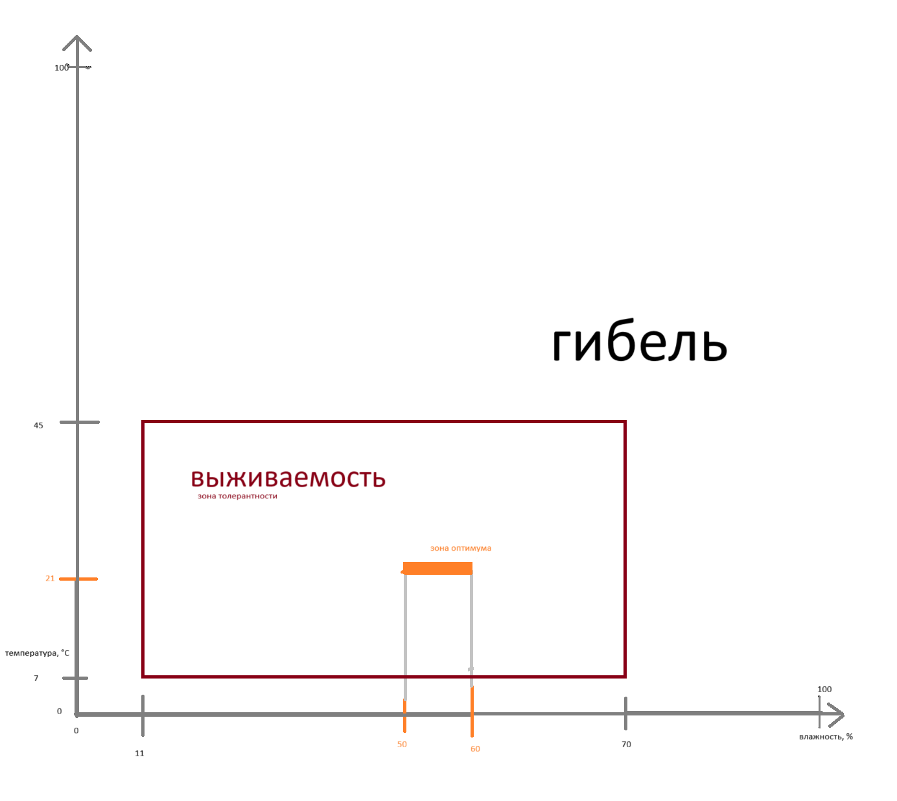

Задания по аутэкологии
===

- правило минимума (Либиха) - ограничивающий фактор
- правило оптимума (Шелфорда) - вредны и недостаток и избыток
- толерантность - диапазон переносимых значений фактора
- экологическая ниша (Хатчинсон) - зоны толерантности по комплексу факторов
- стенобионтность - узкая приспособленность
- эврибионтность - широкая приспособленность

Задача I
---

<!-- 1. Вид 3 и 4 имеют довольно значительное пересечение
   зоны толерантности
   по факторам температуры и влажности.

   Из этого можно сделать вывод: они занимают одну и ту же
   экологическую нишу.

   Они не могут сосуществовать на одной территории,
   поскольку будут конкурировать за ресурсы. -->

1. Вид 1 и 2 не пересекаются по потребностям ни в
   температуре, ни во влажности.

   Виды 2 и 4 имеют небольшое пересечение по влажности,
   но не по температуре.

   На местности эти факторы слабо варьируются,
   поэтому на близких расстояниях эти виды
   не смогут сосуществовать.

   виды 1 и 4 имеют пересечение по обоим факторам,
   поэтому могут сосуществовать.

2. Согласно графику, влажность ограничивает распространение
   вида 3 сильнее, чем тепмература.

   Вообще, можно говорить о его __эвритермности__ (см. ниже)

3. Б**о**льшую площадь белого квадрата занимает
   зона толерантности вида 1, следовательно, он
   наиболее приспособлен к указанным условиям.

4. Вид 3 можно считать эвритермным
   (широко приспособленным к температуре),
   т.к. его зона толерантности - вся ось температуры (0-40 $\degree C$)

   Остальные можно считать стенотермными, относительно вида 3.

Задача II
---

Учитывая приведенные факторы, можно предложить хранить зерно
при температурах ниже $5 \degree C$, напр. при помощи
холодильников.

Повышать температуру слишком затратно,
менять влажность трудно.

Задача III
---

1. 
  - 1 - температура
  - 2 - температура
  - 3 - влажность

2. оптимум достигается при влажности ~65-85% и температурах ~10-25 $\degree C$

3. вид гибнет при температурах ниже $2.5 \degree C$ и выше $40 \degree C$;

   при влажности ниже 20%. Однако, он способен выжить при влажности практически 100%.

Задача 1.6.2
---

- Лиса: 6-10 кг.
  - Кролики: 60-100 кг.
    - Трава: 600-1000 кг.
  - Мыши: 60-100 кг.
    - Трава: 600-1000 кг.
    - Ягоды: 600-1000 кг.
  - Тушканы [?]: 60-100 кг.
    - Ягоды: 600-1000 кг.

- Ястреб: 750-1300 г. (0.75-1.3 кг)
  - Мыши: 7500-13000 г. (7.5-13 кг)
    - Трава: 75-130 кг.
    - Ягоды: 75-130 кг.
  - Тушканы [?]: 7500-13000 г. (7.5-13 кг)
    - Ягоды: 75-130 кг.

- Сова: 2.1 - 3.2 кг.
  - Мыши: 21 - 32 кг.
    - Трава: 210 - 320 кг
    - Ягоды: 210 - 320 кг
  - Тушканы [?]: 21 - 32 кг.
    - Ягоды: 210 - 320 кг

- Синица: 14 - 21 г
  - Тля: 140 - 210 г
    - Ягоды: 1400 - 2100 г
    - Листва: 1400 - 2100 г
  - Гусеницы: 140 - 210 г
    - Листва: 1400 - 2100 г