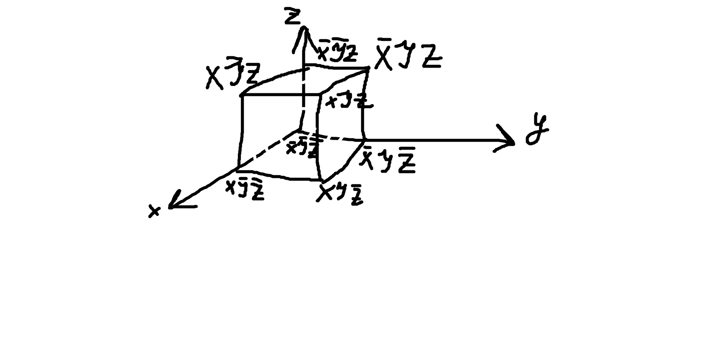

в зависимости от результатов на контрольной:
- экзамен по билетам
- среднее по контрольным

решебник

один типовик из 10 задач

делать когда скажут и в порядке который скажут

ссылки на маил ру! :(

Лекция 1. Алгебра высказываний 01.09.2025
===

План лекции:
- __1.1__ Историческая справка
- __1.2__ Понятие высказывания. Полное и неполное высказывание.
- __1.3__ Логические выражения и логические операции над высказывании.
- __1.4__ Равносильность логических операций
- __1.5__ Формулы алгебры высказываний. Функции алгебры высказываний.


Джордж Буль

равнозначность

парадокс Рассела (лжеца)

__1.2__ Понятие высказывания
---
Объектом алгебры логики являются простые высказывания

__Определение:__ Высказывание - это повествовательное предложение, выражающее суждение

Если суждение, составляющее содержание или смысл, истинно, то все высказывание будет истинно;
в противном случае ложно.

Истинность или ложность - это логическое значение высказывания

Примеры:

- А1: Волга впадает в Каспийское море (истина)
- А2: Число 20 делится на 100 без остатка (false)
- А3: Ура! Лето! (не высказывание)

Высказывания
- простые
- составные
  - совокупность простых посредством логических связок

1.3 Логические выражения.
---
__Определение:__ Логическое выражение это символическая запись, состоящая из логических величин
(констант или переменных), объединенных логическими операциями (связками)

$ \lambda(A) = \begin{cases}0\\1\end{cases} $

<!-- большая фигурная скобка -->

$2^n$, где n - кол-во входных переменных

n-арные операции

### 1. Логическое НЕ (отрицание, инверсия) ###

А с чертой на верху

$\overline{A}$

<!-- -, A -->

$\neg A$

$A'$

A|not A
-|-
0|1
1|0

### 2. Логическое И (конъюнкция)

A^B=min(A,B)

A&B

$A \cdot B$ // deprecated

AB

A|B|A^B
-:|-:|-:
0|0|0
0|1|0
1|0|0
1|1|1

### 3. Логическое ИЛИ (дизъюнкция, aka логическое сложение (deprecated))

A v B = max(A, B)

$A \lor B$

A|B|A v B
-:|-:|-:
0|0|0
0|1|1
1|0|1
1|1|1

### 4. Исключающее ИЛИ (строгая дизъюнкция; суммирование по модулю 2; сумма Жегалкина)

A (+) B

$A \oplus B$

 A| B|A(+)B
-:|-:|--:
 0| 0|  0
 0| 1|  1
 1| 0|  1
 1| 1|  0

### 5. Если... то... (импликация)

A -> B

A - посылка

B - истина

экспертные системы

формальные языки и грамматики

логические выводы (основы ИИ)

 A| B|A->B
-:|-:|--:
 0| 0|  1
 0| 1|  1
 1| 0|  0
 1| 1|  1

### 6. Равносильность (эквиваленция)

A ~ B

A === B ($A \equiv B$)

A <-> B

 A| B|A~B
-:|-:|--:
 0| 0|  1
 0| 1|  0
 1| 0|  0
 1| 1|  1

### 7. Обратная конъюнкция И-НЕ (штрих Шеффера)

A ' B

 A| B|A'B
-:|-:|--:
 0| 0|  1
 0| 1|  1
 1| 0|  1
 1| 1|  0

### 8. Обратная дизъюнкция ИЛИ-НЕ (стрелка Пирса, ф-ция Вебба) A \|/ B

 A| B|A\|/B
-:|-:|--:
 0| 0|  1
 0| 1|  0
 1| 0|  0
 1| 1|  0

1. NOT
2. AND
3. OR
4. IMPLY
5. EQV
6. XOR
7. NOT AND
8. NOT OR

Все высказывания (переменные), подающиеся на вход лог. операции, наз-ся
пропозициональными переменными, а все логические операции, использующиеся в
лог. выражениями, наз-ся пропозициональными связками

Выражение, построенное из пропозициональных переменных с использованием
пропрозициональных связок наз-ся пропозициональной формой, или логической формулой

Пример.

```
    1    2     6   3   5    4
((A v B) -> C) ~ (A^C) v (D(+)C)
```

lambda(A) = 1
lambda(B) = 0
lambda(C) = 1
lambda(D) = 0

```
((1 v 0) -> 1) ~ (1^1) v (0(+)1)

(1 -> 1) ~ (1) v (1)

1 ~ 1

1
```

```
D = A^(A^B -> not C) v not A ^ B
lambda(D) = 0

lambda(A^(A^B -> not C)) = 0
AND
lambda(not A ^ B) = 0

lambda(A) = 0
OR
lambda(A^B -> not C) = 0

lambda(A^B) = 1
lambda(not C) = 0
lambda(C) = 1
lambda(A) = 1
lambda(B) = 1
```

1.4 Равносильность логических операций
---

      1   3   2
A = (x~y) -> (xz)

      2              1
B = x((not y) v z) v (not x)y
     1        3    6        5

x|y|z| x ~ y | xz | A(3) | not x | not y | not y v z | x(not y v z) | not x y | B(6)
-|-|-|-------|----|------|-------|-------|-----------|--------------|---------|-----
0|0|0| 1     | 0  | 0    | 1     | 1     | 1         | 0            | 0       | 0
0|0|1| 1     | 0  | 0    | 1     | 1     | 1         | 0            | 0       | 0
0|1|0| 0     | 0  | 1    | 1     | 0     | 0         | 0            | 1       | 1
0|1|1| 0     | 0  | 1    | 1     | 0     | 0         | 0            | 1       | 1
1|0|0| 0     | 0  | 1    | 0     | 1     | 1         | 1            | 0       | 1
1|0|1| 0     | 1  | 1    | 0     | 1     | 1         | 1            | 0       | 1
1|1|0| 1     | 0  | 1    | 0     | 0     | 0         | 0            | 0       | 0
1|1|1| 1     | 1  | 1    | 0     | 0     | 1         | 1            | 0       | 1

(равносильно)

Второй способ проверки равносильности формул

это можно доказать через формулы равносильности алгебры высказываний

существуют для всех логических операций основные законы алгебры логики,
благодаря которым устанавливается равносильность между формулами.

Также данный способ помогает найти упрощенный равносильный вид
исходной формулы

    #include дискретка
    or in tg chan

__Пример:__ упростить логическое выражение.

1) `X & Y | X & NOT(Y) & Z | NOT(Y) & X & NOT(Z) | X & NOT(Z)` =  
   // по закону коммутативности меняем местами X и NOT(Y)

   `X & Y | X & NOT(Y) & Z | X & NOT(Y) & NOT(Z) | X & NOT(Z)` =  
   // по закону склеивания для 2й и 3й конъюнкции (И)

   `XY | X & NOT(Y) | X & NOT(Z)` =  
   // по закону дистрибутивности (вынесем за скобку X)

   `X & (Y | NOT(Y) | NOT(Z) )` =  
   // Y or NOT Y = 1

   `X & (1 | NOT(Z) )` =  
   // 1 or Z = 1

   `X & 1` =  
   `X`  // ответ

   Другой путь:

   `X & Y | X & NOT(Y) & Z | X & NOT(Y) & NOT(Z) | X & NOT(Z)` =  
   // по закону диствибутивности вынесем X & NOT(Y) за скобку

   `X & Y | X & NOT(Y) & (Z | NOT(Z) ) | X & NOT(Z)` =  ... то же самое

2) `((X | Y) & NOT(X)) | (NOT(X | Y) & NOTNOT(X))` =  
   // во 2 скобке снимаем инверсию над дизъюнкцией (де морган)  
   // и двойное отрицание

   `((X | Y) & NOT(X)) | (NOT(X) & NOT(Y) & X)` =  
   // 2-ая скобка: not X and X and Y = 0 and Y = 0

   `((X | Y) & NOT(X)) | 0` =  
   // 1ая скобка: закон дистрибутивности

   `X and not X or y and not X` =  
   `False or y and not X` =  
   `y and not X`  // Ответ  
   `not X and Y`

3)
   `not ((X or Y) -> not (Y or Z))` =

   // Снимаем импликацию

   `not (not (X or Y) or not (Y or Z))` =

   // Де морган

   `((X or Y) and (Y or Z))` =

   // Фонтанчиком 

   `XY or XZ or YY or YZ` =

   // идемпотентность: YY = Y

   `XY or XZ or YZ or Y`

1.5 Формулы алгебры логики. Функции алгебры логики
---

__Определение.__ __Логическая функция__ - в которой переменные принимают
только два значения: истина и ложь (логические 1/0)

$ f : A \rightarrow B $

A = B = {0; 1}

$ f(x) = \begin{cases} 0 \\ 1 \end{cases} $

$ f(x_1; ...; x_n) = \begin{cases} 0 \\ 1 \end{cases} $ => булевый результат

истинностное (логическое) значениение ф-ции;  
выходной сигнал

булевые переменные (var)  
пропозициональньные  
входные сигналы

> Если функция на определенных значениях входных сигналов принимает значение истина,
> то такая функция называется выполнимой
>
> Если принимает значение 0 - то опровержимой

> Если на каждом значении входных сигналов значение функции = 1,
> то такая ф-ция называется тождественно истинной (__тавтологией__)

> Если на любых входных наборах значение функции = 0,
> то такая ф-ция называется тождественно ложной (__противоречие__)

Число всевозможных функций алгебры логики (сокр. ФАЛ) равно $ 2^{2^n} $,
где n - кол-во входных переменных

напр.

n = 2

2^2^2

Графически функцию алгебры логики можно представить в виде многомерного куба



> Если две функции алгебры логики принимают на всевозможных на борах входных
> 
> сигналов одинаковые значения, то такие ф-ции наз-ся равными.

Функция алгебры логики от n переменных

ФАЛ: $ f(x_1; x_2; ...; x_{i-1}; x_{i}; x_{i+1}; ...; x_n) $
существенно зависит от x_i если имеет место соотношение:

$ f(x_1; x_2; ...; x_{i-1}; 0; x_{i+1}; ...; x_n) \neq f(x_1; x_2; ...; x_{i-1}; 1; x_{i+1}; ...; x_n) $

в противном случае говорят, что он x_i ф-ция зависит несущественно
и x_i является __фиктивным аргументом__

ФАЛ не изменится, если к ее аргументам дописать любое кол-во
фиктивных или удалить из ФАЛ ее фиктивные аргументы.

### Алгоритм поиска фиктивных переменных

1) Представить ФАЛ в табличной форме

2) Множество входных наборов ф-ции разбить на 2 подмножества:

   На котором ф-ция выполнима, и на котором опровержима

3) Из каждого подмножества вычеркивают столбец, соответствующий
   проверяемой переменной

4) Полученных удалением столбца подмножествах проверяют,
   не появились ли одинаковые наборы значений
   
   (сравнение идет между подмножествами)

5) Если таких наборов не появилось, то проверяемый аргумент является фиктивным.

Пример

x1 | x2 | x3 | x4 | f(x1, x2, x3, x4)
-|-|-|-|-
0|0|0|0| 0
0|0|0|1| 0
0|0|1|0| 0
0|0|1|1| 0
0|1|0|0| 1
0|1|0|1| 1
0|1|1|0| 0
0|1|1|1| 0
1|0|0|0| 0
1|0|0|1| 0
1|0|1|0| 0
1|0|1|1| 0
1|1|0|0| 1
1|1|0|1| 1
1|1|1|0| 1
1|1|1|1| 1

выполнима:

x1 | x2 | x3 | x4 | f(x1, x2, x3, x4)
-|-|-|-|-
0|1|0|0| 1
0|1|0|1| 1
1|1|0|0| 1
1|1|0|1| 1
1|1|1|0| 1
1|1|1|1| 1

опровержима:

x1 | x2 | x3 | x4 | f(x1, x2, x3, x4)
-|-|-|-|-
0|0|0|0| 0
0|0|0|1| 0
0|0|1|0| 0
0|0|1|1| 0
0|1|1|0| 0
0|1|1|1| 0
1|0|0|0| 0
1|0|0|1| 0
1|0|1|0| 0
1|0|1|1| 0

Проверяем 3 переменную

x1 | x2 | x3 | x4 | f(x1, x2, x3, x4)
-|-|-|-|-
0|1||0| 1
0|1||1| 1
1|1||0| 1
1|1||1| 1
1|1||0| 1
1|1||1| 1

x1 | x2 | x3 | x4 | f(x1, x2, x3, x4)
-|-|-|-|-
0|0||0| 0
0|0||1| 0
0|0||0| 0
0|0||1| 0
0|1||0| 0
0|1||1| 0
1|0||0| 0
1|0||1| 0
1|0||0| 0
1|0||1| 0

x3 - не фиктивен (0 1 0)

> У __тавтологии__ и __противоречия__ нет фиктивных аргументов (?)

### Логический базис

Логическая формула (функция) может быть реализована над некоторым базисом.

> __Логический базис__ - минимальное кол-во операций для реализации любой булевой функции

Т.е. любую ФАЛ посредством равносильных преобразований
можно привести к ее реализации базисными элементами.

### Примеры логических базисов:

1. Дизъюнктивный базис Буля: NOT, OR (A -> B = NOT(A) OR B)
2. Конъюнктивный базис Буля: NOT, AND
3. Базис Буля: NOT, AND, OR
4. Базис Жегалкина: 1; XOR; AND

Лекция 2. Формы представления высказываний. 8.09.2025
===

> [!CAUTION]
> ---
> 23-го сентября контрольная на лекции!

План лекции:
- 2.1 Дизъюнктивные и конъюнктивные нормальные формы: ДНФ и КНФ
- 2.2 Совершенные нормальные формы: СДНФ и СКНФ

2.1 Дизъюнктивные и конъюнктивные нормальные формы: ДНФ и КНФ
---

> __Нормальная форма__ - синтаксически однозначный способ,
> реализующий данную функцию

> Любая n-местная функция является __однозначно определенной__, если достоверно
> известно, на каких входных наборах ф-ция выполнима, а на каких -
> опровержима.

$ 2^{2^n} $

> Формула называется __элементарной конъюнкцией__, если она является
> конъюнкцией переменных или инверсией переменных
> 
> (может быть одночленной!)

Напр. A, AB, NOT(A)B; ...

> Формула, представляющая собой дизъюнкцию элементарных конъюнкций,
> называется __дизъюнктивной нормальной__.

Напр. ДНФ:

A1 or not A2; A1 and not A2 and A3 or not A1 and A2 and A3; ...

### Теорема 2.1.

> Для любой формулы U можно найти равносильную ей формулу V, являющуюся ДНФ

__Пример.__

F = not (x * not y or y * not z)

// снимаем инверсию над дизъюнкцией

F = not (x * not y) and not (y * not z)

F = (not x or y) and (not y or z)

not x * not y or not x * z or (y * not y) or y * z

not x * not y or not x * z or 0 or y * z

not x * not y or not x * z or y * z

// ДНФ