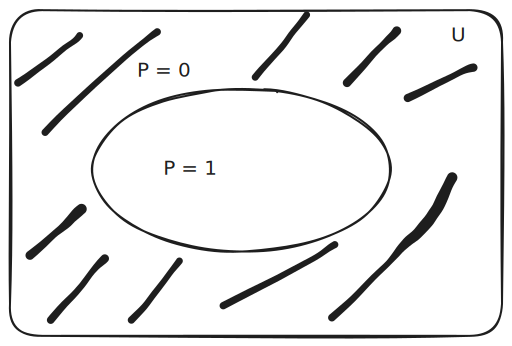

# 24.11.2025. Лекция 7. Теория предикатов

# План лекции

## 7.1. Алгебра предикатов
## 7.2. Исчисление предикатов
## 7.3. Интерпретация
## 7.4. Основные равносильности для предикатов
## 7.5. Приведенная форма представления предикатов

# 7.1. Алгебра предикатов

- A: "5 <u> - целое число</u>"; $\lambda(A) = 1$
- B: "$\pi$ <u> - целое число</u>"; $\lambda(A) = 0$

P(x) = "x - целое число"

- $P(5) = 1$
- $P(\pi) = 0$
- $x \in R$

## Определение

Предикат $P(x)$ - предложение, зависящее от переменной $x$,
заданной на некоторой предметной области

т.е. $x \in U$

Если подставить в предикат некоторое фиксированное значение $a \in U$,
то $P(a)$ - высказывание

$P(a) \in \{ 0;1 \}$

в этом случае предикат можно считать логической фцией,
определенной на элементах множества $U$

$$U = P \cup P'$$

## Пример

$P(x) =$ "$x^2-4x=0$"; $x \in R$

$x(x-4) = 0$

$x_1 = 0; x_2 = 4$

$P = \{0; 4\}$

$P' = R \setminus \{ 0; 4 \}$

К предикатам применимы все логические операции

$\overline{ P(x) }$:
- $P'$ - истинно
- $P$ - ложно

высказывания - это 0-местные предикаты.

с каждым предикатом связано число,
которое называется местностью,
или арностью предиката

язык предикатов максимально приближены к естественным языкам

## Пример

1) $P(x)$: "$x$ делится на 2"; $Q(x)$: "$x$ делится на 3"
   
   P(x) \land Q(x): "$x$ делится на 2 и на 3"

2) $S(x;y)$: "$x$ делится на $y$"

Определение. Предложение определенное на множестве

$$X_1 \times X_2 \times ... \times X_n$$

называется n-местным предикатом

$$P(x_1; x_2; ...; x_n)$$

где

$$x_1 \in X_1; x_2 \in X_2; ...; x_n \in X_n$$

## Пример

$P(x;y;z)$: "$xy<z$"; $(x;y;z) \in A \times A \times A = A^3$

$$A = \{ 1; 2; 3; 5 \}$$

P: (1; 2; 3); (1; 2; 5); (2; 1; 3); (2; 1; 5); (3; 1; 5); (1; 3; 5)

## Кванторы

1) существования: $\exist$:
   
   $\exist x P(x)$ будет истинно, если существует такой x из множества определения

2) общности (всеобщности): $\forall$:
   
   $\forall x P(x)$ - если для каждого x из множества определения высказывание будет истинно

### Пример

P(x;y)

$$\forall x \forall y P(x;y) \lrarr \forall y \forall x P(x;y)$$

$$\exist x \exist y P(x;y) \lrarr \exist y \exist x P(x;y)$$

$$\exist x \forall y P(x;y) \rarr \forall y \exist x P(x;y)$$

$$\forall x \exists y P(x;y)$$

$$\exists y \forall x P(x;y)$$

переменная которая находится под квантором - __связная__

если нет - __свободная__

### Пример

$q \rarr \exists x P(x;y)$ входят:

1) q - булевая переменная, $q \in \{0;1\}$
2) элемент произвольного множества $y \in M$
3) предикатная переменная $x$

# 7.2. Исчисление предикатов

## 1 Алфавит:
   - связки: 
     - основные
       - $\lnot$
       - $\rarr$
     - дополнительные
       - &
       - ^
   - служебные символы
     - $($
     - $)$
   - кванторы
     - $\exist$
     - $\forall$
   - предметные константы
     - a
     - b
     - c
     - ...
   - предметные переменные
     - x
     - y
     - z
     - ...
   - символы предикатов
     - P
     - Q
     - R
     - S
     - ...
   - символы функций
     - f
     - g
     - h
     - ...

константы, перменные, функторы называются термами

## 2 Формулы

слово называется формулой, если имеет следующий синтаксис
(удовлетворяет условиям 1-4):

1) P(x_1; ...; P_n) - атомарная формула

   вхождение переменный в атомарную формулу называется свободным

2) если A - формула, то $\overline A$ - тоже
3) если A и B формулы, то $A \land B$, $A \lor B$, $A \rarr B$ - тоже
4) если A - формула, содержащая свободную переменную $x$,
   то $\forall x A$, $\exist x A$ - тоже формулы

вхождение переменных в формуле 4, называются __связными__

переменная, не равная x является __свободной__

## 3 Аксиомы (логические)

1) любая система аксиом исчисления высказываний (см. пред. лек.)
2) собственные аксиомы
   P_1: \forall x A(x) \rarr A(t)
   P_2: A(t) \rarr \exist A(x)

## 4 Правила вывода

1. \frac{ A, A \rarr B }{ B } - modus ponens
2. введение квантора общности
   $\frac{ B \rarr A(x) }{ B \rarr \forall A(x) }$
3. $\frac{ A(x) \rarr B }{ \exist x A(x) \rarr B }$

исчисление предикатов, в котором кванторы могут связывать только
предметные переменные и не могут связывать функторы или предикаты
называется исчислением 1 порядка

> домашняя контрольная 3 декабря
