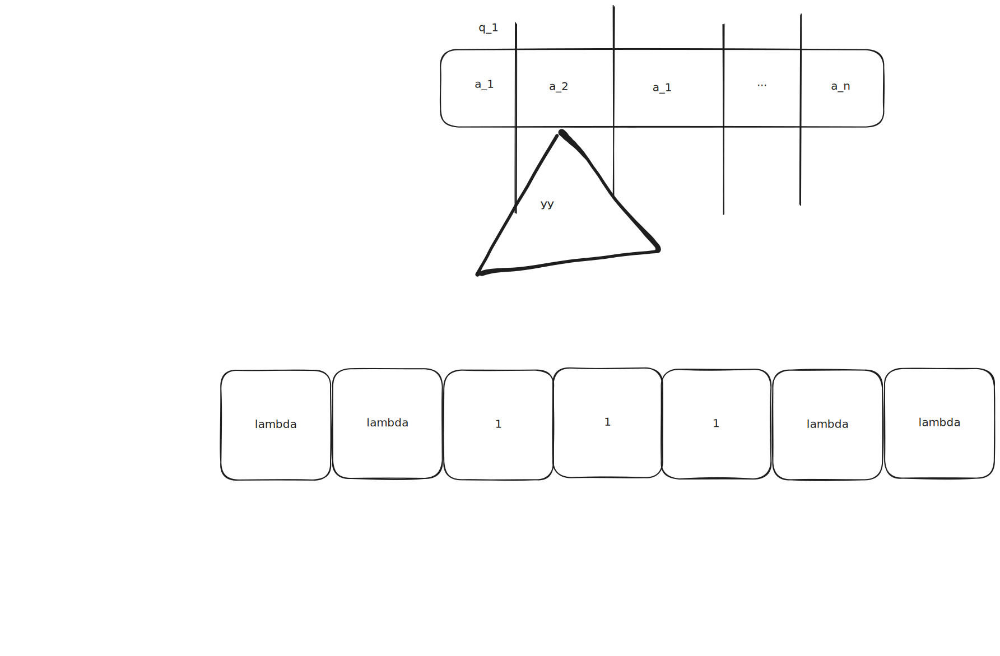

8.12.2025. Лекция 8. Теория алгоритмов

# План лекции

## 8.1. Интуитивное понятие алгоритма
## 8.2. Конкретизация понятия алгоритма
### 8.2.1 Машина Тьюринга
### 8.2.2. Рекурсивные функции
### 8.2.3. Нормальные алгоритмы Маркова
## 8.3. Алгоритмически неразрешимые проблемы
## 8.4. Характеристики сложности вычисления

> контроша в субботу 20 в 18:00

> 12 января экзамен (1ый)

# 8.1. Интуитивное понятие алгоритма

нет точного определения

__Определение:__

Алгоритм это строгое предписание, описывающее вычислительный процесс
как последовательность шагов, которая приводит от входных данных
к результату

- конечная

Свойства:
- массовость
  - должен решать класс похожих задач
  - а не 1 конкретную
- элементарность
  - разбивается на этапы (шаги)
    - понятные и простые
      - для пользователя или вычислителя
- детерминированность (определенность)
  - после выполнения очередного шага, следующий должен быть известно какой
- результативность
  - должен приводить решение задачи за конечное число шагов

(или счетно)

(или последний шаг мега большой)

Модели:
- Машина Тьюринга
- Рекурсивные функции
- Нормальные алгоритмы Маркова

# 8.2. Конкретизация понятия алгоритма

Алгоритмически разрешимые и неразрешимые

Один из способов анализатора - это машина Тьюринга

машины Поста

## 8.2.1 Машина Тьюринга

В природе не существует,
это автоматизированная модель, которая описывает любой алгоритм

сокращается как _МТ_

чтобы такую создать, ей нужен

### 1 входной алфавит

$$A = \{a_1; a_2; ...; a_n; \lambda\}$$

$\lambda$ или $a_0$ или $\varepsilon$ - пустой символ

A - конечное множество

### 2 Множество внутренних состояний

$$Q = \{ q_0; q_1; ...; q_n \}$$

Q - тоже конечное множество

обычно:
- $q_0$ - конечное состояние
- $q_1$ - начальное

### 3 Множество действий

$$D=\{ L; R; S \}$$

$$D=\{ Л; П; С \}$$

действие - двиганье по ленте

если в текущей момент головка обозревает ячейку которая содержит $a_i$

и находится в состоянии $q_i$

то действия могут быть:
- $a_i$ стирается, записывается $a_j$
- УУ может переместиться на 1 шаг согласно указанным действиям
  - L
  - R
  - S
- так происходит до тех пор пока
  - машина Тьюринга не достигнет конца строки
  - не дойдет до конечного состояния
- все эти действия приводящие к конечному результату называются
- программой машины Тьюринга

MT = &lt; A; Q; D &gt;

Все программы - посл-ть команд:
- слева текущее состояние машины
- справа - новое состояние, новый символ для перезаписи, действие
- $q_i a_i \rarr a_j D q_j$

или таблица переходов

|     | q_0 | q_1 | q_2 | ... | q_i       | ... | q_n |
| --- | --- | --- | --- | --- | --------- | --- | --- |
| a_1 |     |     |     |     |           |     |     |
| a_2 |     |     |     |     |           |     |     |
| ... |     |     |     |     |           |     |     |
| a_i |     |     |     |     | a_j D q_j |     |     |
| ... |     |     |     |     |           |     |     |
| a_n |     |     |     |     |           |     |     |

### Пример MT: к слову прибавить единицу

$A = \{ \lambda; 1\}$

$A = \{ q_0; q_1; q_2 \}$

для каждого состояния есть обработка для каждого символа

$q_1 \lambda \rarr q_1 \lambda R$

если в обозреваемой ячейке - лямбда, а МТ работает в состоянии q_1,
то состояние не меняется, УУ двигается вправо

$q_1 1 \rarr q_2 1 R$

Если в воспринимаемой ячейке - 1, а МТ в состоянии q_1,
то УУ находится на ячейке слова.
Состояние меняется на q_2, символ не меняется, УУ двигается вправо

$q_2 1 \rarr q_2 1 R$

Если в воспринимаемой ячейке - 1,
а МТ в состоянии q_2,
то УУ находится передвигается по слову вправо.
Состояние не меняется,
символ не меняется,

$q_2 \lambda \rarr q_0 1 S$

Если в воспринимаемой ячейке - лямбда,
а МТ в состоянии q_2,
то УУ достигло конца слова.
Состояние сменится на заключительное,
символ лямбда заменяется на единицу,

|           | $q_1$           | $q_2$     |
| --------- | --------------- | --------- |
| $\lambda$ | $q_1 \lambda R$ | $q_0 1 S$ |
| $1$       | $q_2 1 R$       | $q_2 1 R$ |

иногда S в конце не пишут

Конфигурация МТ (машинное слово) - это слово вида:

$p_1 q_1 a_1 p_2$, где:
- $p_1$ - голова слова (слово может быть пустым)
- $q_1$ - внутреннее состояние МТ
- $a_1$ - внутренний символ из алфавита
- $p_2$ - хвост цепочки

МТ переходит из начальной конфигурации в конечную

$p_1' q_0 a_n p_2'$

### Тезис Тьюринга

Любой интуитивный алгоритм может быть реализован в виде некоторой
машины Тьюринга

## 8.2.2. Рекурсивные функции

Будем рассматривать только числовые функции

$\aleph ^n : f : N^n \rarr N$

всюду определенная

- числа Фибоначчи
- факториал

все рекурсивные функции строятся на 3 примитивных
(заведомо однозначно понятных и реализуемых функций)
_простейшие_

### 1) S(x) = x + 1

_функция следования_, _операция сдвига_

Пример: S(1) = 1 + 1 = 2

S(-5) = undefined

(натуральные числа!)

### 2) O(x) = 0

да да мы расширили до нуля

нуль-функция

O(5) = 0

__O(-6) = undefined__

### 3) I_m (x_1, x_2, ..., x_m) = x_m (m = \overline{1,n})

функция проектирования (выбора аргумента)

$$I_2 (1; 2; 3; 4; ...; 10) = 2$$

С примитивными фциями можно производить действия
3 оператора:
- суперпозиции
- примитивной рекурсии
- минимизации

### 1) Оператор суперпозиции (подстановки)

f : n-местная фция (n аргументов)

g_1; g_2; ...; g_n : n-местные операции на $\N$

S ставит в соответствие n-местным фциям и g_i -> h(x_1; x_2; ...; x_n)

= f(g_1(x_1, x_n), ..., g_n(x_1, x_n))

#### Пример 1

S(O(x)) = 0 + 1 = 1

S(S(O(x))) = (0 + 1) + 1 = 2

#### Пример 2

можно выполнить сдвиг на произвольную константу

S(x) = x + 1
S(S(x)) = S(x+1) = (x+1) + 1 = x + 2

### 2) Оператор примитивной рекурсии

Оператор R

каждой (n+2)-местной операции f и n-местной операции g

ставит в соответствие (n+1)-местную операцию h

h = R(f, g)

удовлетворяющую следующей схеме

h(x_1; ...; x_n; 0) = g(x_1; ...; x_n)

h(x_1; ...; x_n; y+1) = f(x_1; ...; x_n; y; h(x_1; ...; x_n; y))

#### Пример

Пусть n=0

h(0) = a; a - const

h(y+1) = f(y; h(y))

#### Пример

h(0) = 1

h(y + 1) = h(y) * (y+1) = f(h(y), y+1)

Схема примитивной рекурсии образует процесс построения фции h,
при котором на 0 шаге используется фция g, а на каждом последующем шаге
значение фции f, зависящее от аргументов x_i, номера y предыдущего шага
и значения фции h, вычисленного на предыдущем шаге

Функция называется примитивно-рекурсивной (ПРФ), если она может быть
получена из простейших функций с помощью оператора суперпозиции
или оператора примитивной рекурсии

#### Пример

f(x; y)

x + 0 = I_1(x)

x + (y + 1) = S(x, y)

### 3) Оператор минимизации: $\mu$-оператор

f(x_1; ...; x_n) = \mu (g(x_1; ...; x_n; y) = 0); - выделенная переменная

выделяется переменная y

затем x фиксируются

значение y постепенно увеличивается с 0

значение \mu оператора будет то значение выделенной переменной y

при котором фция впервые обратилась в 0

если фция в 0 не обращается,

или принимает отрицательный результат, то $\mu = undefined$

#### Пример

g(x; y) = x - y + 3

фиксируем x = 1 и меняем y начиная с 1

ноль не берем

найти y при котором 

g(1; 1) = 1 - 1 + 3 = 3

g(1; 2) = 1 - 2 + 3 = 2

g(1; 3) = 1 - 3 + 3 = 1

g(1; 4) = 1 - 4 + 3 = 0

$\mu _y = 4$

n-местная фция f называется частично рекурсивной (ЧРФ)
если она может быть получена из простейших фций с помощью конечного
числа применений операций суперпозиции, примитивной рекурсии и минимизации

### Тезис Чёрча

Всякая эффективно вычислимая фунцкия (алгоритм)
является ЧРФ

## 8.2.3. Нормальные алгоритмы Маркова (НАМ)

Алгоритмическая система Маркова строится по принципам как и МТ

Но носит более простой и интуитивно понятный характер

определяются нормальной схемой подстановок,
которая состоит из СОВОКупности подстановок,
расположенных в определенном порядке

- X - некоторый конечный алфавит
- F(X) - слово над алфавитом
- $e \in F(X)$ - пустое слово

Если p и q - слово над алфавитом

$$p, q \in F(X)$$

то выражения

- $p \rarr q$ - простая
- $p \rarr .q$ - конечная (заключительная)

называются формулами подстановки в алфавите X

Символы $\{\rarr; .\}$ не принадлежат алфавиту

p, q могут быть пустыми словами

Строка R входит (включена) в строку L,
если она имеет вид

$$L_1 R L_2$$

Подстановка применима к слову, если строка соответствующая левой части
подстановки входит в слово

Применение заключается в замене в преобразующем слове левой строки правой

$$L_1 p L_2 \rarr L_1 q L_2$$

### принцип работы

дано преобразуемое слово (конечная цепочка символов алфавита)

начальная схема подстановок, содержащая фиксированную последовательность
простых и конечных подстановок

#### 1 преобразуемое слово просматривается слева направо

схема подстановок просматривается с 1

и если подст можно применить, то применяется к самому левому вхождению
просматриваемой строки

#### 2 работа алгоритма заканчивается, если ни одна из подстановок

не применяется.

тогда слово не распознается 

алгоритм неприменим к входному слову

использована заключительная подстановка

а может и не закончиться

### Пример

$$X = \{ А; Б; ...; Я \}$$

Х -> К

М -> Р

КА -> ЛОН

РУ -> .С

"МУХА"

сначала 1ая подстановка!

"итерируем по регуляркам"

"МУКА"

"РУКА"

"РУЛОН"

"СЛОН"

### Пример

X = { x; y; z }

- xx -> y
- xy -> x
- yzy -> x
- zz -> .z
- yy -> x

xxxyyyzzz

yxyyyzzz

yxyyzzz

yxxzzz

> yxxzz

подстановки кончаются!

<!-- yxyzzz -->

### Пример

X = { a, b }

- a -> e
- b -> .b

bbbbbb

не изменится.

а если бес точки то неприменимый алгоритм

abab

ebab

> bab

### Теорема 8.1.

- $O(x) = 0$
- $S(x) = x + 1$
- $I_m(x_1; ...; x_m) = x_m$

они вычислимы по Маркову, т.е. реализуемы при помощи НАМ

### Теорема 8.2.

Всякая ЧРФ вычислима по Маркову

### Теорема 8.3.

Любой НАМ является ЧРФ или машиной Тьюринга

## 8.3 Алгоритмически неразрешимые задачи

- Основные понятия
- Примеры алгоритмически неразрешимых задач
- Методы доказательства алгоритмической неразрешимости

### основные положения

h(n) про число пи

Гильберт: 1900 г, диофантовые уравнения

проблема эйлера про простые числа

теорема Гёделя

автоматные базисы

конечные автоматы - тьюринг инкомплит, конечное число состояний

10ая проблема Гильберта

### Примеры алгоритмически неразрешимых задач

#### Прямой

диагональный метод Кантора

там про несчетность множества действительных чисел

континуум - |R|

\[0, 1]

арифметические фции n переменных несчетные

вычислимых фций - счетное множество,

мн-во машин тьюринга - тоже счетно

#### Косвенный

через другую проблему

### Проблемы самоприменимости и остановки

для доказательства неразрешимости других проблем

вычислимая фция $\varphi: N \rarr A$

по номеру выдает программу

называется _нумерацией алгоритмов_

n - номер алгоритма A

$\exist \varphi ^{-1}$

можно работать с алгоритмами как с числами!

#### Проблема остановки

мы не можем понять останавливается ли данный алгоритм на этих данных

#### Самоприменимость

самоприменимость: тождественные преобразования строк в алфавите A

не существует МТ которая определяет самоприменимость

####

одна из первых найденных неразрешимых задач 

при помощи диагонального метода и свойства самоприменимости

используется для косвенного доказательства

нельзя алгоритмически определить завершится ли алгоритм

нету синтаксического разбора

## Основы анализа сложности алгоритмов

Критерии оценки:
- процессорное время
- память (макс. кол-во ячеек)

сортировка

один алгоритм: $2n^2$

второй: $50 n \log (n)$

скорости исполнения: 10^8, 10^6 Гц

### RAM

можно придумать стек!

память, проц

обязательно должна быть адресация

доступ к памяти - 1 единица

операция проца - 1 единица

циклы и подпрограммы не считаются простыми операциями

число элементарных операций - Относительное время выполнения алгоритма

как меняется время работа при увеличении обьема входных данных

определяется числовой фцией - соотносит время работы алгоритма с временем задачи

то есть числа операций кол-во входного вектора

так можно сравнить алгоритмы, но это зависит от обьема данных

Скорость роста играет ключевую роль

для массива: его длина

для двумерного: кол-во эл-тов

для чисел (длинная арифметика, простота): общее число битов

для графов: кол-во вершин, иногда и число ребер

### формальное описание

N слова памяти по alpha битам

N_\alpha = N * alpha

M инструкций по \beta битам

M_\beta = *

S_d - промежуточные

S_T - вычислительный процесс

трудоемкость - кол-во элементарных операций (конечное)

фция трудоемкости T_a (N) - отношение входных данных ко кол-ву эл. операций

$$\Psi _A = c_1 T_a(N) + c_2 * M + c_3 * S_d + c_4 * S_T$$

$T_a \hat(N)$ - худший случай - наибольшее кол-во операций

$T_a v (N)$ - лучший случай - наименьшее кол-во операций

$\overline T _a (N)$ - средний (арифметический)

определяется вероятность группы

сигма вероятность на время, по группам

### виды фций трудоемкости

1 Количественно-зависимые

не зависит от значений

2 Параметрически зависимые

зависит

3 Количественно-параметрические

и то и другое

3.1 Порядково-зависимые

зависит от порядка

$$|D_P| = n!$$

### Асимптотический анализ

$$n \rarr \infty$$

\Theta(g(n))

g(n)

O(g(n))

растет медленнее чем g(n) начиная с n_0 с точностью до множителя

g(n) мажорирует T(n)

T(n) = 3n^3 + 2n^2

n_0 = 1; c = 5

T(n) = O(n^3)

\Omega - растет быстрее g

оценка снизу

не медленнее точнее

Классы сложности

- 1 - константа
- log N - становится медленнее с ростом N; разбивка задач делением на констатнту
- n - каждый входной элемент обрабатывается немного
- n log n - разбивает на подзадачи решает их независимо и обьединяет
- n^2 - для решения небольших задач; все пары элементов данных
- n^3 - похож, но обрабатывает тройки
- 2^n - практически применим для маленьких задач; 2^20 = 10^6

Класс 0 - постоянное время O(1), O(log n)

Класс P - полиноминальные (рациональные): O(n), O(n^2), O(n^3), O(n log n)

Класс E - O(2^n)

Класс F - с факториальной сложностью, практически не используются

Класс NP - ни P ни E

\Theta(N)

как будто бы P входит в NP

NPC - NP-полные задачи:
- в NP
- полиноминально сводятся все задачи NP

(NP (P) (NPC))
