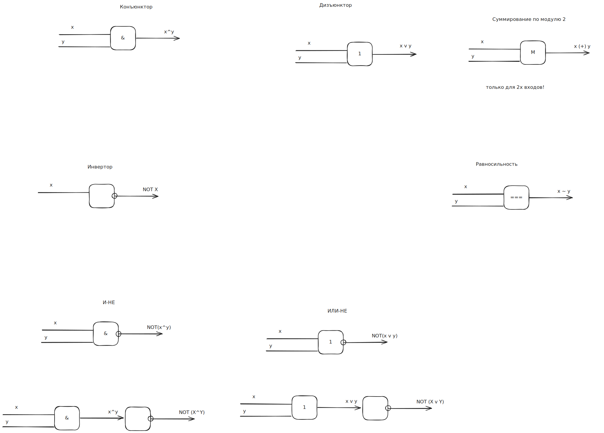

в зависимости от результатов на контрольной:
- экзамен по билетам
- среднее по контрольным

решебник

один типовик из 10 задач

делать когда скажут и в порядке который скажут

ссылки на маил ру! :(

Лекция 1. Алгебра высказываний 01.09.2025
===

План лекции:
- __1.1__ Историческая справка
- __1.2__ Понятие высказывания. Полное и неполное высказывание.
- __1.3__ Логические выражения и логические операции над высказывании.
- __1.4__ Равносильность логических операций
- __1.5__ Формулы алгебры высказываний. Функции алгебры высказываний.


Джордж Буль

равнозначность

парадокс Рассела (лжеца)

__1.2__ Понятие высказывания
---
Объектом алгебры логики являются простые высказывания

__Определение:__ Высказывание - это повествовательное предложение, выражающее суждение

Если суждение, составляющее содержание или смысл, истинно, то все высказывание будет истинно;
в противном случае ложно.

Истинность или ложность - это логическое значение высказывания

Примеры:

- А1: Волга впадает в Каспийское море (истина)
- А2: Число 20 делится на 100 без остатка (false)
- А3: Ура! Лето! (не высказывание)

Высказывания
- простые
- составные
  - совокупность простых посредством логических связок

1.3 Логические выражения.
---
__Определение:__ Логическое выражение это символическая запись, состоящая из логических величин
(констант или переменных), объединенных логическими операциями (связками)

$ \lambda(A) = \begin{cases}0\\1\end{cases} $

<!-- большая фигурная скобка -->

$2^n$, где n - кол-во входных переменных

n-арные операции

### 1. Логическое НЕ (отрицание, инверсия) ###

А с чертой на верху

$\overline{A}$

<!-- -, A -->

$\neg A$

$A'$

A|not A
-|-
0|1
1|0

### 2. Логическое И (конъюнкция)

A^B=min(A,B)

A&B

$A \cdot B$ // deprecated

AB

A|B|A^B
-:|-:|-:
0|0|0
0|1|0
1|0|0
1|1|1

### 3. Логическое ИЛИ (дизъюнкция, aka логическое сложение (deprecated))

A v B = max(A, B)

$A \lor B$

A|B|A v B
-:|-:|-:
0|0|0
0|1|1
1|0|1
1|1|1

### 4. Исключающее ИЛИ (строгая дизъюнкция; суммирование по модулю 2; сумма Жегалкина)

A (+) B

$A \oplus B$

 A| B|A(+)B
-:|-:|--:
 0| 0|  0
 0| 1|  1
 1| 0|  1
 1| 1|  0

### 5. Если... то... (импликация)

A -> B

A - посылка

B - истина

экспертные системы

формальные языки и грамматики

логические выводы (основы ИИ)

 A| B|A->B
-:|-:|--:
 0| 0|  1
 0| 1|  1
 1| 0|  0
 1| 1|  1

### 6. Равносильность (эквиваленция)

A ~ B

A === B ($A \equiv B$)

A <-> B

 A| B|A~B
-:|-:|--:
 0| 0|  1
 0| 1|  0
 1| 0|  0
 1| 1|  1

### 7. Обратная конъюнкция И-НЕ (штрих Шеффера)

A ' B

 A| B|A'B
-:|-:|--:
 0| 0|  1
 0| 1|  1
 1| 0|  1
 1| 1|  0

### 8. Обратная дизъюнкция ИЛИ-НЕ (стрелка Пирса, ф-ция Вебба) A \|/ B

 A| B|A\|/B
-:|-:|--:
 0| 0|  1
 0| 1|  0
 1| 0|  0
 1| 1|  0

1. NOT
2. AND
3. OR
4. IMPLY
5. EQV
6. XOR
7. NOT AND
8. NOT OR

Все высказывания (переменные), подающиеся на вход лог. операции, наз-ся
пропозициональными переменными, а все логические операции, использующиеся в
лог. выражениями, наз-ся пропозициональными связками

Выражение, построенное из пропозициональных переменных с использованием
пропрозициональных связок наз-ся пропозициональной формой, или логической формулой

Пример.

```
    1    2     6   3   5    4
((A v B) -> C) ~ (A^C) v (D(+)C)
```

lambda(A) = 1
lambda(B) = 0
lambda(C) = 1
lambda(D) = 0

```
((1 v 0) -> 1) ~ (1^1) v (0(+)1)

(1 -> 1) ~ (1) v (1)

1 ~ 1

1
```

```
D = A^(A^B -> not C) v not A ^ B
lambda(D) = 0

lambda(A^(A^B -> not C)) = 0
AND
lambda(not A ^ B) = 0

lambda(A) = 0
OR
lambda(A^B -> not C) = 0

lambda(A^B) = 1
lambda(not C) = 0
lambda(C) = 1
lambda(A) = 1
lambda(B) = 1
```

1.4 Равносильность логических операций
---

      1   3   2
A = (x~y) -> (xz)

      2              1
B = x((not y) v z) v (not x)y
     1        3    6        5

x|y|z| x ~ y | xz | A(3) | not x | not y | not y v z | x(not y v z) | not x y | B(6)
-|-|-|-------|----|------|-------|-------|-----------|--------------|---------|-----
0|0|0| 1     | 0  | 0    | 1     | 1     | 1         | 0            | 0       | 0
0|0|1| 1     | 0  | 0    | 1     | 1     | 1         | 0            | 0       | 0
0|1|0| 0     | 0  | 1    | 1     | 0     | 0         | 0            | 1       | 1
0|1|1| 0     | 0  | 1    | 1     | 0     | 0         | 0            | 1       | 1
1|0|0| 0     | 0  | 1    | 0     | 1     | 1         | 1            | 0       | 1
1|0|1| 0     | 1  | 1    | 0     | 1     | 1         | 1            | 0       | 1
1|1|0| 1     | 0  | 1    | 0     | 0     | 0         | 0            | 0       | 0
1|1|1| 1     | 1  | 1    | 0     | 0     | 1         | 1            | 0       | 1

(равносильно)

Второй способ проверки равносильности формул

это можно доказать через формулы равносильности алгебры высказываний

существуют для всех логических операций основные законы алгебры логики,
благодаря которым устанавливается равносильность между формулами.

Также данный способ помогает найти упрощенный равносильный вид
исходной формулы

    #include дискретка
    or in tg chan

__Пример:__ упростить логическое выражение.

1) `X & Y | X & NOT(Y) & Z | NOT(Y) & X & NOT(Z) | X & NOT(Z)` =  
   // по закону коммутативности меняем местами X и NOT(Y)

   `X & Y | X & NOT(Y) & Z | X & NOT(Y) & NOT(Z) | X & NOT(Z)` =  
   // по закону склеивания для 2й и 3й конъюнкции (И)

   `XY | X & NOT(Y) | X & NOT(Z)` =  
   // по закону дистрибутивности (вынесем за скобку X)

   `X & (Y | NOT(Y) | NOT(Z) )` =  
   // Y or NOT Y = 1

   `X & (1 | NOT(Z) )` =  
   // 1 or Z = 1

   `X & 1` =  
   `X`  // ответ

   Другой путь:

   `X & Y | X & NOT(Y) & Z | X & NOT(Y) & NOT(Z) | X & NOT(Z)` =  
   // по закону диствибутивности вынесем X & NOT(Y) за скобку

   `X & Y | X & NOT(Y) & (Z | NOT(Z) ) | X & NOT(Z)` =  ... то же самое

2) `((X | Y) & NOT(X)) | (NOT(X | Y) & NOTNOT(X))` =  
   // во 2 скобке снимаем инверсию над дизъюнкцией (де морган)  
   // и двойное отрицание

   `((X | Y) & NOT(X)) | (NOT(X) & NOT(Y) & X)` =  
   // 2-ая скобка: not X and X and Y = 0 and Y = 0

   `((X | Y) & NOT(X)) | 0` =  
   // 1ая скобка: закон дистрибутивности

   `X and not X or y and not X` =  
   `False or y and not X` =  
   `y and not X`  // Ответ  
   `not X and Y`

3)
   `not ((X or Y) -> not (Y or Z))` =

   // Снимаем импликацию

   `not (not (X or Y) or not (Y or Z))` =

   // Де морган

   `((X or Y) and (Y or Z))` =

   // Фонтанчиком 

   `XY or XZ or YY or YZ` =

   // идемпотентность: YY = Y

   `XY or XZ or YZ or Y`

1.5 Формулы алгебры логики. Функции алгебры логики
---

__Определение.__ __Логическая функция__ - в которой переменные принимают
только два значения: истина и ложь (логические 1/0)

$ f : A \rightarrow B $

A = B = {0; 1}

$ f(x) = \begin{cases} 0 \\ 1 \end{cases} $

$ f(x_1; ...; x_n) = \begin{cases} 0 \\ 1 \end{cases} $ => булевый результат

истинностное (логическое) значениение ф-ции;  
выходной сигнал

булевые переменные (var)  
пропозициональньные  
входные сигналы

> Если функция на определенных значениях входных сигналов принимает значение истина,
> то такая функция называется выполнимой
>
> Если принимает значение 0 - то опровержимой

> Если на каждом значении входных сигналов значение функции = 1,
> то такая ф-ция называется тождественно истинной (__тавтологией__)

> Если на любых входных наборах значение функции = 0,
> то такая ф-ция называется тождественно ложной (__противоречие__)

Число всевозможных функций алгебры логики (сокр. ФАЛ) равно $ 2^{2^n} $,
где n - кол-во входных переменных

напр.

n = 2

2^2^2

Графически функцию алгебры логики можно представить в виде многомерного куба


> Если две функции алгебры логики принимают на всевозможных на борах входных
> 
> сигналов одинаковые значения, то такие ф-ции наз-ся равными.

Функция алгебры логики от n переменных

ФАЛ: $ f(x_1; x_2; ...; x_{i-1}; x_{i}; x_{i+1}; ...; x_n) $
существенно зависит от x_i если имеет место соотношение:

$ f(x_1; x_2; ...; x_{i-1}; 0; x_{i+1}; ...; x_n) \neq f(x_1; x_2; ...; x_{i-1}; 1; x_{i+1}; ...; x_n) $

в противном случае говорят, что он x_i ф-ция зависит несущественно
и x_i является __фиктивным аргументом__

ФАЛ не изменится, если к ее аргументам дописать любое кол-во
фиктивных или удалить из ФАЛ ее фиктивные аргументы.

### Алгоритм поиска фиктивных переменных

1) Представить ФАЛ в табличной форме

2) Множество входных наборов ф-ции разбить на 2 подмножества:

   На котором ф-ция выполнима, и на котором опровержима

3) Из каждого подмножества вычеркивают столбец, соответствующий
   проверяемой переменной

4) Полученных удалением столбца подмножествах проверяют,
   не появились ли одинаковые наборы значений
   
   (сравнение идет между подмножествами)

5) Если таких наборов не появилось, то проверяемый аргумент является фиктивным.

Пример

x1 | x2 | x3 | x4 | f(x1, x2, x3, x4)
-|-|-|-|-
0|0|0|0| 0
0|0|0|1| 0
0|0|1|0| 0
0|0|1|1| 0
0|1|0|0| 1
0|1|0|1| 1
0|1|1|0| 0
0|1|1|1| 0
1|0|0|0| 0
1|0|0|1| 0
1|0|1|0| 0
1|0|1|1| 0
1|1|0|0| 1
1|1|0|1| 1
1|1|1|0| 1
1|1|1|1| 1

выполнима:

x1 | x2 | x3 | x4 | f(x1, x2, x3, x4)
-|-|-|-|-
0|1|0|0| 1
0|1|0|1| 1
1|1|0|0| 1
1|1|0|1| 1
1|1|1|0| 1
1|1|1|1| 1

опровержима:

x1 | x2 | x3 | x4 | f(x1, x2, x3, x4)
-|-|-|-|-
0|0|0|0| 0
0|0|0|1| 0
0|0|1|0| 0
0|0|1|1| 0
0|1|1|0| 0
0|1|1|1| 0
1|0|0|0| 0
1|0|0|1| 0
1|0|1|0| 0
1|0|1|1| 0

Проверяем 3 переменную

x1 | x2 | x3 | x4 | f(x1, x2, x3, x4)
-|-|-|-|-
0|1||0| 1
0|1||1| 1
1|1||0| 1
1|1||1| 1
1|1||0| 1
1|1||1| 1

x1 | x2 | x3 | x4 | f(x1, x2, x3, x4)
-|-|-|-|-
0|0||0| 0
0|0||1| 0
0|0||0| 0
0|0||1| 0
0|1||0| 0
0|1||1| 0
1|0||0| 0
1|0||1| 0
1|0||0| 0
1|0||1| 0

x3 - не фиктивен (0 1 0)

> У __тавтологии__ и __противоречия__ нет фиктивных аргументов (?)

### Логический базис

Логическая формула (функция) может быть реализована над некоторым базисом.

> __Логический базис__ - минимальное кол-во операций для реализации любой булевой функции

Т.е. любую ФАЛ посредством равносильных преобразований
можно привести к ее реализации базисными элементами.

### Примеры логических базисов:

1. Дизъюнктивный базис Буля: NOT, OR (A -> B = NOT(A) OR B)
2. Конъюнктивный базис Буля: NOT, AND
3. Базис Буля: NOT, AND, OR
4. Базис Жегалкина: 1; XOR; AND

Лекция 2. Формы представления высказываний. 8.09.2025
===

> [!CAUTION]
> ---
> 23-го сентября контрольная на лекции!

План лекции:
- 2.1 Дизъюнктивные и конъюнктивные нормальные формы: ДНФ и КНФ
- 2.2 Совершенные нормальные формы: СДНФ и СКНФ

2.1 Дизъюнктивные и конъюнктивные нормальные формы: ДНФ и КНФ
---

> __Нормальная форма__ - синтаксически однозначный способ,
> реализующий данную функцию

> Любая n-местная функция является __однозначно определенной__, если достоверно
> известно, на каких входных наборах ф-ция выполнима, а на каких -
> опровержима.

$ 2^{2^n} $

> Формула называется __элементарной конъюнкцией__, если она является
> конъюнкцией переменных или инверсией переменных
> 
> (может быть одночленной!)

Напр. A, AB, NOT(A)B; ...

> Формула, представляющая собой дизъюнкцию элементарных конъюнкций,
> называется __дизъюнктивной нормальной__.

Напр. ДНФ:

A1 or not A2; A1 and not A2 and A3 or not A1 and A2 and A3; ...

### Теорема 2.1.

> Для любой формулы U можно найти равносильную ей формулу V, являющуюся ДНФ

###### __Пример.__

F = not (x * not y or y * not z)

// снимаем инверсию над дизъюнкцией

F = not (x * not y) and not (y * not z)

F = (not x or y) and (not y or z)

not x * not y or not x * z or (y * not y) or y * z

not x * not y or not x * z or 0 or y * z

not x * not y or not x * z or y * z

// ДНФ


> #### Контрольная
>
> ~30го сентября

> ###### элементарной дизъюнкцией
> Формулу называют __элементарной дизъюнкцией__, если она является
> дизъюнкцией переменных или отрицания переменных.
> 
> - A_1 or A_2
> - not A_1 or A2
> - A_1 or A_2 or not A_3
> 
> НЕ МОЖЕТ быть одна переменная
> 
> 

> Формулу, являющуюся конъюнкцией элементарных дизъюнкций,
> называют __конъюнктивной нормальной формой__
> 
> (A_1 or A_2) and
> (not A_1 or A2) and
> (A_1 or A_2 or not A_3)
> 
> НЕ МОЖЕТ быть одночленной
> 
> (ради однозначности, чтоб отличить ДНФ и КНФ)

F = not (x * not y or y * not z)

// снять инверсию над дизъюнкцией (де Морган)

F = not (x * not y) and not (y * not z)

// снова де Морган

F = (not x or not not y) and (not y or not not z)

F = (not x or y) and (not y or z)

// конъюнктивная нормальная форма

> #### Теорема 2.2
>
> для любой формулы U  
> можно найти равносильную ей  
> формулу V,  
> являющуюся КНФ

> #### Замечание 1.
>
> отдельный элемент ДНФ называется  
> __элементарной конъюнкцией__,
> или __конситуетной единицы__ (1)
> или __min-term__

> отдельный элемент КНФ называется  
> элементарной дизъюнкцией,
> или конситуетной нуля (0)
> или max-term


### Алгоритм приведения ФАЛ к нормальным формам

1. Используя равносильные преобразования,
   ФАЛ привести к основным операциям базиса Буля (not, and, or)

2. При наличии знака инверсии над операциями,  
   а не над пропозициональными переменными,  
   раскрыть инверсию,  
   используя закон де Моргана.

3. Избавиться от операции двойного отрицания

4. В случае необходимости применить к формуле
   закон дистрибутивности и поглощения

##### Пример:

F = (X -> Y) & ((NOT Y -> Z) -> NOT X)

// A -> B = not A or B

F = (not X or Y) & (not (not not y or Z) or not X)

// Снять инверсию над дизъюнкцией

F = (not X or Y) & (not Y and not Z or not X)

F = (not X or Y) and ((not Y or not X) and (not Z or not X))

F = (not X or Y) and (not Y or not X) and (not Z or not X)

// КНФ

// скобки - усиление мощности операции (приоритет)

##### Пример

F: (X -> Y) \downarrow not (Y -> Z)

// A \downarrow B = not (A or B)

F = not ((X -> Y) or not (Y -> Z))

F = not (X -> Y) and not not (Y -> Z)

F = not (X -> Y) and (Y -> Z)

F = not (not X or Y) and (not Y or Z)

F = (not not X and not Y) and (not Y or Z)

F = (X and not Y) and (not Y or Z)

<!-- F = X*notY or not Y or Z -->

F = X and not Y and (not Y or Z)

F = X*notY*notY or X*notY*Z

`F = X*notY or X*notY*Z`

f(x_1; x_2; ...; x_n)

x_1 | x_2 | ... | x_n | f(...)
-|-|-|-|-
0 | 0 | ... | 0 | 1
0 | 0 | ... | 1 | 1
0 | 1 | ... | 0 | 0
0 | 1 | ... | 1 | 1
... | ... | ... | ... | ...
1 | 1 | ... | 1 | 0


ДНФ - ищем 1

Входной сигнал набора, которому соответствует 1,  
будет записан в прямом коде

Входной сигнал набора, которому соответствует 0,  
будет записан как переменная с инверсией

Каждый входной набор, на котором  
функция выполнима,  
будет записан в виде элементарной конъюнкции  
_всех_ входных переменных

> #### Определение. Совершенная дизъюнктивная форма
> это такая дизъюнктивная форма,  
> в которой каждая элементарная конъюнкция  
> содержит в прямом либо инвертированном коде  
> ровно по 1 разу  
>
> Элементарные конъюнкции не повторяются.

Аналогично, для получения СКНФ,  
в результирующем столбце  
выбираются такие наборы значений,  
для которых функция опровержима,  
т.к. СКНФ сохраняет 0.

И тогда данные наборы значений  
можно представить в виде совершенных элементарных дизъюнкций,  
там где переменная входит в прямом коде,  
то ей будет соответствовать значение 0,  
а там где с инверсией -  
то это будет 1  

> #### Определение. СКНФ
> это такая КНФ,  
> в которой каждая элементарная дизъюнкция   
> содержит ввсе пропозициональные переменные  
> либо их инверсии  
> ровно по 1 разу  
>
> Элементарные дизъюнкции не повторяются.

> #### Замечание
> тождественно истинная формула - тавтология -  
> не имеет СКНФ

> #### Замечание
> тождественно ложная формула - противоречие -  
> не имеет СДНФ

СНФ можно построить 2 способами:
- равносильными преобразованиями из нормальных форм
- таблица истинности

#### Привести нормальные формы к совершенному виду

`F = notX*Y or notX*notY*Z`

СДНФ сохраняет 1

A & 1 = A

A & 1 = A & (B or not B) = AB or AnotB

`F = notX*Y*1 or notX*notY*Z`

`F = notX*Y*(z or not z) or notX*notY*Z`

`F = notX*Y*Z or notX*Y*notZ or notX*notY*Z`

x | y | z | F | not x | not y | notX*Y | notX*notY*Z | notX*Y or notX*notY*Z
-|-|-|-|-|-|-|-|-
0 | 0 | 0 | 1 | 1 | 0 | 0 | 0
0 | 0 | 1 | 1 | 1 | 0 | 1 | 1
0 | 1 | 0 | 1 | 0 | 1 | 0 | 1
0 | 1 | 1 | 1 | 0 | 1 | 0 | 1
1 | 0 | 0 | 0 | 1 | 0 | 0 | 0
1 | 0 | 1 | 0 | 1 | 0 | 0 | 0
1 | 1 | 0 | 0 | 0 | 0 | 0 | 0
1 | 1 | 1 | 0 | 0 | 0 | 0 | 0

notX*notY*Z or notX*Y*notZ or notX*Y*Z

#### Пример

F = X & (notX or Y)

СКНФ сохраняет 0

A or 0 = A

A or (B & notB) = (A or B) and (A or not B)

F = (X or Y or Z) & (X or Y or notZ) & (X or notY or Z) & (X or notY or notZ) & (notX or Y or Z) & (notX or Y or notZ)

F = (X or Y) & (X or notY) & (notX or Y)

СКНФ

x | y | z | F | not x | notX or Y | x & (not X or Y)
--|---|---|---|-------|-----------|-----------------
0 | 0 | 0 | 1 | 1     | 1         | 0
0 | 0 | 1 | 1 | 1     | 1         | 0
0 | 1 | 0 | 1 | 1     | 1         | 0
0 | 1 | 1 | 1 | 1     | 1         | 0
1 | 0 | 0 | 0 | 0     | 0         | 0
1 | 0 | 1 | 0 | 0     | 0         | 0
1 | 1 | 0 | 0 | 0     | 1         | 1
1 | 1 | 1 | 0 | 0     | 1         | 1


> #### Теорема 2.3.
>
> Любую ФАЛ можно
> равносильными преобразованиями
> привесит к СДНФ,
> притом данное представление будет единственным
>
> (кроме противоречия)

> #### Теорема 2.4. о приведениии к СКНФ
>
> Любую ФАЛ можно
> равносильными преобразованиями
> привесит к СКНФ,
> притом данное представление будет единственным
>
> (кроме тавтологии)

> __Длина СДНФ__ это кол-во входящих в нее   
> cовершенных элементарных конъюнкций  

> __Длина СКНФ__ это кол-во входящих в нее   
> cовершенных элементарных дизъюнкций  

##### Утверждение 2.1

отрицание (инверсия) всякой формулы F равно дизъюнкции  
тех, и только тех  min-term-ов, которые не вошли в СДНФ исходной формулы F

##### Утверждение 2.2

отрицание not F всякой формулы F равно  
конъюнкции тех и только тех max-term-ов,  
которые не вошли в СКНФ формулы F  

not F = (notX or notY or Z) & (notX or notY or notZ)

##### Утверждение 2.3

для нахождения отрицания произвольной формулы,  
реализованной над базисом Буля,  
достаточно всюду  
заменить знак операции and на or  
знак операции or на and  
(swap)  
всякую переменную входящую в формулу без знака инверсии  
заменить на переменную со знаком;  
а все знаки инверсии - снять

##### Пример.

((X & (not Y or (not Z & P))) or not Q) & R

((not X or (Y and (Z or not P))) and Q) or not R


22.09.2025. Лекция 3. Минимизация булевых функций
===

> Контрольная №1
>
> 29.09.2025
>
> на лекции!
>
> от того как группа напишет ее зависят "автоматы"!

#### План лекции
- 3.1. Основные понятия.
- 3.2. Минимизация ФАЛ равносильными преобразованиями.
- 3.3. Метод неопределенных коэффицентов.
- 3.4. Многомерный куб.
- 3.5. Карта Карно
- 3.6. Метод Квайна
- 3.7. Метод Мак-Класки (алгебраический метод)

3.1. Основные понятия.
---

ФАЛ:
- СДНФ
- СКНФ

(единственным образом)

f(x; y; z) = xyz or xy*notZ or xnotYz or xnotYnotZ or notXyz  // длина 5

f(x; y; z) = xy or xnotY or notXyz  // длина 3

f(x; y; z) = xynotZ or yz or xnotY  // длина 3

(NOT; AND; OR)

> #### Определение
> 
> ДНФ, имеющая наименьшую длину  
> по сравнению с другими формами,  
> эквивалентными ей, называется __кратчайшей ДНФ__ (КрДНФ)

> #### Определение
> 
> ДНФ, содержащая наименьшее число букв (переменных)  
> по сравнению с другими эквивалентными ей ДНФ,
> называется __МДНФ__ (минимальной дизъюнктивной нормальной формой)

> #### Определение
> 
> __Импликантом__ функции f(x_1; ...; x_n) называется  
> элементарная конъюнкция 
> $$U = x_1^{\alpha_1} x_2^{\alpha_2} ... x_n^{\alpha_n}$$
> если выполнено соотношение $$U \rightarrow f(x_1; ...; x_n) = 1$$

> #### Определение
> 
> __Простой импликант__ - тот, из которого нельзя удалить ни одну переменную
> 
> (при удалении переменной элементарная конъюнкция перестает быть импликантой)

> #### Определение
> 
> __Сокращенная ДНФ__ (СкДНФ) - дизъюнкция всех простых импликантов

МДНФ получается из сокращенной удалением некоторых элементарных конъюнкций

> #### Замечание 1
>
> для заданной ФАЛ существует несколько МДНФ,  
> отличающихся друг от друга набором входных переменных  
> или числом слагаемых  

> #### Замечание 2
>
> для количества входных переменных n = 2 или n = 3,  
> КрДНФ = МДНФ
>
> если n > 3, то
> КрДНФ != МДНФ

> #### Определение
> 
> __Тупиковой ДНФ__ это дизъюнкция простых импликант,  
> из которых ни один простой импликант удалить нельзя,  
> так, чтобы полученная ДНФ все еще представляла функцию  

> Любая МДНФ является тупиковой
> 
> тупиковая ДНФ не является не является МДНФ

процесс МДНФ заключается в следующем:
1) находят СкДНФ - склеивание, поглощение
2) из сокращенной формы получаем тупиковую  
   удалением подмножества элементарных конъюнкций
3) из полученных тупиковых выбирают минимальную

СДНФ:
- СкДНФ:
  - тупиковая
  - тупиковая
  - тупиковая

3.2. Минимизация ФАЛ равносильными преобразованиями
---

1) Операция полного склеивания
   $$A \overline B \lor AB = A$$
2) Операция неполного склеивания
   $$AB \lor A \overline B = AB \lor A \overline B \lor A$$
   (удлиньшить)
3) Операция поглощения
   $$AB \lor A = A$$

> _Из двух ДНФ выбирай меньшую_

#### Пример

F: notXnotYnotZ or notXnotYz or xnotYnotZ or notXyz or xnotYz

F(1,2; 3,5; 4) = notXnotY or xnotY or notXyz = notY or notXyz - МДНФ

F(2,4; 3,5; 1) = notXz or xnotY or notXnotYnotZ

по закону идемпотентности:

A or A = A

F: notXnotYnotZ or notXnotYz or xnotYnotZ or notXyz or xnotYz or notXnotYz

// скопировали 2й


F(1,2; 3,5; 4,6) = notXnotY or xnotY or notXyz = notXnotY or xnotY or notXz = notY or notXz - МДНФ

блотнее всего! (не слишком много букв)

3.3. Метод неопределенных коэффицентов
---

F: notXnotYnotZ or notXyz or xynotZ

```math
f(x_1; x_2; x_3) =
k^1_1 x_1 \lor k^0_1 \overline x_1 \lor
k^1_2 x_2 \lor k^0_2 \overline x_2 \lor
k^1_3 x_3 \lor k^0_3 \overline x_3 \lor

k^{11}_{12} x_1 x_2
\lor k^{10}_{12} x_1 \overline x_2
\lor k^{01}_{12} \overline x_1 x_2 
\lor k^{00}_{12} \overline x_1 \overline x_2 

...

k^{000}_{123} \overline x_1 \overline x_2 \overline x_3

...


```

$k \in [0;1]$ - коэффиценты

СЛАУ

```math
\begin{cases}

\end{cases}
```

f(0; 0; 0) = k^0_1 \overline x_1 \lor k^0_2 \overline x_2 \lor k^0_3 \overline x_3 \lor ... = 1
f(0; 0; 1) = k^0_1 \overline x_1 \lor k^0_1 \overline x_1 \lor k^1_3 x_3 \lor ... = 0  // тут все ложны
f(0; 1; 0) = 0  // тут все ложны
f(0; 1; 1) = 0  // тут все ложны
f(1; 0; 0) = 1
f(1; 0; 1) = 1
f(1; 1; 0) = 1
f(1; 1; 1) = 1

f(0; 0; 0) = k^{00}_{23} \overline x_2 \overline x_3 \lor k^{000}_{123} \overline x_1 \overline x_2 \overline x_3 = 1
f(0; 0; 1) = k^{10}_{12}
f(0; 1; 0) = 0  // тут все ложны
f(0; 1; 1) = 0  // тут все ложны
f(1; 0; 0) = 1
f(1; 0; 1) = 1
f(1; 1; 0) = 1
f(1; 1; 1) = 1

везде есть $k^1_1$

k^1_1 \lor k^{00}_{23} = 1

берем любое конкретное решение системы.

МДНФ: $$x_1 \lor \overline x_2 \overline x_3$$

---

многомерный куб

3.4 Многомерный куб
---


получилать МДНФ! но это чисто совпадение

3.5 Карты Карно
---


3.6 Метод Квайна.
---

> Множество импликант булевой функции  
> образует __полную систему импликант__  
> (покрытие булевой функции)  
> если любая существенная вершина булевной фунцией  
> покрывается хотя бы одной импликантой  
> этого множества.  

> Система простых импликант называется приведенной  
> если она является полной  
> и никакая ее собственная часть  
> не образует полную систему импликант.  

На вход: СДНФ

1) нахождение простых импликант

   все конситуенты СДНФ (0-кубы)
   сравнивают между собой попарно,
   применяя закон склеивания.

   Результаты записывают в таблицу

   |0-куб фции|результат 1 склеивания|...|результат n-го склеивания|
   |-|-|-|-|

   по результатам склеивания
   помечают те импликанты, которые склеить нельзя

   это и будет система простых импликант

2) расстановка меток

   составляется таблица (импликантная матрица),
   числом строк - простые импликанты
   столбцы - 0-кубы или конситуенты единицы, входящие в СДНФ

   Если 0-куб функции покрывается простой импликантой,
   то в соответствующей ячейке ставится метка

3) Нахождение существенных импликант

   Если в каком-либо столбце
   составленной таблицы
   имеется только одна метка,
   то импликанта, соответствующая этой метке
   является существенной.

   Её удалить из минимальной формы нельзя.

4) Вычеркивание лишних столбцов

   Если в таблице 2 одинаковых столбца,
   то 1 из них можно удалить

5) Вычеркивание лишних строк

   Если в таблице появились строки,
   в которых нет ни 1 метке,
   то их тоже удаляем

6) Выбор минимального покрытия

   Исследуем получившуюся таблицу

   Выбираем такую СОВОК упность первичных импликант
   которые имели бы метку во всех столбцах

Замечания:
1) недостаток метода Квайна - 1ый этап (попарное склеивание)

   (но можно картой Карно или диаграммой Вебба при программной реализации)

2) Только тупиковые формы

### Пример

$$f(x_1; x_2; x_3) = (10110011)$$

$2^n$, n - кол-во 8 => n=3

потом СДНФ

x_1|x_2|x_3|f
-|-|-|-


Классы с вариантами входных значений

Поиск единиц во входном (результирующем) столбце

f(000) = f(010) = f(011) = f(110) = f(111) = 1

10110011

СДНФ:

NOT x1 NOT x2 NOT x3 OR NOT x1 x2 NOT x3 OR NOT x1 x2 x3 OR x1 x2 NOT x3 OR x1 x2 x3

|-|                       -|                       -|                        -|
|-|                       -|                       -|                        -|
|1| NOT x1 NOT x2 NOT x3 * | NOT x1 NOT x3 (1; 2) ~ |                         |
|2| NOT x1 x2 NOT x3 *     | NOT x1 x2 (2; 3) *     | x2 [(2;3) (4;5)] ~      |
|3| NOT x1 x2 x3 *         | x2 NOT x3 (2; 4) *     | ~~x2 [(2; 4); (3; 5)]~~ |
|4| x1 x2 NOT x3 *         | x2 x3 (3; 5) *         |                         |
|5| x1 x2 x3 *             | x1 x2 (4; 5) *         |                         |

-------------| NOT x1 NOT x2 NOT x3 | NOT x1 x2 NOT x3 | NOT x1 x2 x3 | x1 x2 NOT x3 | x1 x2 x3
-------------|--|--|--|--|--
x2           |  |\*|\*|\*|\*
NOT x1 NOT x3|\*|\*|  |  |


x2 OR NOT x1 NOT x3

$$x_2 \lor \overline x_1 \overline x_3$$

СДНФ

xyz OR xyNOTz OR xNOTyNOTz OR NOTxNOTyNOTz or NOTxyz or NOTxNOTyz

3.7 Метод Мак-Класки (алгебраический метод)
---

> **Теорема**:
>
> если в СДНФ ф-ции алгебры логики произвести
> все возможные операции неполного склеивания,
> а затем все возможные операции элементарного поглощения,
> то полученная дизъюнкция будет сокращенной.

Все входные min-term (0-кубы) записываются в виде
соответствующих двоичных кодов

СДНФ сохраняет единицу

следовательно если переменная входит без 

Затем полученные двоичные коды разбиваются на интервалы

по количеству единиц в кодах

Напр.
1. одна единица
2. две единицы

Процесс попарного склеивания возможен только между соседними интервалами

т.е. только те входные наборы, которые отличаются на 1 единицу

После процесса склеивания

переменная которая "склеивается" заменяется знаком подчеркивания

В результате получаются новые интервалы

Процесс 2го склеивания возможен также между соседними интервалами
и только между кодами у которых одинаковая "маска" (`_` на том же самом месте)

Процесс склеивания заканчивается когда в соседних интервалах склеить нельзя.

Дальше как по Квайну.
но в имликантную матрицу входят 2чные коды 0-куба
и 2чные коды простых импликант

Процесс получения минимального покрытия такой же.

> ~27 октября контроха!

### Пример

$$f(x_1; x_2; x_3; x_4) = \Sigma (0; 2; 5; 6; 7; 8; 9; 14; 15)$$

(по номерам входного набора в 16ричной)

1010011111000011

```math
f(x_1; x_2; x_3; x_4) = \{
   (0;0;0;0);  // 0
   (0;0;1;0);  // 1
   (0;1;0;1);  // 2
   (0;1;1;0);  // 2
   (0;1;1;1);  // 3
   (1;0;0;0);  // 1
   (1;0;0;1);  // 2
   (1;1;1;0);  // 3
   (1;1;1;1);  // 4
\}
```

| индекс | интервал |
| :----- | :------- |
| 0      | 0000     |
| 1      | 0010     |
| .      | 1000     |
| 2      | 0101     |
| .      | 0110     |
| .      | 1001     |
| 3      | 0111     |
| .      | 1110     |
| 4      | 1111     |

| .         | интервал  |
| :-------- | :-------- |
| 0-1 (I)   | 00\_0 – A1 |
| .         | \_000 – A2 |
| 1-2 (II)  | 0\_10 – A3 |
| .         | 100\_ - A4 |
| 2-3 (III) | 01\_1 -A5  |
| .         | 011\_      |
| .         | \_110      |
| 3-4 (IV)  | \_111      |
| .         | 111\_      |

| .        | Интервал  |
| :------- | :-------- |
| III – IV | \_11\_ - A6 |
| .        | ~~\_11\_~~  |

| implicant     | 0000 | 0010 | 0101 | 0110 | 0111 | 1000 | 1001 | 1110 | 1111 |
| :------------ | :--- | :--- | :--- | :--- | :--- | :--- | :--- | :--- | :--- |
| \_11\_ - A6     | .    | .    | .    | *    | *    | .    | .    | *    | *    |
| 01\_1 – A5     | .    | .    | *    | .    | *    | .    | .    | .    | .    |
| 100\_ - A4     | .    | .    | .    | .    | .    | *    | *    | .    | .    |
| ~~0\_10 – A3~~ | .    | *    | .    | *    | .    | .    | .    | .    | .    |
| ~~\_000 – A2~~ | *    | .    | .    | .    | .    | *    | .    | .    | .    |
| 00\_0 – A1     | *    | *    | .    | .    | .    | .    | .    | .    | .    |

МДНФ:

yz or notXyt or xnotYnotZ or notXnotYnotT

---

СДНФ:

notXnotYnotZnotT or
notXnotYZnotT or
notXYnotZT or
notXYZnotT or
notXYZT or
XnotYnotZnotT or
XnotYnotZT or
XYZnotT or
XYZT or

0000 0
0010 2
0101 5
0110 6
0111 7
1000 8
1001 9
1110 14
1111 15

1010011111000011

| -   | 0-кубы              | результат 1-го склеивания | результат 2-го склеивания |
| :-- | :------------------ | :------------------------ | :------------------------ |
| 1   | NotXnotYnotZnotT \* | <u>NotXnotYnotT (1-2)</u> | <u>YZ (4589)<u>           |
| 2   | NotXnotYZnotT *     | <u>NotXYT (3-5)</u>       | ~~YZ (4859)~~             |
| 3   | NotXYnotZT *        | NotXYZ (4-5) *            | -                         |
| 4   | NotXYZnotT *        | YznotT (4-8) *            | -                         |
| 5   | NotXYZT *           | YZT (5-9) *               | -                         |
| 6   | XnotYnotZnotT *     | <u>XnotYnotZ (6-7)</u>    | -                         |
| 7   | XnotYnotZT *        | XYZ (8-9) *               | -                         |
| 8   | XYZnotT *           | -                         | -                         |
| 9   | XYZT *              | -                         | -                         |

| implicant    | NotXnotYnotZnotT \* | NotXnotYZnotT * | NotXYnotZT * | NotXYZnotT * | NotXYZT * | XnotYnotZnotT * | XnotYnotZT * | XYZnotT * | XYZT * |
| :----------- | :------------------ | :-------------- | :----------- | :----------- | :-------- | :-------------- | :----------- | :-------- | :----- |
| YZ           | .                   | .               | .            | O            | O         | .               | .            | O         | O      |
| XnotYnotZ    | .                   | .               | .            | .            | .         | O               | O            | .         | .      |
| notXYT       | .                   | .               | O            | .            | O         | .               | .            | .         | .      |
| notXnotYnotT | O                   | O               | .            | .            | .         | .               | .            | .         | .      |


Не вычеркнуть

Сошлось кста

| .   | .    | .    | T    | T    | .   |
| :-- | :--- | :--- | :--- | :--- | :-- |
| X   | 1000 | 1100 | 1101 | 1001 | .   |
| X   | 1010 | 1110 | 1111 | 1011 | Z   |
| .   | 0010 | 0110 | 0111 | 0011 | Z   |
| .   | 0000 | 0100 | 0101 | 0001 | .   |
| .   | .    | Y    | Y    | .    | .   |

| 1   | .   | .   | 1   |
| :-- | :-- | :-- | :-- |
| .   | 1   | 1   | .   |
| 1   | 1   | 1   | .   |
| 1   | .   | 1   | .   |

YZ or notXYT or notXnotYnotT or XnotYnotZ

x2 x3  or not x1 not x2 not x4  or not x1 x2 x4  or x1 not x2 not x3

# 13.10.2025. Лекция 4. Логические элементы компьютера

## План лекции

### 4.1. Основные понятия
### 4.2. Логические элементы И; ИЛИ; НЕ; И-НЕ; ИЛИ-НЕ.
Декомпозиционная схема.
### 4.3 Переключательная схема
### 4.4 Комбинационная схема

---

## 4.1. Основные понятия

> __Логический элемент__ - часть электронно-логической схемы,
> которая реализует элементарную логическую функцию.

так можно реализовать любую логическую функцию

чтобы представить 2 лог. состояния: 1 или 0
в вентилях соответствующие им входные и выходные сигналы
имеют 1 из 2 установленных уровней напряжения.

обычно:
- высокий уровень - 1
- низкий - 0

Каждый логический элемент имеет свое условное обозначение,
которое выражает его логическую ф-цию, но не указывает на то,
какая именно электросхема в ней реализована.

Работу лог. элементов можно описать при помощи таблицы истинности

Логические элементы имеют 1 или несколько входов и 1 выход,
через которые проходят логические сигналы, обозначаемые условно
- 0, если отсутствует эл. сигнал
- 1, если присутствует

## 4.2. Логические элементы И; ИЛИ; НЕ; И-НЕ; ИЛИ-НЕ.



### Логический элемент И (конъюнктор)

Реализует конъюнкцию 2 или более логических переменных

---

Рекомендуется все делать в базисе Буля

Цепи из логических элементов называются логическими устройствами

СОВОКупность логических устройств образует функциональную схему
(декомпозиционная, структурная)

По заданной функциональной схеме можно определить логическую формулу, ей
соответствующую и наоборот.

### Пример

f(X;Y;Z) = notX and (Y or Z)


---

f(X;Y;Z) = (01000011)

| x   | y   | z   | f   |
| :-- | :-- | :-- | :-- |
| 0   | 0   | 0   | 0   |
| 0   | 0   | 1   | 1   |
| 0   | 1   | 0   | 0   |
| 0   | 1   | 1   | 0   |
| 1   | 0   | 0   | 0   |
| 1   | 0   | 1   | 0   |
| 1   | 1   | 0   | 1   |
| 1   | 1   | 1   | 1   |

f(X;Y;Z) = notXnotYZ or XYnotZ or XYZ = notXnotYZ or XY

лучше расслаивать по 2, но можно конъюнктировать и 3

---

По декомпозиционной схеме восстановить соответствующую функцию

```
F = (
    not (A or B)
    or (A and B)
) and C
```

> не упрощаем, если не сказали!

## 4.3. Переключательная схема

это схематическое изображение не

состоящее из переключателей и проводников 

из входов и выходов

на которые поднается и с которых снимается
электрический сиграл

каждый переключатель имеет только 2 состояния:
- замкнутое
- разомкнутое

---

X -> x равно:
- 1, X замкнут
- 0, X разомкнут

$X$ и $\overline X$:

когда $X$ замкнут то $\overline X$ разомкнут и наоборот

_Поставлены в соответствие_ x и X

Всей переключательной схеме можно поставить в соответствие

логическую переменную =1 если схема проводит ток

0 в противном случае

Данная переменная является функцией от переменных соответствующих
переключателям и носит название **переключательной функции**


схема проще если меньше лог. операций (элементов)

1. упростить функцию проводимости
2. СДНФ, минимизировать

Z ^ (1 or notY) = Z ^ 1 = Z

XnotY or Z

и рисуем ее потом

Синтез схем:
1) составление ф-ции проводимости по таблице истинности
2) упрощение ф-ции
3) построение упрощенной ф-ции

Анализ:
1) определение значений ее ф-ции проводимости при всевозможных переменных
2) упрощение
3) реализация

## 4.4 Комбинационная схема

входные полюсы обозначаются именами пропозициональных переменных

остальные (не входные) обозначаются символами операций, учитывая их местность.

Комбинировать можно не более 2 входов!

f(x;y;z) = notX or XY or XZ or notXY or notXZ


Развертываем (склейка наоборот)

Потом карта Карно

| 100 | 110 | 111 | 101 |
| :-- | :-- | :-- | :-- |
| 000 | 010 | 011 | 001 |

| .   | 1   | 1   | 1   |
| :-- | :-- | :-- | :-- |
| 1   | 1   | 1   | 1   |

МДНФ:
notX or Y or Z


---

f(X;Y;Z) = (11000011)

```math
f(0;0;0) =
k ^0 _1 \overline x_1 \lor
k ^0 _2 \overline x_2 \lor
k ^0 _3 \overline x_3 \lor

k ^{00} _{12} \overline x_1 \overline x_2 \lor
k ^{00} _{13} \overline x_1 \overline x_3 \lor
k ^{00} _{23} \overline x_2 \overline x_3 \lor

k ^{000} _{123} \overline x_1 \overline x_2 \overline x_3
= 1
```

```math
f(0;0;1) = 
k ^0 _1 \overline x_1 \lor
k ^0 _2 \overline x_2 \lor
k ^1 _3 x_3 \lor

k ^{00} _{12} \overline x_1 \overline x_2 \lor
k ^{01} _{13} \overline x_1 x_3 \lor
k ^{01} _{23} \overline x_2 x_3 \lor

k ^{001} _{123} \overline x_1 \overline x_2 x_3
= 1
```

```math
f(0;1;0) = 
k ^0 _1 \overline x_1 \lor
k ^1 _2 x_2 \lor
k ^0 _3 \overline x_3 \lor

k ^{01} _{12} \overline x_1 x_2 \lor
k ^{00} _{13} \overline x_1 \overline x_3 \lor
k ^{10} _{23} x_2 \overline x_3 \lor

k ^{010} _{123} \overline x_1 x_2 \overline x_3
= 0
```

```math
f(0;1;1) =
k ^0 _1 \overline x_1 \lor
k ^1 _2 x_2 \lor
k ^1 _3 x_3 \lor

k ^{01} _{12} \overline x_1 x_2 \lor
k ^{01} _{13} \overline x_1 \overline x_3 \lor
k ^{11} _{23} x_2 x_3 \lor

k ^{011} _{123} \overline x_1 x_2 x_3
= 0
```

```math
f(1;0;0) =
k ^1 _1 x_1 \lor
k ^0 _2 \overline x_2 \lor
k ^0 _3 \overline x_3 \lor

k ^{10} _{12} x_1 \overline x_2 \lor
k ^{10} _{13} x_1 \overline x_3 \lor
k ^{00} _{23} \overline x_2 \overline x_3 \lor

k ^{100} _{123} x_1 \overline x_2 \overline x_3
= 0
```

```math
f(1;0;1) = 
k ^1 _1 x_1 \lor
k ^0 _2 \overline x_2 \lor
k ^1 _3 x_3 \lor

k ^{10} _{12} x_1 \overline x_2 \lor
k ^{11} _{13} x_1 x_3 \lor
k ^{01} _{23} \overline x_2 x_3 \lor

k ^{101} _{123} x_1 \overline x_2 x_3
= 0
```

```math
f(1;1;0) =
k ^1 _1 x_1 \lor
k ^1 _2 x_2 \lor
k ^0 _3 \overline x_3 \lor

k ^{11} _{12} x_1 x_2 \lor
k ^{10} _{13} x_1 \overline x_3 \lor
k ^{10} _{23} x_2 \overline x_3 \lor

k ^{110} _{123} x_1 x_2 \overline x_3
= 1
```

```math
f(1;1;1) =
k ^1 _1 x_1 \lor
k ^1 _2 x_2 \lor
k ^1 _3 x_3 \lor

k ^{11} _{12} x_1 x_2 \lor
k ^{11} _{13} x_1 x_3 \lor
k ^{11} _{23} x_2 x_3 \lor

k ^{111} _{123} x_1 x_2 x_3
= 1
```

---

$$k _{12} ^{00} \lor k _{123} ^{000} = 1$$
$$k _{12} ^{00} \lor k _{123} ^{001} = 1$$
$$k _{12} ^{11} \lor k _{123} ^{110} = 1$$
$$k _{12} ^{11} \lor k _{123} ^{111} = 1$$

---

МДНФ: notXnotY or XY

Карта Карно:

| 100 | 110 | 111 | 101 |
| :-- | :-- | :-- | :-- |
| 000 | 010 | 011 | 001 |

| .   | 1   | 1   | .   |
| :-- | :-- | :-- | :-- |
| 1   | .   | .   | 1   |

# 20.10.2025 Минимизация булевых функций и логические схемы

№1 дана ФАЛ, найти МДНФ
---

- коэф.
- Карно
- Квайн
- МакКласки

по исходной ф-ции построить комбинационную схему

и по мднф

f(x;y;z) = XY or XnotZ or notYnotZ

1 шаг - найти СДНФ

XYZ or XYnotZ or ~~XYnotZ~~ or XnotYnotZ or ~~XnotYnotZ~~ or notXnotYnotZ

СДНФ:

XYZ or XYnotZ or XnotYnotZ or notXnotYnotZ

- 111
- 110
- 100
- 000

2 шаг находим МДНФ

### Карно

| .   | .   | .   | z   | z   |
| :-- | :-- | :-- | :-- | :-- |
| x   | 100 | 110 | 111 | 101 |
| 000 | 010 | 011 | 001 |     |
| .   | .   | y   | y   | .   |

| 1   | 1   | 1   | .   |
| :-- | :-- | :-- | :-- |
| 1   | .   | .   | .   |

XY or XnotZ or notYnotZ

| implicant | XYZ | XYnotZ | XnotYnotZ | notXnotYnotZ |
| :-------- | :-- | :----- | :-------- | :----------- |
| XY        | O   | O      | .         | .            |
| ~~XnotZ~~     | .   | O      | O         | .            |
| notYnotZ  | .   | .      | O         | O            |

> Ответ: XY or notYnotZ

### Метод Квайна

| .   | 0куб f(x;y;z) | 1 склейка      |
| :-- | :------------ | :------------- |
| 1   | XYZ           | XY (1, 2)      |
| 2   | XYnotZ        | XnotZ (2,3)    |
| 3   | XnotYnotZ     | notYnotZ (3;4) |
| 4   | notXnotYnotZ  | .              |

ответ тот же.

> на контрохе так и пишем: см. имп. мат. выше

### МакКласки

| interval | .   | .   | .   | .   |
| :------- | :-- | :-- | :-- | :-- |
| 0        | 000 | 0-1 | _00 | :A1 |
| 1        | 100 | 1-2 | 1_0 | :A2 |
| 2        | 110 | 2-3 | 11_ | :A3 |
| 3        | 111 | .   | .   | .   |

| .        | 111 | 110 | 100 | 000 |
| :------- | :-- | :-- | :-- | :-- |
| \_00     | .   | .   | O   | O   |
| ~~1\_0~~ | .   | O   | O   | .   |
| 11\_     | O   | O   | .   | .   |

> Ответ: notYnotZ or XY
>
> (сошелся)

### коэф.

```math
k_1^0 \lor k_2^0 \lor k_3^0 \lor k_{12}^{00} \lor k_{13}^{00} \lor k_{23}^{00} \lor k_{123}^{000} = 1
```

```math
k_1^0 \lor k_2^0 \lor k_3^1 \lor k_{12}^{00} \lor k_{13}^{01} \lor k_{23}^{01} \lor k_{123}^{001} = 0
```

```math
k_1^0 \lor k_2^1 \lor k_3^0 \lor k_{12}^{01} \lor k_{13}^{00} \lor k_{23}^{10} \lor k_{123}^{010} = 0
```

```math
k_1^0 \lor k_2^1 \lor k_3^1 \lor k_{12}^{01} \lor k_{13}^{01} \lor k_{23}^{11} \lor k_{123}^{011} = 0
```

```math
k_1^1 \lor k_2^0 \lor k_3^0 \lor k_{12}^{10} \lor k_{13}^{10} \lor k_{23}^{00} \lor k_{123}^{100} = 1
```

```math
k_1^1 \lor k_2^0 \lor k_3^1 \lor k_{12}^{10} \lor k_{13}^{11} \lor k_{23}^{01} \lor k_{123}^{101} = 0
```

```math
k_1^1 \lor k_2^1 \lor k_3^0 \lor k_{12}^{11} \lor k_{13}^{10} \lor k_{23}^{10} \lor k_{123}^{110} = 1
```

```math
k_1^1 \lor k_2^1 \lor k_3^1 \lor k_{12}^{11} \lor k_{13}^{11} \lor k_{23}^{11} \lor k_{123}^{111} = 1
```


## Делаем СКНФ из СДНФ

- 001
- 010
- 011
- 101

отрицание СДНФ:

notXnotYZ or notXYnotZ or notXYZ or XnotYZ

СКНФ:

(X or Y or notZ) and (X or notY or Z) and (X or notY or notZ) and (notX or Y or notZ)

Сверяемся по таблице истинности:

- 001
- 010
- 011
- 101

Пусть СКНФ: (notX or notY or Z) and (X or notY or notZ) and (notX or notY or notZ)

- 110
- 011
- 111

- 000
- 001
- 010
- 100
- 101

отрицание:

(X or Y or Z) and (X or Y or notZ) and (X or notY or Z) and (notX or Y or Z) and (notX or Y or notZ)

notXnotYnotZ or notXnotYZ or notXYnotZ or XnotYnotZ or XnotYZ

б)
---

f(x;y;z) = (01010101)

- 001: 1
- 011: 2
- 101: 2
- 111: 3

СДНФ:

notXnotYZ or notXYZ or XnotYZ or XYZ

### Карно

| .   | 00  | 01  | 11  | 10  |
| :-- | :-- | :-- | :-- | :-- |
| 0   | .   | 1   | 1   | .   |
| 1   | .   | 1   | 1   | .   |

| implicant | notXnotYZ | notXYZ | XnotYZ | XYZ |
| :-------- | :-------- | :----- | :----- | :-- |
| Z         | O         | O      | O      | O   |

> Ответ: Z

### Квайн

| .   | 0куб      | 1 склейка  | 2 склейка  |
| :-- | :-------- | :--------- | :--------- |
| 1   | notXnotYZ | 1-2: notXZ | 1-2-3-4: Z |
| 2   | notXYZ    | 1-3: notYZ | 1-3-2-4: Z |
| 3   | XnotYZ    | 2-4: YZ    | .          |
| 4   | XYZ       | 3-4: XZ    | .          |

> Импликантную матрицу см. выше

### МакКласки

| interval | .   | .   | .   |
| :------- | :-- | :-- | :-- |
| 1        | 001 | 0_1 | __1 |
| 2        | 011 | _01 | __1 |
| .        | 101 | _11 | .   |
| 3        | 111 | 1_1 | .   |

> Импиликантную матрицу см. выше

# 27.10.2025 Лекция 5. Полнота систем булевых функций

## План лекции

### 5.1 Основные понятия
### 5.2 Полином Жегалкина
### 5.3 Замыкание систем булевых функций
### 5.4 Классы $T_0$, $T_1$, их свойства
### 5.5 Двойственные функции
### 5.6 Класс самодвойственных функций и его свойства
### 5.7 Класс монотонных функций и его свойства
### 5.8 Класс линейных функций и его свойства
### 5.9 Критерий полноты (теорема Поста)

## 5.1 Основные понятия

> Определение
>
> Множество булевых функций от $n$ переменных
> 
> $$B =\{f_1; f_2; ...; f_n\}, f_i \in P_n$$
> 
> называется __полной системой__, если любая булевая функция
> может быть реализована в виде логической формулы над $B$

> ### Теорема 5.1
>
> всякая булевая функция может быть порождена некоторой формулой,
> в которой присутствуют только операции инверсии, конъюнкции, и дизъюнкции
> (базис Буля)

### Пример

$$f(x;y) = x \rightarrow y$$

строим сднф

notXnotY or notXY or XY

тут есть все 3 операции

(а надо чтоб было все три!)

> ### Теорема 5.2 (о полноте)
>
> Пусть даны две системы функций из $P_2$ (принимают 2 значения: 0 и 1)
>
> $$B_1 = {f_1; f_2; ...}$$
> 
> $$B_2 = {g_1; g_2; ...}$$
>
> тогда если система $B_1$ полная, и каждая ее функция может быть реализована
> в виде логической формулы над $B_2$, то система $B_2$ тоже является полной

### Пример

${x ' y}$ - полная

$$B_1 = \{\overline x; x \land y\}$$

$$B_2 = \{x ' y\}$$

$$x ' y = \overline{x \land y}$$

---

$$B_1 = \{\overline x; x \lor y\}$$

$$B_2 = \{x \downarrow y\}$$

$$x \downarrow y = \overline{x \lor y}$$

## 5.2 Полином (или базис) Жегалкина

Пусть $M$ - некоторое произвольное подмножество булевого куба $B^n$

$$\sigma = (\sigma _1; \sigma _2; ...; \sigma _n)$$

$v(\sigma)$ - номер вектора $\sigma$

$|| \sigma || = \sum _{ i \in I } \sigma _i$ - его вес

$i_1; i_2; ...; i_{|| \sigma ||}$ - номера отличных от нуля координат вектора
$\sigma$

Формула вида

```math
\sum _{ \sigma \in M } ^{ high } a_{v(\sigma)} x_1 \cdot x_2 \cdot ... \cdot x_{|| \sigma ||}
```

где суммирование ведется по модулю 2

а коэффиценты принимают значение либо 0 либо 1

называется __полиномом Жегалкина__

от n переменных

Если суммирование в формуле 5.1 ведется по всем булевым векторам длины n,
слагаемые идут в порядке возрастания номеров булевых векторов и
для номеров:

$$i_1 < i_2 < ... < i_{|| \sigma ||}$$

то говорят что полином Жегалкина представлен в канонической форме

Замечание

Каждый полином Жегалкина от n переменных можно записать в канонической форме

---

Полином Жегалкина|Каноническая форма
-|-
$a_0 (+) a_1 x_2 (+) a_2 x_1 (+) a_3 x_1 x_2$ | 
$1 (+) x_2 (+) x_1 x_2$ | $1 (+) 0 \cdot x_1 (+) 1 \cdot x_2 (+) 1 x_1 x_2$
$a_0 (+) a_1 x_1 (+) a_2 x_2 (+) a_3 x_3 (+) a_4 x_1 x_2 (+) a_5 x_1 x_3 (+) a_6 x_2 x_3 (+) a_7 x_1 x_2 x_3$ |
$1 (+) x_1 x_2 (+) x_1 x_2 x_3$ | 1 (+) 0 \cdot x_1 (+) 0 \cdot x_2 (+) 

### Теорема 5.3

Каждая булевая функция от $n$ переменных может быть представлена в виде
канонического полинома Жегалкина от $n$ переменных причем данное представление
единственное.

Соответственно мы говорим о базисе Жегалкина

{1; (+); ^}

### 1 метод неопределенных коэффицентов

на вход алгорит

в общем виде записывают канонический полином Жегалкина

затем для каждного набора $\forall ( \alpha _1; \alpha _2; ...; \alpha _n )$

составляют уравнение вида

$$f(\alpha _1; \alpha _2; ...; \alpha _n) = P(\alpha _1; \alpha _2; ...; \alpha _n)$$

получаем систему из $2^n$ уравнений

#### Пример

$$f(x_1; x_2) = x_1 ' x_2$$

| x_1 | x_2 | x_1 ‘ x_2 |
| :-- | :-- | :-------- |
| 0   | 0   | 1         |
| 0   | 1   | 1         |
| 1   | 0   | 1         |
| 1   | 1   | 0         |

$$P(x_1; x_2) = a_0 (+) a_1 x_2 (+) a_2 x_1 (+) a_3 x_1 x_2$$

$$f(0;0) = P(0;0) = a_0 (+) a_1 \cdot 0 (+) a_2 \cdot 0 (+) a_3 \cdot 0 \cdot 0 = 1$$

$$f(0;1) = P(0;1) = a_0 (+) a_1 \cdot 1 (+) a_2 \cdot 0 (+) a_3 \cdot 0 \cdot 1 = 1$$

$$f(1;0) = P(1;0) = a_0 (+) a_1 \cdot 0 (+) a_2 \cdot 1 (+) a_3 \cdot 1 \cdot 0 = 1$$

$$f(1;1) = P(1;1) = a_0 (+) a_1 \cdot 1 (+) a_2 \cdot 1 (+) a_3 \cdot 1 \cdot 1 = 0$$

---

$$a_0 (+) 0 (+) 0 (+) 0 = 1$$

$$a_0 (+) 0 = 1$$

$$a_0 = 1$$

$$a_0 (+) a_1 (+) 0 (+) 0 = 1$$

$$a_0 (+) a_1 = 1$$

$$1 (+) a_1 = 1$$

$$a_1 = 0$$

$$1 (+) 0 (+) a_2 (+) 0 = 1$$

$$1 (+) a_2 = 1$$

$$a_2 = 0$$

$$1 (+) 0 (+) 0 (+) a_3 = 0$$

$$1 (+) a_3 = 0$$

$$a_3 = 1$$

---

$$1 (+) x_1 x_2$$

### 2 алгебраические преобразования

$$\overline x = 1 (+) x$$

```math
x_1 \lor x_2 = \overline{\overline x_1 \land \overline x_2} =
1 (+) \overline x_1 \land \overline x_2 =
1 (+) (1 (+) x_1)(1 (+) x_2) =
x_1 (+) x_2 (+) x_1 x_2
```

```math
x_1 ' x_2 = \overline{x_1 x_2}
```

```math
P(x_1; x_2) = 1 (+) x_1 x_2
```

---

$$f(x_1; x_2; x_3) = (01001110)$$

| x_1 | x_2 | x_3 |      .      | .   | .       |
| :-- | :-- | :-- | :---------: | :-- | :------ |
| 0   | 0   | 0   | `0\|1001110` | 0   | .       |
| 0   | 0   | 1   | `1\|101001`  | 1   | x_3     |
| 0   | 1   | 0   |  `0\|11101`  | 0   | .       |
| 0   | 1   | 1   |  `1\|0011`   | 1   | x_2 x_3 |
| 1   | 0   | 0   |   `1\|010`   | 1   | x_1     |
| 1   | 0   | 1   |   `1\|11`    | 1   | x_1 x_3 |
| 1   | 1   | 0   |    `0\|0`    | 0   | .       |
| 1   | 1   | 1   |    `0\|`     | 0   | .       |


$$x_1 (+) x_2 (+) x_1 x_3 (+) x_2 x_3$$

### 3 треугольник Паскаля

> вариант 6