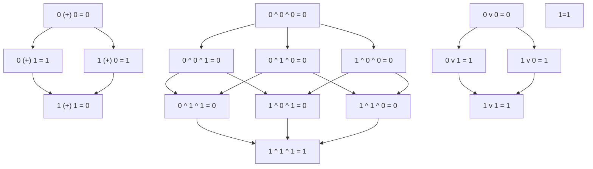
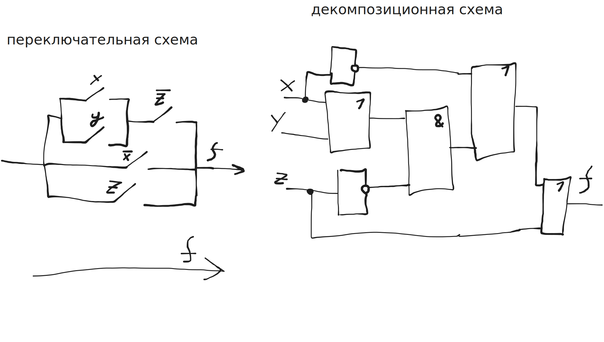

> вариант 9

## задача 1

построить таблицу истинности

$$((A \lor \overline B) \rarr \overline A) \land C$$

|  A  |  B  |  C  | | $\overline A$ | $\overline B$ | $A \lor \overline B$ | $(A \lor \overline B) \rarr \overline A$ | $((A \lor \overline B) \rarr \overline A) \land C$ |
| :-: | :-: | :-: |-| :-----------: | :-----------: | :------------------: | :---------------------: | :-----------: |
|  0  |  0  |  0  | |       1       |       1       |          1           |            1            |       0       |
|  0  |  0  |  1  | |       1       |       1       |          1           |            1            |       1       |
|  0  |  1  |  0  | |       1       |       0       |          0           |            1            |       0       |
|  0  |  1  |  1  | |       1       |       0       |          0           |            1            |       1       |
|  1  |  0  |  0  | |       0       |       1       |          1           |            0            |       0       |
|  1  |  0  |  1  | |       0       |       1       |          1           |            0            |       0       |
|  1  |  1  |  0  | |       0       |       0       |          1           |            0            |       0       |
|  1  |  1  |  1  | |       0       |       0       |          1           |            0            |       0       |

## задача 2

равносильны ли формулы:
- $A \land (\overline A \lor B)$
- $B$

### способ 1: равносильные преобразования

$$A \land (\overline A \lor B)$$

// закон дистрибутивности

$$(A \land \overline A) \lor (A \land B)$$

// закон противоречия

$$0 \lor (A \land B)$$

// идемпотентность

$$A \land B$$

$$A \land B \neq B$$

> формулы не равносильны

### способ 2: таблица истинности

| A   | B            | C   |     | $\overline A$ | $\overline A \lor B$ | $A \land (\overline A \lor B)$ |
| :-- | :----------- | :-- | :-- | :------------ | :------------------- | :----------------------------- |
| 0   | __0__        | 0   |     | 1             | 1                    | __0__                          |
| 0   | __0__        | 1   |     | 1             | 1                    | __0__                          |
| 0   | __<u>1</u>__ | 0   |     | 1             | 1                    | __0__                          |
| 0   | __<u>1</u>__ | 1   |     | 1             | 1                    | __0__                          |
| 1   | __0__        | 0   |     | 0             | 0                    | __0__                          |
| 1   | __0__        | 1   |     | 0             | 0                    | __0__                          |
| 1   | __1__        | 0   |     | 0             | 1                    | __1__                          |
| 1   | __1__        | 1   |     | 0             | 1                    | __1__                          |

> столбцы таблицы истинности не совпадают.
>
> формулы не равносильны.

## задача 3

равносильными преобразованиями прийти к СКНФ; затем перейти к СДНФ

$$A \land (A \rarr B) \rarr B$$

$$A \land (\overline A \lor B) \rarr B$$

$$\overline{A \land (\overline A \lor B)} \lor B$$

$$\overline A \lor \overline{(\overline A \lor B)} \lor B$$

$$\overline A \lor \overline{\overline A} \land \overline B \lor B$$

$$(\overline A \lor B) \lor (A \land \overline B)$$

$$(\overline A \lor B \lor A) \land (\overline A \lor B \lor \overline B)$$

<!-- $$B \land \overline A$$ -->

$$(B \lor 1) \land (\overline A \lor 1)$$

$$1 \land 1$$

$$1$$

> [!CAUTION]
>
> ФОРМУЛА ТАВТОЛОГИЧНА!
>
> поэтому СДНФ не существует!
>
> (она представляет modus ponens кстати, но это не так важно)

но СКНФ отрицания ф-ции все еще можно составить.

элементарные дизъюнкты, не вошедшие в ориг. "СКНФ":
- $A \lor B$
- $A \lor \overline B$
- $\overline A \lor B$
- $\overline A \lor \overline B$

то есть все возможные.

```math
\overline f(A; B)
= (A \lor B)
\land (A \lor \overline B)
\land (\overline A \lor B)
\land (\overline A \lor \overline B)
```

согласно закону об отрицании функции над базисом Буля:

```math
\overline {\overline f(A; B)}
= (\overline A \land \overline B)
\lor (\overline A \land B)
\lor (A \land \overline B)
\lor (A \land B)
```

> ```math
> f(A; B)
> = \overline A \, \overline B
> \lor \overline A B
> \lor A \overline B
> \lor AB
> ```

или, через таблицу истинности:

по _отрицанию СКНФ_ получаем соот. наборы входных значений:
- $\overline f(0, 0) = 0$
- $\overline f(0, 1) = 0$
- $\overline f(1, 0) = 0$
- $\overline f(1, 1) = 0$

---

- $f(0, 0) = 1$
- $f(0, 1) = 1$
- $f(1, 0) = 1$
- $f(1, 1) = 1$

элементарные конъюнкты:
- $\overline A \land \overline B$
- $\overline A \land B$
- $A \land \overline B$
- $A \land B$

> ```math
> f(A; B)
> = \overline A \, \overline B
> \lor \overline A B
> \lor A \overline B
> \lor AB
> ```

## задача 4

Является ли рассуждение логически правильным

- A - почтальон будет приносить газеты вовремя
- B - люди будут покупать газеты в киоске
- C - люди будут слушать радио
- D - тираж будет уменьшен

$$\overline A \rarr (B \lor C)$$

$$\overline B \rarr D$$

$$D \land \overline A \rarr \overline C$$

следовательно

$$B$$

---

$$\overline A \rarr (B \lor C), \overline B \rarr D, D \land \overline A \rarr \overline C \rightarrowtail B$$

<!-- $$(\overline A \rarr (B \lor C))(\overline B \rarr D)(D \land \overline A \rarr \overline C) \rightarrow B$$

$$(A \lor (B \lor C))(B \lor D)(\overline{D \land \overline A} \lor \overline C) \rightarrow B$$

$$(A \lor B \lor C)(B \lor D)(\overline{D \land \overline A} \lor \overline C) \rightarrow B$$

$$(B(A \lor B \lor C) \lor D(A \lor B \lor C))(\overline D \lor A \lor \overline C) \rightarrow B$$

<!-- $$(AB \lor BB \lor BC) \lor (AD \lor BD \lor CD))(\overline D \lor A \lor \overline C) \rightarrow B$$ ->

$$(A \lor B \lor C)(B \lor D)(\overline D \lor A \lor \overline C) \rightarrow B$$

$$(A \lor B \lor C)(B(\overline D \lor A \lor \overline C) \lor D(\overline D \lor A \lor \overline C)) \rightarrow B$$

$$(A \lor B \lor C)((B \overline D \lor AB \lor B \overline C) \lor (\cancel{D \overline D} \lor AD \lor \overline CD)) \rightarrow B$$

$$(A \lor B \lor C)(B \overline D \lor AB \lor B \overline C \lor AD \lor \overline CD) \rightarrow B$$

$$(A(B \overline D \lor AB \lor B \overline C \lor AD \lor \overline CD) \lor B(B \overline D \lor AB \lor B \overline C \lor AD \lor \overline CD) \lor C(B \overline D \lor AB \lor B \overline C \lor AD \lor \overline CD)) \rightarrow B$$

$$((AB \overline D \lor AAB \lor AB \overline C \lor AAD \lor A\overline CD) \lor (BB \overline D \lor ABB \lor BB \overline C \lor ABD \lor B\overline CD) \lor (BC \overline D \lor ABC \lor \cancel{BC \overline C} \lor ACD \lor \cancel{\overline CCD})) \rightarrow B$$

$$(AB\overline D \lor AB \lor AB\overline C \lor AD \lor A\overline CD \lor B\overline D \lor AB \lor B\overline C \lor ABD \lor B\overline CD \lor BC\overline D \lor ABC \lor \cancel{BC\overline C} \lor ACD \lor \cancel{\overline CCD}) \rightarrow B$$

$$(AB\overline D \lor AB \lor AB\overline C \lor AD \lor A\overline CD \lor B\overline D \lor AB \lor B\overline C \lor ABD \lor B\overline CD \lor BC\overline D \lor ABC \lor ACD) \rightarrow B$$

$$(AB \lor AD \lor B\overline D \lor B\overline C \lor BC\overline D \lor ACD) \rightarrow B$$

$$(AB \lor AD \lor B\overline D \lor B\overline C) \rightarrow B$$

$$B(A \lor \overline D \lor \overline C) \lor AD \rightarrow B$$

<!-- $$\overline{AB \lor AD \lor B\overline D \lor B\overline C} \lor B$$ ->

$$\overline{B(A \lor \overline D \lor \overline C) \lor AD} \lor B$$

$$\overline{B(A \lor \overline D \lor \overline C)} \land \overline{AD} \lor B$$

$$(\overline B \lor \overline{A \lor \overline D \lor \overline C}) \land \overline A \lor \overline D \lor B$$

$$(\overline B \lor \overline ADC) \land \overline A \lor \overline D \lor B$$

$$(\overline A \, \overline B \lor \overline ADC) \lor \overline D \lor B$$ -->

резулятивный вывод

$$\overline A \rarr (B \lor C), \overline B \rarr D, D \land \overline A \rarr \overline C, \overline B \rightarrowtail$$

$$A \lor (B \lor C), B \lor D, \overline{D \land \overline A} \lor \overline C, \overline B \rightarrowtail$$

$$A \lor B \lor C, B \lor D, \overline D \lor A \lor \overline C, \overline B \rightarrowtail$$

$$S = \{ A \lor B \lor C, B \lor D, \overline D \lor A \lor \overline C, \overline B \}$$

<!-- $$res _A \{ A \lor B \lor C, \overline D \lor A \lor \overline C \}$$ -->

$$res_B \{ A \lor B \lor C, B \lor D, \overline B \}$$

$$res_B \{ A \lor B \lor C, \overline B D \}$$

$$res_B \{ \overline B D A \lor \overline B D B \lor \overline B D C \}$$

$$res_B \{ \overline B D A \lor \overline B D C \} = DA \lor DC = D(A \lor C)$$

$$res _D \{ D(A \lor C), \overline D \lor A \lor \overline C\}$$

$$res _D \{ A D(A \lor C) \lor \overline C D(A \lor C)\}$$

$$res _D \{ A D \lor CAD \lor \overline C D A \lor \overline C D C\}$$

$$res _D \{ A D \lor CAD \lor \overline C D A \} = A$$

> противоречие не доказано, следовательно формула не выводима

<!-- $$res _D \{ B \lor D, \overline D \lor A \lor \overline C \}$$

$$res _D \{ (B \lor D) \overline D \lor A (B \lor D) \lor \overline C (B \lor D) \}$$

```math
res _D \{ B \overline D \lor A B \lor AD \lor \overline C B \lor \overline C D \}
= A B \lor A \lor \overline C B \lor \overline C \lor B
= A \lor \overline C \lor B
```

$$res _B \{ \}$$ -->

### 2 способ: теорема дедукции и таблица истинности

$$(\overline A \rarr (B \lor C))(\overline B \rarr D)(D \land \overline A \rarr \overline C) \rightarrow B$$

пусть $S = (\overline A \rarr (B \lor C))(\overline B \rarr D)(D \land \overline A \rarr \overline C)$


|  A  |  B  |  C  |  D  | $\overline A \rarr (B \lor C)$ | $\overline B \rarr D$ | $D \land \overline A \rarr \overline C$  | $S \rarr B$  |
| :-: | :-: | :-: | :-: | :----------------------------: | :-------------------: | :-: | :-: |
|  0  |  0  |  0  |  0  |               0                |           0           |  1  |  1  |
|  0  |  0  |  0  |  1  |               0                |           1           |  1  |  1  |
|  0  |  0  |  1  |  0  |               1                |           0           |  1  |  1  |
|  0  |  0  |  1  |  1  |               1                |           1           |  0  |  1  |
|  0  |  1  |  0  |  0  |               1                |           1           |  1  |  1  |
|  0  |  1  |  0  |  1  |               1                |           1           |  1  |  1  |
|  0  |  1  |  1  |  0  |               1                |           1           |  1  |  1  |
|  0  |  1  |  1  |  1  |               1                |           1           |  0  |  1  |
|  1  |  0  |  0  |  0  |               1                |           0           |  1  |  1  |
|  1  |  0  |  0  |  1  |               1                |           1           |  1  |  0  |
|  1  |  0  |  1  |  0  |               1                |           0           |  1  |  1  |
|  1  |  0  |  1  |  1  |               1                |           1           |  1  |  0  |
|  1  |  1  |  0  |  0  |               1                |           1           |  1  |  1  |
|  1  |  1  |  0  |  1  |               1                |           1           |  1  |  1  |
|  1  |  1  |  1  |  0  |               1                |           1           |  1  |  1  |
|  1  |  1  |  1  |  1  |               1                |           1           |  1  |  1  |

|  A  |  B  |  C  |  D  | $\overline A \rarr (B \lor C)$ | $\overline B \rarr D$ | $D \land \overline A \rarr \overline C$  | $S \rarr B$  |
| :-: | :-: | :-: | :-: | :----------------------------: | :-------------------: | :-: | :-: |
|  0  |  1  |  0  |  0  |               1                |           1           |  1  |  1  |
|  0  |  1  |  0  |  1  |               1                |           1           |  1  |  1  |
|  0  |  1  |  1  |  0  |               1                |           1           |  1  |  1  |
|  1  |  0  |  0  |  1  |               1                |           1           |  1  |  __0__  |
|  1  |  0  |  1  |  1  |               1                |           1           |  1  |  __0__  |
|  1  |  1  |  0  |  0  |               1                |           1           |  1  |  1  |
|  1  |  1  |  0  |  1  |               1                |           1           |  1  |  1  |
|  1  |  1  |  1  |  0  |               1                |           1           |  1  |  1  |
|  1  |  1  |  1  |  1  |               1                |           1           |  1  |  1  |

> невозможно доказать тождественность импликации $S \rarr B$,
> следовательно формула не выводима

## задача 5

$$A \land B \lor \overline C$$

| A   | B   | C   |     | $\overline C$ | $A \land B$ | $A \land B \lor \overline C$ |
| :-- | :-- | :-- | :-- | :------------ | :---------- | :--------------------------- |
| 0   | 0   | 0   |     | 1             | 0           | 1                            |
| 0   | 0   | 1   |     | 0             | 0           | 0                            |
| 0   | 1   | 0   |     | 1             | 0           | 1                            |
| 0   | 1   | 1   |     | 0             | 0           | 0                            |
| 1   | 0   | 0   |     | 1             | 0           | 1                            |
| 1   | 0   | 1   |     | 0             | 0           | 0                            |
| 1   | 1   | 0   |     | 1             | 1           | 1                            |
| 1   | 1   | 1   |     | 0             | 1           | 1                            |


СДНФ:

- 000 1
- 010 1
- 100 1
- 110 1
- 111 1

```math
\overline A \, \overline B \, \overline C
\lor \overline A B \overline C
\lor A \overline B \, \overline C
\lor A B \, \overline C
\lor A B C
```

СКНФ:

- 001 0
- 011 0
- 101 0

```math
(A \lor B \lor \overline C)
(A \lor \overline B \lor \overline C)
(\overline A \lor B \lor \overline C)
```

## задача 6

Двойственная функция - это отрицание оригинальной функции,
на вход которой подаются аргументы двойственной функции также под отрицанием.


$$f^*(A;B;C) = \overline{f(\overline A; \overline B; \overline C)}$$

Это выполняется для функций любого числа аргументов.

Более формально:

Если формула $\Phi[f_1; f_2; ...; f_n]$ реализует функцию g, то формула
полученная из нее заменой символов функций $f_1; f_2; ...; f_n$ на символы
двойственной к ним функций, т.е. $f_1^*; f_2^*; ...; f_n^*$ реализуют
$g^*$, двойственную к функции $g$

---

$$f(A;B;C) = A \land B \lor \overline C$$

```math
f^*(A;B;C)
= \overline{\overline A \land \overline B \lor \overline {\overline C}}
```

```math
f^*(A;B;C)
= \overline{\overline{A \lor B} \lor C}
```

```math
f^*(A;B;C)
= \overline{\overline{A \lor B}} \land \overline C
```

```math
f^*(A;B;C)
= (A \lor B) \land \overline C
```

отрицание оригинальной ф-ции:

$$\overline{f(A;B;C)} = \overline{A \land B \lor \overline C}$$

$$\overline{f(A;B;C)} = \overline{A \land B} \land \overline{\overline C}$$

$$\overline{f(A;B;C)} = (\overline A \lor \overline B) \land C$$

отрицание двойственной:

```math
\overline{f^*(A;B;C)}
= \overline{A \lor B} \lor C
= \overline A \land \overline B \lor C
```

## задача 7

<!-- | A   | B   | C   | $f(A;B;C)$ | -->

метод треугольника Паскаля

| A   | B   | C   |              |     |
| :-- | :-- | :-- | :----------: | --- |
| 0   | 0   | 0   | `1\|0101011` | 1   |
| 0   | 0   | 1   | `1\|111110`  | C   |
| 0   | 1   | 0   |  `0\|00001`  |     |
| 0   | 1   | 1   |  `0\|0001`   |     |
| 1   | 0   | 0   |   `0\|001`   |     |
| 1   | 0   | 1   |   `0\|01`    |     |
| 1   | 1   | 0   |    `0\|1`    |     |
| 1   | 1   | 1   |    `1\|`     | ABC |

> $$1 \oplus C \oplus ABC$$

## задача 8

- $f_1 = x \oplus y$
- $f_2 = xyz$
- $f_3 = x \lor y$
- $f_4 = 1$

Классы Поста:
- $T_0$ - сохраняют 0
  - $0 \oplus 0 = 0$
  - $0 \land 0 \land 0 = 0$
  - $0 \lor 0 = 0$
  - $1 \neq 0$
- $T_1$ - сохраняют 1
  - $1 \oplus 1 \neq 1$
  - $1 \land 1 \land 1 = 1$
  - $1 \lor 1 = 1$
  - $1 = 1$
- $S$ - самодвойственные
  - $f_1 ^* = \overline x \equiv \overline y = \overline x \, \overline y \lor xy \neq f_1$
  - $f_2 ^* = \overline{\overline x \, \overline y \, \overline z} = x \lor y \lor z \neq f_2$
  - $f_3 ^* = \overline{\overline x \lor \overline y} = x \land y \neq f_3$
  - $f_4 ^* = \overline 1 = 0 \neq f_4$ (константа, 0 аргументов)
- $M$ - монотонные.
  - Диаграммы Хоссе (см. ниже)
- $L$ - линейные
  - Полином Жегалкина
    - $f_1 = x \oplus y$ - линейная
    - $f_2 = xyz$ - нелинейная
    - $f_3 = x \oplus y \oplus xy$ - нелинейная
    - $f_4 = 1$ - линейная

| x   | y   | .    | .   |
| :-- | :-- | :--- | :-- |
| 0   | 0   | 0111 |     |
| 0   | 1   | 100  | y   |
| 1   | 0   | 10   | x   |
| 1   | 1   | 1    | xy  |

| x   | y   | z   |          |     |
| :-- | :-- | :-- | :------- | :-- |
| 0   | 0   | 0   | 00000001 |     |
| 0   | 0   | 1   | 0000001  |     |
| 0   | 1   | 0   | 000001   |     |
| 0   | 1   | 1   | 00001    |     |
| 1   | 0   | 0   | 0001     |     |
| 1   | 0   | 1   | 001      |     |
| 1   | 1   | 0   | 01       |     |
| 1   | 1   | 1   | 1        | xyz |




| $f$          | $T_0$ | $T_1$ | $S$ | $M$ | $L$ |
| ------------ | ----- | ----- | --- | --- | --- |
| $x \oplus y$ | +     | -     | -   | -   | +   |
| $xyz$        | +     | +     | -   | +   | -   |
| $x \lor y$   | +     | +     | -   | +   | -   |
| 1            | -     | +     | -   | +   | +   |

каждый класс Поста не содержит хотя бы одну ф-цию из системы.

т.е. система не является подмножеством ни одного из классов

> следовательно, система полна.

- $T_0$
  - $\overline x = 1 \oplus x = f_1(f_4, x)$
  - $1 = f_4$
- $T_1$
  - $\overline x = 1 \oplus x = f_1(f_4, x)$
  - $0 = \overline 1 = 1 \oplus 1 = f_1(f_4, f_4)$
- $S$
  - $0 = \overline 1 = 1 \oplus 1 = f_1(f_4, f_4)$
  - $1 = f_4$
- $M$
  - $\overline x = 1 \oplus x = f_1(f_4, x)$
- $L$
  - $x \land y = xy \land 1 = f_2(x, y, f_4)$

## задача 9

$$f(x, y, z, t) = \Sigma (2, 4, 6, 7, 8, 9, 12, 13, 14)$$

| .   | x   | y   | z   | t   |     | f(x, y, z, t) |
| :-- | :-- | :-- | :-- | :-- | --- | :------------ |
| 0   | 0   | 0   | 0   | 0   |     | 0             |
| 1   | 0   | 0   | 0   | 1   |     | 0             |
| 2   | 0   | 0   | 1   | 0   |     | 1             |
| 3   | 0   | 0   | 1   | 1   |     | 0             |
| 4   | 0   | 1   | 0   | 0   |     | 1             |
| 5   | 0   | 1   | 0   | 1   |     | 0             |
| 6   | 0   | 1   | 1   | 0   |     | 1             |
| 7   | 0   | 1   | 1   | 1   |     | 1             |
| 8   | 1   | 0   | 0   | 0   |     | 1             |
| 9   | 1   | 0   | 0   | 1   |     | 1             |
| 10  | 1   | 0   | 1   | 0   |     | 0             |
| 11  | 1   | 0   | 1   | 1   |     | 0             |
| 12  | 1   | 1   | 0   | 0   |     | 1             |
| 13  | 1   | 1   | 0   | 1   |     | 1             |
| 14  | 1   | 1   | 1   | 0   |     | 1             |
| 15  | 1   | 1   | 1   | 1   |     | 0             |

СДНФ:

```math
\,\overline x \,\overline y z \,\overline t
\lor \,\overline x y \,\overline z \,\overline t
\lor \,\overline x y z \,\overline t
\lor \,\overline x y z t
\lor x \,\overline y \,\overline z \,\overline t
\lor x \,\overline y \,\overline z t
\lor x y \,\overline z \,\overline t
\lor x y \,\overline z t
\lor x y z \,\overline t
```

### Равносильные преобразования

```math
\,\overline x \,\overline y z \,\overline t
\lor \,\overline x y \,\overline t
\lor \,\overline x y z t
\lor x \,\overline y \,\overline z \,\overline t
\lor x \,\overline y \,\overline z t
\lor x y \,\overline z \,\overline t
\lor x y \,\overline z t
\lor x y z \,\overline t
```

```math
\,\overline x \,\overline y z \,\overline t
\lor \,\overline x y \,\overline t
\lor \,\overline x y z t
\lor x \,\overline y \,\overline z \,\overline t
\lor x \,\overline y \,\overline z t
\lor x y \,\overline z t
\lor x y \,\overline t
```

```math
\,\overline x \,\overline y z \,\overline t
\lor \,\overline x y z t
\lor x \,\overline y \,\overline z \,\overline t
\lor x \,\overline y \,\overline z t
\lor x y \,\overline z t
\lor y \,\overline t
```

```math
\,\overline x \,\overline y z \,\overline t
\lor \,\overline x y z t
% \lor x \,\overline y \,\overline z \,\overline t
\lor x \,\overline y \,\overline z
\lor x y \,\overline z t
\lor y \,\overline t
```

```math
\overline y (\overline x z \overline t \lor x \overline z)
\lor y (\overline x z t \lor x \overline z t \lor \overline t)
```

```math
\overline y (\overline x z \overline t \lor x \overline z)
\lor y (t(\overline x z \lor x \overline z) \lor \overline t)
```

```math
\overline y (\overline x z \overline t \lor x \overline z)
\lor y (\overline x z \lor x \overline z \lor \overline t)
```

```math
(\,\overline x \,\overline y z \,\overline t \lor x \,\overline y \,\overline z)
\lor (\,\overline x y z \lor x y \,\overline z \lor y \,\overline t)
```

```math
\,\overline x \,\overline y z \,\overline t \lor x \,\overline y \,\overline z
\lor \,\overline x y z \lor x y \,\overline z \lor y \,\overline t
```

```math
\,\overline x \,\overline y z \,\overline t
% \lor x \,\overline y \,\overline z
\lor \,\overline x y z
\lor x \,\overline z
\lor y \,\overline t
```

```math
\overline t (
\,\overline x \,\overline y z
\lor y
)
\lor \,\overline x y z
\lor x \,\overline z
```

```math
\overline t (
\,\overline y (\,\overline x z)
\lor y
)
\lor \,\overline x y z
\lor x \,\overline z
```

```math
\overline t (
\,\overline x z
\lor y
)
\lor \,\overline x y z
\lor x \,\overline z
```

> ```math
> % (
> \,\overline x z \overline t 
> \lor y \overline t 
> % )
> \lor \,\overline x y z
> \lor x \,\overline z
> ```

<!-- ```math
\,\overline x \,\overline y z \,\overline t
\lor \,\overline x y z t
\lor x \,\overline y \,\overline z \,\overline t
\lor x \,\overline z t
\lor y \,\overline t
``` -->

<!-- ```math
\,\overline x z \,\overline t
\lor \,\overline x y \,\overline z \,\overline t
\lor \,\overline x y z t
\lor x \,\overline y \,\overline z \,\overline t
\lor x \,\overline y \,\overline z t
\lor x y \,\overline z \,\overline t
\lor x y \,\overline z t
\lor x y z \,\overline t
```

```math
\,\overline x z \,\overline t
\lor \,\overline x y \,\overline z \,\overline t
\lor \,\overline x y z t
\lor x \,\overline y \,\overline z
\lor x y \,\overline z \,\overline t
\lor x y \,\overline z t
\lor x y z \,\overline t
```

```math
\,\overline x z \,\overline t
\lor \,\overline x y z t
\lor x \,\overline y \,\overline z
\lor y \,\overline z \,\overline t
\lor x y \,\overline z t
\lor x y z \,\overline t
```

```math
\,\overline x z \,\overline t
\lor \,\overline x y z t
\lor x \,\overline y \,\overline z
\lor y \,\overline z \,\overline t
\lor x y \,\overline z t
\lor x y z \,\overline t
```
 -->
<!-- склейки:

- 2-3:  -->

### Карта Карно

| .   | 00  | 01  | 11  | 10  |
| :-- | :-- | :-- | :-- | :-- |
| 00  | .   | .   | .   | 1   |
| 01  | 1   | .   | 1   | 1   |
| 11  | 1   | 1   | .   | 1   |
| 10  | 1   | 1   | .   | .   |


#### импликантная матрица

| implicant | notXnotYZnotT | notXYnotZnotT | notXYZnotT | notXYZT | XnotYnotZnotT | XnotYnotZT | XYnotZnotT | XYnotZT | XYZnotT |
| :-------- | :------------ | :------------ | :--------- | :------ | :------------ | :--------- | :--------- | :------ | :------ |
| YnotT     | .             | O             | O          | .       | .             | .          | O          | .       | O       |
| XnotZ     | .             | .             | .          | .       | O             | O          | O          | O       | .       |
| notXZnotT | O             | .             | O          | .       | .             | .          | .          | .       | .       |
| notXYZ    | .             | .             | O          | O       | .             | .          | .          | .       | .       |

Ни одну строку вычеркнуть нельзя.

> МДНФ:
> 
> ```math
> y \overline t
> \lor x \overline z
> \lor \overline x z \overline t
> \lor \overline x y z
> ```

<!-- > ```math
> x \overline z
> \lor y \overline t
> \lor \overline x y z
> \lor \overline x z \overline t
> ``` -->

### Метод Квайна

| .   | .             | .     | .         | .           | .       |
| :-- | :------------ | :---- | :-------- | :---------- | :------ |
| 1 * | notXnotYZnotT | 1-3 ~ | notXZnotT | .           | .       |
| 2 * | notXYnotZnotT | 2-3 * | notXYnotT | (2-3)-(7-9) | YnotT ~ |
| 3 * | notXYZnotT    | 2-7 * | YnotZnotT | (2-7)-(3-9) | YnotT ~ |
| 4 * | notXYZT       | 3-4 ~ | notXYZ    | .           | .       |
| 5 * | XnotYnotZnotT | 3-9 * | YZnotT    | .           | .       |
| 6 * | XnotYnotZT    | 5-6 * | XnotYnotZ | (5-6)-(7-8) | XnotZ ~ |
| 7 * | XYnotZnotT    | 5-7 * | XnotZnotT | (5-7)-(6-8) | XnotZ ~ |
| 8 * | XYnotZT       | 6-8 * | XnotZT    | .           | .       |
| 9 * | XYZnotT       | 7-8 * | XYnotZ    | .           | .       |
| .   | .             | 7-9 * | XYnotT    | .           | .       |

см. [#импликантная-матрица](#импликантная-матрица)

> МДНФ:
> 
> ```math
> y \overline t
> \lor x \overline z
> \lor \overline x z \overline t
> \lor \overline x y z
> ```

### Метод МакКласки

| interval |     |      |       |      |        |      |
| -------- | --- | ---- | ----- | ---- | ------ | ---- |
| 1        | a * | 0010 | a-d ~ | 0_10 | bdfi ~ | _1_0 |
|          | b * | 0100 | b-d * | 01_0 | bfdi ~ | _1_0 |
|          | c * | 1000 | b-f * | _100 | cefh ~ | 1_0_ |
| 2        | d * | 0110 | c-e * | 100_ | cfeh ~ | 1_0_ |
|          | e * | 1001 | c-f * | 1_00 |        |      |
|          | f * | 1100 | d-g ~ | 011_ |        |      |
| 3        | g * | 0111 | d-i * | _110 |        |      |
|          | h * | 1101 | e-h * | 1_01 |        |      |
|          | i * | 1110 | f-h * | 110_ |        |      |
|          |     |      | f-i * | 11_0 |        |      |

$$y \overline t \lor x \overline z \lor \overline x z \overline t \lor \overline x yz$$

см. [#импликантная-матрица](#импликантная-матрица)


> МДНФ:
> 
> ```math
> y \overline t
> \lor x \overline z
> \lor \overline x z \overline t
> \lor \overline x y z
> ```

### Метод неопределенных коэффицентов (бонус)

[end](#end)

```math
f(x, y, z, t)
= k_1 ^x
\lor k_2 ^y
\lor k_3 ^z
\lor k_4 ^t
% 
\lor k_{12} ^{xy}
\lor k_{13} ^{xz}
\lor k_{14} ^{xt}
% 
\lor k_{23} ^{yz}
\lor k_{24} ^{yt}
% 
\lor k_{34} ^{zt}
%%
\lor k_{234} ^{yzt}
\lor k_{134} ^{xzt}
\lor k_{124} ^{xyt}
\lor k_{123} ^{xyz}
%%
\lor k_{1234} ^{xyzt}
```

<!-- представим 4-местную булевую ф-цию в следующем виде:

```math
f(x, y, z, t)
= x k_1 ^1 \lor \overline x \cancel{k_1 ^0}
\lor y k_2 ^1 \lor \overline y \cancel{k_2 ^0}
\lor z \cancel{k_3 ^1} \lor \overline z k_3 ^0
\lor t \cancel{k_4 ^1} \lor \overline t k_4 ^0
\lor
```

```math
\lor x
```
-->

---

```math
f(0, 0, 0, 0)
= \cancel{k_1 ^0}
\lor \cancel{k_2 ^0}
\lor \cancel{k_3 ^0}
\lor \cancel{k_4 ^0}
% 
\lor \cancel{k_{12} ^{00}}
\lor \cancel{k_{13} ^{00}}
\lor \cancel{k_{14} ^{00}}
% 
\lor \cancel{k_{23} ^{00}}
\lor \cancel{k_{24} ^{00}}
% 
\lor \cancel{k_{34} ^{00}}
%%
\lor \cancel{k_{234} ^{000}}
\lor \cancel{k_{134} ^{000}}
\lor \cancel{k_{124} ^{000}}
\lor \cancel{k_{123} ^{000}}
%%
\lor \cancel{k_{1234} ^{0000}}
= 0
```

```math
f(0, 0, 0, 1)
= \cancel{k_1 ^0}
\lor \cancel{k_2 ^0}
\lor \cancel{k_3 ^0}
\lor \cancel{k_4 ^1}
% 
\lor \cancel{k_{12} ^{00}}
\lor \cancel{k_{13} ^{00}}
\lor \cancel{k_{14} ^{01}}
% 
\lor \cancel{k_{23} ^{00}}
\lor \cancel{k_{24} ^{01}}
% 
\lor \cancel{k_{34} ^{01}}
%%
\lor \cancel{k_{234} ^{001}}
\lor \cancel{k_{134} ^{001}}
\lor \cancel{k_{124} ^{001}}
\lor \cancel{k_{123} ^{000}}
%%
\lor \cancel{k_{1234} ^{0001}}
= 0
```

```math
f(0, 0, 1, 0)
= \cancel{k_1 ^0}
\lor \cancel{k_2 ^0}
\lor \cancel{k_3 ^1}
\lor \cancel{k_4 ^0}
% 
\lor \cancel{k_{12} ^{00}}
\lor \cancel{k_{13} ^{01}}
\lor \cancel{k_{14} ^{00}}
% 
\lor \cancel{k_{23} ^{01}}
\lor \cancel{k_{24} ^{00}}
% 
\lor k_{34} ^{10}
%%
\lor k_{234} ^{010}
\lor k_{134} ^{010}
\lor \cancel{k_{124} ^{000}}
\lor \cancel{k_{123} ^{001}}
%%
\lor k_{1234} ^{0010}
= 1
```

```math
f(0, 0, 1, 1)
= \cancel{k_1 ^0}
\lor \cancel{k_2 ^0}
\lor \cancel{k_3 ^1}
\lor \cancel{k_4 ^1}
% 
\lor \cancel{k_{12} ^{00}}
\lor \cancel{k_{13} ^{01}}
\lor \cancel{k_{14} ^{01}}
% 
\lor \cancel{k_{23} ^{01}}
\lor \cancel{k_{24} ^{01}}
% 
\lor \cancel{k_{34} ^{11}}
%%
\lor \cancel{k_{234} ^{011}}
\lor \cancel{k_{134} ^{011}}
\lor \cancel{k_{124} ^{001}}
\lor \cancel{k_{123} ^{001}}
%%
\lor \cancel{k_{1234} ^{0011}}
= 0
```

```math
f(0, 1, 0, 0)
= \cancel{k_1 ^0}
\lor k_2 ^1
\lor \cancel{k_3 ^0}
\lor \cancel{k_4 ^0}
% 
\lor k_{12} ^{01}
\lor \cancel{k_{13} ^{00}}
\lor \cancel{k_{14} ^{00}}
% 
\lor k_{23} ^{10}
\lor k_{24} ^{10}
% 
\lor \cancel{k_{34} ^{00}}
%%
\lor k_{234} ^{100}
\lor \cancel{k_{134} ^{000}}
\lor k_{124} ^{010}
\lor k_{123} ^{010}
%%
\lor k_{1234} ^{0100}
= 1
```

```math
f(0, 1, 0, 1)
= \cancel{k_1 ^0}
\lor k_2 ^1
\lor \cancel{k_3 ^0}
\lor \cancel{k_4 ^1}
% 
\lor k_{12} ^{01}
\lor \cancel{k_{13} ^{00}}
\lor \cancel{k_{14} ^{01}}
% 
\lor k_{23} ^{10}
\lor k_{24} ^{11}
% 
\lor \cancel{k_{34} ^{01}}
%%
\lor k_{234} ^{101}
\lor \cancel{k_{134} ^{001}}
\lor k_{124} ^{011}
\lor k_{123} ^{010}
%%
\lor k_{1234} ^{0101}
= 0
```

```math
f(0, 1, 1, 0)
= \cancel{k_1 ^0}
\lor k_2 ^1
\lor \cancel{k_3 ^1}
\lor \cancel{k_4 ^0}
% 
\lor k_{12} ^{01}
\lor \cancel{k_{13} ^{01}}
\lor \cancel{k_{14} ^{00}}
% 
\lor k_{23} ^{11}
\lor k_{24} ^{10}
% 
\lor k_{34} ^{10}
%%
\lor k_{234} ^{110}
\lor k_{134} ^{010}
\lor k_{124} ^{010}
\lor k_{123} ^{011}
%%
\lor k_{1234} ^{0110}
= 1
```

```math
f(0, 1, 1, 1)
= \cancel{k_1 ^0}
\lor k_2 ^1
\lor \cancel{k_3 ^1}
\lor \cancel{k_4 ^1}
% 
\lor k_{12} ^{01}
\lor \cancel{k_{13} ^{01}}
\lor \cancel{k_{14} ^{01}}
% 
\lor k_{23} ^{11}
\lor k_{24} ^{11}
% 
\lor \cancel{k_{34} ^{11}}
%%
\lor k_{234} ^{111}
\lor \cancel{k_{134} ^{011}}
\lor k_{124} ^{011}
\lor k_{123} ^{011}
%%
\lor k_{1234} ^{0111}
= 1
```

```math
f(1, 0, 0, 0)
= k_1 ^1
\lor \cancel{k_2 ^0}
\lor \cancel{k_3 ^0}
\lor \cancel{k_4 ^0}
% 
\lor k_{12} ^{10}
\lor k_{13} ^{10}
\lor k_{14} ^{10}
% 
\lor \cancel{k_{23} ^{00}}
\lor \cancel{k_{24} ^{00}}
% 
\lor \cancel{k_{34} ^{00}}
%%
\lor \cancel{k_{234} ^{000}}
\lor k_{134} ^{100}
\lor k_{124} ^{100}
\lor k_{123} ^{100}
%%
\lor k_{1234} ^{1000}
= 1
```

```math
f(1, 0, 0, 1)
= k_1 ^1
\lor \cancel{k_2 ^0}
\lor \cancel{k_3 ^0}
\lor \cancel{k_4 ^1}
% 
\lor k_{12} ^{10}
\lor k_{13} ^{10}
\lor k_{14} ^{11}
% 
\lor \cancel{k_{23} ^{00}}
\lor \cancel{k_{24} ^{01}}
% 
\lor \cancel{k_{34} ^{01}}
%%
\lor \cancel{k_{234} ^{001}}
\lor k_{134} ^{101}
\lor k_{124} ^{101}
\lor k_{123} ^{100}
%%
\lor k_{1234} ^{1001}
= 1
```

```math
f(1, 0, 1, 0)
= k_1 ^1
\lor \cancel{k_2 ^0}
\lor \cancel{k_3 ^1}
\lor \cancel{k_4 ^0}
% 
\lor k_{12} ^{10}
\lor k_{13} ^{11}
\lor k_{14} ^{10}
% 
\lor \cancel{k_{23} ^{01}}
\lor \cancel{k_{24} ^{00}}
% 
\lor k_{34} ^{10}
%%
\lor k_{234} ^{010}
\lor k_{134} ^{110}
\lor k_{124} ^{100}
\lor k_{123} ^{101}
%%
\lor k_{1234} ^{1010}
= 0
```

```math
f(1, 0, 1, 1)
= k_1 ^1
\lor \cancel{k_2 ^0}
\lor \cancel{k_3 ^1}
\lor \cancel{k_4 ^1}
% 
\lor k_{12} ^{10}
\lor k_{13} ^{11}
\lor k_{14} ^{11}
% 
\lor \cancel{k_{23} ^{01}}
\lor \cancel{k_{24} ^{01}}
% 
\lor \cancel{k_{34} ^{11}}
%%
\lor \cancel{k_{234} ^{011}}
\lor k_{134} ^{111}
\lor k_{124} ^{101}
\lor k_{123} ^{101}
%%
\lor k_{1234} ^{1011}
= 0
```

```math
f(1, 1, 0, 0)
= k_1 ^1
\lor k_2 ^1
\lor \cancel{k_3 ^0}
\lor \cancel{k_4 ^0}
% 
\lor k_{12} ^{11}
\lor k_{13} ^{10}
\lor k_{14} ^{10}
% 
\lor k_{23} ^{10}
\lor k_{24} ^{10}
% 
\lor \cancel{k_{34} ^{00}}
%%
\lor k_{234} ^{100}
\lor k_{134} ^{100}
\lor k_{124} ^{110}
\lor k_{123} ^{110}
%%
\lor k_{1234} ^{1100}
= 1
```

```math
f(1, 1, 0, 1)
= k_1 ^1
\lor k_2 ^1
\lor \cancel{k_3 ^0}
\lor \cancel{k_4 ^1}
% 
\lor k_{12} ^{11}
\lor k_{13} ^{10}
\lor k_{14} ^{11}
% 
\lor k_{23} ^{10}
\lor k_{24} ^{11}
% 
\lor \cancel{k_{34} ^{01}}
%%
\lor k_{234} ^{101}
\lor k_{134} ^{101}
\lor k_{124} ^{111}
\lor k_{123} ^{110}
%%
\lor k_{1234} ^{1101}
= 1
```

```math
f(1, 1, 1, 0)
= k_1 ^1
\lor k_2 ^1
\lor \cancel{k_3 ^1}
\lor \cancel{k_4 ^0}
% 
\lor k_{12} ^{11}
\lor k_{13} ^{11}
\lor k_{14} ^{10}
% 
\lor k_{23} ^{11}
\lor k_{24} ^{10}
% 
\lor k_{34} ^{10}
%%
\lor k_{234} ^{110}
\lor k_{134} ^{110}
\lor k_{124} ^{110}
\lor k_{123} ^{111}
%%
\lor k_{1234} ^{1110}
= 0
```

```math
f(1, 1, 1, 1)
= k_1 ^1
\lor k_2 ^1
\lor \cancel{k_3 ^1}
\lor \cancel{k_4 ^1}
% 
\lor k_{12} ^{11}
\lor k_{13} ^{11}
\lor k_{14} ^{11}
% 
\lor k_{23} ^{11}
\lor k_{24} ^{11}
% 
\lor \cancel{k_{34} ^{11}}
%%
\lor k_{234} ^{111}
\lor k_{134} ^{111}
\lor k_{124} ^{111}
\lor k_{123} ^{111}
%%
\lor k_{1234} ^{1111}
= 1
```

###### end

## задача 10

Исходная (неоптимизированная версия):

$$(x \lor y) \overline z \lor \overline x \lor z$$



<!--```math
(x \lor y) \overline z
\lor \overline x
\lor ((x \lor y) \lor \overline{(x \lor y)})z
```

```math
(x \lor y) \overline z
\lor \overline x
\lor (x \lor y)z \lor \overline{(x \lor y)} \land z
```

```math
\overline x
\lor (x \lor y) \lor \overline{(x \lor y)} \land z
``` -->

<!-- $$x \overline z \lor y \overline z \lor \overline x \lor z$$

$$x \overline z \lor y \overline z \lor \overline x \lor z(x \lor \overline x)$$ -->

<!-- $$(x \lor y) \overline z \lor \overline x \lor z$$ -->

| x   | y   | z   | x v y | not z | (x v y) ^ not z | not x | (x v y) ^ not z v not x | (x v y) ^ not z v not x v z |
| :-- | :-- | :-- | :---- | :---- | :-------------- | :---- | :---------------------- | :-------------------------- |
| 0   | 0   | 0   | 0     | 1     | 0               | 1     | 1                       | 1                           |
| 0   | 0   | 1   | 0     | 0     | 0               | 1     | 1                       | 1                           |
| 0   | 1   | 0   | 1     | 1     | 1               | 1     | 1                       | 1                           |
| 0   | 1   | 1   | 1     | 0     | 0               | 1     | 1                       | 1                           |
| 1   | 0   | 0   | 1     | 1     | 1               | 0     | 1                       | 1                           |
| 1   | 0   | 1   | 1     | 0     | 0               | 0     | 0                       | 1                           |
| 1   | 1   | 0   | 1     | 1     | 1               | 0     | 1                       | 1                           |
| 1   | 1   | 1   | 1     | 0     | 0               | 0     | 0                       | 1                           |

упрощенная функция тождественно истинна,
по ней не получится построить по ней декомпозиционную схему.
