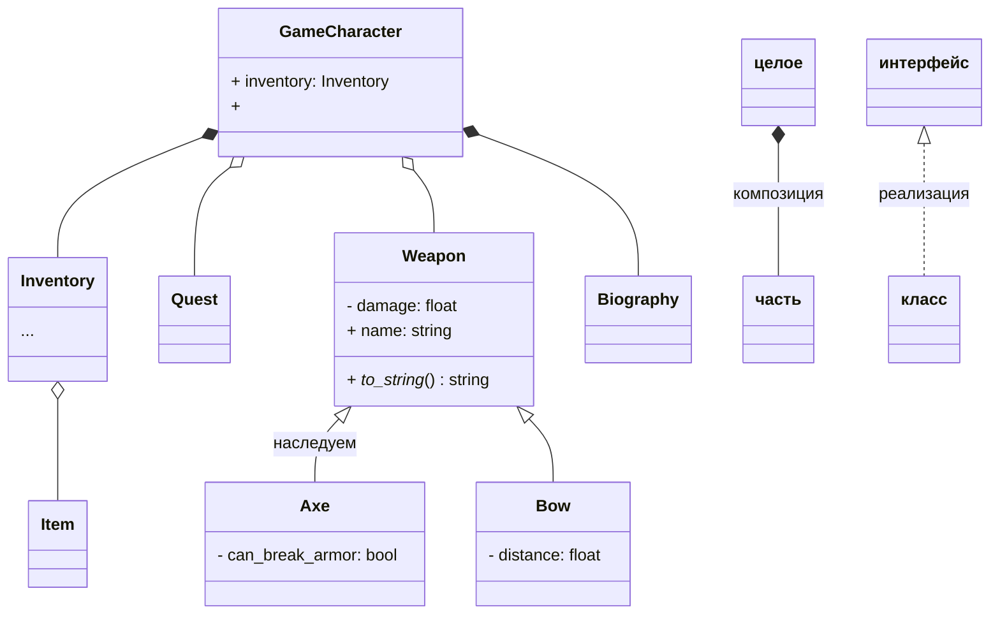
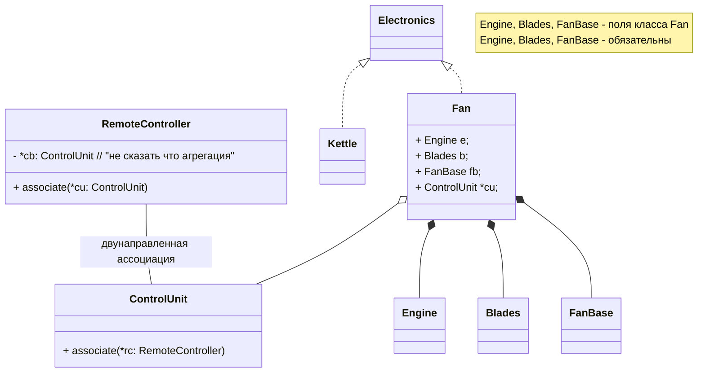
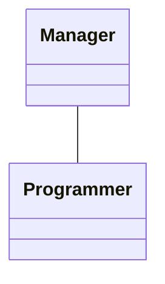

http://urait.ru/

Страуструп - C++

как проверить книгу на новизну

C++11:
- `nullptr` = `NULL`

  ```c
  #define NULL = 0
  ```

- `auto` - авто-выведение типа (вместо автоопределения времени существования)
  
  ```c++
  int x;
  auto y = 4u;  // беззнаковый
  ```

Варианты из практики!

Отчет со скринами (чтоб проверить сами ли делали)

переменная среды `PATH` - пути к исполняемым файлам

описать работу в терминале

Завершение на `TAB`

Кнопки со стрелками - история команд

// `mkvmerge` - склейка видео

тесты на `assert`

курсивом - бонусные

Конспекты в 1 файле

задание на 2 недели

```c
#include <cstdio>    // c, не c++
#include <iostream>  // c++, без .h!
```

```c++
3.5l // double!
```


`123.45e-67` = $123.45 \cdot 10^{-67}$

Используем `std::string`!

```c++
#include <iostream>

std::cout << "Hello, World!" << std::endl;

// или

using namespace std;
cout << "Hello, World!" << endl;
// Character OUTput, END Line
// << это такая функция
// cout это объект потока вывод

cout << setw(12) << fixed << setprecision(2);

cout << x << endl;

// fixed - без e

string s = format("{:.3f}", 3'000'000.14159265)

```

```c++
// Автор

#include <iostream>  // для ввода-вывода
#include <math.h>    // sqrt - квадратный корень
#include <format>    // -std=c++20

#include "unitA.h"
#include "geometry.h"

using namespace std;  // искать в стандартной библиотеке


/// вычислить расстояние от начала координат до x1, y1 
float distance_from_0(float x1, float y1) {  // формальные параметры
    return sqrt(x*x + y*y);
}


int main(){
    // if(distance_from_0(1.0, 0.0) != 1.0) {
    //     clog << "СЛОМАЛАСЬ ФУНКЦИЯ!!!" << endl;
    //     exit(1);
    // }

    assert(distance_from_0(1.0, 0.0) == 1.0);
    assert( abs(distance_from_0(0.0, 0.1)) - 0.1 < 1e-6);

    Point p1;  // NOTE: no `struct` keyword needed

    float x, y;
    float d;

    std::cout << "Введите координаты точки\n";

    std::cout << "x = ";
    std::cin >> x;

    std::cout << "y = ";
    std::cin >> y;

    // d = sqrt(x*x + y*y);

    std::cout << std::format("Расстояние = {:.2f}\n", d);
    return 0;
}
```

```c++
/// @file unitA.h

#pragma once

struct A {
    int x;
}
```

```c++
/// @file geometry.cpp


struct Point {
    double x, y;
};


float distance_from_0(float x1, float y1) {
    
}


float distance( const Point &p1, const Point, &p2 ) {
    // & - аналог ключевого слова var в паскале
    // память экономим!
    return sqrt( pow(p1.x, p2.x, 2) + pow(p1.y, p2.y, 2) );
}

void read_point( Point &point ) {
    cout << "x = ";
    cin >> point.x;

    cout << "y = ";
    cin >> point.y;
}

// Одинаковое имя с разными аргументами можно в C++!
// Называется перегрузка функций

Point read_point() {
    Point point;

    return point;
}

Point *read_point() {
    Point point;

    return &point;  // висячий указать! ошибка!
}
```

```c++
// то же самое
(*p1).x = 100;
p1->x = 100;
```

```c++
std::string s = "Russia";
std::string *rf = &s;  // указатель; `&` - взятие адреса
std::string &russia = s;  // ссылка; `&` - ссылочный тип

s = "Россия";
*rf = "Россия";
russia = "Россия";
```

```c
const size_t N = 100;
// статический
int a[N];

// Динамический массив в C
int *b = malloc( N * malloc(int) );
// ...
// работаем с массивом
// ...
free(b);
```

```c++
// В C++
int *b = new int[N];
delete[] b;
```

```c++
// Динамическая переменная
int *c = new int;
delete c;
```

Массив _распадается_ до указателя

```c++
// Заполнить массив числом
// @param arr массив
// @param size размер массива
// @param x число, которым заполнить
void fill_array(float *arr, size_t size, float x) {
    for(size_t i = 0; i < size; i++) {
        arr[i] = x;
    }
}


float *new_array(size_t size) {
    float *arr = new float[size];

    for(size_t i = 0; i < size; i++) {
        arr[i] = 0;
    }

    return arr;
    // БЕЗ delete! а то потеряется.
    // delete должен быть использован вызывающей стороной
}


// Очень плохой пример
void new_array2(float *arr, size_t size) {
    arr = new float[size];

    for(size_t i = 0; i < size; i++) {
        arr[i] = 0;
    }

    // return arr;
    // БЕЗ delete! а то потеряется.
    // delete должен быть использован вызывающей стороной
}


// Очень плохой пример
// Не попёр вообще!
void new_array3(float &*arr, size_t size) {
    arr = new float[size];

    for(size_t i = 0; i < size; i++) {
        arr[i] = 0;
    }

    // return arr;
    // БЕЗ delete! а то потеряется.
    // delete должен быть использован вызывающей стороной
}


// плохой пример
void new_array3(float **arr, size_t size) {
    *arr = new float[size];

    for(size_t i = 0; i < size; i++) {
        (*arr)[i] = 0;
    }

    // return arr;
    // БЕЗ delete! а то потеряется.
    // delete должен быть использован вызывающей стороной
}


int main() {
    size_t N = 100;
    float *a = new float[N];

    fill_array(a, N, 0);
    a[0] = 10;
    a[1] = 20;
    a[2] = 30;

    std::cout << sizeof(a) << std::endl;   // 8 (байт) (на 64-битных платформах)
    std::cout << sizeof(*a) << std::endl;  // 4 (байта)

    std::cout << a[0] << std::endl;  // 10
    std::cout << a[1] << std::endl;  // 20
    std::cout << a[2] << std::endl;  // 30

    std::cout << *a << std::endl;   // 10
    std::cout << a+1 << std::endl;  // адрес указателя...
                                    // адресная арифметика
    std::cout << a+2 << std::endl;  // адрес указателя...

    std::cout << *(a+0) << std::endl;  // 10
    std::cout << *(a+1) << std::endl;  // 20
    std::cout << *(a+2) << std::endl;  // 30
    std::cout << *(a+200) << std::endl;  // 0 - но это ошибка, не делайте так!

    delete[] a;
    a = nullptr;
    a = 0;
    a = NULL;

    return 0;
}
```

```c
int main() {
    float **matr = malloc( n * sizeof(float *) );

    for(size_t i = 0; i < n; i++) {
        matr[i] = malloc( m * sizeof(float) );
    }

    // ...

    for(size_t i = 0; i < n; i++) {
        free(matr[i]);
    }

    free(matr);
    matr = NULL;
}
```

```c++
int main() {
    size_t n = 3;
    size_t m = 4;

    float **matr = new float *[n];

    for(size_t i = 0; i < n; i++) {
        matr[i] = new float[m];
    }

    // ...

    for(size_t i = 0; i < n; i++) {
        delete[] matr[i];
    }

    delete[] matr;
    matr = nullptr;
}
```

```c++
void print_matr(float **M, size_t n, size_t m) {
    for(size_t i = 0; i < n; i++) {
        for(size_t j = 0; j < m; j++) {
            // std::cout << M[i][j] << ' ';
            std::cout << format("{:7.2f} ", M[i][j]);
        }
        std::cout << '\n';
    }
}
```

nullptr, если неадекватное значение

Статическая библиотека

.cpp -> .o -> unit.lib или unit.a

```c++
try {}
catch (const std::exception &e) {}
```

git
===

надо чтобы хранить 2 копии папки, стабильная и не очень

или если надо что то исправить в многих версиях

совместная работа

---

т.н. системы управления версий

Репозиторий (хранилище) - папка с кодом, за которой следит гит

Может быть локальный и удаленный

---

с гитом надо самому работать! он не автоматичен.

Установить гит (консольная версия (ну она по дефолтам))

НЕ СТАВЬТЕ VIM ПЖ А ТО ВЫ ОТТУДА НЕ ВЫЙДЕТЕ!!!!!!

ну или если уже...

нажмите `Esc` `:` `q` `!` `Enter`

---

```bash
git --version
cd my_project
git init
# появится папка .git (скрытая).
# не удаляем!

git add main.cpp  # теперь гит следит за main.cpp

# фиксируем изменения за ВСЕМИ отслеживаемыми файлами
git commit -am "new repo"

# ... меняем файл main.cpp
# Не забываем сохнарить (Ctrl-S)!

git commit -am "написал Hello World"

git commit -am "коммит без изменений!"

# коммит не произойдет если изменений нету

git commit -am "add new feature"

clang++ main.cpp -o main

# блин, где-то накосячили!

git log

# список коммитов...

git checkout d7a7

# файл вернулся!

git checkout main

# вернулись на главную ветку

# разница между d7a7 и главной веткой
git diff d7a7

# делаем новую функцию в main

# создаем новую ветку
git branch dev

# показать ветки
git branch

# переключаемся
git switch dev

# пока что ветки ничем не отличаются!

# делаем новую функцию...

git commit -am "+ func: hello_world"

git commit -am "fix: hello_world"

git commit -am "upd: hello_world: add doc"

# возвращаемся к ветке main
git switch main

# файл стал каким был до hello_world!

# добавить в текущую ветку изменения из другой
git merge dev

# статус репозитория: какие изменения есть?
git status

# удалить ветку
# git branch -d dev


```

собранные файлы (напр. `*.exe`) не добавляем

```bash
git switch dev

git commit -am '...'

git branch add_unit

git switch add_unit

git commit -am "fix: hello_world"

git switch dev

git merge add_unit

# Конфликт! какое из изменений "правильнее"

# наш файл изменили, там хаос теперь, обе версии там...

# Оставляем как будет лучше (буквально, руками)

git commit -am "merge: hello_world"

# кайф.

# все не нужна больше
git branch -d add_unit

# сидим на dev

clang++ main.cpp unit.cpp -o main

git ls-files

# unit.h и unit.cpp пока не отслеживается!

# а то не добавятся
git add unit.h unit.cpp

git commit -am "+ unit.h, unit.cpp"

# убрать из отслеживания
git rm --cached a.exe

# то же самое НО ТАКЖЕ УДАЛЯЕТ И САМ ФАЙЛ
git rm a.exe
```

После создания репы на гитхабе:

```bash
# добавить удаленный репозиторий в локальный
git remote add "origin" git@github.com/VetrovSV/my_project.git

# переименовать ветку
# git branch -M main

git config --local user.name "VetrovSV"
git config --local user.name "goida@goool.org"

# Отправляем данные на гитхаб
git push -u "origin" main
git push -u "origin" dev

# опять что то меняем...

git commit -am "..."

git push  # без аргументов

# теперь гит знает куда отправлять изменения.

# допустим версия на гитхабе изменилась

# скачиваем себе изменения
git pull

# полностью скачать новый репозиторий (напр. на другом компе где стоит гит)
git clone
```

MSVS (not code):

- `.sln`
- `.vcproj`

Для поиска ошибок синтаксиса отладчик не при чем.

это можно сделать кнопкой сборки.

Отладчик нужен для _логических_ ошибок.

в средах разработки запуск бывает с отладкой и без отладки.

не забываем про целочисленную арифметику

> [!NOTE]
>
> после лекций читаем учебник!
>
> (как было на тырфейсах)

Парадигмы прораммирования
- императивное
  - основано на исполнении команд
  - структурное
    - (не `struct`!)
    - if, while, for...
    - алгоритмический код
      - последовательность операторов
      - условный оператор (выбора)
      - операторы циклов
        - for
        - while
        - do...
  - процедурное
    - "нечистые" функции (с побочкой)
  - модульное
  - обьектно-ориентированное
    - когда удобнее делить задачу не на алгоритмы а на обьекты

```c++
struct Lecture {
    string title;
    vector<string> recap_themes;
    vector<string> themes;
    vector<string> questions;
    string resume;

    short duration;
}
```

придумать класс
- UML-диаграмма
  - в draw.io - "Classifier"
  - название класса
  - атрибуты (поля)
    - `+ title : string`
    - `- duration : short`
    - public: `+`
    - private: `-`
    - protected: `#`
  - операции (методы)
    - `+ Lecture(title : string, duration: short)`
    - `+ Lecture(title : string, duration: short, themes : vector<string>)`
    - `+ set_duration(duration : short)`
    - `+ get_duration() : short`
- потом на C++ написать

для диаграм: <https://draw.io>

принципы ооп:
- Абстрагирование
  - придумываем только необходимые поля
  - мурзика кормить
- Инкапсуляция
  - методы вдобавок к полям
  - `private` - принцип сокрытия
    - геттеры, сеттеры
      - для потенциально некорректных значений
    - детали реализации
- Наследование
  - Отношения между классами
    - часть и целое (агрегация и композиция)
      - в класее есть поле, тип которого - другой класс
      - напр: инвентарь и предмет

      - ```c++
        class Part {
            // ...
        };


        class Whole {
            Part p;
        };
        ```

      - композиция - обязательно включает
      - агрегация - не является неотъемлемая частью
        - напр. указатель
        - "нестрогая" композиция
      - комната, мебель: агрегация
      - комната, стены: композиция
      - тоже композиция, но с динамическим полем
        - ```c++
            class Whole {
                Part *field1;

                public:
                    Whole() { field1 = new Part(); }
                    ~Whole() { delete field1; }
            }
            ```
    - на uml обозначается ромбом
      - композиция - закрашенный
      - агрегация - нет
    - ассоциация
      - это отношение которое к другому виду не подходит
      - стрелка к тому классу который зависимый
        - при однонаправленной ассоциации
      - при двунаправленной: без стрелки
      <!-- - has a -->
    - наследование
      - есть Vector2D
      - хотим сделать Vector3D
        - плохая реализация: скопипастить
        - есть же наследование!
      - строим один класс на основе другого
        - базовый класс, или предок
        - производный класс, потоком
      - `class Vector3D: public Vector2D {`
        - `_x`, `_y` унаследованы
        - конструктор можно вызвать внутри или же:
          - `Vector3D(float x, float y, float z): Vector2D(x, y), _z(z) {}`
          - да и вообще он сам вызывается (в случае дефолтного конструктора)
          - overload для Vector3D::abs
            - `v3.abs()` вызывает именно его
      - к `protected` есть доступ у наследника, но не у мира
      - к `public` - мир
      - к `private` - не может даже наследник
      - стрелка незакрашенная
        - должна указывать на базовый класс
- \[Динамический] полиморфизм



Придумать тему 3 класса с наследованием

Области памяти:
- автоматическая память (стек) - локальные переменные, формальные
  - (могут совпадать или не совпадать с фактическими, в зависимости от передачи по ссылке) аргументы
- куча (динамическая память) - `new`
- статическая память - глобальные переменные

ADT - абстрактный тип данных (бонусное задание)
- подродбно расписать все
- см шаблон в учебнике
- лень

виртуальные методы обозначаются курсивом

вспоминаем plantUML - текстовый формат для UML-диаграм

и еще Mermaid

делаем пулл реквесты!

Полиморфизм
- определение: возможность фции работать с разными типами данных
- полезен тем что не надо запоминать разные имена фций для разных типов
- статический - понятно какую реализацию вызывать уже на этапе компиляции
  - (compile-time)
  - перегрузка фций
    - одно имя фции - много реализаций
    - отличаются параметрами
  - перегрузка операторов
    - то же самое только выглядит по другому
  - перегрузка методов
    - методы с одним названием внутри одного класса
    - отличаются списком параметров
  - шаблоны фций (`template<>`) 
- динамический
  - runtime (реализация определяется при выполнении программы)
  - надо чтоб был `virtual` метод в базовом классе
  - работает если есть `override` в классе-наследнике (но это необязательно)
    - ключевое слово переводится как "переопределение", "замена"
  - работает для указателей! не для просто объектов
  - делается через `dynamic_cast<Weapon *>(w2)`

- `vtable`
  - добавляется как неявное поле во все классы с `virtual` методами
  - то есть каждый объект содержит указатель на список методов
  - указатель на метод может быть нулевым - так делают абстрактные методы

```c++
// тогда класс называется абстрактный
// работает как эквивалент интерфейса
class Weapon {
    // ...
public:
    // _абстрактные_ методы, или _чисто виртуальные_

    // когда у метода нет реализации
    virtual void attack() = 0;
    virtual string to_string() = 0;
}
```

|     |     |
| --- | --- |
|     |     |

```c++
class Matrix { /* ... */ };

Matrix plus(Matrix m1, Matrix m2);
Matrix operator +(Matrix m1, Matrix m2);  // перегрузка оператора

Vector operator +(Vector v1, Vector v2);
Vector plus(Vector v1, Vector v2);  // перегрузка plus для векторов (не путать с std::vector)
```

<!-- ~~~markdown
```c++
fksdlfs;k
```
~~~ -->

public-наследование - все остается на местах

protected: public становится protected

private: все приватится, то что уже private - разумеется не доступно

```
using A::printData;  // "восстанавливает" доступ
// private открыть нельзя, только protected
```

абстракные классы: где есть абстрактный метод, хоть один

абстрактные методы: `virtual` `= 0;`

синоним: pure-virtual метод

абстрактные классы можно использовать как интерфейсы

для экземпляров (наследников)
абстрактных классов можно использовать только указатели!

не забываем delete

мультинаследование

проблема ромбовидного наследования

даже если общий предок - единственная реализация

```
// можно указать напрямую
dataD::B.print();
```

а еще двойной вызов конструктора и деструктора!

`virtual public` наследование - по нормальному вызывает ctor/dtor

но лучше мультинаследование вообще не делать

мультинаследование можно использовать для абстрактных классов

или mixin'ы (но опасно)

напро принтер, сканер - интерфейсы, мфу - реализация

наследование против агрерации и композиции

наследование: is-a (напр квадрат это прямоугольник)

агрерация/композиция: has-a (целое-часть) (a car has an engine)

композиция это более сильная связь чем агрегация

ассоциация слабее них

---



ассоциация в коде:
- поле с указателем
- использование одного класса внутри другого
  - когда мы создаем экземпляр в методе

```c++
// может быть ссылка, указатель или сам экземпляр
void m1(Foo f);
```




- класс
  - методы + реализация
- виртуальный класс
  - методы + реализация
  - должен быть виртуальный метод
- абстрактный
  - методы + реализация
  - должет быть абстрактный метод (виртуальный без реализации)
  - `pure virtual`
- интерфейс
  - абстрактный класс, где вообще нет реализаций

```mermaid
classDiagram

"<<interface>> Pet" <|.. Cat
"<<interface>> Pet" <|.. Dog
```

- совершенный код - стив макконелл
- чистый код - роберт мартин
- чистая архитектура - это попозже

## SOLID

### Single Responsibility

швейцарский нож

### Open/closed
### Liskov substitution
### Interface segregation
### Dependency inversion
