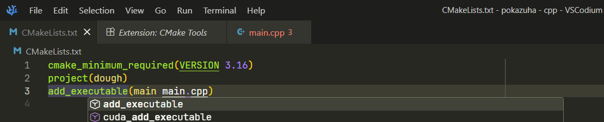
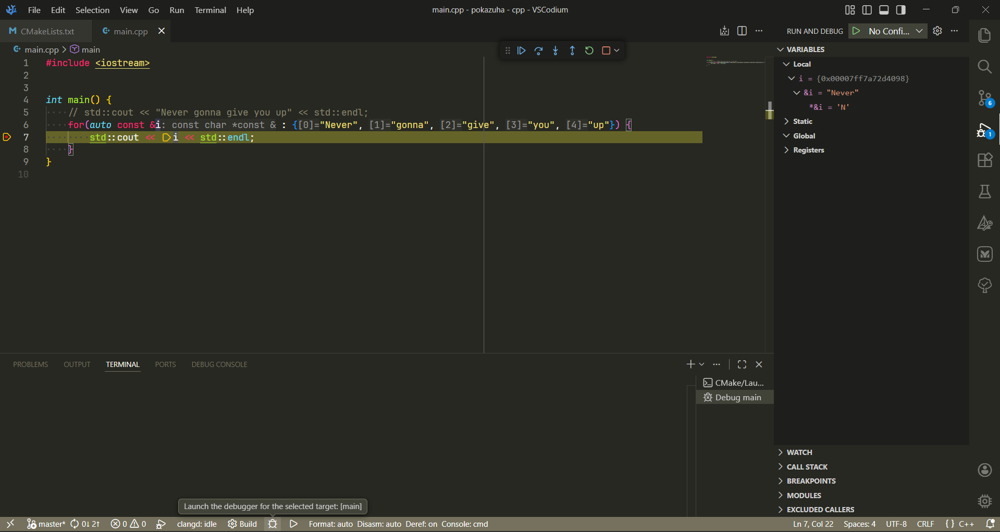
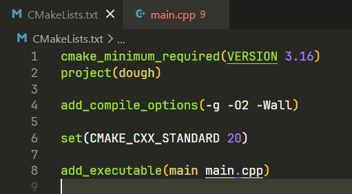
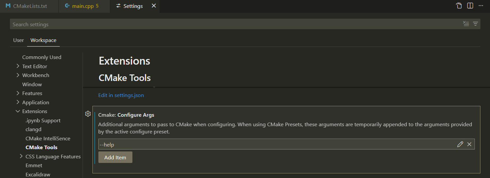
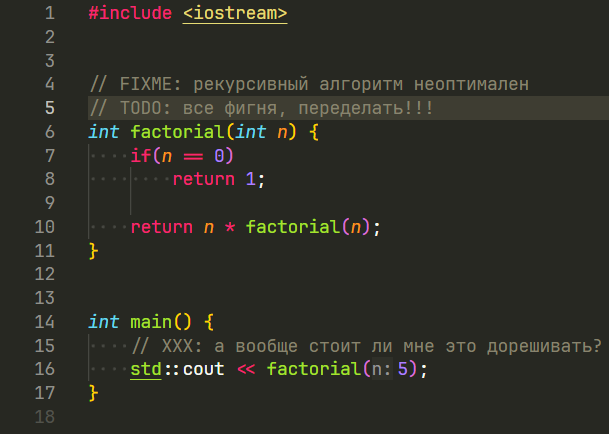

# Огранизация

## Работа с командной строкой

Командную строку можно открыть множеством способов.

Например, внутри VS Code.

Для этого есть сочетание клавиш <code>Ctrl+`</code>.


После этого рекомендуется выполнить команду `chcp 65001`, чтобы установить
UTF-8 как кодировку консоли.

Основные команды консоли:
- `pwd` - отобразить рабочий каталог (_"открытая папка"_)
- `cd <имя>` - сменить рабочий каталог (_"открыть папку"_)
- `ls` - отобразить содержимое текущего каталога (_открытой папки_)
- `mkdir <имя>` - создать каталок (_папку_)

### Редактирование командной строки

Можно перемещаться по истории команд при помощи клавиш
__вверх__ и __вниз__

В зависимости от оболочки и ее настроек,
доступны различные варианты автодополнения при нажатии на `tab`.

Пример `fish`-подобного дополнения на примере `nushell`:


## Компиляция программы на C++ из командной строки

Для программирования на C++ необходим компилятор.

На MS Windows можно использовать `g++` (входит в набор `c++`)
в среде MSYS2.


Исполняемый файл компилятора C++ обычно доступен как `c++`.

Чтобы он был доступен без указания полного пути, в MSYS нужно добавить
путь к исполняемым файлам в переменную PATH

На MS Windows это можно сделать так:


Пример команды компиляции:

```sh
c++ -o main.exe main.cpp calc.cpp -std=c++20
```

- `-o main.exe` - название выходного файла

- `main.cpp` - исходный файл главного модуля

- `calc.cpp` - исходный файл вспомогательного модуля

  (`.h`-файлы в командной строке указывать не надо, они указываются в
   `.cpp`-файле)

- `-std=c++20` - версия стандарта языка


## Среда разработки

Visual Studio Code - расширяемый редактор от Microsoft на
основе проекта с открытым исходным кодом,
но с некоторыми проприетарными расширениями.

Для разработки на C++ я использую VSCodium - сборку,
также основанную на этом проекте, но без проприетарных расширений.

<!-- Принцип работы в VSCodium практически не отличается от VS Code,
но некоторые расширения от Microsoft отказываются работать. -->

Помимо расширений, принцип работы в VSCodium
практически не отличается от VS Code.

Сам по себе VS Code дает только самые необходимые
возможности работы с наиболее популярными языками.
Для таких задач, как сборка, отладка, рефакторинг,
используются специальные расширения.

### Сборка, запуск, отладка

В VS Code сборка обычно осуществляется при помощи утилиты `cmake`
и специального расширения CMake Tools.

Для этого необходим файл `CMakeLists.txt`.

Расширение ищет его в корне проекта. Проектом в VS Code обычно является
открытая в нем папка.

После его ручного создания, нужно его заполнить. Расширение позволяет
воспользоваться автодополнением.



В этом файле нужно указать имя исполняемого файла и файлов его исходного кода.

После этого на специальной вкладке можно настроить параметры сборки и запуска.


Если все настроено правильно, сборка производится при помощи кнопок
в панели состояния (_статусбаре_)


Здесь же можно сразу запустить программу


И выполнить отладочный запуск.
Если в файле есть точки останова (_breakpoints_), отладчик остановится на них.



Точки останова устанавливаются кликом на красный кружок слева от строки


Панель управления отладкой.
Слева направо:
- _продолжить_ выполнение до следующей точки останова
- _шаг в обход_ (не входя внутрь функций в этой строке)
- _шаг со входом_ в функции
- _шаг с выходом_ из текущей функции
- _перезапуск_ отлаживаемой программы
- _остановить отладку_


Значения переменных можно просмотреть в нескольких местах:

В коде при наведении


На специальной вкладке


На той же вкладке, в панели отслеживаемых выражений


Стек вызовов можно посмотреть там же, в специальной панели


### Файлы

VS Code, в отличие от традиционных, "тяжелых" сред разработки,
не использует файлы для описания проекта.

Обычно проектом является папка.

В некоторых случаях внутри нее может быть создана папка `.vscode`.

В ней хранятся файлы:
- `launch.json` - настройки запуска и отладки проекта
- `tasks.json` - _задачи_, настроенные пользователем
- `settings.json` - локальные настройки проекта
- `c_cpp_properties.json` (для расширения от Microsoft) -
  настройки расширения для C++

Обычно эти файлы исключаются из контроля версий, и вся папка `.vscode`
добавляется в `.gitignore`.

Расширение для CMake использует папку `build` для сборки исходного кода.

Ее тоже следует исключить.

`CMakeLists.txt` содержит настройки системы сборки, поэтому может считаться
частью проекта. Его не следует исключать.

`.clangd` содержит настройки языкового сервера `clangd`.
Он отвечает за статический анализ кода.
Его можно исключить, но можно и оставить.

### Горячие клавиши

- `Ctrl+D` - выделить следующее вхождение строки
- `Ctrl+L` - выделить строку, выделить следующие строки
- `F1`, `Ctrl+Shift+P` - палитра команд
- `Ctrl+Tab` - переключить вкладку
- `Ctrl+/` - закомментировать строку
- <code>Ctrl+`</code> - открыть встроенный терминал
- `Ctrl+J` - переключить нижнюю панель
- `Ctrl+B` - переключить боковую панель
- `Alt+Up`, `Alt+Down` - передвинуть строку вверх/вниз

### Рефакторинг

Вместо официального расширения для C++ здесь используется `clangd`.

`clangd` - языковой сервер для C и C++.
В нем есть интеграция с VSCode (и производными)
при помощи одноименного расширения.

При установке расширение предлагает загрузить и автоматически установить
сам инструмент `clangd`.

Доступные рефакторы для выражения или выделенного фрагмента кода
можно отобразить при помощи команды "Refactor" в контекстном меню
или нажав `Ctrl+Shift+R` или `Ctrl+.`


### Параметры компилятора

Обычно задаются в CMakeLists.txt



Также есть настройки расширения



### TODO

<!-- Создать `TODO`-комментарий можно, написав в нем `TODO`. -->

Комментарии, содержащие строку `TODO` используются для быстрого поиска задач,
которые следует выполнить или завершить.

Для быстрого просмотра `TODO` необходимо расширение, например Todo Tree.




# Язык C++

## Обработка аргументов командной строки

В C++ функция `main` может иметь или не иметь аргументы:

```c++
int main();
int main(int argc, char *argv[]);
```

где
- `argc` - кол-во параметров командной строки
- `argv` - массив из C-style строк (массивов из символов).
  - каждый элемент - аргумент командной строки

оба эти аргумента считают название программы первым аргументом, т.е.

- если программа вызвана без аргументов как таковых, `argc == 1`
- `argv[0]` - имя программы
  - может быть абсолютным или относительным
    - в зависимости от того, как ее вызвали в оболочке
      (в частности, в терминале)

## Этапы компиляции

1. Препроцессинг - в основном текстовая работа. Обработка директив:
   - `#include` - буквально копирует текст из
     указанного файла в препроцессируемый
     - обычно аргументы имеют расширение `.h`
   - `#define` - определение т.н. _макроса_, который при нахождении в коде
     будет буквально заменен на заданное содержимое.
   - `#ifndef`/`#endif` - вставка текста
     при условии что указанный макрос определен
     - используется для защиты от многократного включения
2. Компиляция в ассемблерный код
   - компилятор из структурированного кода на C++ (`.cpp`) делает
     низкоуровневый код на языке ассемблера (одно из расширений - `.s`),
     уникальный для каждой архитектуры процессора и
     операционной системы.
3. Сборка в машинный код
   - ассемблер преобразует этот код в машинный (двоичный),
     также зависящий от архитектуры.
   - выходные файлы имеют расширение `.o` (на MSVC: `.obj`)
4. Связывание (компоновка, linking)
   - компоновщик создает исполняемый файл из:
     - `.o`
       - компилированные `.cpp`-файлы
     - `.a`
       - статические библиотеки (архивы из `.o`)
     - `.so` - динамические библиотеки
       - в исполняемый файл сами не попадают, но там появляются ссылки на них
         (зависимости)

## `std::string`

Класс для текстовой строки.

Объявлен в заголовочном файле `<string>`.

Работает как массив, но реализует текстовыми операциями.

Как и `std::vector`, не требует `delete[]`.

```c++
std::string s0;  // пустая строка, ""

std::string a(5, 'A');  // "AAAAA"

std::string s5 = "abcdef";   // непустая строка
std::string s5c("abcdef");   // то же самое
std::string s5i{"abcdef"};   // то же самое


using std::literals::operator ""s;
"abcdef"s;  // то же самое

// индексы начинаются с 0!

a[4];      // символ из строки по индексу
a.at(4);   // то же, но с проверкой границ

a[2] = 'z';     // перезапись символа
a.at(2) = 'z';  // то же, но с проверкой границ

a.insert(1, "bbb");       // вставить строку по индексу
a.replace(1, 3, "beef");  // заменить 3 символа с позиции 1
a.substr(1, 4);  // 4 символа из строки, начиная с позиции 1
a.erase(1, 3);   // вырезать 3 символа, начиная с позиции 1

s5.c_str();  // С-style string (указатель `char *`)
s5.data();   // то же, но позволяет изменять данные

s0.length();  // длина строки (кол-во символов)
s0.size();    // то же самое

s0.reserve(10);  // выделить память, чтобы длина строки могла достигнуть 10
s0.capacity();   // кол-во символов, под которые выделенна память

s0.shrink_to_fit();  // очистить неиспользованную память

a.resize(10, 'z');  // увеличить строку, заполнив 'z'
a.append(5, 'z');   // то же самое, но указывается кол-во заполнителей
a.append("lib");    // добавить строку в конец
a.push_back('r');   // то же, но только для одного символа
a += "eoffice";     // то же

// преобразование чисел (только их) к строке
// необходимо для добавления к другой строке
a += std::to_string(25);

a.resize(50);       // увеличить строку, заполнив '\0' (нуль-терминаторами)
a.resize(10);       // обрезать строку

a.find("fAzA");     // найти индекс вхождения строки слева
                    // или спец. значение std::string::npos, если не найдено

// для нескольких вхождений полезно указать начало поиска
size_t i = a.find("Az", 0);  // по умолчанию поиск ведется с начала
i = a.find("Az", i+1);

a.find_first_of("abcdef");  // найти один из перечисленных символов

a.rfind('z');  // то же, но искать с конца
a.rfind('z', std::string::npos);  // то же самое
a.rfind('z', a.length()-1);  // то же самое
a.rfind('z', a.length()-2);   // то же, но с предпоследнего символа

// конкатенация ("склейка"): std::string, char, c_str (т.е. char*)
// использует append
"one"s + ' ' + "apple";

// оператор сравнения c-style строки с std::string
argv[1] == std::string("--help");

// лексикографическое сравнение строк (в т.ч. c-style)
argv[0] < std::string("z++");
"c++"s < "z++"s;

// non-member operator <<
std::cout << a;

// non-member operator >>
// считывает слово (строку непробельных символов),
// перезаписывая объект
std::cin >> a;
```

## `std::vector`

Класс для динамического массива.

<!-- Это класс, который работает как динамический массив. -->

Объявлен в заголовочном файле `<vector>`.

Деструктор очищает память и вызывает деструкторы элементов: поэтому для
векторов в автоматической памяти (на стеке) не нужно вызывать `delete[]`

Инициализация (конструкторы):

```c++
std::vector<int> v0;             // пустой целочисленный вектор
std::vector<int> v5(5);          // вектор из пяти нулей
std::vector<int> v50(5, 10);     // вектор из пяти десяток
std::vector<int> v15{5, 10};     // вектор из двух элементов: 5 и 10
std::vector<int> v7{7, 15, 35};  // вектор с тремя элементами: 7, 15, 35
// (фигурные скобки создают объект std::initializer_list)

// вектор из пяти объектов (на каждом вызван конструктор без параметров)
std::vector<SomeClass> cs(5);

// динамический набор битов, оптимизированный по памяти
std::vector<bool> bits(32);
```

самые важные методы:

```c++
v50.push_back(10);  // добавить элемент в конец
v50.pop_back();     // удалить элемент в конце

v50[0];          // `operator[]` - получить элемент по индексу
v50[4] = 9;      // он же, но для записи
v50.at(5);       // то же, но с проверкой границ
v50.at(4) = 18;  // перезаписать элемент с проверкой границ

v0.size()       // кол-во хранимых элементов
v0.resize(10);  // задать размер: расширить, заполнив объектами по умолчанию
v7.resize(1);   // задать размер: сократить, вызвав деструкторы
v0.resize(10, 42);  // задать размер: расширить, заполнив 42

v50.capacity()   // кол-во выделенных ячеек памяти
v50.reserve(0)   // ничего не делает
// выделяет память, чтобы могло поместиться суммарно 50 элементов
v50.reserve(50)

v0.data()  // указатель на выделенную память; будет работать как C-style array

v0.insert(v0.begin(); {1, 4, 9, 16});  // вставить элементы в начало

// лексикографическое поэлементное сравение векторов
std::vector{1, 2, 3, 4} < std::vector{1, 2, 4};
```

Пример использования:

```c++
/// Загрузить массив из файла.
/// @param name имя файла
/// @return вектор со значениями из файла
template<typename T>
std::vector<T> load(const std::string &name) {
    std::ifstream f;
    f.open(name);

    std::vector<T> result;

    for(T n; f >> n;) {
        // NOTE: каждый вызов push_back выделяет память наперед.
        result.push_back(n);
    }

    // освободить выделенную но не использованную память
    result.shrink_to_fit();

    // NOTE: нельзя вернуть по ссылке, т.к.
    // она будет указывать на очищенную стековую память
    return result;
}
```

## Правило трех и пяти

Правила, специфичные для C++.

<!-- Относится к следующим пяти элементам: -->

Гласит, что если в классе есть хотя бы одно из перечисленного,
следует реализовать и остальное:

1. деструктор
2. конструктор копирования
3. оператор присвоения (_перезаписи_) копированием

Начиная со стандарта `C++11`, к этому списку добавляются еще два элемента:

4. конструктор перемещения
5. оператор присвоения перемещением

(относительно) простой пример реализации: 

```c++
template<typename E>
class Array {
    E *ptr;
    size_t size;

  public:

    // конструктор по умолчанию (без параметров).
    //
    // NOTE: приводит к такому же состоянию, что и "опустошение"
    // объекта при перемещении (см. конструктор и operator= для перемещения)
    Array(): ptr(nullptr), size(0) {}

    // 1) Деструктор.
    // без него: будут удалены стековые переменные ptr и size,
    // НО НЕ ДИНАМИЧЕСКАЯ ПАМЯТЬ ДЛЯ МАССИВА
    ~Array() {
        delete[] ptr;

        // не нужно: будет удалена сама
        // size = 0;
    }

    // 2) Конструктор копирования.
    //
    // без него: будет создаваться т.н. поверхностная копия.
    //
    // в this присвоятся size и ptr,
    // но ptr будет общий с other!
    // это будет не копия объекта, а "ссылка" на него
    // (рабочая, но это не то что мы хотим)
    Array(const Array &other) {
        this->size = other.size;
        this->ptr = new E[size];

        for(size_t i{0}; i < size; i++) {
            ptr[i] = other.ptr[i];
        }

        // NOTE: this и other теперь два независимых объекта

        // можно и так:
        // this->ptr = nullptr;
        // *this = other;
    }

    // 3) Оператор присвоения копированием.
    //
    // без него: то же, что и для конструктора копирования,
    // но к тому же еще и утечка памяти (дин. массив по адресу this->ptr)
    Array &operator =(const Array &other) {
        // в случае "самоприсвоения" даже делать ничего не нужно.
        if(this == &other)
            return *this;

        // происходит перезапись, поэтому освобождаем this.

        // кстати, `delete nullptr` это не ошибка;
        // в этом случае ничего не произойдет
        delete[] this->ptr;

        // выделим память и заполним ее перед присвоением
        // на случай исключения
        E *new_ptr = new E[size];

        for(size_t i{0}; i < size; i++) {
            ptr[i] = other.ptr[i];
        }

        this->ptr = new_ptr;
        this->size = other.size;

        // перегруженные операторы обычно делают так.
        // это для цепных присвоений и для единства с синтаксисом языка.
        return *this;
    }

    // начиная с C++11

    // 4) Конструктор перемещения.
    //
    // без него: пришлось бы лишний раз копировать память из other,
    // несмотря на то что он все равно не нужен.
    Array(Array &&other) {
        // other - либо временный объект,
        // либо явно указанный как условно временный
        // при помощи std::move()

        // "воруем" ресурсы у other, "ему уже все равно" ;)
        ptr = other.ptr;
        size = other.size;

        // Согласно стандарту,
        // теперь other в рабочем, но неуказанном состоянии.

        // в случае с настоящим временным объектом (prvalue),
        // после вызова конструктора перемещения, у пользователя этого класса
        // даже не будет возможности использовать other, т.к. у него даже
        // не было имени.
        // деструктор будет вызван в ближайшее время.

        // в случае с std::move, у пользователя класса остается other.
        // он "рабочий", но "опустошенный".

        // это значит что его можно "восстановить",
        // например вызвав методы инициализации (если такие есть)
        // или присвоив значение, как раз при помощи нашего `operator=`.

        // в обоих случаях, будет вызван деструктор.

        // чтобы он не удалил "украденную" память, укажем,
        // что она больше не принадлежит other,
        // т.е. оставим его в "опустошенном" состоянии
        other.ptr = nullptr;
        other.size = 0;
    }

    // 5) Оператор присвоения перемещением.
    //
    // без него: то же, что и для конструктора перемещения.
    //
    // в случае без конструктора копирования, произошла бы утечка памяти
    // при this->ptr = other.ptr
    Array &operator =(Array &&other) {
        // проверка на "самоприсвоение"
        if(this == &other)
            return *this;

        // перезапись
        delete[] this->ptr;

        ptr = other.ptr;
        size = other.size;

        other.ptr = nullptr;
        other.size = 0;

        return *this;
    }
};
```
