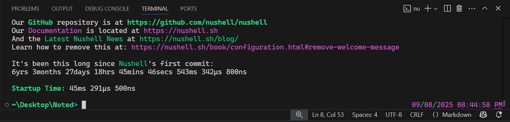
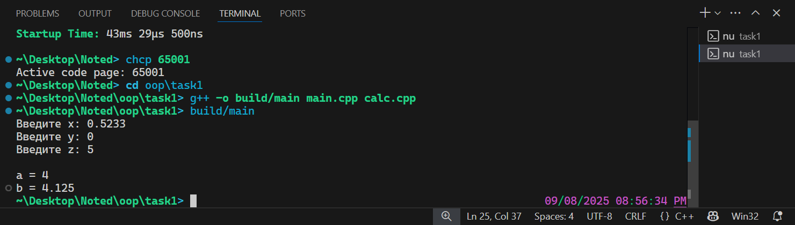

Работа с командной строкой
===

Командную строку можно открыть множеством способов.

Например, внутри VS Code.

Для этого есть сочетание клавиш <code>Ctrl+`</code>.



После этого рекомендуется выполнить команду `chcp 65001`, чтобы установить
UTF-8 как кодировку консоли.

Основные команды консоли:
- `pwd` - отобразить рабочий каталог (_"открытая папка"_)
- `cd <имя>` - сменить рабочий каталог (_"открыть папку"_)
- `ls` - отобразить содержимое текущего каталога (_открытой папки_)
- `mkdir <имя>` - создать каталок (_папку_)

Компиляция программы на C++ из командной строки
===

Исполняемый файл компилятора C++ обычно доступен как `c++`.

Пример команды компиляции:

```sh
c++ -o main.exe main.cpp calc.cpp -std=c++20
```

- `-o main.exe` - название выходного файла

- `main.cpp` - исходный файл главного модуля

- `calc.cpp` - исходный файл вспомогательного модуля

  (`.h`-файлы в командной строке указывать не надо, они указываются в
   `.cpp`-файле)

- `-std=c++20` - версия стандарта языка

