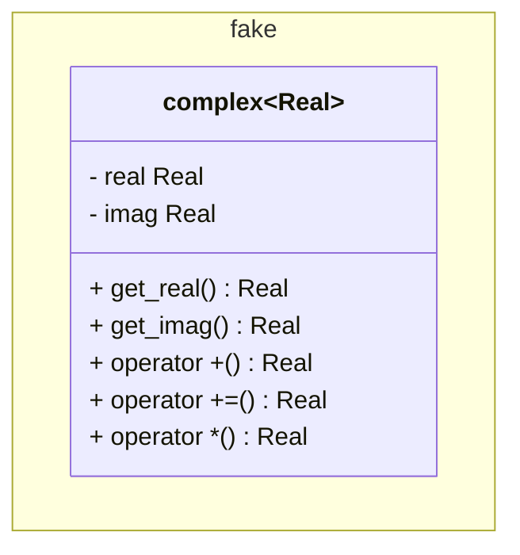
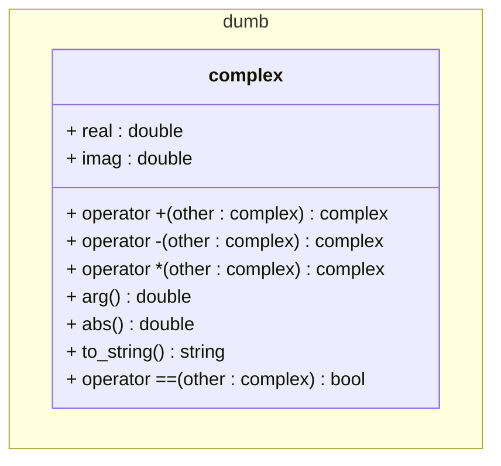

<!--

```mermaid
classDiagram
%% class complex["complex<Real>"] {
namespace fake {
    class complex~Real~ {
        - real Real
        - imag Real
        + get_real() Real
        + get_imag() Real
        + operator +() Real
        + operator +=() Real
        + operator *() Real
    }
}
```
-->

```mermaid
classDiagram
namespace dumb {
    class complex {
        + real : double
        + imag : double
%%        + complex()
%%        + complex(real : const double, imag : const double = 0)
%%        + operator +(&other : const complex) complex; const
%%        + operator -(&other : const complex) complex; const
%%        + operator *(&other : const complex) complex; const
        + operator +(other : complex) complex
        + operator -(other : complex) complex
        + operator *(other : complex) complex
        + arg() double
        + abs() double
        + to_string() string
        + operator ==(other : complex) bool
    }
}
```
