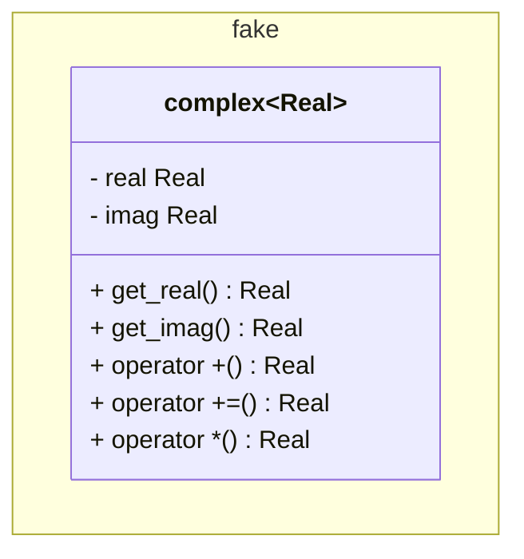

```mermaid
classDiagram
%% class complex["complex<Real>"] {
namespace fake {
    class complex~Real~ {
        - real Real
        - imag Real
        + get_real() Real
        + get_imag() Real
        + operator +() Real
        + operator +=() Real
        + operator *() Real
    }
}
```