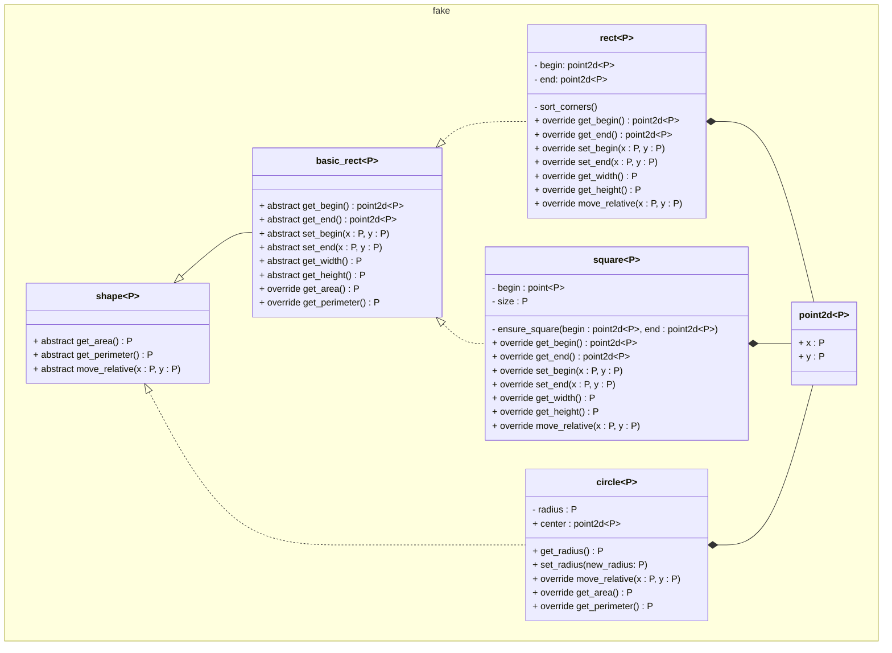

```mermaid
classDiagram


namespace fake {
    class point2d~P~ {
        + x : P
        + y : P
    }

    class shape~P~ {
        + abstract get_area() P
        + abstract get_perimeter() P
        + abstract move_relative(x : P, y : P)
    }

    class basic_rect~P~ {
        + abstract get_begin() point2d~P~
        + abstract get_end() point2d~P~

        + abstract set_begin(x : P, y : P)
        + abstract set_end(x : P, y : P)

        + abstract get_width() P
        + abstract get_height() P

        + override get_area() P
        + override get_perimeter() P
    }

    class rect~P~ {
        %% - width : P
        %% - height : P
        - begin: point2d~P~
        - end: point2d~P~

        - sort_corners()

        + override get_begin() point2d~P~
        + override get_end() point2d~P~

        + override set_begin(x : P, y : P)
        + override set_end(x : P, y : P)

        + override get_width() P
        + override get_height() P

        + override move_relative(x : P, y : P)
    }

    class square~P~ {
        - begin : point~P~
        - size : P
        - ensure_square(begin : point2d~P~, end : point2d~P~)

        + override get_begin() point2d~P~
        + override get_end() point2d~P~

        + override set_begin(x : P, y : P)
        + override set_end(x : P, y : P)

        + override get_width() P
        + override get_height() P

        + override move_relative(x : P, y : P)
    }

    class circle~P~ {
        - radius : P
        + center : point2d~P~

        + get_radius() P
        + set_radius(new_radius: P)

        + override move_relative(x : P, y : P)
        + override get_area() P
        + override get_perimeter() P
    }
}


shape <|-- basic_rect
basic_rect <|.. square
basic_rect <|.. rect
shape <|.. circle

rect   *-- point2d
square *-- point2d
circle *-- point2d
```
