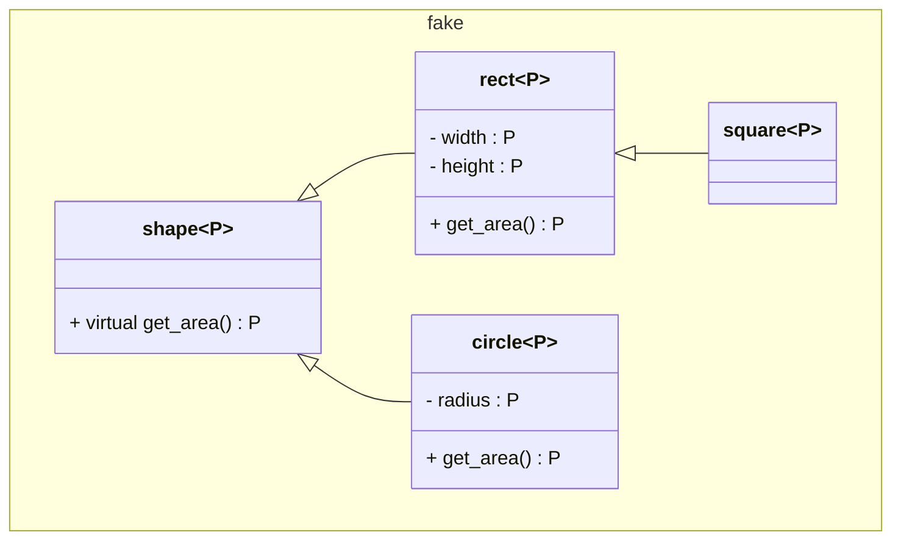

```mermaid
classDiagram


namespace fake {
    class shape~P~ {
        + virtual get_area() P
    }

    class rect~P~ {
        - width : P
        - height : P

        + get_area() P
    }

    class square~P~ {
        
    }

    class circle~P~ {
        - radius : P

        + get_area() P
    }

}


shape <|-- rect
rect <|-- square
shape <|-- circle
```
