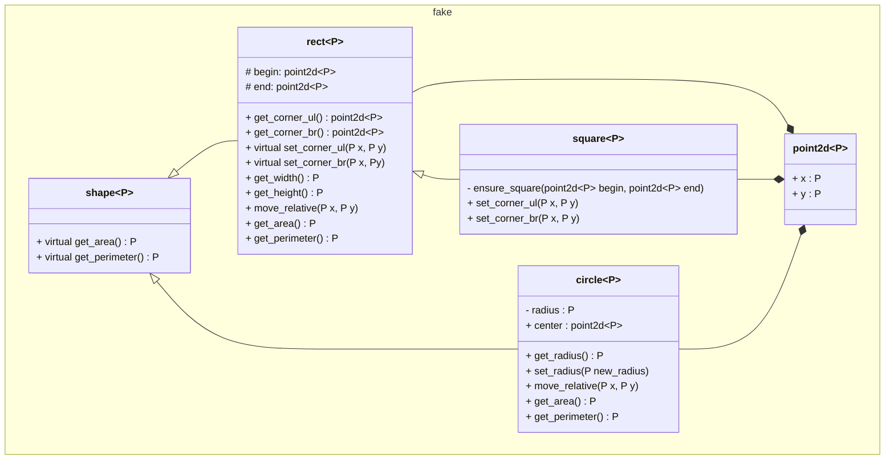

```mermaid
classDiagram


namespace fake {
    class point2d~P~ {
        + x : P
        + y : P
    }

    class shape~P~ {
        + virtual get_area() P
        + virtual get_perimeter() P
    }

    class rect~P~ {
        %% - width : P
        %% - height : P
        # begin: point2d~P~
        # end: point2d~P~

        + get_corner_ul() point2d~P~
        + get_corner_br() point2d~P~

        + virtual set_corner_ul(P x, P  y)
        + virtual set_corner_br(P x, Py)

        + get_width() P
        + get_height() P

        + move_relative(P x, P y)
        + get_area() P
        + get_perimeter() P
    }

    class square~P~ {
        - ensure_square(point2d~P~ begin, point2d~P~ end)
        + set_corner_ul(P x, P y)
        + set_corner_br(P x, P y)
    }

    class circle~P~ {
        - radius : P
        + center : point2d~P~

        + get_radius() P
        + set_radius(P new_radius)

        + move_relative(P x, P y)
        + get_area() P
        + get_perimeter() P
    }
}


shape <|-- rect
rect <|-- square
shape <|-- circle

%% point2d *-- rect
%% point2d *-- square
%% point2d *-- circle

rect   --* point2d
square --* point2d
circle --* point2d
```
