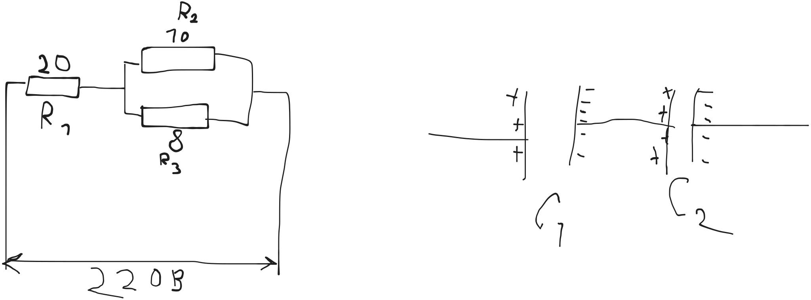

кол-во молекул на пов-ти * процент молекул с достаточной скоростью * доля молекул, возвращающихся обратно

$1 атм = 101 * 10^5 Па$

34 \AA

3 \AA

10^{15} * 1% = 10^{13}

вероятность попасть в молекулу воздуха: 0.1

330 м/с - в воздухе

км/с - в металлах

Методы познания:
- практические (эмпирические)
  - эксперимент - влияем на ход
  - наблюдений - не влияем
  - опыт - среднее между
- теоретические
  - анализ - дробление общей задачи на отдельные части
  - синтез - воссоединение из отдельных частей
  - индукция - способ рассуждения, повествования (от частного к общему)
  - дедукция - способ рассуждения, повествования (от общего к частному)
  - абстрагирование - _неконкретные представления_
  - использование аналогий - поиск схожих понятий, процессов

> Научная картина мира основана на эволюционизме

> Эволюция - плавное, постепенное __изменение__ состояния __системы__

Пример с Шеролоком Холмсом: он сначала думал кому надо было совершить
преступление и зачем.

В отличие от поиска улик и на их основе поиска преступников

(необязательно развитие)

> Революция - быстрое, скачкообразное изменение

> [!CAUTION]
>
> Задание: всем геологическая периодизация времен
>
> (будут проверять!)
> 
> животных всяких
> 
> чтобы видеть эволюцию _(lol wdym)_

5 млрд - лет земле

40 км - толщина земной коры

300 млн лет назад - млекопитающие

1 млн лет назад - homo erectus

религия - дедуктивна по своей природе

> религия основана на креационизме (вере в Создателя)

От живого созерцания к абстрактному мышлению и к практике

Формула дальтона:

$$v = k \frac{E_s - e}{P} \cdot f(v)$$

E_s - max упругость 

f(v) - функция ветра

$$\frac{E_s - e}{P} \cdot f(v) \approx 10..100$$

$$k \approx 1.76 \cdot 10^{15}$$

\- основной влияющий сомножитель

Полуэмпирический подход

ускорение электрона: 10^{15} м/c^2

2.5 ангстрема - при таком межатомном расстоянии начинается
_поляризационная катастрофа_ и сильно растет электропроводность

вода - растворитель из-за полярности молекул

электролитическая диссоциация

туман - взвесь мелких капель воды

не меньше чем 1 микрометр

длина волны света - 0.8 микрометр

в идеальном газе удары полностью упругие

Частота волны микрволновки: 2450 МГц

> В международных и российских стандартах даются следующие определения:
> 
> - обработанные, организованные и связанные данные, которые порождают смысл (значение) (ISO 5127:2017);
> - знания о предметах, фактах, идеях и т. д., которыми могут обмениваться люди в рамках конкретного контекста (ISO/IEC 10746-2:1996);
> - знания относительно фактов, событий, вещей, идей и понятий, которые в определённом контексте имеют конкретный смысл (ISO/IEC 2382:2015);
> - сведения, воспринимаемые человеком и (или) специальными устройствами как отражение фактов материального или духовного мира в процессе коммуникации (ГОСТ 7.0-99).

есть сомножитель в $10^{9}$

---

Определить удельную электропроводность материала
из которого изготовлен проводник
длиной 100 метров
диаметром 0.2 мм
если известно что при подаче напряжения
1 вольт
по проводнику
идет ток
10 ампер

$$U = IR$$

$$1 В = 10 А * R$$

$$R = U/I = 1 В / 10 А = 0.1 Ом$$

$$R = \frac{ \rho l }{ S }$$

$$\rho = \frac{ R S }{ l }$$

$$\rho = \frac{ 0.1 Ом * \pi * (0.1 мм)^2 }{ 100 м }$$

$$\sigma = 1/\rho = \frac{ 100 м }{ 0.1 Ом * \pi * (0.1 мм)^2 }$$

$$\sigma = 1/\rho = \frac{ 100 м }{ 0.1 Ом * \pi * 0.01 мм^2 }$$

$$\sigma = 1/\rho = \frac{ 10^5 м }{ \pi Ом * мм^2 }$$

$$\sigma = 1/\rho = \frac{ 10^5 м }{ \pi Ом * (10^{-3} м)^2 }$$

$$\sigma = 1/\rho = \frac{ 10^5 м }{ \pi Ом * 10^{-6} м^2 }$$

$$\sigma = 1/\rho = \frac{ 10^{11} м }{ \pi Ом * м^2 }$$

$$\sigma = 1/\rho = \frac{ 10^{11} }{ \pi Ом * м }$$

$$\sigma = 1/\rho = 0.3183098862 * \frac{ 10^{11} См }{ м }$$

$$\sigma = 3.183098862 * 10^{10} \frac{ См }{ м }$$

---



общее сопротивление цепи

силу тока через каждый элемент цепи

падение напряжения на каждом элементе цепи

$$R = R_1 + R_2$$

$$1/R = 1/R_1 + 1/R_2$$

параллельное:
- U = U_1 = U_2
- I = I_1 + I_2
- I = U/R
- U/R = U/R_1 + U/R_2
- 1/R = 1/R_1 + 1/R_2
- R = \frac{ R_1 R_2 }{ R_1 + R_2 }

последовательное:
- I = I_1 = I_2
- U = U_1 + U_2
- IR = IR_1 + IR_2
- R = R_1 + R_2

R23 = 80/18 = 40/9 = 4.4444444444 (Ом)

> R123 = 24.4444444 (Ом)

---

I1 = I23 = I123

I23 = I2 + I3

U123 = U1 + U23

U23 = U2 = U3

I123 = U123 / R_123

I123 = 220 В / 24.444444 Ом = 9 А

I1 = 9 А

I23 = 9 А

U1 = R1 * I1 = 20 Ом * 9 А = 180 В

U23 = 220 В - 180 В = 40 В = U2 = U3

I2 = U2/R2 = 40 В / 10 Ом = 4 А

I3 = U3/R3 = 40 В / 8 Ом = 5 А

- I:
  1) 9 А
  2) 4 А
  3) 5 А

---

C = q/U

U = U1 + U2

---

Задача

определить скорость направленного движения электронов

в медном проводнике

при предельной плотности тока

$$j_{пр Cu} = 1 * 10^7 А/м^2$$

$$j = \sigma E$$

$$E = $$

$$I = q/t = Ne^{-}/t$ = jS$

l - длина цилинда

V = Sl

n = N/V = N/(Sl)

n = 8.49 * 10^{28} 1/м^3

$$I = q/t = nSle^{-}/t$ = jS$$

$$nle^{-}/t$ = j$$

Выражение для плотности дрейфового тока

$$U = l/t$$

$$j = e^{-} n U$$

$$U = \frac{ j }{ n e^{-} }$$

$$e^{-} = -1.6 \cdot 10 ^{-19} \, Кл$$

```math
U = \frac{ 1 * 10^7 А/м^2 }{ 8.49 * 10^{28} 1/м^3 * 1.6 \cdot 10 ^{-19} \, Кл}
```

```math
U = \frac{ 1 * 10^{26} А/м^2 }{ 8.49 * 10^{28} 1/м^3 * 1.6 \, Кл}
```

```math
U = \frac{ 1 * 10^{-2} А/м^2 }{ 8.49 1/м^3 * 1.6 \, Кл}
```

---

Определить силу тока короткого замыкания автомобильного аккумулятора
ЭДС которого 12 вольт если известно что его внутреннее сопротивление
0.01 ом (1/100)