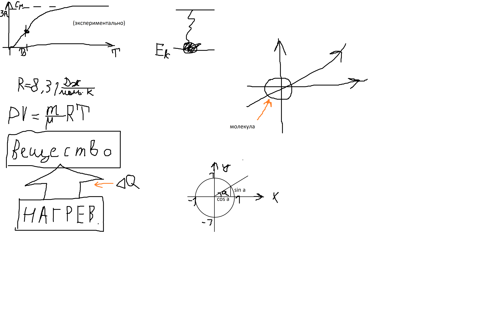
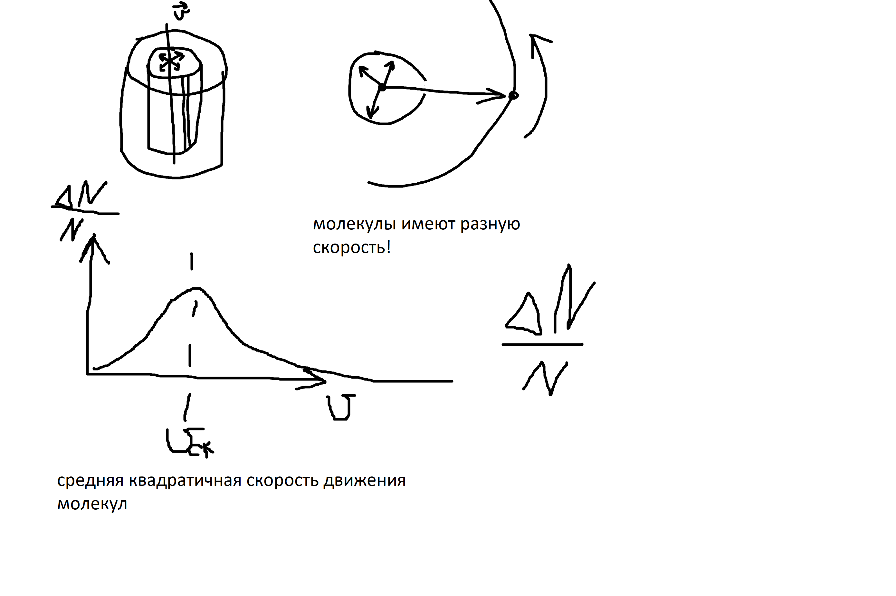
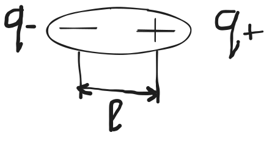
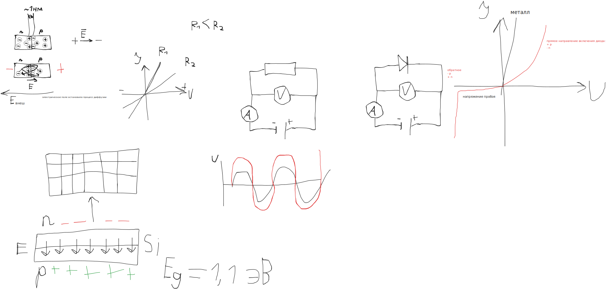
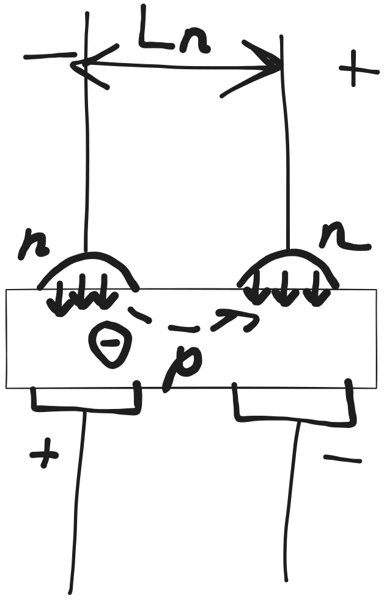

Механика
===

> __Масса__ - это мера инертности вещества

$F = ma$

$m = F / a$

> __Плотность__ - это масса единицы объема

$\rho = m / V$

| Вещество                      | Состояние | Плотность (кг/м³) | Плотность (г/см³) |
| ----------------------------- | --------- | ----------------- | ----------------- |
| Осмий                         | Твёрдое   | 22 590            | 22.59             |
| Иридий                        | Твёрдое   | 22 560            | 22.56             |
| Платина                       | Твёрдое   | 21 450            | 21.45             |
| Золото                        | Твёрдое   | 19 320            | 19.32             |
| Вольфрам                      | Твёрдое   | 19 250            | 19.25             |
| Уран                          | Твёрдое   | 18 950            | 18.95             |
| Ртуть (замёрзшая, при −39 °C) | Твёрдое   | 14 180            | 14.18             |
| Свинец                        | Твёрдое   | 11 340            | 11.34             |
| Серебро                       | Твёрдое   | 10 490            | 10.49             |
| Медь                          | Твёрдое   | 8 960             | 8.96              |
| Никель                        | Твёрдое   | 8 900             | 8.90              |
| Железо                        | Твёрдое   | 7 870             | 7.87              |
| Цинк                          | Твёрдое   | 7 140             | 7.14              |
| Алмаз                         | Твёрдое   | 3 510             | 3.51              |
| Графит                        | Твёрдое   | 2 260             | 2.26              |
| Алюминий                      | Твёрдое   | 2 700             | 2.70              |
| Кремний                       | Твёрдое   | 2 330             | 2.33              |
| Стекло (силикатное)           | Твёрдое   | 2 500–2 600       | 2.5–2.6           |
| Бетон                         | Твёрдое   | 2 300–2 500       | 2.3–2.5           |
| Гранит                        | Твёрдое   | 2 600–2 800       | 2.6–2.8           |
| Мрамор                        | Твёрдое   | 2 600–2 800       | 2.6–2.8           |
| Дуб (древесина)               | Твёрдое   | 700–900           | 0.7–0.9           |
| Сосна                         | Твёрдое   | 400–600           | 0.4–0.6           |
| Пробковое дерево              | Твёрдое   | 200–250           | 0.2–0.25          |
| Тефлон (PTFE)                 | Твёрдое   | 2 200             | 2.20              |
| Лёд (при 0 °C)                | Твёрдое   | 917               | 0.917             |
| Вода (при 4 °C)               | Жидкое    | 1 000             | 1.000             |
| Морская вода                  | Жидкое    | 1 020–1 030       | 1.02–1.03         |
| Молоко                        | Жидкое    | 1 030             | 1.03              |
| Этиловый спирт (этанол)       | Жидкое    | 789               | 0.789             |
| Метанол                       | Жидкое    | 791               | 0.791             |
| Ацетон                        | Жидкое    | 784               | 0.784             |
| Бензин                        | Жидкое    | 700–780           | 0.70–0.78         |
| Дизельное топливо             | Жидкое    | 830–880           | 0.83–0.88         |
| Керосин                       | Жидкое    | 780–820           | 0.78–0.82         |
| Оливковое масло               | Жидкое    | 915               | 0.915             |
| Подсолнечное масло            | Жидкое    | 920               | 0.920             |
| Этиленгликоль                 | Жидкое    | 1 110             | 1.11              |
| Глицерин                      | Жидкое    | 1 260             | 1.26              |
| Серная кислота (98%)          | Жидкое    | 1 840             | 1.84              |
| Ртуть                         | Жидкое    | 13 546            | 13.546            |
| Бром                          | Жидкое    | 3 100             | 3.10              |
| Жидкий азот (при −196 °C)     | Жидкое    | 808               | 0.808             |
| Жидкий кислород (при −183 °C) | Жидкое    | 1 140             | 1.14              |
| Водород (H₂)                  | Газ       | 0.0899            | 0.0000899         |
| Гелий (He)                    | Газ       | 0.1786            | 0.0001786         |
| Неон (Ne)                     | Газ       | 0.900             | 0.000900          |
| Аммиак (NH₃)                  | Газ       | 0.771             | 0.000771          |
| Метан (CH₄)                   | Газ       | 0.717             | 0.000717          |
| Природный газ                 | Газ       | 0.68–0.85         | 0.00068–0.00085   |
| Пары воды (при 100 °C)        | Газ       | 0.598             | 0.000598          |
| Азот (N₂)                     | Газ       | 1.251             | 0.001251          |
| Сухой воздух                  | Газ       | 1.293             | 0.001293          |
| Кислород (O₂)                 | Газ       | 1.429             | 0.001429          |
| Аргон (Ar)                    | Газ       | 1.784             | 0.001784          |
| Озон (O₃)                     | Газ       | 2.14              | 0.00214           |
| Фтор (F₂)                     | Газ       | 1.696             | 0.001696          |
| Хлороводород (HCl)            | Газ       | 1.64              | 0.00164           |
| Диоксид серы (SO₂)            | Газ       | 2.927             | 0.002927          |
| Углекислый газ (CO₂)          | Газ       | 1.977             | 0.001977          |
| Пропан (C₃H₈)                 | Газ       | 2.01              | 0.00201           |
| Ацетилен (C₂H₂)               | Газ       | 1.17              | 0.00117           |
| Хлор (Cl₂)                    | Газ       | 3.214             | 0.003214          |

> __Концентрация__ - это количество вещества на единицу объема

$n = N / V$

Определить концентрацию атомов меди, находящихся в конденсированном состоянии,
используя знания плотности меди

#### 3 Базовых понятия

- Материя
- пространство
- время
- движение
- взаимодействие

> Пространство трехмерно.

#### Существуют различные системы координат

1) Декартова

2) Сферическая (2 Угла и 1 радиус)

   > Чита: 52°02′ с. ш. 113°30′ в. д.

   > Радиус Земли - примерно 6 378,1 км.

3) Цилиндрическая (1 угол 2 расстояния)

> __Расстояние__ измеряется в __метрах__
>
>$[d] = 1 м$

> __Время__ измеряется в __секундах__
>
>$[t] = 1 с$

> __Угол__ измеряется в __радианах__ (или __градусах__?)
> 
>$2 \pi \ рад = 360 \degree$- один оборот, или окружность

<!--$2 \pi \ рад = 360 \ ^oC$-->
<!-- \SI{360}{\celsius} -->
<!-- \textdegree C -->
<!-- ^\circ C -->
<!--$\usepackage{siunitx}$-->

> __Ангстрем__ (Å) — единица измерения длины, равная$10^{−10}$метра
>
>$1 \ \AA$приблизительно равен диаметру атома водорода.
>
>$1 \ \AA = 0.1 \ нм$

#### Материя:
1) Вещество 
2) Поле

> __Все вещества состоят из молекул.__

> __Порядковый номер__ химического элемента определяется
> количеством __протонов__ в ядре атома

| Период | 1        | 2        | 3        | 4        | 5        | 6        | 7        | 8        | 9        | 10       | 11       | 12       | 13       | 14       | 15       | 16       | 17       | 18       |
|--------|----------|----------|----------|----------|----------|----------|----------|----------|----------|----------|----------|----------|----------|----------|----------|----------|----------|----------|
| **1**  | H        |          |          |          |          |          |          |          |          |          |          |          |          |          |          |          |          | He       |
| **2**  | Li       | Be       |          |          |          | B        | C        | N        | O        | F        | Ne       |          |          |          |          |          |          |          |
| **3**  | Na       | Mg       |          |          |          | Al       | Si       | P        | S        | Cl       | Ar       |          |          |          |          |          |          |          |
| **4**  | K        | Ca       | Sc       | Ti       | V        | Cr       | Mn       | Fe       | Co       | Ni       | Cu       | Zn       | Ga       | Ge       | As       | Se       | Br       | Kr       |
| **5**  | Rb       | Sr       | Y        | Zr       | Nb       | Mo       | Tc       | Ru       | Rh       | Pd       | Ag       | Cd       | In       | Sn       | Sb       | Te       | I        | Xe       |
| **6**  | Cs       | Ba       | *Лантаноиды* | Hf       | Ta       | W        | Re       | Os       | Ir       | Pt       | Au       | Hg       | Tl       | Pb       | Bi       | Po       | At       | Rn       |
| **7**  | Fr       | Ra       | *Актиниды*  | Rf       | Db       | Sg       | Bh       | Hs       | Mt       | Ds       | Rg       | Cn       | Nh       | Fl       | Mc       | Lv       | Ts       | Og       |

---

### Лантаноиды (вставка для периода 6)
| Элемент | La | Ce | Pr | Nd | Pm | Sm | Eu | Gd | Tb | Dy | Ho | Er | Tm | Yb | Lu |
|--------|----|----|----|----|----|----|----|----|----|----|----|----|----|----|----|
| №      | 57 | 58 | 59 | 60 | 61 | 62 | 63 | 64 | 65 | 66 | 67 | 68 | 69 | 70 | 71 |

### Актиниды (вставка для периода 7)
| Элемент | Ac  | Th  | Pa  | U   | Np  | Pu  | Am  | Cm  | Bk  | Cf  | Es  | Fm  | Md  | No  | Lr  |
| ------- | --- | --- | --- | --- | --- | --- | --- | --- | --- | --- | --- | --- | --- | --- | --- |
| №       | 89  | 90  | 91  | 92  | 93  | 94  | 95  | 96  | 97  | 98  | 99  | 100 | 101 | 102 | 103 |


|     | Заряд (q)   | Масса (m)            | Время жизни (t)      |
| --- | --- | ------------ | ------ |
| Протон (p)     | +1 | 1  е.а.м.       |$\infty$   |
| Нейтрон (n)    | 0  | 1 е.а.м.        | 878.4 сек. |
| Электрон (e)   | -1 | 1 / 1883 е.а.м. |$\infty$   |

> __Изотопы__ - это различные варианты какого-либо химического
> элемента, отличающиеся количеством __нейтронов__
>
> Изотопы есть у __каждого__ химического элемента

> Кол-во __электронов__ в атоме точно равно кол-ву __протонов__,
> поэтому атомы электрически нейтральны.

> __Ион__ - это атом, потерявший или присоединивший
> один или несколько электронов

> Вещество в ионизированном состоянии называется __плазмой__.
>
> Плазма светится.

#### Состояния вещества
1) Твердое
2) Жидкое
3) Газообразное
4) Плазма

> Переход из одного состояния в другое осуществляется при изменении
> соотношения __потенциальной энергии взаимодействия молекул__ и
> их __кинетической энергии__ движения

Например, изменение агрегатного состояния воды осуществляется изменением температуры

> __Температура__ - это мера кинетической энергии молекул

## Основы молекулярно-кинетической теории газов и основные положения

1) Все вещества состоят из молекул
2) Молекулы двигаются
3) Они взаимодействуют

Было сформировано понятие __идеального газа__, где можно было пренебречь
взаимодействием молекул.

Там достаточно большое расстояние между молекулами?

> __Сила__ - это мера взаимодействия

Молекулы в __твердом__ и __конденсируемом__ состоянии будут находится на
определенном __расстоянии__ друг от друга, в связи с чем будет формироваться
определенная __концентрация__ и, соответственно, __плотность__

Если молекула 2 уйдет на расстояние в 10 раз больше, чем r0, то вещество
перейдет в __газообразное__ состояние.

> Воздух, находящийся при нормальном давлении и температуре, можно считать идеальным газом

> #### Заметки автора (не редактора)
>
> дома читать все про давление
> 
> особенно __опыт Торичелли__ (ртутный барометр)

> __Нормальным__ считается давление в 1 атмосферу

1 атм = 101 325 Па

> Все взаимодействие в идеальном газе сводится к упругим ударам

> Конец вставки.
> Thx <https://t.me/ReVoLuTiOn137>

1. материя - вещество и поле
1. пространство
1. время

> [!CAUTION]
>
> носить таблицу менделеева!
>
> вклеить в тетрадь (будет проверяться!)

> __идеальный газ__ - большое расстояние между молекулами
>
> воздух (при норм. атм. д.) похож на идеальный газ

давление:$P=\frac{F}{S}$

### Температура

> __температура__ - мера кинетической энергии молекул

-91 - рекорд по низкой температуре на Земле

и 60

в микроволновке - 250-300 градусов

адронный коллайдер делает очень большую температуру (больше чем в центре солнца)

760 мм. рт. ст.$\approx$10 м. воды

100 км. водзуха$\approx$2 атм.

100 м. воды$\approx$11 атм (давление воздуха + воды!)

1 км - 101 атм.

10 км - 1001 атм.

Объединенный газовый закон
---

Менделеева-Клайперона

$PV = \frac{m}\mu \cdot RT$

$
P[Па]
\\
V[м^3]
\\
m[кг]
\\
T[K]
$

### Универсальная газовая построянная

> $R = 8.31 \frac{Дж}{моль \cdot К}$
>
> имеет размерность молярной теплоемкости

Удельная теплоемкость -$\frac{Дж}{кг \ \cdot \degree C}$

>$m/\mu = \nu = N/N_A$
> 
>$\nu$- кол-во вещества (моль)
> 
>$\mu$- молярная масса вещества (кг/моль)
> 
> N - кол-во молекул идеального газа
>
> N[A] - __Число Авогадро__
>
>$N_A = 6.022 \cdot 10^{23} \frac{1}{моль}$
>
> кол-во частиц в 1 моль

> __Моль__ - это единица измерения __кол-ва вещества__, содержащее в себе столько частиц
> (атомов или молекул), сколько их содержится в __12 граммах__ изотопа углерода$_6^{12}C$
> (это число равно __числу Авогадро__)

(6 - заряд ядра, 12 - атомная масса)

C-6-14 радиоактивен, даже больше чем уран!

### Задача:

Рассчитать, какое кол-во атомов углерода C-6-12 содержится в 12 граммах этого вещества

атомная масса углерода (согласно таблице Менделеева) - 12.011 е.а.м

>$1 \ е.а.м. = 1.661 \cdot 10^{-27} кг$

$N = m_C / {m_a}_C = 0.012 кг / (12.011 * 1.661 * 10^{-27}) кг = 0.012 \cdot 10^{27} / 19.950271 = 6.01495 * 10^{-4} * 10^{27} = 6.015 * 10^{23}$

(???)

У азота атомная масса 14

У воды = 18 = 1 + 1 + 16

#### аналогия:

__молекулы__ это ящики

__моли__ это вагоны

сорт яблок это углерод C-6-12

Так как$PV = \frac{m}\mu * RT$, то:

Если$\frac{m}\mu = \nu = 1 \ (моль?)$, то следовательно PV=RT

(R = const по определению)

$PV = T \cdot const$

$T = PV \cdot const$

$V = T/P \cdot const$

$P = T/V \cdot const$

> Если T = const:
>
> PV = const
> 
> P1V1 = P2V2
> 
> _Изотермический_

> Если V = const:
>
> P/T = const
>
> P1/T1 = P2/T2
>
> _Изохорный_

> Если P=const:
>
> V/T = const
>
> V1/T1 = V2/T2
> 
>$P = \frac{1}V \frac{m}\mu \cdot RT =
> \frac{1}V \frac{N}{N_A} \cdot RT =
> \frac{1}V \frac{N}{N_A} \cdot RT =
> \frac{N}V \frac{R}{N_A} \cdot T
>$
>
> _Изобарный_
<!-- > P = 1/V * N/[A] * R * T = N/V * R/N[A] * T -->

>$n = N/V$- концентрация

### Постоянная больцмана

$k_Б = R/N_A = \frac{8.31}{6.022 \cdot 10^{23}} = 1.38 \cdot 10^{-23} Дж/К$

$m/\mu = N/N_A$

$P = n \cdot k_Б \cdot T$

$k_Б \cdot T = E_{об} [Дж]$

>$k_БT$- дает энергию, которая необходимо затратить для увеличения температуры молекулы идеального газа

$E_k = \frac{mv^2}2$

$E_k + U = E_{об}$

U - потенциальная энергия

U = E[k] (друг в друга перетекают)

$E_k = \frac{1}2 \cdot k_БT$
(На 1 степень свободы, т.е. одно измерение пространства)

на 3:$\frac{3}2 * k_БT$

$mv^2 / 2 = 3/2 * k[Б] * T$

$mv^2 = 3 * k[Б] * T$

>$v = \sqrt{\frac{3k_Б T}{m}}$
>
> отсюда следует физический смысл температуры

#### Задача

рассчитать расстояние между молекулами воздуха, находящегося при нормальных условиях

Будем считать, что средняя масса молекулы воздуха = 29 е.а.м. = 29 * 1.661 * 10^-27 кг

N_2 = 28 е.а.м.

O_2 = 32 е.а.м.

Также считаем, что плотность воздуха при нормальных условиях = 1.225 кг/м^3

<!-- 1.225 кг/м^3 * 1 м^3 = 1.225 кг - столько весит 1 м^3 воздуха -->

<!-- U = mgh

U = E[k] = mv^2 / 2 -->

3kT

$m = \rho V$

V = a^3

Ищем объем, который занимает одна молекула // "заприватила"

V = 29 * 1.661 * 10^-27 кг / 1.225кг/м^3 = 
(29 * 1.661 * 10^-27 / 1.225) м^3 = 
39,32163265306122 * 10^-27

3,9 * 10^-26 м^3

a^3 = 3,9 * 10^-26 м^3

a = \cbrt

a = 0.3333 * 10^-8 * \cbrt{10^-2}

a = 0.3333 * 10^-9 

a = 3.39 * 10^-9 = 3.39 нм

1/10 нм = 1 ангстрем = 1 атом водорода

> #### Вывод
>
> если расстояние между молекулами порядка 34 ангстрем,
> то взаимодействие между ними мало,
> и газ можно считать идеальным

$N / N_A = \nu = m / \mu$

$\mu = 29 \frac{г}{моль}$

$m = 1.225 \frac{кг}{м^3} \cdot V$

$\nu = \frac{1.225 \frac{кг}{м^3} \cdot V}{29 \frac{г}{моль}}$

$\nu = \frac{1225 \frac{г}{м^3} \cdot V}{29 \frac{г}{моль}}$

$\nu = \frac{1225 \frac{моль}{м^3} \cdot V}{29}$

$\nu = \frac{1225}{29} V \frac{моль}{м^3}$

$N = \nu \cdot N_A$

$N = \frac{1225}{29} V \frac{моль}{м^3} \cdot 6.022 \cdot 10^{23} \frac{1}{моль}$

$N = \frac{1225}{29} \cdot 6.022 \cdot 10^{23} \cdot V \frac{1}{м^3}$

$N \approx 254.37 \cdot 10^{23} \cdot V \frac{1}{м^3}$

$N \approx 2.5437 \cdot 10^{25} \cdot V \frac{1}{м^3}$

$n = N / V = 2.5437 \cdot 10^{25} \frac{1}{м^3}$

---

$N = \frac{m_{1 м^3}}{m_{ \ моль \ в}} = 2.54 * 10^{25} = 0.0254 * 10^{27} = 2.54 * 10^{25}$

$n = 2.54 * 10^{25} / 1 м^3 = 2.54 * 10^{25} \frac{1}{м^3}$


Рассчитать расстояние между молекулами в воде, находящейся при нормальном давлении и температуре 20 \degree C

Сделать вывод!

$n = \frac{N}{V}$


\rho = 1000 кг/м^3

$n = 3.34 * 10^{28} \  м^{-3}$

$N = \frac{m_{1 м^3}}{m_{1 моль в}}$

Взаимодействие внутри воды больше

### Определить межатомное расстояние с учетом сфер

$V_{сферы} = \frac{4}{3} \pi r^3$

Карл Фридрих Гаусс доказал, что максимальная плотность упаковки:

$\eta \approx 0.74$

т.е. из 1 м^3 пространства занято сферами будет максимум ~0.74

$N \cdot \frac{4}{3} \pi r^3 = 0.74 * V$

$r^3 = 0.74 \cdot V \frac{1}{N \cdot \pi} \cdot \frac{3}{4}$

$r^3 = 0.74 \cdot 3 \cdot V \cdot \frac{1}{4 \pi N}$

$r^3 = \frac{0.74 \cdot 3 \cdot V}{4 \pi N}$

$N/N_A = \nu = m / \mu$

$m = \rho V = 1000 \cdot V \frac{кг}{м^3}$

$\mu = 18 \frac{г}{моль}$

$\nu = \frac{1000 \cdot V \frac{кг}{м^3}}{18 \frac{г}{моль}}$

$\nu = \frac{1\ 000\ 000 \frac{г}{м^3}}{18 \frac{г}{моль}} \cdot V$

$\nu = \frac{1\ 000\ 000}{18} \cdot V \frac{моль}{м^3}$

$N = \nu \cdot N_A = \frac{1\ 000\ 000}{18} \cdot 6.022 \cdot 10^{23} \frac{1}{моль} \cdot V \frac{моль}{м^3}$

$N = \frac{1\ 000\ 000}{18} \cdot 6.022 \cdot 10^{23} \cdot V \frac{1}{м^3}$

$r^3 = \frac{0.74 \cdot 3 \cdot V}{4 \pi \frac{1\ 000\ 000}{18} \cdot 6.022 \cdot 10^{23} \cdot V \frac{1}{м^3}}$

$r^3 = \frac{0.74 \cdot 3 \cdot 18 \cdot V}{4 \pi \cdot {1\ 000\ 000} \cdot 6.022 \cdot 10^{23} \cdot V} {м^3}$

$r^3 = \frac{0.74 \cdot 3 \cdot 18 \cdot V}{4 \pi \cdot 6.022 \cdot 10^{29} \cdot V} {м^3}$

$r^3 = \frac{0.74 \cdot 3 \cdot 18}{4 \pi \cdot 6.022} \cdot 10^{-29} {м^3}$

$r^3 = \frac{0.74 \cdot 3 \cdot 18}{4 \pi \cdot 6.022} \cdot 10^{-29} \cdot \frac{10}{10} {м^3}$

$r^3 = \frac{7.4 \cdot 3 \cdot 18}{4 \pi \cdot 6.022} \cdot 10^{-30} {м^3}
      \approx 5.28 \cdot 10^{-30} {м^3}$

<!-- 5.2804977797676333587882723217915 -->
<!-- 5,2804977797676333587882723217915 -->

$r = \sqrt[3]{5.28 \cdot 10^{-30} {м^3}} = \sqrt[3]{5.28} \cdot 10^{-10} {м} = \sqrt[3]{5.28} \AA
    = 1.74 \AA$

$d = 2 r = 3.48 \AA$

---

$N \cdot \frac{4}{3} \pi r^3 = 0.74 * 30 * 10^{-30}$

$ r^3 = 0.74 * 30 * 10^{-30} * \frac{3}{4\pi}$

$ r = \sqrt[3]{0.74 * 30 * 10^{-30} * \frac{3}{4\pi} }$

$= 0.74 * 30 * 10$


$3.5 \  ангстрем$

---

тот же алгоритм, рассчитать межатомное расстояние в меди с учетом того что
атомы представляют собой сферы с плотной упаковкой

$V_{сферы} = \frac{4}{3} \pi r^3$

$N \cdot \frac{4}{3} \pi r^3 = 0.74 \cdot V$

$N / N_A = \nu = m / \mu$

$\mu = 63.55 \frac{г}{моль}$

$\rho = 8.92 \frac{г}{см^3}$

$m = \rho V$

$\nu = \frac{8.92 \frac{г}{см^3} \cdot V}{63.55 \frac{г}{моль}}$

$\nu = \frac{8.92 \frac{моль}{см^3} \cdot V}{63.55}$

$\nu = \frac{8.92 }{63.55} \cdot V \frac{моль}{см^3}$

$N = \nu \cdot N_A =  \frac{8.92 }{63.55} \cdot V \frac{моль}{см^3} \cdot 6.022 \cdot 10^{23} \frac{1}{моль}$

$N = \frac{8.92 }{63.55} \cdot 6.022 \cdot 10^{23} \cdot V \frac{1}{см^3}$

$N = \frac{8.92 \cdot 6.022}{63.55} \cdot 10^{23} \cdot V \frac{1}{см^3}$

$N = \frac{8.92 \cdot 6.022}{63.55} \cdot 10^{23} \cdot V \frac{1}{(1/100 м)^3}$

$N = \frac{8.92 \cdot 6.022}{63.55} \cdot 10^{23} \cdot V \frac{1}{10^{-6} м^3}$

$N = \frac{8.92 \cdot 6.022}{63.55} \cdot 10^{23} \cdot 10^{6} \cdot V \frac{1}{м^3}$

$N = \frac{8.92 \cdot 6.022}{63.55} \cdot 10^{29} \cdot V \frac{1}{м^3}$

$r^3 = \frac{0.74 \cdot 3 \cdot V}{4 \pi N}$

$r^3 = \frac{0.74 \cdot 3 \cdot V}{4 \pi \frac{8.92 \cdot 6.022}{63.55} \cdot 10^{29} \cdot V \frac{1}{м^3}}$

$r^3 = \frac{0.74 \cdot 3}{4 \pi \frac{8.92 \cdot 6.022}{63.55} \cdot 10^{29}} {м^3}$

$r^3 = \frac{0.74 \cdot 3 \cdot {63.55}}{4 \pi \cdot 8.92 \cdot 6.022} 10^{-29} {м^3}$

$r^3 = \frac{0.74 \cdot 3 \cdot {63.55} \cdot 10}{4 \pi \cdot 8.92 \cdot 6.022} 10^{-30} {м^3}
      \approx 2.09 \cdot 10^{-30} {м^3}$

$r = \sqrt[3]{2.09 \cdot 10^{-30} {м^3}}$

$r = \sqrt[3]{2.09} \cdot 10^{-10} {м}$

$r = \sqrt[3]{2.09} \AA \approx 1.28 \AA$

$d = 2 r = 2.56 \AA$

> Ответ:$d = 2.56 \AA$

Домашняя лабораторная работа
---

определить скорость испарения воды, т.е.  
рассчитать сколько молекул воды испаряется  
с 1 см^2 за 1 секунду

__Изотоп__ - варинты какого-либо хим. элемента, отличающиеся кол-вом нейтронов

$H_1^1$,$H_1^2$,$H_1^3$

$O_8^{16}$,$O_8^{17}$

__Молярная масса__ - масса одного моля вещества

1 моль/сутки испарение

поверхность с низкими стенками

блюдце

берем 1 моль воды

1 см^3 воды = 1 г.

14 г/см^3 - пло
19 г/см^3 - плотность золота

шприц с метками

молекул / (сек * )

узнать влажность воздуха

подальше от батарей отопления

можно в шкаф убрать

Задача. 1 моль воды испарились за 24 часа из блюдца диаметром 15 см.

S = 176,71458676442586966352369030947 см^2

6.022 * 10^23 молекул / 86400 c / 176,71458676442586966352369030947 cm^2

6 969 907 407 407 407 407,4074074074074
6,9699074074074074074074074074074 * 10^18
6.97 * 10^18 молекул

39 441 607 878 409 128,080731306511435
39 441 607 878 409 128,080731306511435

0,03944315545243619489559164733179 * 10^18

Ответ:$3,94 * 10^{16} \frac{1}{см^2 с}$

$39,4 * 10^{15} \frac{1}{см^2 с}$

сколько молекулярных слоев в секунду

$d_{воды} = 3 \AA$

9 ангстрем^2

$9 * 10^{-20} м^2$

$1 см^2 = 10^{-4} м^2$

$10^{-4} м^2 / 9 * 10^{-20} м^2$

$10^{20} / 9 * 10^{4}$

$10^{16} / 9$- кол-во молекул в одном слое

1.111111 * 10^15 - молекул в слое

35 слоев/сек.

### Практика

Рассчитать объем цилиндра

d = 8 см

h = 0.5 см

V - ? (см^3)

r = d/2 = 4 см

S = \pi r ^2

S = 3.14 * 16 см^2

V = Sh = 8 * 3.14 см^3

V = 25.12 см^3

>$\rho_{воды} = 1 \frac{т}{м^3}$

m = 25.12 г

> Число Авогадро такое взяли, чтобы из таблицы Менделеева было
> видно сколько грамм в 1 моле

> [!NOTE]
>
> Таблица плотностей!

Монослой (толщиной в 1 молекулу) можно сделать при помощи жидкости

Вода при замерзании рвет даже сталь!

Расширяется при замерзании висмут

Поэтому воду в батареях отопления надо сливать при аварии

> __Сублимация__ - вода испаряется даже в твердом состоянии

Распределение молекул по скоростям (распределение Максвелла-Больцмана).
Опыт Штерна
---

> подробно законспектировать!


в 1920 г. был проведен опыт Отто Штерном, который позволил доказать,
что существует распределение молекул по скоростям.

$v_{с \ к} = \sqrt \frac{3kT}{m}$

в 19 в. было установлено что молярная теплоемкость большинства веществ
подчиняентся закону Дюлонга-Пти

Молярная теплоемкость - кол-во тепла, которое необходимо
для того, чтобы увеличить температуру 1 моля данного вещества на 1 градус

Молярная теплоемкость легко рассчитывается из удельной теплоемкости

Удельная теплоемкость - это кол-ва тепла, которое необходимо
для увеличения температуры 1 кг данного вещества на 1 градус

Рассчитаем молярную теплоемкость воды, если
ее удельная теплоемкость 4200 Дж/(кг * К)

```math
C_{у \ H_2O}
C_{у \ H_2O}
```

4.200 * 18 г = 75.6

При увеличении температуры поступающая тепловая энергия
будет расходоваться на увеличения потенциально энергии взаимодействия (U)
+ увеличение кинетической энергии
(U + E)

При этом необходимо учитывать, что каждый отдельный атом вещества
можно рассматривать как осциллятор
т.е. колебательную систему



Рассмотрим выражение для молярной теплоемкости

$$
C_\mu = \Delta Q / \Delta T = 3 R = 3kN_A
$$

$k = R / N_A$

$R = kN_A$

эта энегрия, которая будет израсходована на увеличение
температуры 1 моля на 1 градус

значит, на увеличение температуры 1 молекулы на 1 градус
будет тратиться 3k энергии

следовательно, для увеличения температуры в интервалы

3kT

для увеличения температуры на опр. кол-во градусов

на увеличение $E_k$, $U$

поскольку E_k = U

3kT = E + U

E_k = 3/2 kT

рассматриваем одноатомный состав молекул

тогда на 1 степень свободы будет приходиться
1/3 поступающей энергии

следовательно E_k на 1 степень свободы поступательного движения

E_k = 3/2 kT

Термодинамика
---

это раздел физики
в котором рассматриваются
процессы передачи тепла и совершения работы

Вводится базовое понятие под названием
кол-во теплоты

это энергия, передающаяся от одного тела к другому в 
процессе теплообмена

```math
\Delta Q = C_у m \cdot (T_к - T_н)
```

```math
C_y = \frac{\Delta}{}
```

### 1 закон термодинамики (закон сохранения энергии)

утверждает, что подводимое к системе тепло

идет на совершение работы

а также на изменение внутренней энергии тела

> $\Delta Q = A + \Delta U$

из 1 закона термодинамики следует
что невозможно создать вечный двигатель 1 рода,
т.е. такую тепловую машину,
которая совершала бы работу
за счет источников, отличных от тепла
или внутренней энергии

Работа

$A=F \cdot l \cdot cos \alpha$

косинусы - это проекция единичного отрезка на ось x

видно что если \alpha = 0

то cos = 1

и совершаем максимальную работу

рассмотрим работу,
которую совершает идеальный газ,
находящийся в цилиндре под
поршнем
если подводится некоторое кол-во тепла
\Delta Q

под воздействием этого тепла
поршень переместится вверх на высоту h

$h = h_2-h_1$

V = Sh

$\Delta V = V_2 - V_1 = Sh_2 - Sh_1 = S(h_2 - h_1) = Sh$

в данном случае перемещение поршня
происходит в направлении действия силы

$A = Fh$

учтем что сила создает давление

> $P = F / S$

Н/м^2 = Па

F = PS

A = PSh

> $A = P \Delta V$

в дальнейшем работа в молекулярной физике

Вывод: таким образом, при изохорическом процессе
работа равна нулю

$\Delta U$ - изменение внутренней энергии

$U_к - U_н$

атомная энергия

в химических связях молекул

в термодинамике рассматривается только та часть внутренней энергии вещества,
которая заключена в тепловом хаотическом движении, т.е. кинетическая
энергия молекул

<!-- $U = i/2 * \nu R T$ -->
$U = \frac{i}{2} \cdot \nu R T$

i - число степеней свободы молекул

Если молекула одноатомная,
то i = 3

Если двухатомная, то i = 5 (3 поступательные + 2 вращательные)

Если 3атомная - то i = 6

В некоторых молекулах приходится рассматривать
дополнительные степени свободы,
что обусловлено
возбуждением колебаний молекул

рассмотрим 1 закон термодинамики при различных
изо-процессах

Изохорический:

V = const

\Delta V = 0

A = 0

\Delta Q = \Delta U

то есть все подводимое тепло
будет расходоваться на увеличение температуры,
т.е. внутренней энергии

\Delta Q = C m \Delta T

C_{\muV} = \Delta Q / \Delta V = \Delta U / \Delta T = \frac{1/2 \nu R \Delta T}{\Delta T} = 1/2 R = C_V

C_V = \Delta U / \Delta T

\nu = 1 моль

теплоемкость при постоянном объеме

Изобарный:

P = const

A \neq 0

в этом случае 1 закон термодинамики не изменяется

C_P = \Delta Q / \Delta T = \Delta U / \Delta T + A / \Delta T

A = P \Delta V

PV = m/\mu RT

\mu = 1 моль

PV = RT

P \Delta V = R \Delta T

C_V + R \Delta T / \Delta T

> C_P = C_V + R

Уравнение Майера

Изотермический

T = const

\Delta T = 0

T_r - T_н = 0

\Delta Q = 0 - адиабетический

\Delta U = i/2 \nu R \Delta T

\Delta Q = 0

A = - \Delta U

при диабетическом процессе работа совершается за
счет убыли внутренней энергии

Адиабатическим называется процесс,
происходящий без теплообмена с окружающей средой

T - const

\Delta U = 0

\Delta Q = A

при изотермическом процессе вся подводимая энергия
расходуется на совершение работы

При этом теплоемкость системы

$$C \rightarrow \infty$$

### 2 закон термодинамики

устанавливает направление тепловых процессов  
и утверждает что тепло не может __самопроизвольно__  
передаваться от тел холодных горячим

Вводится понятие энтропии (S)

это часть общей энергии системы  
которая не может быть потрачена  
на совершение работы
(т.е. обесцененная энергия)

сосредоточена в равномерно распределенном
по системе хаосе

$$\Delta S \geq 0$$

$$S_к - S_н \geq 0$$

таким образом, в изолированной системе
которая не взаимодействует с окружением
происходят процессы, приводящие к хаотизации систем

порядок -> хаос

Этот закон в 19 в. трактовался как одна из
причин тепловой смерти вселенной

энтропия увеличивается до максимума

Однако, тогда возникает вопрос, почему в окружающем нас мире
существуют высокоупорядоченные системы, в т.ч. и космос

Космос - переводится как порядок

Ответ на поставленный вопрос - почему существует порядок (космос)
в науке дается в рамках такой дисциплины как синергетика

это раздел термодинамики, который рассматривает процессы,
происходящие в открытых, диссипативных и неравновесных системах

структура - это строение или устройство

открытой называется система, которая
обменивается с окружением
энергией, веществом, информацией

энциклопедически точное определение термина информация!

В открытых системах могут происходить процессы,
связанные с переходом от хаоса к порядку,
т.е. структурирование

Диссипация - это процесс равномерного распределения
энергии (сброса энергии) в окружающее пространство
для реализации которого самопроизвольно возникает
определенная структура (т.е. порядок)

#### Примеры синергетических явлений

(явлений самопроизвольного перехода систем от хаоса к порядку)

1. Ячейки Бинара
   
   

2. Периодические химические реакции окислительно-восстановительного
   цикла, открытые Белоусом

Неравновесность в системе обеспечивается нарушением
какой-либо симметрии

4 вида взаимодействий

- гравитационное

  Причина существования всех видов взаимодействий - нарушение симметрии

  Нарушение симметрии пространства-времени под воздействием материи

  (шар на батуте)

- электромагнитное

- сильное
  
  _изотопический спин_

- слабое

развитие - увеличение сложности структуры системы

деградация - уменьшение сложности структуры системы

сложность зависит от
- количества связей (видов взаимодействия)
- количества элементов
<!-- - количества  -->

Чем выше сложность структуры системы тем быстре скорость реакции

Таким образом, синергетика крайне важна для формирования понимания
взаимосвязи процессов в окружающем мире и формировании научной картины мира
которая основана на эволюционизме.

в термодинамике изолированных систем второй закон термодинамики
"запрещает" создание вечного двигателя второго рода, т.е.
такой тепловой машины, которая совершала бы работу за счет
тепловой энергии, равномерно рассеянной в окружающей среде 

$$U = \frac{m}{\mu} \frac{1}{\nu} RT$$

т.к. КПД тепловой машины:

$$\frac{Q_1 - Q_2}{Q_1} = \eta$$


однако вследствие того что все тепловые процессы идут
с увеличением энтропии (необратимые процессы),

$$Q_2 \neq 0$$

т.е. невозможно избежать тепловых потерь.

Поэтому КПД всегда меньше 1

$$\boxed{\eta < 1}$$

Для того чтобы повысить КПД, необходимо приблизить
тепловой процесс к циклу Карно


Однако на практике реализовать адиобатический процесс сложно

существуют 3 механизма теплопередачи

один из которых - излучение тепла - блокировать полностью
невозможно.

- теплопроводность
- конвекционные потоки
- излучение тепла

для цикла карно:

$$\eta = \frac{T_1 - T_2}{T_1}$$

- T_1 - температура нагревателя
- T_2 - температура охладителя

### Распределение Максвелла-Больцмана по скоростям



$\frac{\Delta N}{N}$- процент молекул

$k_Б = 1.38$

Скорость движения молекул воды при температуре$20 \degree C$

T = 20 oC = 293 К

18 е.а.м * 1.661 * 10^-27 кг

$v = \sqrt \frac{3 * 1.38 * 10^{-23} \frac{Дж}{К} * 293 К}{18 е.а.м * 1.661 * 10^{-27} кг}$

$v = \sqrt \frac{3 * 1.38 * 10^{4} {Дж} * 293}{18 е.а.м * 1.661 кг}$

$v = 100 \sqrt \frac{3 * 1.38  {Дж} * 293}{18 е.а.м * 1.661 кг}$

$v = 100 \sqrt \frac{3 * 1.38 * 293}{18 * 1.661}$м/с

$v = 100 \sqrt \frac{3 * 1.38 * 293}{18 * 1.661}$м/с

<!-- 40,571944611679711017459361830223 -->

636.96 м/с - средяя скорость

соизмеримо с выстрелом автомата Калашникова

$E_k = \frac{mv^2}{2}$

> Молекула должна

Рассчитать, какую скорость должна иметь
молекула воды для того, чтобы преодолеть
силы притяжения и перейти в газовую фазу
(т.е. испариться)

Будем исходить из __удельной теплоты испарения__ воды.

2260 кДж/кг

2450 кДж/кг - при$20 \degree C$

$334.56 * 10^{23}$молекул в 1 кг воды

$7.32 * 10^{-23}$кДж / 1 молекулу

$7.32 * 10^{-20}$Дж / 1 молекулу

$7.32 * 10^{-20} Дж = \frac{mv^2}{2}$

$14.64 * 10^{-20} Дж = {mv^2}$

$m = 18 а.е.м. * 1.661 * 10^{-27} кг$

$14.64 * 10^{-20} кг * (м/с)^2 = {v^2} * 18 а.е.м. * 1.661 * 10^{-27} кг$

$\frac{14.64 * 10^{-20} кг * (м/с)^2}{18 а.е.м. * 1.661 * 10^{-27} кг} = {v^2}$

$\frac{14.64 * 10^{-20}}{18 а.е.м. * 1.661 * 10^{-27}} (м/с)^2 = {v^2}$

$\frac{14.64}{18 а.е.м. * 1.661} * 10^7 (м/с)^2 = {v^2}$

<!-- 0,48966486052578767810555890026089 -->
$v^2 = 0.4897 * 10^7 (м/с)^2$

$v = \sqrt {0.4897 * 10^7 (м/с)^2}$

$v = 1000 \sqrt {0.4897 * 10 (м/с)^2}$

$v = 1000 \sqrt {4.897} \ м/с$

$v = 1000 \cdot {2.213} \ м/с$

$v = {2213} \ м/с$- такая скорость для того чтобы однозначно стать газовой молекулы

#### Задача.

Рассчитать, какая доля молекул (сколько %)
воды имеют скорость, превышающую 2210 м/с
при температуре 20 oC (т.е. способны к испарению)

Для этого необходимо знать выражение для
распределения Максвелла-Больцмана


Электричество и магнетизм
===

Электростатика
---

Рассматривает неизменные в пространстве и времени
электрические заряды и поля.

__Электрический заряд__

$q [Кл]$

свойства зарядов:

- бывают положительными и отрицательными

  стеклянная палка и бумага

  стекло - положительный заряд

  янтарная палка и ткань

  янтарь - отрицательный заряд

  Если зарядить от них шарики из фольги то они притягиваются/отталкиваются

- одноименные заряды отталкиваются,
  разноименные - притягиваются.

  Заряды можно получить электризацией

  > __Электризация__ - это процесс перехода электронов
  > от одного тела к другому при их
  > соприкосновении

  Заряды взаимодействуют

  Мерой взаимодействия - сила Кулона

  

  $$F_к = k \frac{ q_1 \cdot q_2 }{ r^2 } \overline e$$

  $$|\overline e| = 1$$

  $$k=\frac{ 1 }{ 4 \pi \varepsilon _0 \varepsilon }$$

  $\varepsilon _0 = 8.82 \cdot 10 ^{-12} Ф/м$ - диэлектрическая постоянная

  $\varepsilon$ - диэлектрическая проницаемость, которая характеризует
  интенсивность поляризационных процессов,
  происходящих в среде

  для ваккуума $\varepsilon = 1$ (абсолютно проницаем для <u>электрического поля</u>)

  Электрическое поле было придумано как переносчик взаимодействия
  между зарядами

- Существует элементарный электрический заряд

  $$e^{-} = -1.6 \cdot 10 ^{-19} \, Кл$$
  $$^1 p = +1.6 \cdot 10 ^{-19} \, Кл$$

  каждый атом имеет равное кол-во протонов и электронов.

  Суммарный заряд равен нулю.

- Любой макроскопический заряд состоит из целого числа
  элементарных зарядов

  $$Q = \sum \limits _{i=1} ^n q_i$$

  $$n=0,1,2,...$$

- электрический заряд инвариантен

  т.е. не изменяется при перестановках в пространстве-времени

- существует закон сохранения электрического заряда.

  В любой изолированной системе суммарный электрический заряд
  остается неизменной величиной.

- электрический заряд всегда присутствует только на телах,
  обладающих массой.


$r_1 < r_2$, поэтому притяжение сильнее чем отталкивание по закону Кулона

наблюдаемое притяжение обусловлено процессом поляризации

__Поляризация__ - это явление разделения электрических зарядов
под воздействием внешнего электрического поля

В результате поляризации нейтральные молекулы
превращаются в __диполи__ (2 полюса)

Для создания дипольного момента необходимо
под действием силы Кулона
переместить заряды друг от друга на расстояние l,
т.е. совершить работу



$$P_э = q \cdot l$$

Процесс отрыва электронов от атома или молекулы
называется ионизацией

Ион - это атом или молекула, потерявшая или
присоединившая один или несколько электронов

Характеристики электрического поля
---

Как видно из закона Кулона,
сила взаимодействия зависит от величины двух зарядов.

При этом q_1 создает поле 1 з

Если убрать 2 заряд, то останется 1ый и его поле

Напряженность электрического поля

это векторная величина,
она является силовой характеристикой электрического поля
первого заряда

$$\frac { \overline F_к } { q_2 } = k \frac { q_1 } { r^2 } = \overline E_1$$
$$\frac { \overline F_т } { g } = G \frac { M } { r^2 } = \overline g$$

$$| \frac {Н} {Кл} | = | \frac{В}{м} | = \frac{U}{r}$$

В ризетке:

$$200/0.02 = 1 \cdot 10^4 В/м$$

Искра - это плазма (воздуха)!

Если напряженность электрического поля в воздухе
достигает значения 1 млн. В/м
то начинается процесс ионизации воздуха
при котором электрическое поле будет вырывать
электроны из атомов и ускорять их

```math
E \cdot q = F_к = F_p = ma
```

```math
\boxed { a = \frac {E \cdot q} {m} }
```


рассчитать величину ускорения
которую будет испытывать электрон
находящийся в электрическом поле напряженностью 1 млн В/м

1 * 10^6 * -1.6 * 10 ^(-19) / (9.1 * 10^(-31))

10^18 * 0.1758241758

1.758241758 * 10^17

Видно, что электрически заряженная частица
в электрическом поле будет испытывать действие силы,
величина которой пропорциональна напряженности
электрического поля

```math
E = \frac{F_к} q = k \frac {q} {r^2}
```


построить график E(r)


данный график обьясняет происхождение
ядерной и термоядерной энергии

Уран: 92 протона в ядре

растояние: 1 * 10^{-13} м

25 кг урана

1 моль урана - 238 г

25кг/238г

100 моль * 6.022 * 10^{23}

6.022 * 10^{25}

$$P=nkT$$

электрическое поле ускоряя заряды
создает их направленное движение
т.е. элекрический ток

Электрический ток вызывает направленное
движение заряженных частиц

В металле такими являются электроны

в электролитах - ионы обоих зарядов

в газах - положительные ионы и электроны

В полупроводниках это электроны и дырки

дырка - квазичастица, возникающая при разрыве ковалентной
связи

Для визуализации электрических полей
используются силовые линии

> Силовые линии электрического поля
> проводятся таким образом, чтобы вектор
> напряженности в каждой точке был направлен
> по касательной к этим линиям

т.е. для построения силовых линий
вначале необходимо нарисовать
вектор напряженности электрического поля
в той точке через которую проходит силовая линия.

Для этого будем использовать пробный электрический заряд

Пробным всегда берется положительный и единичный электрический заряд

можно использовать шарик из фольги

Дипольный момент:

$$P = ql$$

Напряженность электрического поля

$$E = \frac{ F_к }{ q }$$

Упростить процедуру построения силовых линий электрического поля
и расчета напряженности электрического поля можно, используя теорему
Остроградского-Гаусса, которая использует понятие _потока вектора напряженности
электрического поля_.

$$\Phi_E = ES$$


В электростатике электрическое поле появляется как следствие существования
заряда, а следовательно, логично предположить, что если окружить заряд
замкнутой поверхностью, то через нее будет проходить
поток электрического поля.

$$\int _S E dS = \sum _{ i=1 } ^{ h } Q_i$$

$$D = \varepsilon _0 \varepsilon \overline E$$

Вектор E характеризует электрическое поле внутри вещества,
в котором под действием внешнего электрического поля уже произошли процессы
поляризации

Вектор D - _вектор электрического смещения_, или _электрической индукции_.

Он характеризует элекрическое поле в ваккууме (т.е. поле сторонних, свободных
электрических зарядов)

Такие заряды могут быть получены, например, при помощи генератора Бандеграафа

> Задание: конспект про этот генератор

Вектор поляризации - характеризует интенсивность поляризационных процессов,
прошедших в данном веществе

Вследствие поляризации, электрическое поле внутри вещества уменьшится,
т.к. вектор P направлен противоположно вектору D

(вектор D _индуцировал_ появление вектора P)

$$\overline D = \overline E + \overline P$$

СИ

$$\varepsilon _0 \overline E$$

$$\varepsilon _0 \chi_{+} \overline E = \overline P$$

Диэлектрическая восприимчивость - характеризует способность вещества
поляризоваться

$$D = \varepsilon _0 \overline E + \varepsilon _0 \chi _э \overline E =$$

$$= \varepsilon _0 (1 + \chi _э) \overline E;$$

$$\overline E = \frac{ \overline D }{ \varepsilon _0 \varepsilon }$$

$$\varepsilon > 1 \Rightarrow \varepsilon E < \overline D$$

(благодаря процессам поляризации)

$$n=\sqrt{\varepsilon \mu}$$

$$\iiint \frac{ \overline D }{ \varepsilon _0 \varepsilon } dS = \sum _{ i=1 } ^{ n } Q_i =$$

$$= \frac{ 1 }{ \varepsilon _0 \varepsilon } \iiint \overline D d \overline S$$

$$\sum Q = \int _V \rho dV$$

интрегирование осуществляется по объему, находящемуся под замкнутой
поверхностью

в этом объеме находятся электрические заряды с некоторой

_обьемной плотностью электрического заряда_:

$$\rho = \frac{ q }{ V }$$

$\sum _{ i=1 } ^{ n } Q_i$ - электрический заряд находящихся под поверхностью

Теорема Остроградского-Гаусса может быть использована для расчета
напряженности электрического поля, например, вокруг бесконечной тонкой линии,
на которой имеется элекрический заряд.

$$\iiint _S \overline E d \overline S$$

Предположим, что электрический заряд на линии распределен равномерно,
с некоторой электрической плотностью

$$\tau = \frac{ Q }{ l }$$ 
- линейная плотность

$$\sigma = \frac{ Q }{ S }$$
- поверхностная

$$\rho = \frac{ Q }{ V }$$
- обьемная

$$E2S_{осн} + E \cdot S_{бок}$$

$$E2S_{осн} = 0$$

$$E \cdot S_{бок} = Q = \tau \cdot l$$

т.к. силовые линии элекрического поля не пересекают основания

они лежат в плоскости основания

$$E l L = \tau l$$

$$L = 2\pi r$$

$$E \cdot 2\pi r = \tau \Rightarrow E = \frac{ \tau }{ 2 \pi r }$$

таким образом, напряженность электрического поля
линейно убывает при увеличении расстояния

Расчет напряженности электрического поля бесконечной заряженной плоскости

$$\sigma = \frac{ Q }{ S }$$

$$E2S_{осн} + ES_{бок} = Q = \sigma S_{осн}$$

$$ES_{бок}=0$$

$$E=\frac{ \sigma }{ 2 \varepsilon _0 \varepsilon }$$

Вывод:

Напряженность поля бесконечной заряженной пластины не зависит от расстояния
до нее

$$E ~ \frac{ 1 }{ r }$$

Если мы в ваккууме, $\varepsilon = 1$

Еще один пример это элекрическое поле внутри плоского конденсатора,
который предстваляет собой две разноименно заряженные пластины

из рисунка видно, что электрическое поле концентрируется между пластинами и
его величина напряженности:

$$E= \frac{ \sigma }{ 2 \varepsilon _0 \varepsilon }$$
- для 1 пластины

$$E= \frac{ \sigma }{ \varepsilon _0 \varepsilon }$$
- для 2 пластин
(конденсатора)

Потенциал электрического поля
---

это _энергетическая_ характеристика электрического поля

$$\phi [В]$$

любое электрическое поле способно совершать работу по перемещению
электрических зарядов

запас потенциальной энергии поля в точке 1

$$A_{12} = W_1 - W_2$$

$$W_1 = A_{1\infty}$$

$$W_2 = A_{2\infty}$$

$$\Rightarrow A_{12} = A_{1\infty} - A_{2\infty}$$

$$A \approx F_к$$

$$F_к = k \frac{ Q \cdot q }{ r^2 }$$

отсюда видно что величина работы зависит как от заряда Q,\
так и от заряда q

однако нам необходима характеристика электрического поля
заряда Q

величина которой не должна зависеть от величины перемещаемого заряда

поэтому

$$\frac{ A_{1\infty} }{ q } = \phi _1$$

$$q =q_{пр} \Rightarrow \varphi _1 = A_{1\infty}$$

> __Потенциал электрического поля__ в некоторой точке
> численно равен работе по перемещению пробного заряда
> из данной точки в бесконечность

Задача: рассчитать работу, которую необходимо совершить
для удаления пробного электрического заряда от электрического заряда
находящегося на расстоянии 1 метр от него на бесконечность,
если величина 2 заряда -1 Кл

аналогия с килограммами

$$G = 6.62 \cdot 10^{11}$$

$$M = 59 \cdot 10^{24}$$

$$m = 1$$

$$R_з = 6375000$$

$$A = \int _r dA$$

$$dA = F(r) dr$$

$$F(r) = F_т = G \frac{ Mm }{ r^2 }$$

$$\Rightarrow dA = G \frac{ Mm }{ r^2 } dr$$
$$\Rightarrow A = \int _{R_3} ^\infty G \frac{ Mm }{ r^2 } dr$$
$$ = GMm \int _{R_3} ^\infty \frac{ dr }{ r^2 }$$
$$ = GMm (-\frac{ 1 }{ r }) | _{R_3} ^\infty$$
$$ = GMm (-\frac{ 1 }{ \infty } - (-\frac{ 1 }{ R_з })) $$
$$ = GMm \frac{ 1 }{ R_з } $$
$$ = \frac{ GMm }{ R_з } $$
$$ = \frac{ GM 1 кг }{ R_з } $$
$$ = \frac{ 6.67 \cdot 10^{-11} \frac{ м^3 }{ кг\,с^2 } \cdot 5.97 \cdot 10^{24} кг \cdot 1 кг }{ 6371 км } $$
$$ = \frac{ 6.67 \frac{ м^3 }{ с^2 } \cdot 5.97 \cdot 10^{13} кг }{ 6371 км } $$
$$ = \frac{ 6.67 \frac{ м^3 }{ с^2 } \cdot 5.97 \cdot 10^{10} кг }{ 6371 м } $$
$$ = \frac{ 6.67 \frac{ м^2 }{ с^2 } \cdot 5.97 \cdot 10^{10} кг }{ 6371 } $$
$$= 0.0062501805 \cdot 10^{10} Дж$$
$$= 6.2501805 \cdot 10^{7} Дж$$

вроде кайф (очень кайф)

---

$$A = \int _r A$$

$$dA = F(r) dr$$

$$F(r) = F_к = k \frac{ Q \cdot q }{ r^2 }$$

<!-- $$F_к = k \frac{ Q \cdot q }{ r^2 }$$ -->

$$A = \frac{ kQq }{ R }$$
$$A = \frac{ k \cdot 1 Кл \cdot 1 Кл }{ 1 м }$$
$$A = \frac{ k \cdot 1 Кл^2 }{ 1 м }$$

$$k_e = \frac{ 1 }{ 4 \pi \varepsilon _0 \varepsilon } = 8.99 \cdot 10^{9} \frac{ Н \cdot м^2 }{ Кл^2 } $$

$$A = \frac{ 8.99 \cdot 10^{9} Н \cdot м^2 }{ 1 м } = 8.99 \cdot 10^{9} Дж$$

---

$$\varphi _1 = \frac{ A_{1\infty} }{ r } = k \frac{ Q }{ r }$$

$$\varepsilon = 1$$

$$\varepsilon = 8.82 \cdot 10 ........$$

---

> $$\varphi _1 = \frac{ A_{1\infty} }{ r } = k \frac{ Q }{ r }$$
> 
> $$E_1 = k \frac{ Q }{ r^2 }$$
> 
> $$E = -\frac{ \Delta \varphi }{ \Delta r }$$

$$E = -\frac{ \Delta \varphi }{ \Delta r } = -\frac{ d \varphi }{ d r } = - grad \varphi$$
- взаимосвязь между 2 характеристиками электрического поля

$$[ \frac{ В }{ м } ] - E$$

напряженность ризетки: 10000 В/м

---

Задача:

электрон находится в электрическом поле

напряженностью (E) 1 В/м

Определить с какой скоростью

он будет двигаться

через 1 мс (10^{-3})

Расчитать какая энергия будет потрачена на его ускорение

$$E = \frac{ F_к }{ q }$$

$$|e^{-}| = 1.6 \cdot 10^{-19} Кл$$

$$F_к = 1.6 \cdot 10^{-19} Н$$

$$F_к = 1.6 \cdot 10^{-19} Н$$

$$m_e = 9.1 \cdot 10^{-31} кг$$

$$a = F/m = 10^{12} \cdot 0.1758241758 \frac{м}{с^2}$$

$$v = at = 10^{12} \cdot 0.1758241758 \frac{м}{с^2} \cdot 10^{-3} с$$

$$v = 1.758241758 \cdot 10^{8} м/с$$

---

$$E_к = \frac{ mv^2 }{ 2 }$$

$$E_к = \frac{ 9.1 \cdot 10^{-31} кг \cdot (1.758241758 \cdot 10^{8} м/с)^2 }{ 2 }$$

$$E_к = \frac{ 9.1 \cdot 10^{-31} кг \cdot 3.0914140796 \cdot 10^{16} (м/с)^2 }{ 2 }$$

$$E_к = \frac{ 9.1 \cdot 10^{-15} кг \cdot 3.0914140796 (м/с)^2 }{ 2 }$$

$$E_к = \frac{ 9.1 \cdot 3.0914140796 }{ 2 } \cdot 10^{-15} Дж$$

$$E_к = 14.0659340622 \cdot 10^{-15} Дж$$

$$E_к = 1.40659340622 \cdot 10^{-14} Дж$$

---

электрон прошел ускоряющую разность потенциалов $\varphi _1 - \varphi _2$

равную 10 В

рассчитать с какой скоростью должен был бы двигаться элекрон

без учета релятивистских эффектов

$$\varphi _1 - \varphi _2 = 10 В$$

$$\frac{ A _{1 \infty} }{ q } - \frac{ A _{2 \infty} }{ q } = 10 В$$

$$\frac{ A _{1 \infty} - A _{2 \infty} }{ q } = 10 В$$

$$\frac{ A _{1 2} }{ q } = 10 В$$

$$\frac{ A _{1 2} }{ 1.6 \cdot 10^{-19} Кл } = 10 В$$

$$A _{1 2} = 16 \cdot 10^{-19} Кл \cdot В$$

$$E_{к} = 16 \cdot 10^{-19} Дж$$

$$\frac{ mv^2 }{ 2 } = 16 \cdot 10^{-19} Дж$$

$$\frac{ 9.1 \cdot 10^{-31} кг \cdot v^2 }{ 2 } = 16 \cdot 10^{-19} Дж$$

$${ 4.55 \cdot 10^{-31} кг \cdot v^2 } = 16 \cdot 10^{-19} Дж$$

$${ v^2 } = \frac{ 16 \cdot 10^{-19} Дж }{ 4.55 \cdot 10^{-31} кг }$$

$${ v^2 } = \frac{ 16 \cdot 10^{12} м^2 }{ 4.55 с^2 }$$

$${ v^2 } = \frac{ 16 }{ 4.55 } \cdot 10^{12} м^2 / с^2$$

$${ v^2 } = 3.5164835165 \cdot 10^{12} м^2 / с^2$$

$${ v } = 1.8752289238 \cdot 10^{6} м / с$$

---

поле это тоже материя

наряду с веществом

электрическое поле придумано Майклом Фарадеем

$$E = - \frac{ d \varphi }{ d r } = -grad \varphi$$

$$E = \frac{ F_к }{ q }$$

$$В = \frac{ Дж }{ К }$$

$$\frac{ Н }{ Кл } = \frac{ В }{ м }$$

Поток:

$$\Phi _E = ES$$

$$\Phi E = \oint _S E dS = \frac{ Q }{ \varepsilon _0 \varepsilon }$$

$\varepsilon _0$ - диэлектрическая постоянная

$\varepsilon$ - характеризует интенсивность поляризационных процессов

Поляризация - разделение зарядов под действием внешнего электрического поля

Если вещество попадает в электрическое поле,
оно поляризуется

$$\varphi _1 - \varphi _2 = \Delta \varphi = U$$


можно провести т.н. эквипотенциальную линию,
на которой выполняется условие $\varphi = const$,
т.е. потенциал одинаков вдоль всей этой линии

Переход заряда с одной эквипотенциальной линии на другую
связан с совершением работы

$$A_{12} = q(\varphi _1 - \varphi _2)$$

из этого выражения видно,
что при перемещении электрического заряда
вдоль эквипотенциальной поверхности
электрические силы (Кулона)
не совершают работы

$$\varphi _1 = k \frac{ Q }{ r_1 }$$

$$E = k \frac{ Q }{ r_1 ^2 }$$

$$A = Fs \cos \alpha$$

$\alpha$ - угол между направлениями силы и перемещения

косинус - проекция единичного отрезка на ось x

если косинус равен $90 \degree$

то работа не совершается

_(лебедь рак и щука)_

Следовательно, вектор напряженности электрического поля, параллельный
вектору кулоновской силы будет направлен перпендикулярно эквипотенциальным
линиям

$$E \parallel F_к$$

это дает возможность построения силовых линий электрического поля
в ходе экспериментального исследования, основу которого составляет
визуализация эквипотенциальных поверхностей при помощи вольтметра

Электрическое поле предопределяет отклик вещества и его электрические,
оптические свойства в абсолютном большинстве случаев

кроме материалов, содержащих железо, кобальт, никель,
которые относятся к классу ферромагнетиков

Электроемкость
---

из этой формулы видно, что чем больше заряд Q,
тем больше будет потенциал в точке 1

однако можно утверждать что отношение заряда к потенциалу
будет оставаться постоянным

определительная формула электроемкости

> $$\frac{ q }{ \varphi } = C [Ф]$$

сам термин электроемкость позволяет говорить о том что
на материальных телах может быть накоплен, сконцентрирован электрический заряд

электроемкость шара:

$$C = 4 \pi \varepsilon _0 \varepsilon R$$

видно, что она зависит от геометрических размеров шара и свойств
окружающего пространства

$$\varepsilon _в = 1$$
$$\varepsilon _0 = 8.82 \cdot 10^{-12} Ф/м$$

рассчитать электроемкость земного шара

R = 6378 км = 6378000 м

$$C = 4 \pi 8.82 \cdot 10^{-12} Ф/м \cdot 1 \cdot 6378000 м$$

$$C = 4 \pi 8.82 \cdot 10^{-9} Ф/м \cdot 1 \cdot 6378 м$$

<!-- 4 pi 8.82 1 6378 -->

$$706908.109885336 \cdot 10^{-9} Ф$$

$$7.06908109885336 \cdot 10^{-4} Ф$$

706 мкФ

Вывод: это небольшая емкость, сопоставимая с емкостью среднего конденсатора

Конденсатор - это устройство, использующееся в электротехнике и электронике
для накопления электрического заряда

Видна частичная экранировка элекрического заряда, находящегося на шаре
индуцированными электрическими зарядами,
находящимися в среде

любой конденсатор учитывает это свойство окружающей среды

напр. электроемкость плоского конденсатора:

$$C = \frac{ \varepsilon _0 \varepsilon S }{ d }$$

S - площадь перекрытия пластин

d - расстояние между пластинами

$\varepsilon$ - проницаемость среды между пластинами

$$E = \frac{ \Delta \varphi }{ d }$$

С уменьшением $d$ не удастся создать конденсатор с бесконечной электроемкостью
потому что уменьшение расстояния между пластинами приведет к росту
напряженности электрического поля и разрушению диэлектрика, находящегося
между пластинами (электрический пробой диэлектрика)

Рассчитать электроемкость плоского конденсатора:

$$S = 200 см^2 = 0.02 м^2$$

$$\varepsilon = 5$$

$$d = 0.5 мм = 0.5 \cdot 10^{-3} м$$

$$C = \frac{ 8.82 \cdot 10^{-12} Ф/м \cdot 5 \cdot 0.02 м^2 }{ 0.5 \cdot 10^{-3} м }$$

$$C = \frac{ 8.82 \cdot 10^{-12} \cdot 5 \cdot 0.02 }{ 0.5 \cdot 10^{-3} } Ф$$

$$C = \frac{ 8.82 \cdot 10^{-9}  0.1 }{ 0.5 } Ф$$

$$C = { 17.64 \cdot 10^{-9}  0.1 } Ф$$

$$C = { 1.764 \cdot 10^{-9} } Ф$$

Вывод: видно, что конденсаторы обладают гораздо большей электроемкостью
чем уединенные тела

В конденсаторах формируется двойной электрический слой
с малым расстоянием между зарядами, а следовательно
большими кулоновскими силами, направленными на удержание
сторонних свободных зарядов

Для еще большего наращивания электроемкости используются
соединения конденсаторов, которые бывают последовательные и параллельные

> Дз: понять вывод формул для параллельного соединения

## Постоянный электрический ток


Электрическим током называется направленное упорядоченное движение
заряженных частиц

В металлах этими частицами являются электроны

В полупроводниках - это электроны и дырки

дырка - квазичастица

котору в 1933 году

в электролитах носителями заряда являются положительно и отрицательно
заряженные ионы

в газаз носителями заряда являются положительные ионы и электроны

Сила тока

$$[A]J = \frac{ q }{ t }$$

$$q = It (I = const)$$

$$J \neq const \Rightarrow q = \int _t I(t) dt$$

$$e^{-} = -1.6 \cdot 10^{-19} Кл$$

Электрический ток создает три вида действия
- тепловое
- магнитное
- химическое

кроме понятие силы тока есть плотность тока

$$j = \frac{ I }{ S } | \frac{ А }{ м^2 } |$$

$$I = jS \Leftarrow j = const$$

$$I = \int _S j(S)dS \Leftarrow j(S) \Leftarrow j \neq const$$

за направление электрического тока принимается направление
движения положительно заряженных частиц

источники тока

$$U = \varphi _1 - \varphi _2 + \varepsilon$$

все в вольтах

$$\frac{ A }{ q } = \frac{ A_к }{ q } + \frac{ A _с }{ q }$$

сторонние силы - силы некулоновского происхождения
- например сила лоренца

ЭДС (электродвижущая сила) - величина, характеризующая работу сторонних сил
по перемещению электрического заряда внутри источника тока

напряжение - суммарная работа кулоновских и сторонних сил
по перемещению заряда

Если электрическая цепь содержит источник тока (ЭДС отлично от нуля)
то такая цепь будет называться полной

однако в такой цепи заряд возвращается в исходную точку и
$\varphi _1 = \varphi _2$

$$\varphi _1 - \varphi _2 = 0$$

$$U = \varepsilon$$

Экспериментально установлен закон Ома для полной цепи:

$$I = \frac{ \varepsilon }{ R + r }$$

Если электрическая цепь не содержит источника тока:

$$I = U/R$$

Экспериментально установлено что сопротивление внешней нагрузки

$$R = \rho \frac{ l }{ S }$$

$l = 1 м, S = 1 м^2 \Rightarrow \rho = R$

Удельное сопротивление вещества равно сопротивлению образца изготовленного
из данного вещества, длина которого 1 метр а площадь поперечного сечения -
$1 м^2$

Ом * м

- медь: 
  - 0.0175 Ом * мм^2/м
- золото
  - 0.023
- серебро
  - 0.0159
  - 1.6 * 10^{-8} Ом * м
- алюминий
  - 0.028
- кремний
  - 240 кОм * см
- стекло
  - 7 * 10^5 Ом * м
- дерево
  - 10^8..10^{14}

$$G = 1/R [1/Ом] = [См]$$

(сименс)

Удельная электропроводность

$$\sigma = 1/ \rho [1/(Ом * м)] = [См/м]$$

Для того чтобы определить электрическое сопротивление проводника
измеряют силу тока при заданном напряжении

$$R = U/I$$

купить мультиметр

2 комнатная квартира

2 провода от внешней сети

в каждой комнате по лампочке

подвести туда

в каждую комнату по 2 ризетки

У каждого материала существует критическая плотность тока,
превышение которой приводит к плавлению проводника
- выделяется большое количество тепловой энергии

например для меди:

$$j_{пр} = 1 * 10^7 А/м^2$$

задача

квартира рассчитана на потребление тока силой 25 ампер

определить медный провод какого диаметра необходимо взять для того чтобы
обеспечить подключение данной нагрузки

$$25 А / 10^7 (А/м^2)$$

$$25 * 10^{-7} м^2$$

$$2.5 * 10^{-6} м^2$$

$$S = \pi r^2$$

$$\sqrt{2.5 * 10^{-6} м^2 / \pi}$$

$$\sqrt{2.5 / \pi} * 10^{-3} м$$

$$r = 0.8920620581 * 10^{-3} м$$

$$d = 1.7841241162 * 10^{-3} м$$

$$d = 1.7841241162 \, мм$$

---

$$15 кВт$$

$$380 В$$

$$15000/380 \approx 40 А$$

$$\sqrt{4 / \pi} * 10^{-3} м$$

$$1.1283791671 * 10^{-3} м$$

из закона ома короткое замыкание

$$R \rightarrow 0$$

## Закон ома в дифференциальном виде

$$I = U/R$$

$$I = jS$$

$$U = El \Leftarrow E = -d\varphi / dl$$

$$E = -U / l$$

$$U = (\varphi _1 - \varphi _1) / (l_1 - l_2) = \Delta \varphi / \Delta l$$

$$R = \rho (l/S)$$

$$jS = \frac{ El }{ \rho \frac{ l }{ S } }$$

$$jS = \frac{ ES }{ \rho }$$

$$j = \frac{ E }{ \rho }$$

$$j = \sigma E$$

Закон ома в дифференциальном виде

данная запись оказывается применима к любому физически бесконечно малому
участку проводника

## Классическая электронная теория электропроводности металлов

в конце 19 века

в 1896 г Томсон обнаружил существование отрицательно заряженных частиц,
входящих в состав атомов

к этому времени уже было известно что электрический ток связан с переносом
электрического заряда

опытным путем было показано что в металлах
протекание электрического тока связано с движением электронов
открытых Томсоном

причем электроны входят в состав любого и их перемещение вдоль цепи не
изменяет химический состав проводников

кроме этого были поставлены опыты Мендельштаммом
которые показали что электроны в металлах ведут себя как
<u>свободные</u> частицы (свободные носители заряда)

о, аналогия с водой! я думал я тупой (да я и так тупой)

для того чтобы шел электрический ток должны быть свободные носители заряда

этот опыт заключается в резком торможении проводника вследствие чего
фиксируется электрический ток электронов, двигающихся по инерции

эти опыты были тщательно проведены Толманом и Стюартом,
что позволило определить отношение заряда электрона к его массе

$$e/m = \frac{ 1.6 * 10^{-19} Кл }{ 9.1 * 10 ^{-31} кг }$$

в дальнейшем было установлено что в таких металлах как серебро, медь, золото

каждый атом освобождает по 1 электрону, вследствие чего
каждый атом превращается в ион
а внутри металлов существует высококонцентрированная плазма
свободных носителей заряда

в металлах расстояние между атомами оказывается примерно
2.5 ангстрема вследствие чего возникает воздействие мощных электрических полей
ядер атомов на внешние валентные электроны, которые вследствие этого влияния
коллективизируются, т.е. освобождаются от своих атомов

---

Задача рассчитать концентрацию свободных носителей заряда в меди

если известно что каждый атом освобождает 1 электрон

$$\rho = 8.96 г/см^3 = m / V$$

$$8.49 * 10^{28} 1/м^3$$


Все вещества по электропроводности делятся на
- металлы
- полупроводники
- изоляторы (диэлектрики)

что обусловлено наличием или отсутствием свободных носителей заряда.

так, в металлах концентрация свободных электронов достигает значений:

$Cu$: $n = 8.49 * 10^{28} 1/м^3$

что и предопределяет их высокую электропроводность

рассмотрим поведение электрона находящегося в металле

пусть каждый атом металла освободил по одному электрону
и эти электроны слабо взаимодействуют друг с другом,
а следовательно к ним применимы законы,
использующиеся для описания идеального газа

электрон движется 

$$v_x = \sqrt{\frac{ 3kT }{ m }}$$

$$v_x \approx 1.1 * 10^5 м/с$$

Двигаясь от столкновения до столкновения,
электрон проходит некоторое расстояние,
которое принято называть длиной свободного пробега

$$L$$

$$\tau = \frac{ L }{ v_х }$$

из экспериментов известно, что при комнатной температуре
в металлах:

```math
L = 1 * 10^{-9} м \Rightarrow \tau
= 1 * 10^{-14} с \Rightarrow \nu _{столк}
= 1 * 10^{14} Гц
```

эти частоты соответствуют __инфракрасной -- видимой__ части спектра шкалы
электромагнитных волн

в качестве препятствий, о которые сталкиваются электроны:
- другие электроны
  - _электрон-электронное_ взаимодействие
- ионы
  - ионный остов
- дефекты кристаллической решетки
- атомы примесей
  - которые могут быть:
    - незаряженные
    - заряженные

таким образом, на величину времени релаксаций ($\tau$) влияет множество
факторов, включая:
- температуру
- совершенство кристаллической решетки
- наличие и тип примесей

рассмотрим, как изменится движение электрона, если к образцу металла
(полупроводника) приложить внешнее электрическое поле,
т.е. подать напряжение

$$E = U/l$$

l - длина образца

$$E = F_к/q$$

$$q = e^{-}$$

$$F_к=E^{-} \cdot E$$

поскольку никакие другие силы на электрон не действуют
то можно считать что сила кулона и будет являться результирующей силой

$$F_к = F_р = ma = e^{-}E$$

$$a = \frac{ e^{-}E }{ m }$$

в течение времени свободного пробега

---

$$\frac{ 1.6 * 10^{-19} * 1  }{  9.1*10^{-31} } \approx 1.8 \cdot 10^{12} м/с^2$$

т.к. ускорение по определению:

$$\boxed{a = \frac{ U-U_0 }{ t }}$$

U - дрейфовая скорость, которую электрон приобретает под действием внешнего
электрического поля

будем считать:

$$U_0 = 0$$

$$t = \tau$$

тогда

$$U = a\tau \Rightarrow U = \frac{ e^{-}E }{ m } \tau$$

$$U = \frac{ e^{-} }{ m } \tau E$$

новая величина: подвижность свободных носителей заряда

$$\mu = \frac{ e^{-} }{ m } \tau$$

$$\mu = U/E$$

$$\left[\frac{ м^2 }{ В \cdot с }\right]$$

Как видно из рисунка (*), дрейфовая скорость электрона линейно увеличивается
а следовательно электрон приобретает кинетическую энергию
- электрическое поле совершает работу за счет энергии внешнего источника

В момент столкновения скорость направленного движения обнуляется
при этом кинетическая энергия электрона переходит в тепловую
и металл нагревается

$$j=ne^{-}U = n {e^-} \frac{ e^{-}E }{ m } \tau$$

$$j=\frac{ n(e^-)^2 }{ m } \tau E$$

$$j=\sigma E \text{ - закон ома в дифференциальном виде}$$

$$\boxed{\sigma = \frac{ n(e^{-})^2 }{ m } \tau}$$

известно что скорость дрейфового тока определяется этим выражением

транзистор - _перенос сопротивления_

R=\rho \frac{ l }{ S }

$$\rho=\frac{ 1 }{ \sigma }$$

в транзисторе мы должны уметь изменять концентрацию

очень важно отметить зависимость электропроводности от концентрации
<u>свободных</u> носителей заряда

в металлах концентрация свободных электронов примерно

$$1*10^{28}$$

вследствие чего электропроводность оказывается равной примерно

$$1*10^7 См/м$$

в полупроводниках свободные носители заряда могут образоваться только
вследствие разрыва ковалентной связи причем одновременно появляется электрон
и дырка (квазичастица, т.е. остуствие электрона на ковалентной связи)

дырки, также как и электроны, будут участвовать в процессе переноса
электрического заряда

$$j=j_p + j_n = p_i e^{-} U_p + n_i e^{-}U_n$$

$$n_i = p_i = A \exp^{\frac{ -E_g }{ 2kT }}$$

A - концентрация ковалентных связей в данном метериале,
которые могут быть разорваны

для кремния:

$$A=2*10^{25} 1/м^3$$

$\exp^{\frac{ -E_g }{ 2kT }} = 1/\exp^{\frac{ E_g }{ 2kT }}$ - фактор Больцмана

величина, описывающая вероятность разрыва ковалентной связи

Eg - энергия необходимая для разрыва ковалентной связи

в кремнии:

$$E_g = 1.1 эВ = 1.1 * 1.6 * 10^{-19} Дж$$

видно что при $T \rightarrow 0$, фактор Больцмана стремится к нулю,
а следовательно в полупроводнике концентрация свободных носителей
также будет стремиться к нулю
т.е. при низких температурах полупроводник ведет себя как диэлектрик

при очень высоких температурах фактор больцмана будет стремиться к единице
а следовательно все ковалентные окажутся разорванными

Задача

рассчитать концентрацию свободных электронов и дырок в кремнии
при температуре $T = 300\,К$

$$k = 1.38 \cdot 10^{-23} Дж/К$$

$$n_i = p_i = A \exp^{\frac{ -E_g }{ 2kT }}$$

$$n_i = p_i = A \exp^{\frac{ -1.1 * 1.6 * 10^{-19} Дж }{ 1.38 \cdot 10^{-23} Дж/К * 600 К }}$$

$$n_i = p_i = A \exp^{\frac{ -1.1 * 1.6 * 10^{4} }{ 1.38 * 600 }}$$

$$n_i = p_i = A \exp^{\frac{ -1.1 * 1.6 * 100 }{ 1.38 * 6 }}$$

$$n_i = p_i = A \exp^{-21.2560386473}$$

$$\exp^{21.2560386473} = 1.70364966285584 * 10^9$$

$$n_i = p_i = \frac{ 2*10^{25} \frac{ 1 }{ м^3 }  }{  1.70364966285584 * 10^9 }$$

$$n_i = p_i = \frac{ 2*10^{16} \frac{ 1 }{ м^3 }  }{  1.70364966285584 }$$

$$n_i = p_i = 1.1739502807 \cdot 10^{16} \frac{ 1 }{ м^3 }$$

вывод таким образом в кремнии при комнатной температуре концентрация
свободных носителей заряда оказывается в триллион раз меньше чем в металлах

поэтому электропроводность чистого, нелегированного кремния
ничтожно мала по сравнению с металлом

поэтому в электронике и электротехнике используются
легированные полупроводники

легирование - это внесение примесей донорного или акцепторного типа

например внесение фосфора в кремний дает свободные электроны

потому что он дает 5 электронов а кремний 4

а если бор то дадут дырку

---

рассчитать концентрацию свободных электронов в кремнии легированном
фосфором если в кремний внесено 1/100 атомного процента фосфора

при комнатной температуре

каждый атом фосфора отдал по 1 электрону

$$0.01 Ат \% P$$

$$n_{Si} = \rho / m_{атSi} = 2330 кг/м^3 / 28 * 1.661 * 10^{27} = 50.01 * 10^{27}$$

$$5 * 10^{28} 1/м^3$$

$$n_P = 5 * 10^{24} 1/м^3$$

$$Si: T = 300; n_i$$

---

франклин

фарадей

1891 г - термин электрон

катод - отрицательный потенциал

анод

$$e/m = 1.6 * 10^{19} Кл / 9.1 * 10^{-31} кг = 0.1758241758 * 10^{12} = 1.758241758 * 10^{11}$$

$$q_p/(m_p = 1883m_e)$$

Джозеф Томсон

186х год - менделеев

$$C ^{14} _6; C ^{14} _7$$

от радиации образуются OH

> конспект про опыты Милликена
>
> (определение заряда электрона)


нейтронами пулять запрещено!

а то радиацию вызовем

$$j = I/S, I = q/t$$

$$I = U/R$$

$$R = \rho l /S$$

$$\rho = 1/\sigma$$

$$j = \sigma E$$

теоретическая модель:

$$\boxed{j = neU}$$

---

$$R = \sigma ^{-1} l /S$$

$$I = \frac{ U }{ \sigma ^{-1} l /S}$$

$$I = \frac{ \sigma US }{l}$$

$$I/S = \frac{ \sigma US }{lS}$$

$$j = \frac{ \sigma U }{l}$$

---

### Использование эффекта Холла для определения концентрации свободных носителей заряда в проводнике

Эффект Холла заключается в возникновении поперечной разницы потенциалов на
гранях образца с током, помещенном в магнитное поле


Направление силы Лоренца определяется по правилу левой руки

4 пальца по направлению тока

вектор магнитной индукции входит в ладонь

тогда большой палец левой руки отогнутый на 90 градусов покажет направление
силы лоренца

$$F_л = e \cdot U \cdot B sin \alpha$$

$$\alpha = \overline U \overline U$$

$$F_к = eE$$

$U_x = const$ если $|F_л|=|F_к|$

---

$$F_л = eUB = eE = F_к$$

$$j=neU \Rightarrow U = \frac{ j }{ ne } \Rightarrow$$

$$\frac{ j }{ ne } \cdot B = e$$

$$j = I/S = \frac{ I }{ dl }$$

$$E=U_x/l$$

$$\frac{ 1 }{ ne } * I/dl * B = U_x/l$$

$$\boxed{ \frac{ 1 }{ ne } * IB/d = U_x}$$

известны: U_x, J, B, d, e

InSb

таким образом проводя соответствующие измерения
можно определить концентрацию свободных носителей заряда

---

пусть сила тока через образец = 100 мА

индукция маг поля = 0.5 Тл

толщина d = 1 мм

напряжения Холла = 20 мВ

$$\boxed{ \frac{ 1 }{ ne } * IB/d = U_x}$$

$$\frac{ 1 }{ ne } = U_x * \frac{ d }{ IB }$$

$${ ne } = \frac{ IB }{ U_x d }$$

$${ n } = \frac{ IB }{ U_x e d }$$

$${ n } = \frac{ 0.1 А * 0.5 Тл }{ 0.02 В * 1.6 \cdot 10^{-19}\,Кл * 0.001 м }$$

$${ n } = \frac{ 0.1 А * 0.5 Тл }{ 0.02 В * 1.6 \cdot 10^{-22}\,Кл * 1 м }$$

$${ n } = \frac{ 0.1 А * 0.5 Тл * 10^{22} }{ 0.02 В * 1.6 \cdot 1 \,Кл * 1 м }$$

$$= 1.56 \cdot 10^{22} 1/м^3$$

если использовать кристалл с извесной концентрацией свободных носителей заряда
при комнатной температуре то можно создать датчик при помощи которого
определяется индукция магнитного поля

$$JB = U_x * ned$$

$$B = \frac{ U_x ned  }{  J }$$

$$J = 0.1 А$$

$$\frac{ ned }{ J } = const$$

> тоже помнить вывод

### определение типа носителей заряда при помощи эффекта Холла

1873 году

Лабораторная работа: определение магнитной индукции при помощи датчика
Холла

Использованнное оборудование: электромагнит, блок питания, амперметр,
датчик Холла

номинальный ток: 100 мА

чуствительность: 173 мкВ/мТл (или 73 ?????)

при расчете индукции поля учесть, что наблюдали напряжение Холла
80 мВ

рассчитать индукцию магнитного поля в Тл (теслах)

$$B = \mu _0 \mu H$$

$$H = \frac{ B }{ \mu _0 \mu }$$

$$\mu _0 = 4\pi \cdot 10^{-7} Гн/м$$

для ваккуума:

1 Тл = 1 \cdot \cdot 10^4 эрстед

эрстед - единица измерения напряженности магнитного поля

эти величины ввел Максвелл

он всего лишь обобщил опыты

_феноменологическая_ теория Максвела

$$j=I/S$$

$$j = \sigma E$$

$$j=neu$$

1891 г - слово электрон - Стоннель

1897 - лорд Кельвин Томсон - открывает электрон как частицу которая
входит в состав атома и по неизвестным тогда причинам оказывается свободна
в металлах и способна перемещаться под воздействием электрического поля
(_течь_) вдоль проводника

детализация электронных представлений об электропроводности металлов
является результатом работы Хенрика Лоренца,
который создал классическую электронную теорию электропроводности металла,
в соответствии с которым в источниках тока происходит разделение
электрических зарядов

это разделение зарядов создает электрическое поле которое со скоростью света
распространяется вдоль проводника соединяющего + и - и воздействует на
свободные носители заряда с силой Кулона

$$F_к = e \overline E$$

вызывая электрический ток

который называется дрейвовым

$$\boxed{\sigma = \frac{ ne^2 }{ m } \tau}$$

это тоже Лоренц придумал и таким образом была создана микроскопическая теория
электропроводности

$$\sigma = ne \mu$$

$$\boxed{\mu = \frac{ e }{ m } \tau}$$

подвижность (чья?)

играет колоссальную роль в современной электронике,
т.к. обеспечивает быстродействие вычислений

## принцип работы полупроводникового диода

диод это контакт двух полупроводников с различным типом проводимости

- n - negative: P + Si
- p - positive: B + Si

$$\sigma = ne \mu$$

$$\boxed{\mu = \frac{ e }{ m } \tau}$$

надо их аж приплавить



j = -D \frac{ dn }{ dx }

диффузионный поток

$$\frac{ 1 }{ м^2 \cdot c }$$

уравнение Фика

$$D = j/\frac{ dn }{ dx }$$

диффузионный поток направлен в сторону уменьшения концентрации

$\frac{ dn }{ dx }$ градиент концентрации

из опытов известно что диффузия незаряженных частиц идет до тех пор пока
не выровняется концентрация

$\frac{ dn }{ dx } = 0$

<!-- <div color="#ff0000">aaaaa</div> -->

> однако диффузия заряженных частиц принципиально отличается от
> диффузии незаряженных, т.к. не приводит к выравниванию концентрации
> а приводит к возникновению электрического поля на границе контакта
> полупроводников с различным типом проводимости
> 
> это электрическое поле останавливает диффузию
>

$$\frac{ E = F_к  }{  e^{-} }$$


т.к. дрейфовый ток вызванный этим электрическим полем будет уравновешивать
диффузионный ток

$$j_{дрейф} = \sigma E$$

$$j_{дифф} = j e^- = -D \frac{ dn }{ dx } e^-$$

$$\boxed{j_{дрейф} = j_{дифф}}$$

условие равновесия

такой p-n переход был использован для создания полупроводникового диода,
- устройства, обладающего неомической вольт-амперной характеристикой

вначале рассмотрим омическую вольт-амперную характеристику:

$$I = U/R$$

$$E = U/L$$

1 млн В/м

сжечь металл:

---

при прямом подключении внешнего электрического поля

внешнее поле нивелирует (_уничтожает_) внутреннее и этим открывает
путь для дальнейшей диффузии, что приводит к резкому увеличению силы тока
через p-n переход

при подключении p-n перехода (диода) в обратном направлении,

внешнее электрическое поле усиливает внутреннее, и диффузия не происходит,
поэтому сила тока через p-n переход близка к 0 до некоторого напряжения - 
напряжения пробоя

- лавинный пробой

1 * 10^{-6} с

### использование внутреннего электрического поля p-n перехода для генерации электрической энергии в фотоэлементах

- солнечные электростанции

35 МВт

аналогия:

g ~ E

солнечный элемент - основа преобразования солнечной энергии в электрическую -
p-n переход большой площади

<!-- солнечный свет рвет молекулы -->

энергия света расходуется на разрыв ковалентных связей и образование
электронов и дырок
- внутренний фотоэффект

> конспект про виды полупроводниковых диодов
>
> ну и применения

дрейфовый ток:

$$j = neu$$

$$j = I/S$$

0.25 А - смертельный ток

диффузионный ток

$$j = e \cdot D \frac{ dn }{ dx }$$

$$u = \mu E$$

1947 г - Шокли, Бардин, Брадгейн
наблюдали влияние двух близкорасположенных p-n переходов
друг на друга

На основе этого явления они предложили идею нового прибора,
который назвали __транзистор__,
что дословно переводится как _перенос, передача сопротивления_

или управление сопротивлением

> __Транзистор__ - это прибор, в котором сопротивление 2го p-n перехода
> изменяется (_модулируется_) за счет передачи сигнала с 1го

это изробретение было удостоено нобелевской премии по физике
и произвело революцию в электронике

Для того, чтобы понять, как работает биполярный транзистор,
необходимо представлять процесс диффузии
основных и неосновных носителей заряда.

В молекулярной физике показывается, что коэффицент диффузии

$$D = \frac{ 1 }{ 3 } l \cdot V_т$$

$$v_т = \sqrt{ \frac{ 3kT }{ m } }$$

$$l = v_т \cdot \tau$$

$$D = \frac{ 1 }{ 3 } \tau v_т ^2 = \frac{ kT }{ m } \tau$$

$$\mu = \frac{ e }{ m } \tau$$

соотношение Эйнштейна

$$D = \frac{ kT \mu }{ e }$$

играет важную роль в понимании принципа работы транзистора, т.к.
величина коэффицента диффузии определяет
т.н. диффузионную длину <u>неосновных</u> носителей заряда

Это расстояние, на котором концентрация электронов
в дырочном (p) полупроводнике
и концентрация дырок в электронном (n) полупроводнике уменьшается в
$e \approx 2.71$ раз

$$L_n = \sqrt{D_n * \tau _n}$$

$$L_p = \sqrt{D_p * \tau _p}$$

диффузионные длины неосновных носителей заряда оказывается порядка
1 мкм (10^-6 м)

поэтому чтобы обнаружить влияние одного pn перехода на 2ой

необходимо чтобы они располагались друг от друга на расстоянии 1 мкм

$$\sigma = \frac{ ne^2 }{ m } \tau$$

на 1 нм - 4 атома меди

4000 атомов меди

В биполярном транзисторе один из pn переходов
включается в прямом направлении,
а второй в обратном



1. подав напряжение на 1ый pn переход в прямом направлении,
   откроем путь для электронов
   (правая ветвнь вольт-амперной характеристики диода)
2. электроны начнут в большом количестве поступать в базу
   - возникнет их высокая концентрация
   - поэтому начнется диффузия электронов в глубину базы
   - в т.ч. в направлении 2го pn-перехода
3. по мере продвижения электронов, концентрация их будет уменьшаться
   из-за рекомбинации с дырками
   - на расстоянии $L_n$ их концентрация уменьшится в 2.7 раз,
   - однако будет оставаться достаточно высокой
4. т.к. 2ой p-n переход, в направлении которого диффундировали электроны,
   - включается в обратном направлении,
   - то электрическое поле этого p-n перехода будет способствовать ускорению
   - электронов
   - создавая тем самым эффект усиления силы тока и напряжения
   - таким образом транзистор может быть использован
   - для усиления мощности сигнала

> шкала волн

$$D = \frac{ kT \mu }{ e }$$

$$\mu = \frac{ e }{ m } \tau$$

(эффективная масса электрона)

1/10 массы свободного электрона (для кремния)

$$m^* = 0.5m_0$$

$$E=mc^2$$


квантовое число Бора

$$n=1,2,3$$

1924 г - Луи де Броль

$$\lambda _Б = \frac{ h }{ P }$$

интерференция - сложение волн

$$\Delta = n \cdot \lambda$$

$$L_1 = n \cdot \lambda _Б$$

$$\lambda _Б = \frac{ h }{ p } = \frac{ h }{ mv }$$

1932 г - нейтроны

1934 - Энрико Ферми замедляет нейтроны

в 20 в. были последовательно созданы разделы, объясняющие строение атомов,
ядер, а в последствии и элементарных частиц

Большую роль сыграло создание квантовой механики,
которая в настоящее время используется для создания принципиально новых
электронных устройств, в т.ч. квантовых компьютеров
