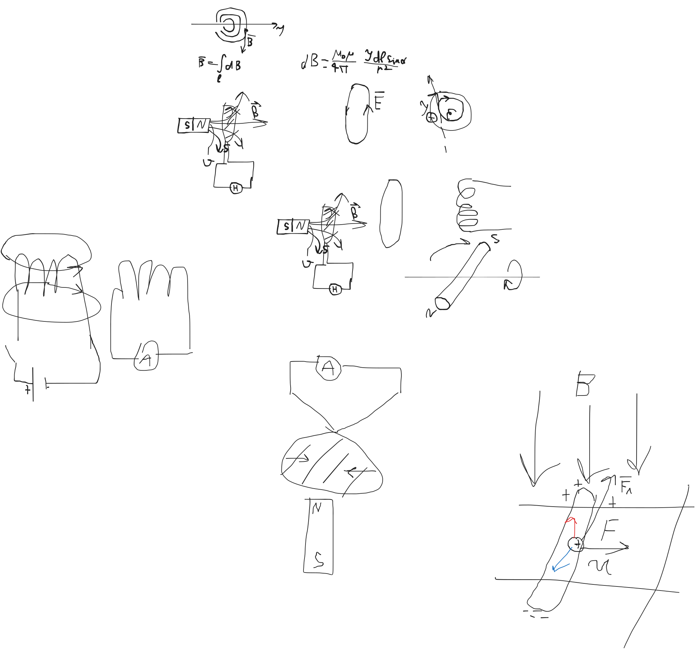

После обнаружения в 1820 г явления возниковения магнитного поля вокруг
проводника с током

(это сделал эрстед)

Начались целенаправленные поиски противоположного явления

Т.е. пытались при помощи магнитного поля создать электрический ток

И только в 1831 г

Майкл Фарадей обнаружил явление электромагнитной индукции

> Явяление электромагнитной индукции заключается в возникновении вихревого
> электрического поля в той точке пространства, в которой с течением времени
> изменяется магнитный поток.

Магнитный поток $$\Phi_B = B \cdot S$$

Вб = Тл * м^2

dB/dt

$$dB = $$

Приближение постоянного магнита к кольцу приводит к тому что в колце
возникает электрический ток,
который фиксируестя при помощи амперметра

Экспериментально установлено что если магнит приближается то
электрический ток идет в одну сторону, а если удаляется - то
в другую

Возникновение тока является следствием изменения магнитного потока

С другой стороны, как направленное движение заряженных частиц
свидетельствует о существовании электрического поля,
для создания которого требуется энергия.

Величина этой энергии характеризуется т.н. ЭДС

$$\varepsilon = A_{ст}/q$$

измеряется в вольтах

т.е. в Дж/Кл

$\varepsilon_{инд} = \frac{ - d \Phi  }{  dt }$

Знак минус означает математическое отражение правила Ленца,
которое определяет направление индукционного тока.

> Вихревое электрическое поле будет иметь такое направление,
> чтобы создаваемый этим поле электрический ток препятствовал
> изменению магнитного потока, пронизывающего контур

Правило Ленца фактически отражает принцип Ле-Шателье, в соответствии с которым
любая система реагирует на внешнее воздействие

И эта реакция сводится к появлению механизмов противодействия

(3 закон Ньютона: Сила действия равна силе проитиводействия)

Данное явление (индукции) используется:
1. для создания переменного электрического тока в промышленных масштабах
2. для излучения и приема радиоволн
3. для индукционной плавки металлов
   - микроволновая техника

$$d\Phi = BdS$$

$$d\Phi = S dB$$

$$d \Phi = dS dB$$

# Природа явления электромагнитной индукции и возникновение ЭДС индукции

На заряженную частицу, которая направленно движется в магнитном поле,
действует сила Лоренца, направление которой определяется по правилу левой руки

Как только произошло разделение зарядов, на концах проводника возникает ЭДС
индукции, т.е. сторонними силами проведена работа по разделению электрических
зарядов

В данном случае этой сторонней силой является сила Лоренца
