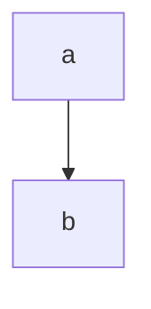

1 большой типовик
---
7 задач  
отдельная тетрадка (~24 листа если без екселя)  
стараемся делать быстрее чем лекции  
в ней писать условия задачи  
7ое желательно делать в экселе  
в последний момент не сдаем - будет лимит заданий/день  
в январе тоже не пересдашь!

5й вариант

автоматы
---

контрольные - типо как по матану  
---
но их сдать надо на хорошие оценки  
дадут 1 раз пересдать

будет тест (говорят бояться ненадо)
---

будем сдавать (в конце 3 курса) госы
---

Калькулятор
---
иметь калькулятор (отдельный, т.к. выч. технику отберут!)  
хотя бы 1 на двоих

книги:
---
- Кремор - теория вероятности, мат. статистики
- Овсянникова - краткий курс теории вероятностей, мат. статистики

ИИ можно, но он тупит
---

Google Class
---
'вместо телеграма'

сдавать туда не надо

Комбинаторика
===

// надо для ИИ

сколькими способами можно выбрать что-либо

будем говорить про производные

### Схема

выборка упорядоченная ли:

- нет, неупорядоченная:
  - сочетания (бином Ньютона).

    допускаются ли повторения:
    - да: $ \tilde {C^k_n} = C^k_{n+k-1} $
    - нет: $ C^k_n = \frac{n!}{k!(n-k)!} $ 

- да, упорядоченная:

  допускаются ли повторения:

  - нет повторений.

    n = k ?
    (n - колво обьектов)  
    (k - колво выборов)

    - да: $ P_n = n! $

    - нет: $ A^k_n = \frac{n!}{(n-k)!} $

  - есть повторения:
    - известно ли число повторений каждого элемента:
      - нет: $ \tilde {A^k_n} = n^k $
      - да: $ \tilde P_{n_1 n_2 ... n_k} = \frac{n!}{n_1! * n_2! * ... * n_k!} $

### перестановки

$ P_n = n! $

$ \tilde{P} = \frac{n!}{n_1! * n_2! * ... * n_k!} $

### сочетание

$ C^k_n = \frac{n!}{k!(n-k)!} $

$ \tilde {C^k_n} = C^k_{n+k-1} $

### размещения

$ A^k_n = \frac{n!}{(n-k)!} $

$ \tilde A^k_n = n^k $

правила:
- суммы: либо это либо то
- произведения: оба условия сразу

Задачи
---

### Задача 1
Сколькими способами можно расставить на полке в ряд 5 __различных__ книг

порядок важен!

все различны - нет повторений

$ n = k $

$ P_n = 5! = 120 $

### Задача 2
Сколько различных слов можно составить из __всех__ букв слова "УДОБРЕНИЯ"
если __порядок следования гласных__ меняться не будет?

УОЕИЯ ->  Ё

повторения теперь можно!

$ \tilde{P} = \frac{9!}{5! 1! 1! 1! 1!} = 9 * 8 * 7 * 6 = 3024 $

### Задача 3

В почтовом отделении продаются открытки 8 типов.

1. сколькими способами можно купить 6 различных открыток?
2. сколькими способами можно купить 6 открыток?

$ C^k_n = \frac{8!}{6!(8-6)!} = 28 $ 

$ \tilde {C^k_n} = C^k_{n+k-1} = C^6_{8+6-1} = \frac{13!}{6!(13-6)!} =
\frac{13!}{6!7!} = 3*2*11 * 11*2*13 = 1716 $

### Задача 4

Студенту необходимо сдать 4 экзамена в течение 7 дней.

Сколькими способами можно составить расписание?

(в 1 день нельзя)

порядок важен!

$ A^k_n = \frac{n!}{(n-k)!} = \frac{7!}{(7-4)!} $

### Задача 5

4 студента сдают экзамен.

Сколькими способами могут быть поставлены положительные оценки (3, 4, 5)

порядок важен (????)

$ \tilde {A^k_n} = 3^4 = 81 $

$ n = 3 \\ k = 4 $

### Задача 6

В 8 классе __лучше всех матешу знают__ пятеро

Вася, Дима, Олег | Катя, с Аней

На олимпиаду - двое из них

(нет иерархии)

порядок неважен

$ C^1_3 \\ C^1_2 $

$ C^1_3 * C^1_2 $

Домашка
---

далбица комбинаторики:

все вот эти формулы

признаки, пример

| Формула | признаки | пример |
|---------|----------|--------|
| $ P_n = n! $ | порядок важен, нет повторений, $ n = k $ (результат - кортеж с равной длиной) | Сколькими способами можно расставить на полке в ряд 5 __различных__ книг? |
| $ \tilde{P} = \frac{n!}{n_1! \cdot n_2! \cdot ... \cdot n_k!} $ | порядок важен, повторения есть, известно кол-во повторений; считаем перестановки __по классам__ | Сколько различных слов можно составить из __всех__ букв слова "УДОБРЕНИЯ" если __порядок следования гласных__ меняться не будет? |
| $ C^k_n = \frac{n!}{k!(n-k)!} $ | порядок не важен, нет повторений (результат действия - множество) | В почтовом отделении продаются открытки 8 типов. сколькими способами можно купить 6 __различных__ открыток? |
| $ \tilde {C^k_n} = C^k_{n+k-1} $ | порядок не важен, есть повторения (_мульти_множество?) | сколькими способами можно купить 6 открыток (необязательно различных)? |
| $ A^k_n = \frac{n!}{(n-k)!} $ | порядок важен, нет повторений, $ n \neq k $ (рассаживаем по местам, выбираем __некоторые из__ объектов; результат - упорядоченное мн-во) | Студенту необходимо сдать 4 экзамена в течение 7 дней. Сколькими способами можно составить расписание? (в 1 день нельзя) |
| $ \tilde A^k_n = n^k $ | порядок важен, есть повторения, неизвестно число повторений (то же, что выше, но допустимы повторения исходных обьектов; результат - кортеж, возможно именованый) | 4 студента сдают экзамен/ Cколькими способами могут быть поставлены положительные оценки (3, 4, 5) |

# События и действия над ними

S - некоторый фиксированный комплекс условий, при котором проводится
эксперимент

> __Случайным событием__ называется такой исход опыта,  
> который может произойти или __не__ произойти при комплексе S

> Событие называется __достоверным__, если оно всегда происходит  
> при данном комплексе условий S
>
> Обозначение: $\Omega$

> Событие называется __невозможным__, если  
> при данном комплексе условий  
> S оно не может наступить
>
> Обозначение: $\emptyset$

> Событие A называется __частным случаем__ события B  
> (Событие A __влечет__ за собой событие B),  
> Если при наступлении события A  
> наступает событие B
> 
> $A \in B$

> События будут называться __равными__, если
>
> $A \in B$ и $B \in A => A = B$

> __Суммой__ события A и B называется событие C,  
> которое происходить тогда и только тогда,  
> когда происходит хотя бы одно из событий: A или B  
> 
> $C = A + B = A \cup B$
>
> (или А или В, одно из)

> Произведением событий A и B называется событие C,  
> которое происходит тогда и только тогда,  
> когда происходят оба события  
> 
> $C = A \cdot B = A \cap B$
> 
> (и то и другое, оба раза)

> __Разностью__ событий называется событие C,  
> которое происходит тогда и только тогда,  
> когда событие A происходит,  
> а событие B не происходит  
> 
> $C = A - B = A \setminus B$

<!-- Событие A называется противоположным,
если происходит -->

> Событие, которое происходит тогда,  
> когда событие A не происходит называется __противоположным__  
> 
> $\overline A$

> События A и B называются __несовместными__,  
> если появление одного из них  
> исключает появление другого
> 
> $AB = \empty$

> События $A_1, A_2, ..., A_n$ называются __попарными совместными__,  
> если любые 2 из них несовместны  
> 
> $A_iA_j = \empty$ ($i \neq j$)

> $A_1, A_2, ..., A_n$ образуют __полную группу__, если в результате  
> каждого эксперимента происходит хотя бы 1 из них  
> 
> $A_1 + A_2 + ... + A_n = \Omega$

### Пример

В урне 8 шаров

Они пронумерованы 1..8

1 случайный шар

- A - шар номер 6
- B - появление шара с четным номером
- C - с нечетным
- D - появление шара с номером, кратным 3
- H - шар с номером 1..8
- K - шар с номером 9

$H = \Omega$ (Достоверное событие)

$K = \empty$

$A \in B$

$AC = \empty$

$BD=A$

$B = \overline C$

$A \in D$

$D \setminus A$ - шар номер 3

$D \setminus A \in C$

## Свойства операций над событиями

1. $A + B = B + A$

   $AB = BA$

2. $(A+B)C = AC+BC$

3. $(AB)C = A(BC)$

4. $A+A=A$
   
   $AA = A$

5. $A + \Omega = \Omega$

   $A \Omega = A$

6. $A + \overline A = \Omega$

   $A \overline A = \empty$

7. $\overline \empty = \Omega$

   $\overline \Omega = \empty$

   $\overline {\overline A} = A$

8. $A - B = A \cdot \overline B$

9. $\overline{A + B} = \overline A \cdot \overline B$

## Вероятность случайного события

### Аксиоматическое определение вероятности

> __Пространством элементарных событий__ будем называть  
> произвольное множество, элементы которого называются  
> __элементарными событиями__ (__элементарными исходами__)  
> 
> На практике: множество всех несовместных исходов эксперимента
> 
> $ \Omega = \{\omega\} $

F - семейство подмножеств $ \Omega $

Элементы F будут называться случайными событиями

Множество F называется __алгеброй множеств__,
если выполняются следующие условия:

1. F содержит в себе $\Omega$ (достоверные события) и $\empty$
2. Если $A \in F$ и $B \in F$, то:
   - $A + B \in F$
   - $AB \in F$
   - $A \setminus B \in F$

$A \in F$ -> $A = \Omega$

<!-- $ F \sub  $ -->

### Аксиомы алгебры множеств

1. множество F является _алгеброй множеств_

2. каждому множеству (случайному событию) A из множества F  
   ставится в соответствие неотрицательное число P(A),  
   которое называется __вероятностью__ события A  

3. вероятность полной группы элементарных событий равна 1

   $P(\Omega)=1$

4. вероятность суммы событий

   $P(\sum\limits^n_{i=1}A_i) = \sum\limits^n_{i=1}P(A_i)$

   при условии что

   $ A_i \in F \forall i $

   $ A_iA_j = \empty $ ($ i \neq j$)

5. $\lim\limits_{n->\infty} P(A_n) = 0$

#### Следствия

1. $P(A) + P(\overline A) = 1$

2. $P(\empty) = 0$

3. $0 \leq P(A) \leq 1$

4. $A \in B$ -> $P(A) \leq P(B)$

### Классическое определение вероятности

> $A_1, ..., A_n$ - __равновозможны__, при комплексе условий S,
> если каждое из них имеет равные шансы наступить

> #### Основная формула вероятностей
>
> $P(A) = m/n$
>
> m - желаемые __элементарные__ исходы
>
> n - общее число элементарных исходов ($ |\Omega| $)

1. $P(A) \geq 0$

2. $P(\Omega) = 1$

3. $P(\empty) = 0$

4. Если A и B несовместны, то

   $P(A+B) = P(A) + P(B)$

### Пример

В урне 4 красных, 3 желтых и 2 зеленых шара.

Вытаскивают 2 шара.

Найти вероятность:
- a\) оба шара красного цвета - A
- б\) 1 - кр, 2 - зел - B
- в\) оба шара одинакового цвета - C

$ \tilde {C^k_n} = C^k_{n+k-1} $

$ \tilde {C^2_9} = C^2_{9+2-1} $

$ C^2_10 = \frac{10!}{2!(10-2)!} $

$ C^2_10 = 10 * 9 / 2 = 45 $

$ C^2_4 $

6/45