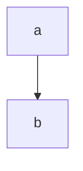

1 большой типовик
---
7 задач  
отдельная тетрадка (~24 листа если без екселя)  
стараемся делать быстрее чем лекции  
в ней писать условия задачи  
7ое желательно делать в экселе  
в последний момент не сдаем - будет лимит заданий/день  
в январе тоже не пересдашь!

автоматы
---

контрольные - типо как по матану  
---
но их сдать надо на хорошие оценки  
дадут 1 раз пересдать

будет тест (говорят бояться ненадо)
---

будем сдавать (в конце 3 курса) госы
---

Калькулятор
---
иметь калькулятор (отдельный, т.к. выч. технику отберут!)  
хотя бы 1 на двоих

книги:
---
- Кремор - теория вероятности, мат. статистики
- Овсянникова - краткий курс теории вероятностей, мат. статистики

ИИ можно, но он тупит
---

Google Class
---
'вместо телеграма'

сдавать туда не надо

Комбинаторика
===

// надо для ИИ

сколькими способами можно выбрать что-либо

будем говорить про производные

выборка упорядоченная ли:
- нет:
  - сочетания: бином Ньютона:
  - допускаются ли повторения:
    - да: $ \tilde {C^k_n} $
    - нет: $ C^k_n $ 
- да:
  допускаются ли повторения:
  - нет: n = k ?
    - n колво обьектов
    - k 
    - да: $ P_n $
    - нет: $ A^k_n $
  - да:
    - известно ли число повторений каждого элемента:
      - нет: $ \tilde {A^k_n} $
      - да: $ \tilde {P_{n_1 n_2 ... n_k}} $

### перестановки

$ P_n = n! $

$ \tilde{P} = \frac{n!}{n_1! * n_2! * ... * n_k!} $

### сочетание

$ C^k_n = \frac{n!}{k!(n-k)!} $

$ \tilde {C^k_n} = C^k_{n+k-1} $

### размещения

$ P_n = \frac{n!}{(n-k)!} $

$ \tilde {P_n} = n^k $

правила:
- суммы: либо это либо то
- произведения: оба условия сразу

Задачи
---

### Задача 1
Сколькими способами можно расставить на полке в ряд 5 __различных__ книг

порядок важен!

все различны - нет повторений

$ n = k $

$ P_n = 5! = 120 $

### Задача 2
Сколько различных слов можно составить из __всех__ букв слова "УДОБРЕНИЯ"
если __порядок следования гласных__ меняться не будет?

УОЕИЯ ->  Ё

повторения теперь можно!

$ \tilde{P} = \frac{9!}{5! 1! 1! 1! 1!} = 9 * 8 * 7 * 6 = 3024 $

### Задача 3

В почтовом отделении продаются открытки 8 типов.

1. сколькими способами можно купить 6 различных открыток?
2. сколькими способами можно купить 6 открыток?

$ C^k_n = \frac{8!}{6!(8-6)!} = 28 $ 

$ \tilde {C^k_n} = C^k_{n+k-1} = C^6_{8+6-1} = \frac{13!}{6!(13-6)!} =
\frac{13!}{6!7!} = 3*2*11 * 11*2*13 = 1716 $

### Задача 4

Студенту необходимо сдать 4 экзамена в течение 7 дней.

Сколькими способами можно составить расписание?

(в 1 день нельзя)

порядок важен!

$ A^k_n = \frac{n!}{(n-k)!} = \frac{7!}{(7-4)!} $

### Задача 5

4 студента сдают экзамен.

Сколькими способами могут быть поставлены положительные оценки (3, 4, 5)

порядок важен (????)

$ \tilde {A^k_n} = 3^4 = 81 $

$ n = 3 \\ k = 4 $

### Задача 6

В 8 классе __лучше всех матешу знают__ пятеро

Вася, Дима, Олег | Катя, с Аней

На олимпиаду

2

(нет иерархии)

порядок неважен

$ C^1_3 \\ C^1_2 $

$ C^1_3 * C^1_2 $

Домашка
---

далбица комбинаторики:

все вот эти формулы

признаки, пример