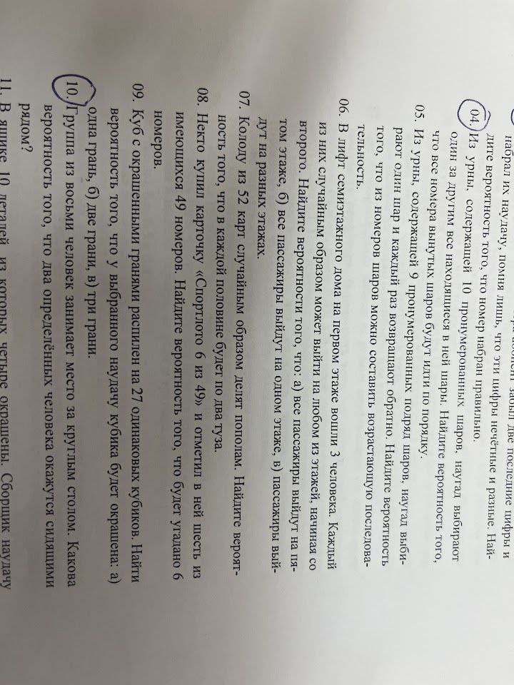

6\)

<!-- ```math
\tilde C ^3 _6 = C ^3 _{6+3-1}
=\frac {
    n!
} {
    k! (n-k)!
}
=\frac {
    8!
} {
    3! (8-3)!
}
``` -->

а:
```math
(1/6)^3 = 1/216
```

б:
```math
1 \cdot 1/6 \cdot 1/6 = 1/36
```

в:
```math
% (1/6) * (1/5) * (1/4) = 1/120
6/6 \cdot 5/6 \cdot 4/6 = 20/36 = 5/9
```

9\)


ровно одна грань:
```math
6/27 = 2/9 \approx 0.2222 = 22.22\%
```

ровно две грани:
```math
12/27 = 4/9 \approx 0.4444 = 44.44\%
```

ровно три грани:
```math
8/27 \approx 0.2963 = 29.63\%
```