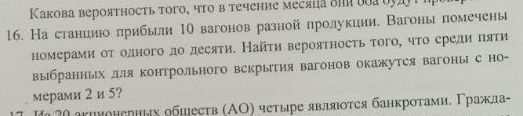
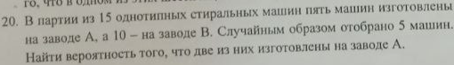
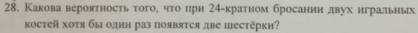
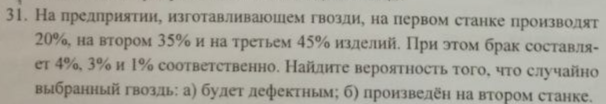

порядок вагонов не важен

но все вагоны пронумерованы, следовательно уникальны

Пусть:
- $B_2$ - среди пяти выбранных вагонов есть 2
- $B_5$ - среди пяти выбранных вагонов есть 5
- $A$ - среди пяти выбранных вагонов есть и 2 и 5

$$B_2 = \frac{  }{ C ^5 _{10} }$$

$$C ^5 _{10} = 252$$

$$C ^3 _{8} = 56$$

$$C ^2 _{2} = 1$$

$$\frac{56 \cdot 1}{252} = 2/9$$

---

$$C ^5 _{15} = 3003$$

$$C ^2 _5 \times C ^3 _{10} = 1200$$

$$1200 / 3003 = 400 / 1001$$

---

- p - вероятность что выпадет две шестерки за 1 бросок
- B - вероятность что выпадет одна шестерка за 1 бросок
- q - вероятность что НЕ выпадет две шестерки за 1 бросок
- Z - вероятность что две шестерки не выпадут ни разу за 24 броска
- A - вероятность что две шестерки выпадут хотя бы раз за 24 броска

$$B = m/n = 1/6$$

$$p = B^2 = 1/36$$

$$q = \overline p = 1 - p = 35/36$$

Формула Бернулли:

$$P _n (k) = C ^k _n p^n q^{n-k}$$

$$Z = P _{24} (0) = q^n = (35/36)^{24} \approx 0.5085961239 \approx 50.86 \%$$

$$A = \overline Z = 1 - A \approx 0.4914038761 \approx 49.14 \%$$

---

- $H_i$ - выбранный гвоздь произведен на i-м станке.

  Образуют полную группу:

  $$H_1 \cup H_2 \cup H_3 = \Omega$$

  (т.к. гвоздь обязательно произведен на каком-либо из этих станков)

  - $P(H_1) = 20\%$
  - $P(H_2) = 35\%$
  - $P(H_3) = 45\%$

- $A$ - выбранный гвоздь бракован

- $A|H_i$ - вероятность что гвоздь бракован _при условии_,  
  что он произведен на i-м станке.
            
  Т.е вероятность брака на i-м станке.

  - $P(A|H_1) = 4\%$
  - $P(A|H_2) = 3\%$
  - $P(A|H_3) = 1\%$

#### а)

Формула полной вероятности:

$$P(A) = \sum \limits _i ^n P(H_i) P(A | H_i)$$

$$P(A) = P(H_1) P(A | H_1) + P(H_2) P(A | H_2) + P(H_3) P(A | H_3)$$

$$P(A) = 20\% \cdot 4\% + 35\% \cdot 3\% + 45\% \cdot 1\%$$

$$P(A) = 0.80\% + 1.05\% + 0.45\% = 2.3 \%$$

#### б)

Пусть N - общее кол-во гвоздей

Тогда кол-во гвоздей произведенных
- на 1-м станке:
  $20 \% \cdot N$
- на 2-м станке:
  $35 \% \cdot N$
- на 3-м станке:
  $45 \% \cdot N$

Тогда:
  - $$P(H_1) = \frac{20 \% \cdot N}{N} = 20\%$$
  - $$P(H_2) = \frac{35 \% \cdot N}{N} = 35\%$$
  - $$P(H_3) = \frac{45 \% \cdot N}{N} = 45\%$$

Ответ: 35%