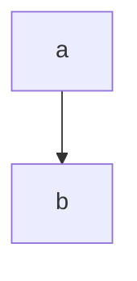

Комбинаторика
===

// надо для ИИ

сколькими способами можно выбрать что-либо

будем говорить про производные

### Схема

выборка упорядоченная ли:

- нет, неупорядоченная:
  - сочетания (бином Ньютона).

    допускаются ли повторения:
    - да: $ \tilde {C^k_n} = C^k_{n+k-1} $
    - нет: $ C^k_n = \frac{n!}{k!(n-k)!} $ 

- да, упорядоченная:

  допускаются ли повторения:

  - нет повторений.

    n = k ?
    (n - колво обьектов)  
    (k - колво выборов)

    - да: $ P_n = n! $

    - нет: $ A^k_n = \frac{n!}{(n-k)!} $

  - есть повторения:
    - известно ли число повторений каждого элемента:
      - нет: $ \tilde {A^k_n} = n^k $
      - да: $ \tilde P_{n_1 n_2 ... n_k} = \frac{n!}{n_1! * n_2! * ... * n_k!} $

### перестановки

$ P_n = n! $

$ \tilde{P} = \frac{n!}{n_1! * n_2! * ... * n_k!} $

### сочетание

$ C^k_n = \frac{n!}{k!(n-k)!} $

$ \tilde {C^k_n} = C^k_{n+k-1} $

### размещения

$ A^k_n = \frac{n!}{(n-k)!} $

$ \tilde A^k_n = n^k $

правила:
- суммы: либо это либо то
- произведения: оба условия сразу

Задачи
---

### Задача 1
Сколькими способами можно расставить на полке в ряд 5 __различных__ книг

порядок важен!

все различны - нет повторений

$ n = k $

$ P_n = 5! = 120 $

### Задача 2
Сколько различных слов можно составить из __всех__ букв слова "УДОБРЕНИЯ"
если __порядок следования гласных__ меняться не будет?

УОЕИЯ ->  Ё

повторения теперь можно!

$ \tilde{P} = \frac{9!}{5! 1! 1! 1! 1!} = 9 * 8 * 7 * 6 = 3024 $

### Задача 3

В почтовом отделении продаются открытки 8 типов.

1. сколькими способами можно купить 6 различных открыток?
2. сколькими способами можно купить 6 открыток?

$ C^k_n = \frac{8!}{6!(8-6)!} = 28 $ 

$ \tilde {C^k_n} = C^k_{n+k-1} = C^6_{8+6-1} = \frac{13!}{6!(13-6)!} =
\frac{13!}{6!7!} = 3*2*11 * 11*2*13 = 1716 $

### Задача 4

Студенту необходимо сдать 4 экзамена в течение 7 дней.

Сколькими способами можно составить расписание?

(в 1 день нельзя)

порядок важен!

$ A^k_n = \frac{n!}{(n-k)!} = \frac{7!}{(7-4)!} $

### Задача 5

4 студента сдают экзамен.

Сколькими способами могут быть поставлены положительные оценки (3, 4, 5)

порядок важен (????)

$ \tilde {A^k_n} = 3^4 = 81 $

$ n = 3 \\ k = 4 $

### Задача 6

В 8 классе __лучше всех матешу знают__ пятеро

Вася, Дима, Олег | Катя, с Аней

На олимпиаду - двое из них

(нет иерархии)

порядок неважен

$ C^1_3 \\ C^1_2 $

$ C^1_3 * C^1_2 $

Домашка
---

далбица комбинаторики:

все вот эти формулы

признаки, пример

| Формула                                                         | признаки                                                                                                                                                          | пример                                                                                                                           |
| --------------------------------------------------------------- | ----------------------------------------------------------------------------------------------------------------------------------------------------------------- | -------------------------------------------------------------------------------------------------------------------------------- |
| $ P_n = n! $                                                    | порядок важен, нет повторений, $ n = k $ (результат - уп. мн-во с равной длиной)                                                                                  | Сколькими способами можно расставить на полке в ряд 5 __различных__ книг?                                                        |
| $ \tilde{P} = \frac{n!}{n_1! \cdot n_2! \cdot ... \cdot n_k!} $ | порядок важен, повторения есть, известно кол-во повторений; считаем перестановки __по классам__ (результат - строковый тип?)                                      | Сколько различных слов можно составить из __всех__ букв слова "УДОБРЕНИЯ" если __порядок следования гласных__ меняться не будет? |
| $ C^k_n = \frac{n!}{k!(n-k)!} $                                 | порядок не важен, нет повторений (результат действия - множество)                                                                                                 | В почтовом отделении продаются открытки 8 типов. сколькими способами можно купить 6 __различных__ открыток?                      |
| $ \tilde {C^k_n} = C^k_{n+k-1} $                                | порядок не важен, есть повторения (_мульти_множество?)                                                                                                            | сколькими способами можно купить 6 открыток (необязательно различных)?                                                           |
| $ A^k_n = \frac{n!}{(n-k)!} $                                   | порядок важен, нет повторений, $ n \neq k $ (рассаживаем по местам, выбирая __некоторые из__ объектов; результат - упорядоченное мн-во)                           | Студенту необходимо сдать 4 экзамена в течение 7 дней. Сколькими способами можно составить расписание? (в 1 день нельзя)         |
| $ \tilde A^k_n = n^k $                                          | порядок важен, есть повторения, неизвестно число повторений (то же, что выше, но допустимы повторения исходных обьектов; результат - кортеж, возможно именованый) | 4 студента сдают экзамен/ Cколькими способами могут быть поставлены положительные оценки (3, 4, 5)                               |

