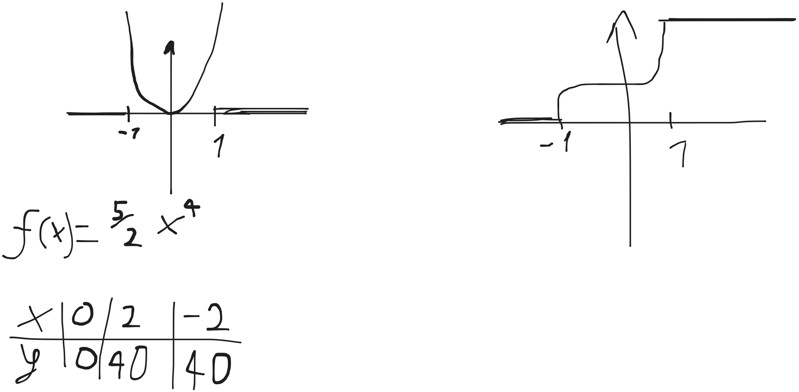
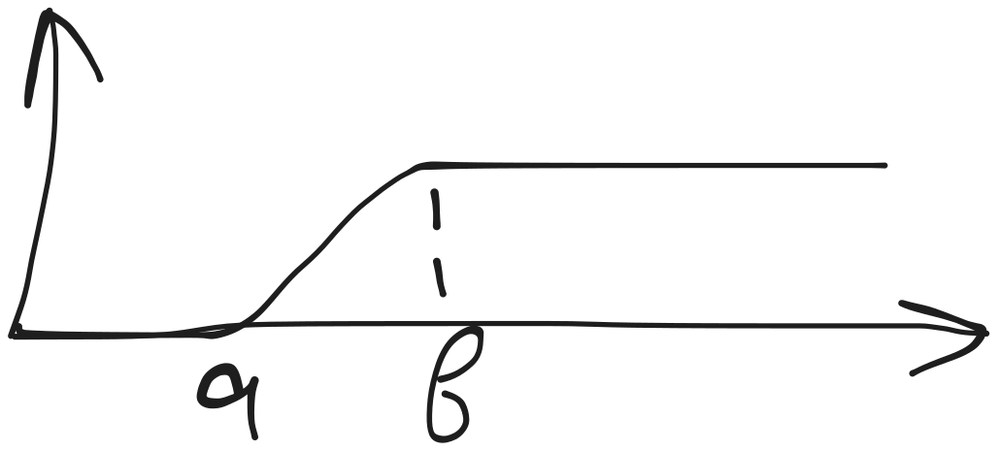
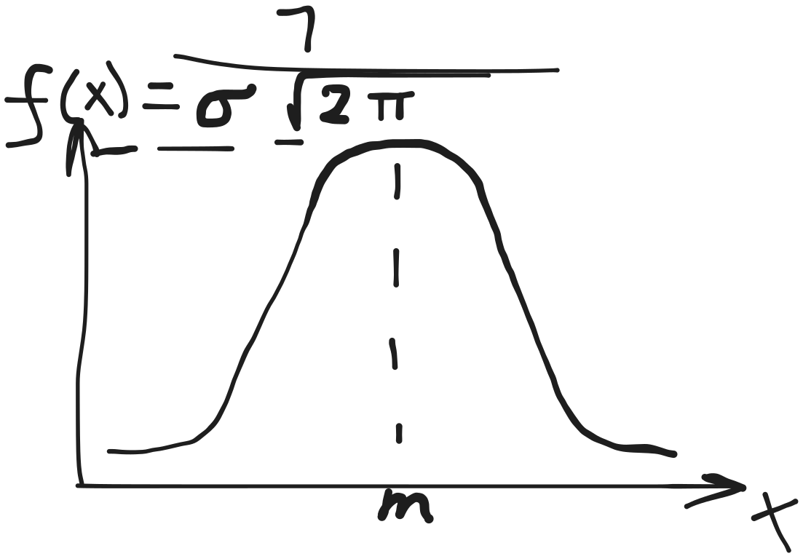
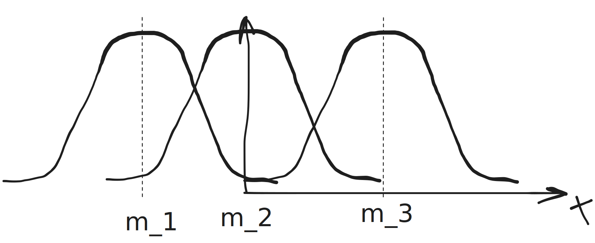
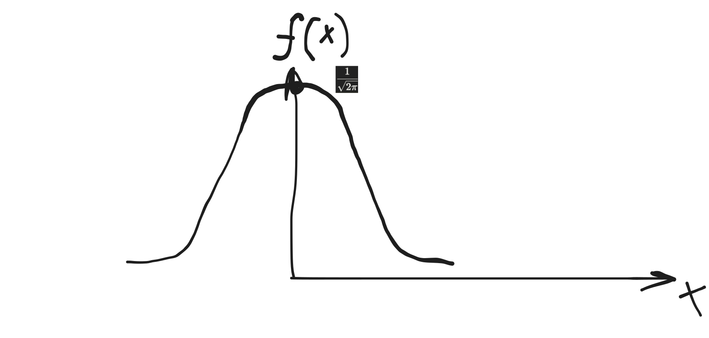
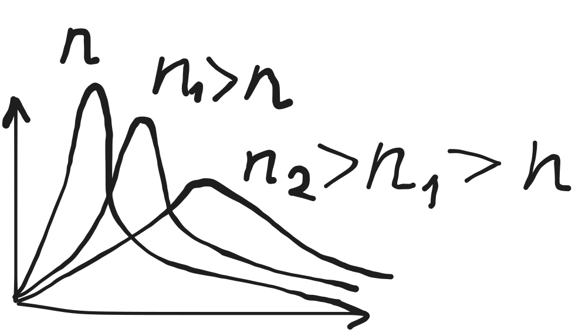

Одномерные случайные величины
===

> __Случайная__ - величина, которая в результате испытания
> примет значение, наперед неизвестное и
> зависящее от причин, все из которых заранее
> не могут быть учтены.

Пример: 
- оценка на экзамене
- зарплата

> __Дискрентная__ - случайная величина, которая
> принимает набор отдельных, изолированных значений

Конечное счетное множество,
бесконечное число

> __Непрерывная__ - случайная величина, набор значений которой
> целиком заполняет некоторый интервал

различные функции, интрегалы...

## Примеры дискретных случайных величин

В результате испытания
дискретная случайная величина X может принять:

- $x_1$
- $x_2$
- $...$
- $x_n$

$p_i$ - вероятность наступления $x_i$

X|$x_1$|$x_2$|...|$x_n$
-|-----|-----|---|-----
P|$p_1$|$p_2$|...|$p_n$

1. Распределение Бернулли

   (только при 0/1)

   X | 0 | 1
   --|---|---
   P | q | p

   q = 1 - p

2. Равновероятное распределение случайных величин

   X - число очков при бросании кости

   X: 1 2 3 4 5 6

   P: 1/6 1/6 1/6 1/6 1/6 1/6 

3. Геометрическое

   (в геометрической прогрессии)

   P(A) = 0.7 - вероятность что стрелок попал

   P(\overline A) = 0.3

   стреляем до первого попадания

   Составить закон распределения числа выстрелов

| X   | 1   | 2         | 3           | 4           | ... | k               |
| :-- | --- | --------- | ----------- | ----------- | --- | --------------- |
| p   | 0.7 | 0.3 * 0.7 | 0.3^2 * 0.7 | 0.3^3 * 0.7 | ... | q^{k-1} \cdot p |

### Гипергеометрическое распределение

$$P(x=k) = \frac{ C ^k _M \cdot C ^k _{N-M} }{ C ^n _N }$$

- N - кол-во объектов
- M - кол-во объектов, обладающих нужными свойствами
- n - сколько объектов извлекаем
- k - сколько из n объектов нам нужно

### Биноминальное распределение

(с биномом Ньютона)

Вероятность попадания: 0.7

стреляем 4 раза

Составить закон распределения числа попаданий в цель

| X   | 0     | 1                     | 2                       | 3                     |
| :-- | :---- | :-------------------- | :---------------------- | :-------------------- |
| P   | 0.3^4 | 0.3^3 * 0.7 * C ^1 _4 | 0.3^2 * 0.7^2 * C ^2 _4 | 0.3 * 0.7^3 * C ^3 _4 |

```math
P_n(k) = C ^k _n p^k q^{n-k}
```

### Распределение Пуассона

без примера

но через егошнюю формулу

## Арифметические операции двух случайных величин

### Сумма

| X   | x_1     | x_2     | x_3     | …   | x_{n_x} |
| :-- | :------ | :------ | :------ | :-- | :------ |
| P   | p_{x_1} | p_{x_2} | p_{x_3} | …   | p_{x_n} |

| Y   | y_1     | y_2     | y_3     | …   | y_{n_y} |
| :-- | :------ | :------ | :------ | :-- | :------ |
| P   | p_{y_1} | p_{y_2} | p_{y_3} | …   | p_{y_n} |

| X+Y | X_1 + y_1 | X_1 + y_1 | …   | X_1 + y_{n_y} | x_2 + y_1 | …   | x_{n_x} + y_{n_y} |
| :-- | :-------- | :-------- | :-- | :------------ | :-------- | :-- | :---------------- |
| P   | P_{11}    | P_{12}    | …   |               |           |     |                   |


$$p = p_{n_x} \cdot p_{n_y}$$

### Произведение

меняется знак на умножение

## Числовые характеристики дискретной случайной величины

### Математическое ожидание

Напр. самая частая оценка на экзамене

в среднем

$$M(x)$$

или

$$E(x)$$

$$M(x) = \sum x_i p_i$$

#### Пример

X - случайная величина распределения оценок

| X   | 2   | 3   | 4   | 5   |
| :-- | :-- | :-- | :-- | :-- |
| P   | 0.2 | 0.4 | 0.3 | 0.1 |

```math
M(X) = 2 * 0.2 + 3 * 0.4 + 4 * 0.3 + 5 * 0.1 = 3.3
```

Средняя оценка - тройка

#### Основные свойства

1. $M(C) = C$

2. $M(\alpha \cdot X) = \alpha M(x)$

3. $M(X + Y) = M(X) + M(Y)$

4. Если события независимы:

   $M(X \cdot Y) = M(X) \cdot M(Y)$

### Дисперсия случайной величины

Отклонение от математического ожидания

$D(x)$ или $Var(x)$

$$D(X) = M( X - M(x) )^2$$

$$D(X) = \sum (x_i - M(x_i))^2 p_i = \sum x_i ^2 - M(x)^2$$

$$i = \overline{ 1,n }$$

| X   | 2   | 3   | 4   | 5   |
| :-- | :-- | :-- | :-- | :-- |
| P   | 0.2 | 0.4 | 0.3 | 0.1 |

$$D(X) = (2^2 * 0.2 + 3^2 * 0.4 + 4^2 * 0.3 + 5^2 * 0.1) - (3.3)^2$$

#### Основные свойства

1. $D(C) = 0$

2. $D(\alpha \cdot X) = \alpha^2 \cdot D(x)$

3. $D(\alpha + X) = D(x)$

4. $D(X-Y) = D(X) + D(Y)$ \[именно плюс!]
   
5. $D(X+Y) = D(X) + D(Y)$

### Среднеквадратичное отклонение

$$\sigma_x = \sqrt{D(x)}$$

---

Для проверки:

$$\sum p_i = 1$$

## Непрерывные случайные величины

X - случайная величина

__Функция распределения__ вероятностей случайной непрерывной величины
(она же __интрегальная__):

$$F_X(x_0) = P(x < x_0)$$

### Основные свойства

1. $0 \leq F(x) \leq 1$

2. $F(x)$ - неубывающая

   $$F(x_2) \geq F(x_1)$$

   $$(x_2 \geq x_1)$$

   - $[a; b)$:
   
     $$P(a \leq x < b) = F(b) - F(a)$$

3. Если $F(x) \rightarrow 0$, то $x \rightarrow -\infty$

   Если $F(x) \rightarrow 1$, то $x \rightarrow +\infty$

   Если $x \in (a; b)$, то $F(x) = 0$

   Если $x < a$, то $F(x) = 0$

   Если $x > b$, то $F(x) = 1$

> X - непрерывная случайная величина,
> если ее ф-ция распределения кусочно-дифференцируема.

__Плотность распределения__:

$$f(x) = F'(x)$$

### Теорема

$$P(a \leq x \leq b) = \int _a ^b f(x) dx = F(b) - F(a) =$$

$$=\int _a ^b F'(x) dx$$

Найти функцию распределения по плотности:

$$F(x_0) = \int _{-\infty} ^{x_0} f(x) d(x)$$

#### Свойства дифференциальной функции распределения

1. $f(x) \geq 0$
2. $\int _{-\infty} ^{+\infty} f(x) dx = P(-\infty < x < +\infty) = 1$

### Числовые характеристики непрерывных случайных величин

1. математическое ожидание

   $$M[x] = \int _{ -\infty } ^{ \infty } x f(x) dx$$

   $$M[x] = \int _{ a } ^{ b } x f(x) dx$$

2. дисперсия

   ```math
   D[x] = \int _{ -\infty } ^{ \infty } (x - M[x])^2 f(x) dx =
   \int _{ -\infty } ^{ \infty } (x^2 f(x) - (M[x])^2)dx
   ```

3. среднеквадратичное отклонение
   
   $$\sigma(x) = \sqrt{D[x]}$$

Свойства такие же как и для

---

```math
f(x) = \begin{cases}
0, x \leqslant -1 \\
ax^4, -1 < x \leqslant 1 \\
0, x > 1
\end{cases}
```

$$\int _{ -\infty } ^{ \infty } f(x) dx = 1$$

$$\int _{ -1 } ^{ 1 } ax^4 dx = 1$$

$$\frac{ ax^5 }{ 5 } | _{-1} ^1 = 1$$

$$a(1/5 - (-1/5)) = 2/5 a = 1$$

$$a = 5 / 2 = 2.5$$

---

```math
f(x) = \begin{cases}
0, x \leqslant -1 \\
2.5x^4, -1 < x \leqslant 1 \\
0, x > 1
\end{cases}
```

$$M[x] = \int _{ -\infty } ^{ \infty } x f(x) dx=$$

$$=\int _{ -\infty } ^{ -1 } x 0 dx + \int _{ -1 } ^{ 1 } 5/2 x^5 dx + \int _{ 1 } ^{ +\infty } x 0 dx=$$

$$5/12 - 5/12$$

---

$$D[x] = M[x^2] - (M[x])^2$$

```math
M[x^2] = \int _{ -1 } ^{ 1 } x^2 \frac{ 5 }{ 2 } x^4 dx
= \left. \frac{ 5x^7 }{ 2 \cdot 7 } \right| ^1 _{-1} = 5/7
```

$$\sigma[x] = \sqrt{5/7}$$

### Вероятность попадания случайной величины в интервал

\[-0.5; 0.5]

$$P(a \leqslant x \leqslant b) = \int _{ a } ^{ b } f(x) dx$$

$$P(a \leqslant x \leqslant b) = \int _{ -0.5 } ^{ 0.5 } f(x) dx$$

$$P(a \leqslant x \leqslant b) = 1/32$$

### найти функцию распределения

$$F(x_n) = \int _{ -\infty } ^{ x_0 } f(x) dx$$

```math
F(x_0) = \begin{cases}
0, x \leqslant -1 \\
\int _{-1} ^{x_0} 2.5x^4 dx, -1 < x \leqslant 1 \\
0, x > 1
\end{cases}
```

```math
F(x_0) = \begin{cases}
0, x \leqslant -1 \\
\frac{ x_0 ^5 + 1 }{ 2 }, -1 < x \leqslant 1 \\
0, x > 1
\end{cases}
```



## Другие характеристики случайных величин

1. Мода

   $$Мода[x] = Mo[x] = \argmax _x f_x(x)$$

   Если их две, то распределение называется __бимодальным__

2. Медиана

   Это значение случайной величины для которого вероятность попасть
   слева или справа от него одинакова

   ```math
   \int _{ -\infty } ^{ Me X } f(x) dx = \int _{ Me X } ^{ -\infty } f(x) dx
   = 0.5
   ```

   $$F_X(Me X) = 0.5$$

3. начальный момент распределения k-го порядка

   $$V_k = M[x]X^k \ (k = 1, 2, ...)$$

4. центральный момент k-го порядка

   $$\mu _k = M(X - MX)^k \ (k = 1, 2, ...)$$

   центральный момент 2го порядка - это дисперсия

   Для симметричных распределений центральный момент нечетного порядка
   равен нулю

   $$\mu _2 = v ^2 _0 - v_1 ^2$$

5. асимметрия 

   нормированный центральный момент 3го порядка

   $$As = \frac{ \mu_3 }{ \sigma ^3 } = \frac{ M(X - MX)^3 }{ \sigma ^3 }$$

6. эксцесс распределения

   это нормированный центральный момент 4-го порядка

   $$K = \frac{ \mu_4 }{ \sigma ^4 } = \frac{ M(X - MX)^4 }{ \sigma ^4 }$$
   
   служит для сравнения любого распределения с нормальным

   Для нормального распределения:

   $$K = 3$$

   если >3, то пик распределения - около M[x] (острый)

   если <3, то гладкий

7. квантиль распределения

   $$x_q - q \cdot 100 \%$$

   вероятность попадания случайной величины слева от x_q

   $$P(X < x_q) = q$$

   медиана - это 50%-ный квантиль

   частные случаи:
   - квартилии
   - децилии

   $$\int _{-\infty} ^{x_q} f(x) dx = q$$

   $$F_x (x_q) = q$$

## Основные распределения непрерывных случайных величин

### 1. Равномерно распределенная случайная величина

```math
f(x) = \begin{cases}
0, x \notin (a; b) \\
C, x \in (a; b)
\end{cases}
```

```math
\int _a ^b f(x) dx = 1
```

```math
\int _a ^b C dx = 1
```

```math
Cx | _a ^b = C(b - a) = 1
```

```math
C = \frac{ 1 }{ b-a }
```


---

```math
F(x) = \begin{cases}
0, & x < a \\
\frac{ x - a }{ b - a }, & a \leqslant x \leqslant b \ (x \in [a; b]) \\
1, & x > b
\end{cases}
```



```math
M[x] = \frac{ a + b }{ 2 }
```

```math
D[x] = \frac{ (b - a)^2 }{ 12 }
```

### 2. Нормальное распределения

Случайная величина X называется нормально распределенной с параметрами
$m$ и $\sigma$

если плотность распределения имеет вид:

```math
f(x) = \frac{ 1 }{ \sigma \sqrt{2 \pi} } e ^{\frac{ -(x-m)^2 }{ 2 \sigma ^2 }}
```

```math
M[x] = m
```

$$D[x] = \sigma ^2$$

$$\sigma[x] = \sigma$$




x = m; f(x) = f(m)

$$f(m) = \frac{ 1 }{ \sigma \sqrt{2 \pi} }$$

Точки перегиба:

$$(m-\sigma, \frac{ 1 }{ \sigma \sqrt{2 \pi} })$$

$$(m+\sigma, \frac{ 1 }{ \sigma \sqrt{2 \pi} })$$



#### Нормированное нормальное распределение

> $$m = 0$$
> 
> $$\sigma = 1$$
> 
> $$f(x) = \frac{ 1 }{ \sqrt{2 \pi} } e ^{-\frac{ x^2 }{ 2 }}$$



```math
F(x_0) = \frac{ 1 }{ \sqrt{2 \pi} }
\int _{ -\infty } ^{ x_0 } e ^{-\frac{ x^2 }{ 2 }} dx
```

(функция Лапласа)

нечетная

$$\Phi(-x) = -\Phi(x)$$

есть готовая таблица

Вероятность того что нормированная нормальная величина
принимает значение из интервала $(0, x_0), x_0 >0$

$$P(0 \leqslant x \leqslant x_0) = \int _{ 0 } ^{ x_0 } f(x) dx = \Phi(x_0)$$

- табличное значение

$$F(x) = 0.5 + \Phi(x)$$

потому что f(x) симметрична

#### Вероятность попадания в заданный интервал нормальной случайной величины

пусть X - нормально распределенная случайная величина

с параметрами m и \sigma

тогда

```math
P(A < X < B) = \int _{ A } ^{ B } f(x) dx
= \frac{ 1 }{ \sigma \sqrt{2\pi} }
  \int _{ A } ^{ B } e^{\frac{ -(x-m)^2 }{ 2\sigma^2 }} dx
```

сделаем замену по переменной z

$$z = \frac{ x-m }{ \sigma }$$

$$\boxed{\Phi(\frac{ B-m }{ \sigma }) - \Phi(\frac{ A-m }{ \sigma })}$$

#### Пример

распределение нормальное

$$m = 48$$

$$\sigma = 2$$

определить процент спроса на 50 размер при условии разброса от 49 до 51

$$(49,51)$$

$$P(49 < X < 51) = \Phi(\frac{ 51-48 }{ 2 }) - \Phi(\frac{ 49-48 }{ 2 })$$

$$P(49 < X < 51) = \Phi(\frac{ 3 }{ 2 }) - \Phi(\frac{ 1 }{ 2 })$$

$$P(49 < X < 51) = 0.4332 - 0.1915 = 0.2417$$

#### Вычисление вероятности заданного отклонения

X - случайная величина нормального распределения

даны m, \sigma

ищем

$$P(|x-m| < \alpha) = P(m - \alpha \leqslant x \leqslant m + \alpha)=$$

```math
=\Phi(\frac{ m+\alpha-m }{ \sigma }) - \Phi(\frac{ m-\alpha-m }{ \sigma })=
```

$$= 2\Phi(\frac{ \alpha }{ \sigma })$$

#### Правило трех сигм:

$$\delta = \sigma t$$

$$P(|x-m| < \sigma t) = 2\Phi(t)$$

t = 3

$$P(|x-m| < 3\sigma) = 2\Phi(3) = 2 \cdot 0.49865 = 0.9973$$

$$P(|x-m| > 3\sigma) = 1 - 0.9973 = 0.0027$$

> если распределение неизвестно,
> но правило трех сигм выполняется,
> то считается что распределение нормальное.
> 
> Иначе - нет

##### Пример

шутка

### распределение $\chi^2$

X_1, ..., X_n - ннсв

$$\chi^2 = \sum _{ i=1 } ^{ n } x_i ^2 \rightarrow$$

распределена по закону $\chi^2$ с $n$ степенями свободы

Если $x_n = x_1 + ... + x_{n-1}$, то число степеней свободы - $n-1$

```math
f_{\chi}(x) =
\begin{cases}
0, & x \leqslant 0  \\
\frac{ 1/2^{n}{2} } \Gamma(n/2), & x > 0  \\
%   \\
\end{cases}
```

где

$$\Gamma(x) = \int _{ 0 } ^{ +\infty } t^{x-1} e^{-t} dt$$



### распределение Стьюдента

Z - ннсв

$\chi^2(k)$ - независимая от $Z$ фция
которая распределена по $\chi^2$ с $k$ степенями свободы

тогда случайная величина
$T = \frac{ Z }{ \sqrt{\frac{ \chi^2(k) }{ k }} } = t(k)$
- распределение Стьюдента с $k$ степенями свободы

```math
f_{t(k)}(x) = \frac{ \Gamma(k/2) }{ \sqrt{\pi(k-1)} \cdot \Gamma(\frac{ k-1 }{ 2 }) } (1+ \frac{ x^2 }{ k-1 })^{-\frac{ 1 }{ 2 }k}, -\infty < x < +\infty
```

### распределение Фишера

чтобы такое существовало, надо 2 величины

$$\chi _1 ^2 (k_1)$$

$$\chi _2 ^2 (k_2)$$

$$F(k_1, k_2) = \frac{ \chi _1 ^2 (k_1) / k_1 }{ \chi _2 ^2 (k_2) / k_2 }$$

k - __число степеней свободы__

__знаментатель__ k_2

# Многомерные случайные величины

> Дз конспект: дискретные и непрерывные, $M[X], D[X], \sigma[X]$
>
> непрерывные: только двумерные берем

многомерные это там где не одно число а целый вектор

$$X=(X_1, X_2)$$

тогда для него:

$$M[X]=(M[X_1], M[X_2])$$

а дисперсия определяется ковариантной матрицей:

$$cov(X) = M[(X - M[X])(X - M[X])^T] = M[X_1 X_2] - M[X_1] M[X_2]$$

в случае двухмерной величины:

```math
cov(X) = \left[ \begin{matrix}
D[X_1] & M[X_1 X_2] - M[X_1] M[X_2]  \\
M[X_2 X_1] - M[X_2] M[X_1] & D[X_2]
\end{matrix} \right ]
```

она симметричка кстати

а тогда

$$\sigma[X] = \sqrt{cov(X)}$$

так чтоли?

```math
\sigma[X] = \left[ \begin{matrix}
\sigma[X_1] & \sqrt{M[X_1 X_2] - M[X_1] M[X_2]}  \\
\sqrt{M[X_2 X_1] - M[X_2] M[X_1]} & \sigma[X_2]
\end{matrix} \right ]
```

для фции плотности:

```math
P(X \in A) = \int _A f(X) dX
```

где A - некоторая область

для двухмерной случайной величины вероятность попадания в прямоугольник:

```math
P(a_1 \leqslant X_1 \leqslant b_1, a_2 \leqslant X_2 \leqslant b_2)
= \int _{ a_1 } ^{ b_1 } \int _{ a_2 } ^{ b_2 } f(x_1, x_2) dx_2 dx_1
```

для интрегальной фции:

```math
F(X) = P(X_1 \leqslant x_1, X_2 \leqslant x_2, ..., X_n \leqslant x_n)
```

```math
F(X) = \int _{ -\infty } ^{ x_1 } ... \int _{ -\infty } ^{ x_n } f(X) dX
```

```math
\frac{ \partial F(X)  }{  \partial x_i } = f_i(X)
```

```math
f(X) = \frac{ \partial ^n F(X)  }{  \partial x_1 \partial x_2 ... \partial x_n }
```

