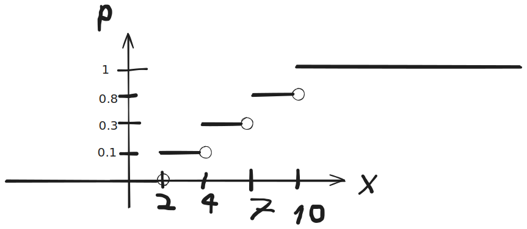

## Практика

Сколькими способами можно расставить
на полке 12 книг, из которых 5 - это сборники
так, чтобы сборники стояли рядом?

12-5+1 (берем сборники как одну)

$ P_8 \cdot P_5 = 8! \cdot 5! $

Пришло 25, нужно выбрать директора, завуча началки, среднего, по воспиталке

$
С_{25}^1
\cdot
С_{24}^1
\cdot
С_{23}^1
\cdot
С_{22}^1
$

5 офицеров, 8 сержантов, 70 рядовых

отряд из 2 офицеров, 4 сержантов, 15 рядовых

порядок неважен

$
С_{5}^2
\cdot
С_{8}^4
\cdot
С_{70}^{15}
$

$ C^k_n = \frac{n!}{k!(n-k)!} $

---

$
С_{5}^2 = \frac{5!}{2!(5-2)!}
$

$
С_{5}^2 = \frac{5!}{2!3!}
$

$
С_{5}^2 = \frac{5 * 4 * 3 * 2}{2 * 3 * 2}
$

$
С_{5}^2 = \frac{5 * 4}{2}
$

$
С_{5}^2 = 5 * 2 = 10
$

---

$ C^4_8 = \frac{8!}{4!(8-4)!} $

$ C^4_8 = \frac{8!}{4! * 4!} $

$ C^4_8 = \frac{8 * 7 * 6 * 5}{4!} $

$ C^4_8 = \frac{8 * 7 * 6 * 5}{4 * 3 * 2} $

$ C^4_8 = \frac{2 * 7 * 2 * 5}{ 2} $

$ C^4_8 = \frac{2 * 7 * 5} $

$ C^4_8 = 70 $

---

$ 700 * C^{15}_{70} $

На выборах победило 9еро

обзовем буквами

2 председателя

3 замов

1 профорг

$
C^2_9
\cdot
C^3_7
\cdot
C^1_4
$

Сколькими способами можно разложить в коробке карандаши (6 шт)
выбирая из 12 имеющихся цветов

$ \tilde {C^k_n} = C^k_{n+k-1} $

$ \tilde {C^6_12} = C^6_{18-1} $

$ C^6_{17} = 17! / 6!(11!) $

13 14 4 17

---

(n+3)!
/
(n+1)!

(n+3) * (n+2)

0 1 2 3 4 5

трехзначные числа

027 - не трехзначное число

```math
C ^1 _5 \cdot \tilde A ^2 _6
```

15-ро: председатель, зам, секретарь

```math
C ^1 _{15} \cdot C ^1 _{14} \cdot C ^1 _{13}
```

букет из 5 цветов, 8 видов

```math
\tilde C ^5 _8 = C ^5 _{8+5-1}
```

> Сдать 3 задачи из типовой к концу сентября!

В группе 15 студентов

среди них 7 отличников

берем 5 из них

вероятность что ни одного отличника?

A - среди 5 нету отличников

```math
P(A) = m/n = \frac {
    C ^5 _{8}
} {
    C ^5 _{15}
}
=\frac{8}{11 * 13 * 3}
```

```math
n = C ^5 _{15}
```

```math
m = C ^5 _8
```

В партии 12 деталей

из них 5 бракованных

берем 3 детали

вероятность того что они не бракованные?

```math
P(A) = m/n
=\frac{
    C ^3 _ 7
} {
    C ^3 _{12}
}
=\frac {
    \frac {
        7!
    } {
        3! (7-3)!
    }
} {
    \frac {
        12!
    } {
        3! (12 - 3)!
    }
}
```

```math
n = C ^3 _{12}
```

```math
m = C ^3 _ 7
```

Внутрь круга радиуса 4 брошена точка

Найти вероятность что точка окажется вне вписанного квадрата

A - 

```math
P = \frac {
    16(\pi - 2)
} {
    16\pi
}
=\frac {
    \pi - 2
} {
    \pi
}
```

```math
n = S_{кр} = \pi r^2 = 16\pi
```

```math
m = S_{кр} - S_{квад} = 16 \pi - 32 = 16(\pi - 2)
```

```math
S_{квад} = (4 \sqrt 2)^2 = 32
```

Внутрь круга радиуса 5 брошена точка

в круг вписан равносторонний треугольник

найти вероятность попадения в треугольник

```math
m = S_{кр} = 25 \pi
```

```math
n = S_{треуг} = \frac{
    3 \sqrt 3 R^2
}{
    4
} = 75 \sqrt 3 /4
```

> Условие должно быть!

> Четко расписывать события словами

> Полностью формулу и уметь проговаривать

---

мин. кол-во переводчиков

1 переводчик знает 2 языка

10ро участников конференции

9 переводчиков, но при условии что нету 1 языка который знают все переводчики

все на разных языках

А если есть: 10

---

реклама

вероятность что увидит по телику 0.06

на стенде 0.08

- а) обе рекламы - C
- б) хотя бы одну из - D

- A - по ТВ
- B - на стенде

$$C = A \cap B = AB$$

$$P(C) = P(AB) = 0.0048$$

$$C = A \cup B = A + B$$

$$P(D) = P(A) + P(B) - P(AB) = 0.1352$$

---

Студент знает 20/25 вопросов

Найти вероятность что знает 3 вопроса - A

- $A_1$
- $A_2$
- $A_3$

Зависимые?!

потому что вопросы исключаются

$$A = A_1 A_2 A_3$$

$$P(A) = P(A_1) P(A_2 / A_1) P(A_3 / A_1 A_2)$$

$$P(A) = 20/25 \cdot 19/24 \cdot 18 / 23$$

<!-- (20/25)^3 -->

---

30 студентам предоставляется
- 15 мест в городе К
- 8 мест в городе М
- 7 мест в городе Н

Вероятность что 2 студента попадут в 1 город - A

A_1, A_2, A_3 - попали вдоем в К, М, Н

$$A = A_1 + A_2 + A_3$$

$$A = \frac{ C^2_15 } { C^2 _30} + \frac{ C^2_8 } { C^2 _30} + \frac{ C^2_7 } { C^2 _30}$$

<!-- $$A = \frac{ C^2_15 } { C^2 _30} + \frac{ C^2_8 } { C^2 _30} + \frac{ C^2_7 } { C^2 _30}$$ -->

$$A = \frac{ C^2_{15} \cdot C^2_8 \cdot C^2_7 }{ C^2 _{30} }$$
$$A = \frac{ 15 * 14 + 8 * 7 + 7 * 6 }{ 30 * 29 }$$
$$A = \frac{ 15 * 14 + 8 * 7 + 7 * 6 }{ 870 }$$

$$A_1 = \frac{ C^2_15 } { C^2 _30}$$

---

электрическая цепь

последовательно

вероятность отказа:
1) 0.1
2) 0.15

вероятность того что тока в цепи не будет - A

$$A = \overline A_1 A_2 + A_1 \overline A_2 + \overline A_1 \overline A_2$$

0.9 * 0.85 = 0.765

> 0.235

0.1 * 0.85 + 0.9 * 0.15 + 0.1 * 0.15

> 0.235

---

Из урны в которой

- 3 белых
- 7 черных

2 шара БЕЗ ВОЗВРАЩЕНИЯ

- A - только 1 из извлеченных шаров будет белым
- A_1 - первым белый шар - второй черный
- A_2 - вторым белый шар - первый черный
- B_1 - первым выпал белый шар
- B_2 - вторым выпал белый шар

$$P(A_1) = P(B_1) P(\overline B_2 / B_1)$$
$$P(A_2) = P(\overline B_1) P(B_2 / \overline B_1)$$

3/10 * 7/9 + 7/10 * 3/9

$$P(A) = P(A_1) + P(A_2)$$

> 7/15

---

20% пакетов акций продаются по первоначально
заявленной цене.

1) из 9 пакетов акций по первоначальной цене НЕ
будет продано 5 пакетов

2) менее двух пакетов по первоначальной

1)

p = 1 - 0.2 = 0.8 - не продается по первоначальной

Формула Бернулли

$$P_9(5) = C ^5 _9 \cdot p ^5 \cdot q ^{9-5}$$

$$3 \cdot 7 \cdot 9 \cdot 0.8^5 \cdot 0.2 ^4$$

2)

$$P_9(m < 2) = P_9(0) + P_9(1)$$

$$P_9(0) = 0.8 ^9 = 0.134217728$$

$$P_9(1) = С ^1 _9 p \cdot q^{9-1}$$

$$P_9(1) = (9! / 1! 8!) \cdot 0.2 \cdot 0.8 ^8$$

$$1.8 \cdot 0.8 ^8 = 0.301989888$$

<!-- 0.134217728 + 0.301989888 -->

$$0.436207616$$

---

вероятность приема сигнала радистом - 0.7

передано 5 сигналов

наиболее вероятное число принятых сигналов

n = 5

p = 0.7

q = 0.3

np + p = 5 * 0.7 + 0.7 = 4.2

np - q = 5 * 0.7 - 0.3 = 3.2

m_0 = 4

P_n(m_0) = P_5(4) = 1.5 * 0.7 ^4 \approx 0.36

---

завод отправил на базу 5000 качественных деталей

испорится - 0.0002 = 2e-4

придут на базу 3 испорченные детали

Пуассон

\lambda = np = 1

$$P ^3 _{5000} \approx \frac{ 1 ^3 e ^{-1} }{3!}$$

---

1/2 имеет нарушение

1000 предприятий

вероятность что 480 выявятся

p = 0.5

n = 1000

k = 480

x = (m-np)/\sqrt{npq} = -1.265

\phi (x) = 0.1793

0.011

а если 0 <= m <= 480

ищем иксы

а потом вычесть функции

---

стр.
45, 46, 48

44, 15, 17

5, 8

Задача 45
---

0.4 * 0.4 * 0.6 = 0.096

Задача 46
---

- 40\% - белые
- 20\% - красные
- 25\% - синие
- 15 \% - зеленые

Закон сложения:

0.2 + 0.15 = 0.35

Задача 48
---

производственный брак - 3%

монтажный брак - 5%

закон сложения:

0.03 + 0.05 = 0.08

Задача 15
---

Арифм:память:другое = 3:2:5

вероятность обнаружения:

0.8; 0.9; 0.9

Задача 17
---

0.5 * 3/4 + 0.5 * 1/4 = 1/2

Задача 5
---

n = 10

p = 0.2

q = 0.8

а) наиболее вероятное число попаданий

np + p = 2.2

np - q = 1.2

m_0 = 2

P_n(m_0)

$$P _{10} (2) = C ^2 _{10} \cdot 0.2 ^2 \cdot 0.8 ^8$$

$$P _{10} (2) = \frac{ 10! }{ 2! (10-2)! } \cdot 0.04 \cdot 0.8 ^8$$

$$P _{10} (2) = \frac{ 10 \cdot 9 }{ 2 } \cdot 0.04 \cdot 0.8 ^8$$

$$P _{10} (2) = 5 \cdot 9 \cdot 0.04 \cdot 0.8 ^8$$

$$P _{10} (2) = 0.301989888$$

б) вероятность совпадения с наиболее вероятным

Задача 8
---

вероятность рождения мальчика 0.5

среди 200 новорожденных будет от 90 до 110 мальчиков

$$x = \frac{ m-np }{ \sqrt{npq} }$$

---

Закон распределения

| $x_i$ | 2   | 4   | 7   | 10  |
| :-- | :-- | :-- | :-- | :-- |
| $p_i$ | 0.1 | ?   | 0.5 | 0.2 |

$$\sum p_i = 1$$

1 - 0.1 - 0.5 - 0.2 = 0.2

$$M[x], D[x], \sigma[x], F(x), D[3x+2], m[3x+2]$$

$$M[x] = \sum _{ i=1 } ^{ n } x_i p_i$$

$$M[x] = 2 \cdot 0.1 + 4 \cdot 0.2 + 7 \cdot 0.5 + 10 \cdot 0.2 = 6.5$$

$$D[x] = M[x^2] - M[x]^2$$

```math
M[x] = 2^2 \cdot 0.1 + 4^2 \cdot 0.2 + 7^2 \cdot 0.5 + 10^2 \cdot 0.2 = 48.1
```

$$D[x] = 48.1 - 6.5^2 = 5.85$$

$$\sigma[x] = \sqrt{D[x]} = \sqrt{5.85}$$

---

$$M[3x + 2] = \sum _{ i=1 } ^{ n } (3x_i + 2) p_i$$

$$3M[x] + M[2] = 3 \cdot 6.5 + 2 = 21.5$$

$$M[2] = 2$$

$$D[C] = 0$$

$$D[3x+2] = 3^2 D[x] + D[2] = 9D[x] = 52.65$$

---

$$x < 2: 0$$
$$2 \leqslant x < 4: 0.1$$
$$4 \leqslant x < 7: 0.1+0.2 = 0.3$$
$$7 \leqslant x < 10: 0.1 + 0.2 + 0.5 = 0.8$$
$$x \geqslant 10: 0.1 + 0.2 + 0.5 + 0.2 = 1$$



---

```math
F(x) = \begin{cases}
0, x < 0 \\
0.2, 0 \leqslant x < 2 \\
0.4, 2 \leqslant x < 4 \\
0.9, 4 \leqslant x < 6 \\
1, 6 \leqslant x \\
\end{cases}
```

Найти моду

это наиболее вероятное случайное значение величины x

max p

| x_i | 0   | 2   | 4   | 6   |
| :-- | :-- | :-- | :-- | :-- |
| p_i | 0.2 | 0.2 | 0.5 | 0.1 |

то есть мода равна 4.

---

| x_i | -2  | -1  | 0   | 1   | 2   |
| :-- | :-- | :-- | :-- | :-- | :-- |
| p_i | 0.2 | 0.1 | 0.2 | p_1 | p_2 |

$$p_1, p_2 - ?, D[x]$$

$$p_1+p_2 = 0.5$$

$$M[x] = 0.1$$

$$M[x] = -2 * 0.2 + (-1) * 0.1 + 0 * 0.2 + 1 * p_1 + 2 * p_2 = 0.1$$

$$p_1 + 2 p_2 = 0.6$$

$$p_1 = 0.4$$

$$p_2 = 0.1$$

---

32-40

32. .
    
    4/36 карт

    а) хотя бы 1 туз

    б) хотя бы 1 туз пик

    тузов всего 1/9 * 36 = 4

    вероятность то что выпадет туз в первый раз

    4/36 = 1/9

    а то что не выпадет

    32/36 = 8/9

    32/36 * 31/35 * 30/34 * 29/33

    8/9 * 31/35 * 15/17 * 29/33

    8/3 * 31/35 * 5/17 * 29/33

    8/3 * 31/7 * 1/17 * 29/33

    0.6104744928

    тогда

    > 0.3895255072

    ---

    1/36 - нужная карта (но один выбор)

    35/36 - ненужные карты (тоже 1 выбор)

---

| x_i | -2   | -1  | 3   | 8    | 9   |
| :-- | :--- | :-- | :-- | :--- | :-- |
| p_i | 4p   | 0.2 | 0.3 | p    | 0.4 |
| .   | 0.08 | .   | .   | 0.02 | .   |

4p + 0.2 + 0.3 + p + 0.4 = 1

p = 0.02

$$M[x] = \sum x_i p_i$$

$$M[x] = 4.3$$

$$M[x^2] = 4 * 0.08 + 1 * 0.2 + 9 * 0.3 + 64 * 0.02 + 81 * 0.4 = 36.9$$

$$D[x] = M[x^2] - (M[x])^2$$

$$D[x] = 36.9 - 18.49 = 18.41$$

$$\sigma[x] = \sqrt{18.4}$$

$${Mo} X = 9$$

```math
F(x) = \begin{cases}
x < -2, 0 \\
-2 \leqslant x < -1, 0.08 \\
-1 \leqslant x < 3, 0.08 + 0.2 \\
3 \leqslant x < 8, 0.08 + 0.2 + 0.3 \\
8 \leqslant x < 9, 0.08 + 0.2 + 0.3 + 0.02\\
x \geqslant 9, 1
\end{cases}
```

```math
F(x) = \begin{cases}
x < -2, 0 \\
-2 \leqslant x < -1, 0.08 \\
-1 \leqslant x < 3, 0.28 \\
3 \leqslant x < 8, 0.58 \\
8 \leqslant x < 9, 0.6\\
x \geqslant 9, 1
\end{cases}
```

P(-5 < x < 2) = F(2) - F(-5) = 0.28 - 0 = 0.28

## непрерывные случайные величины

```math
F(x) = \begin{cases}
0, x \leqslant 0, \\
x^2 / 4, 0 < x \leqslant 2 \\
1, x > 2
\end{cases}
```

```math
f = F'(x) = \begin{cases}
0, x \leqslant 0, \\
x / 2, 0 < x \leqslant 2 \\
0, x > 2
\end{cases}
```

$$M[x] = \int _{-\infty} ^{+\infty} x f(x) dx$$

$$M[x] = \int _{0} ^{2} x \cdot x/2 \cdot dx = x^3 / 6 | ^2 _0$$

$$M[x] = x^3 / 6 | ^2 _0 = 8/6 = 4/3$$

$$D[x] = M[x^2] - (M[x])^2$$

$$M[x^2] = \int _{0} ^{2} x \cdot x^2/2 \cdot dx = x^4 / 8 | ^2 _0$$

$$M[x^2] = x^4 / 8 | ^2 _0  = 2$$

$$D[x] = 2 - 16/9 = 2/9$$

$$\sigma[x] = \frac{ \sqrt{2} }{ 3 }$$

$$P(|X - M[X]| < 0.25) = P(-0.25 < x - 4/3 < 0.25)$$

$$P(-1/4 + 4/3 < x < 1/4 + 4/3)$$

$$P(-3/12 + 16/12 < x < 3/12 + 16/12)$$

$$P(13/12 < x < 19/12)$$

$$\int _{13/12} ^{19/12} f(x) dx$$

$$\int _{13/12} ^{19/12} (x/2) dx$$

$$x^2 / 4 | _{13/12} ^{19/12}$$

$$x^2 / 4 | _{13/12} ^{19/12}$$

$$361 / 144 / 4 - 169 / 144 / 4$$

$$361 / 576 - 169 / 576$$

$$361 / 576 - 169 / 576$$

$$192 / 576$$

$$1/3$$

---

```math
f(x) = \begin{cases}
0, x \leqslant 1, \\
A(2x-1), 1 < x \leqslant 2 \\
0, x > 2
\end{cases}
```

```math
\int _1 ^2 A(2x-1) dx = 1
```

```math
A \int _1 ^2 (2x-1) dx = 1
```

```math
A (x^2 - x | _1 ^2) = 1
```

```math
A (4 - 2 - 1 + 1) = 1
```
2A = 1

A = 0.5

---

```math
f(x) = \begin{cases}
0, x \leqslant 1, \\
x-0.5, 1 < x \leqslant 2 \\
0, x > 2
\end{cases}
```

```math
M[x] = \int _1 ^2 (x-0.5) \cdot x dx
```

```math
M[x] = \int _1 ^2 (x^2-0.5x) \cdot dx
```

```math
M[x] = \frac{ x^3 }{ 3 } - \frac{ x^2 }{ 4 } | _1 ^2 = 19/12
```

$$f = F'(x)$$

```math
f(x) = \begin{cases}
0, x \leqslant 1, \\
x-0.5, 1 < x \leqslant 2 \\
0, x > 2
\end{cases}
```