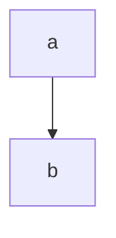
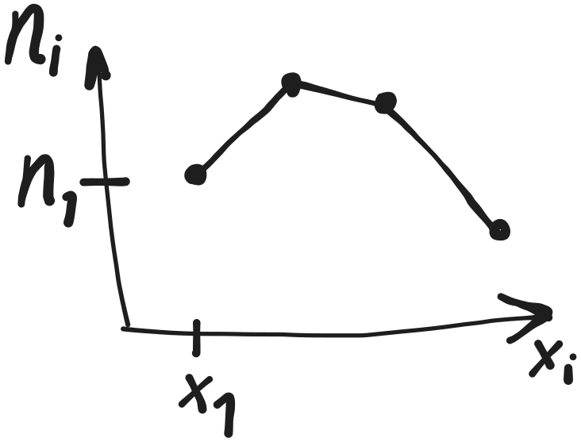
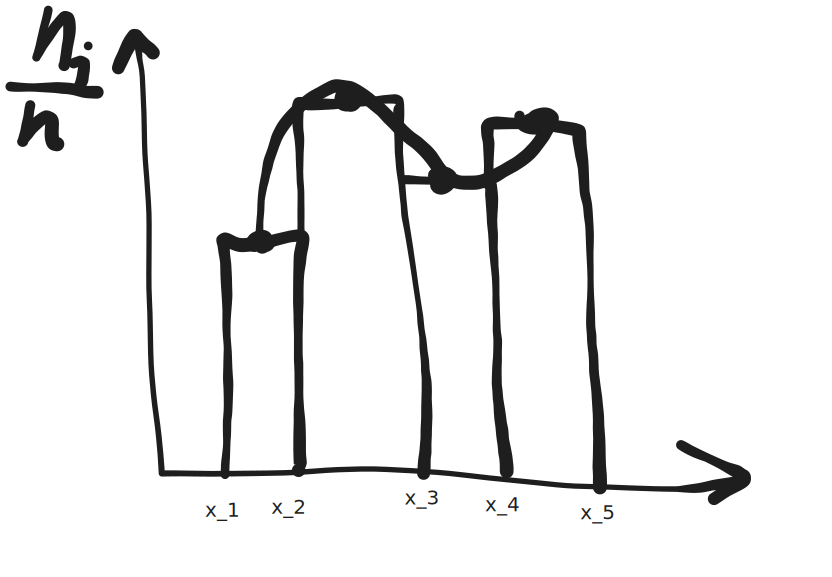

1 большой типовик
---
7 задач  
отдельная тетрадка (~24 листа если без екселя)  
стараемся делать быстрее чем лекции  
в ней писать условия задачи  
7ое желательно делать в экселе  
в последний момент не сдаем - будет лимит заданий/день  
в январе тоже не пересдашь!

5й вариант

автоматы
---

контрольные - типо как по матану  
---
но их сдать надо на хорошие оценки  
дадут 1 раз пересдать

будет тест (говорят бояться ненадо)
---

будем сдавать (в конце 3 курса) госы
---

Калькулятор
---
иметь калькулятор (отдельный, т.к. выч. технику отберут!)  
хотя бы 1 на двоих

книги:
---
- Кремор - теория вероятности, мат. статистики
- Овсянникова - краткий курс теории вероятностей, мат. статистики

ИИ можно, но он тупит
---

Google Class
---
'вместо телеграма'

сдавать туда не надо


Комбинаторика
===

// надо для ИИ

сколькими способами можно выбрать что-либо

будем говорить про производные



### Схема

выборка упорядоченная ли:

- нет, неупорядоченная:
  - сочетания (бином Ньютона).

    допускаются ли повторения:
    - да: $ \tilde {C^k_n} = C^k_{n+k-1} $
    - нет: $ C^k_n = \frac{n!}{k!(n-k)!} $ 

- да, упорядоченная:

  допускаются ли повторения:

  - нет повторений.

    n = k ?
    (n - колво обьектов)  
    (k - колво выборов)

    - да: $ P_n = n! $

    - нет: $ A^k_n = \frac{n!}{(n-k)!} $

  - есть повторения:
    - известно ли число повторений каждого элемента:
      - нет: $ \tilde {A^k_n} = n^k $
      - да: $ \tilde P_{n_1 n_2 ... n_k} = \frac{n!}{n_1! * n_2! * ... * n_k!} $

### перестановки

$ P_n = n! $

$ \tilde{P} = \frac{n!}{n_1! * n_2! * ... * n_k!} $

### сочетание

$ C^k_n = \frac{n!}{k!(n-k)!} $

$ \tilde {C^k_n} = C^k_{n+k-1} $

### размещения

$ A^k_n = \frac{n!}{(n-k)!} $

$ \tilde A^k_n = n^k $

правила:
- суммы: либо это либо то
- произведения: оба условия сразу

Задачи
---

### Задача 1
Сколькими способами можно расставить на полке в ряд 5 __различных__ книг

порядок важен!

все различны - нет повторений

$ n = k $

$ P_n = 5! = 120 $

### Задача 2
Сколько различных слов можно составить из __всех__ букв слова "УДОБРЕНИЯ"
если __порядок следования гласных__ меняться не будет?

УОЕИЯ ->  Ё

повторения теперь можно!

$ \tilde{P} = \frac{9!}{5! 1! 1! 1! 1!} = 9 * 8 * 7 * 6 = 3024 $

### Задача 3

В почтовом отделении продаются открытки 8 типов.

1. сколькими способами можно купить 6 различных открыток?
2. сколькими способами можно купить 6 открыток?


$ C^k_n = \frac{8!}{6!(8-6)!} = 28 $ 

$ \tilde {C^k_n} = C^k_{n+k-1} = C^6_{8+6-1} = \frac{13!}{6!(13-6)!} =
\frac{13!}{6!7!} = 3*2*11 * 11*2*13 = 1716 $

### Задача 4

Студенту необходимо сдать 4 экзамена в течение 7 дней.

Сколькими способами можно составить расписание?

(в 1 день нельзя)

порядок важен!

$ A^k_n = \frac{n!}{(n-k)!} = \frac{7!}{(7-4)!} $

### Задача 5

4 студента сдают экзамен.

Сколькими способами могут быть поставлены положительные оценки (3, 4, 5)

порядок важен (????)

$ \tilde {A^k_n} = 3^4 = 81 $

$ n = 3 \\ k = 4 $

### Задача 6

В 8 классе __лучше всех матешу знают__ пятеро

Вася, Дима, Олег | Катя, с Аней

На олимпиаду - двое из них

(нет иерархии)

порядок неважен

$ C^1_3 \\ C^1_2 $

$ C^1_3 * C^1_2 $

Домашка
---

далбица комбинаторики:

все вот эти формулы

признаки, пример

| Формула                                                         | признаки                                                                                                                                                          | пример                                                                                                                           |
| --------------------------------------------------------------- | ----------------------------------------------------------------------------------------------------------------------------------------------------------------- | -------------------------------------------------------------------------------------------------------------------------------- |
| $ P_n = n! $                                                    | порядок важен, нет повторений, $ n = k $ (результат - уп. мн-во с равной длиной)                                                                                  | Сколькими способами можно расставить на полке в ряд 5 __различных__ книг?                                                        |
| $ \tilde{P} = \frac{n!}{n_1! \cdot n_2! \cdot ... \cdot n_k!} $ | порядок важен, повторения есть, известно кол-во повторений; считаем перестановки __по классам__ (результат - строковый тип?)                                      | Сколько различных слов можно составить из __всех__ букв слова "УДОБРЕНИЯ" если __порядок следования гласных__ меняться не будет? |
| $ C^k_n = \frac{n!}{k!(n-k)!} $                                 | порядок не важен, нет повторений (результат действия - множество)                                                                                                 | В почтовом отделении продаются открытки 8 типов. сколькими способами можно купить 6 __различных__ открыток?                      |
| $ \tilde {C^k_n} = C^k_{n+k-1} $                                | порядок не важен, есть повторения (_мульти_множество?)                                                                                                            | сколькими способами можно купить 6 открыток (необязательно различных)?                                                           |
| $ A^k_n = \frac{n!}{(n-k)!} $                                   | порядок важен, нет повторений, $ n \neq k $ (рассаживаем по местам, выбирая __некоторые из__ объектов; результат - упорядоченное мн-во)                           | Студенту необходимо сдать 4 экзамена в течение 7 дней. Сколькими способами можно составить расписание? (в 1 день нельзя)         |
| $ \tilde A^k_n = n^k $                                          | порядок важен, есть повторения, неизвестно число повторений (то же, что выше, но допустимы повторения исходных обьектов; результат - кортеж, возможно именованый) | 4 студента сдают экзамен/ Cколькими способами могут быть поставлены положительные оценки (3, 4, 5)                               |


# События и действия над ними

S - некоторый фиксированный комплекс условий, при котором проводится
эксперимент

> __Случайным событием__ называется такой исход опыта,  
> который может произойти или __не__ произойти при комплексе S

> Событие называется __достоверным__, если оно всегда происходит  
> при данном комплексе условий S
>
> Обозначение: $\Omega$

> Событие называется __невозможным__, если  
> при данном комплексе условий  
> S оно не может наступить
>
> Обозначение: $\emptyset$

> Событие A называется __частным случаем__ события B  
> (Событие A __влечет__ за собой событие B),  
> Если при наступлении события A  
> наступает событие B
> 
> $A \in B$

> События будут называться __равными__, если
>
> $A \in B$ и $B \in A => A = B$

> __Суммой__ события A и B называется событие C,  
> которое происходить тогда и только тогда,  
> когда происходит хотя бы одно из событий: A или B  
> 
> $C = A + B = A \cup B$
>
> (или А или В, одно из)

> Произведением событий A и B называется событие C,  
> которое происходит тогда и только тогда,  
> когда происходят оба события  
> 
> $C = A \cdot B = A \cap B$
> 
> (и то и другое, оба раза)

> __Разностью__ событий называется событие C,  
> которое происходит тогда и только тогда,  
> когда событие A происходит,  
> а событие B не происходит  
> 
> $C = A - B = A \setminus B$

<!-- Событие A называется противоположным,
если происходит -->

> Событие, которое происходит тогда,  
> когда событие A не происходит называется __противоположным__  
> 
> $\overline A$

> События A и B называются __несовместными__,  
> если появление одного из них  
> исключает появление другого
> 
> $AB = \empty$

> События $A_1, A_2, ..., A_n$ называются __попарными совместными__,  
> если любые 2 из них несовместны  
> 
> $A_iA_j = \empty$ ($i \neq j$)

> $A_1, A_2, ..., A_n$ образуют __полную группу__, если в результате  
> каждого эксперимента происходит хотя бы 1 из них  
> 
> $A_1 + A_2 + ... + A_n = \Omega$

### Пример

В урне 8 шаров

Они пронумерованы 1..8

1 случайный шар

- A - шар номер 6
- B - появление шара с четным номером
- C - с нечетным
- D - появление шара с номером, кратным 3
- H - шар с номером 1..8
- K - шар с номером 9

$H = \Omega$ (Достоверное событие)

$K = \empty$

$A \in B$

$AC = \empty$

$BD=A$

$B = \overline C$

$A \in D$

$D \setminus A$ - шар номер 3

$D \setminus A \in C$

## Свойства операций над событиями

1. $A + B = B + A$

   $AB = BA$

2. $(A+B)C = AC+BC$

3. $(AB)C = A(BC)$

4. $A+A=A$
   
   $AA = A$

5. $A + \Omega = \Omega$

   $A \Omega = A$

6. $A + \overline A = \Omega$

   $A \overline A = \empty$

7. $\overline \empty = \Omega$

   $\overline \Omega = \empty$

   $\overline {\overline A} = A$

8. $A - B = A \cdot \overline B$

9. $\overline{A + B} = \overline A \cdot \overline B$

## Вероятность случайного события

### Аксиоматическое определение вероятности

> __Пространством элементарных событий__ будем называть  
> произвольное множество, элементы которого называются  
> __элементарными событиями__ (__элементарными исходами__)  
> 
> На практике: множество всех несовместных исходов эксперимента
> 
> $ \Omega = \{\omega\} $

F - семейство подмножеств $ \Omega $

Элементы F будут называться случайными событиями

Множество F называется __алгеброй множеств__,
если выполняются следующие условия:

1. F содержит в себе $\Omega$ (достоверные события) и $\empty$
2. Если $A \in F$ и $B \in F$, то:
   - $A + B \in F$
   - $AB \in F$
   - $A \setminus B \in F$

$A \in F$ -> $A = \Omega$

<!-- $ F \sub  $ -->

### Аксиомы алгебры множеств

1. множество F является _алгеброй множеств_

2. каждому множеству (случайному событию) A из множества F  
   ставится в соответствие неотрицательное число P(A),  
   которое называется __вероятностью__ события A  

3. вероятность полной группы элементарных событий равна 1

   $P(\Omega)=1$

4. вероятность суммы событий

   $P(\sum\limits^n_{i=1}A_i) = \sum\limits^n_{i=1}P(A_i)$

   при условии что

   $ A_i \in F \forall i $

   $ A_iA_j = \empty $ ($ i \neq j$)

5. $\lim\limits_{n->\infty} P(A_n) = 0$

#### Следствия

1. $P(A) + P(\overline A) = 1$

2. $P(\empty) = 0$

3. $0 \leq P(A) \leq 1$

4. $A \in B$ -> $P(A) \leq P(B)$

### Классическое определение вероятности

> $A_1, ..., A_n$ - __равновозможны__, при комплексе условий S,
> если каждое из них имеет равные шансы наступить

> #### Основная формула вероятностей
>
> $P(A) = m/n$
>
> m - желаемые __элементарные__ исходы
>
> n - общее число элементарных исходов ($ |\Omega| $)

1. $P(A) \geq 0$

2. $P(\Omega) = 1$

3. $P(\empty) = 0$

4. Если A и B несовместны, то

   $P(A+B) = P(A) + P(B)$

### Пример

В урне 4 красных, 3 желтых и 2 зеленых шара.

Вытаскивают 2 шара.

Найти вероятность:
- a\) оба шара красного цвета - A
- б\) 1 - кр, 2 - зел - B
- в\) оба шара одинакового цвета - C

$$\tilde {C^k_n} = C^k_{n+k-1}$$

$$\tilde {C^2_9} = C^2_{9+2-1}$$

$$C^2_{10} = \frac{10!}{2!(10-2)!}$$

$$C^2_{10} = 10 * 9 / 2 = 45$$

$$n = 45$$

$$C^2_4$$

6/45

## Геометрическая вероятность

площади фигур:

$$g \in G$$

$$P(A) = \frac{мера \ g}{мера \ G}$$

график функции

$$\int^a_b f(x)$$


## Статистическое определение вероятности

Пусть в некотором эксперименте  
одно и то же действие (событие) в тех же условиях  
проведено $n_1$ раз.

При этом некоторое событие A произошло
$m_1$ раз.

$$\frac{m_1}{n_1}$$

\- относительная частота события A

$$\frac{m_1}{n_1} \approx \frac{m_2}{n_2} \approx \frac{m_3}{n_3}$$

$$P(A) \approx \frac{m}{n}$$

- m - желаемое
- n - общее число исходов

## Теорема сложения и умножения вероятностей

### теорема умножения

_И то и другое событие наступили_

_оба, одновременно_

Надо чтоб независимые были!

$$P(A \cdot B) = P(A) \cdot P(B)$$

### теорема сложения

_или-или, хотя бы одно из_

$$P(A + B) = P(A) + P(B) - P(AB)$$

\- для совместных событий

$$P(A + B) = P(A) + P(B)$$

\- для несовместных

### пример

В группе 25 студентов

- 15 из них спик иглиш
- 10 парле франсе
- 5 - оба

вероятность что выбранный из них знает ХОТЯ БЫ 1 язык

- A - англиш
- B - франсе
- AB - оба

P(A) = 15 / 25 = 3 / 5 = 0.6

P(B) = 10 / 25 = 2 / 5 = 0.4

P(AB) = 5 / 25 = 1 / 5 = 0.2

P(A + B) = 0.6 + 0.4 - 0.2 = 0.8

> Вероятность наступления события A при условии, что  
> событие B произошло, называется __условной вероятностью__.

$$P(A/B) = \frac{P(AB)}{P(B)}$$

события зависимы

переложили шар из 1 урны в 2

### пример

бросаются 2 игральные кости.

вероятность что на обоих одинаковое число

__при условии__ что сумма меньше пяти

$$\Omega = {(1; 1); (1; 2); (1; 3); ...; (6; 6)}$$

- A - равное число очков
- B - сумма <5

A = {(1; 1); (2; 2); (3; 3); (4; 4); (5; 5); (6; 6)}

B = {(1; 1); (1; 2); (2; 1); (2; 2); (1; 3); (3; 1)}

AB = {(1; 1); (2; 2)}

P(A) = 6 / 36

P(B) = 6 / 36

P(AB) = 2 / 36 = 1 / 18

$$P(A/B) = \frac{2 / 36}{6/36} = 1/3$$

> События A и B называются __независимыми__,  
> если появление одного из них не влияет  
> на вероятность появления другого.  
> 
> P(A/B) = P(A)
> 
> P(B/A) = P(B)

Независимые в СОВОКупности события (между друг другом)

<!-- В общем виде  -->

### пример

В урне 4 белых и 2 черных шара.

Из урны 3 раза извлекают по 1 шару

Найти вероятность что все изъятые шары белые.

- а) шары извлекаются и не возвращаются
- б) извлекаются и возвращаются

#### а)

$A_i$ - i-й шар белый (1, 2, 3)

A - все 3 шара белые

$$A = A_1 A_2 A_3$$

$$P(A) = P(A_1 A_2 A_3) = P(A_1) \cdot P(A_2 / A_1) \cdot P(A_3 / A_1 A_2)$$

#### б)

$$P(A) = P(A_1 A_2 A_3) = P(A_1) \cdot P(A_2) \cdot P(A_3) = (4/6)^3 = 8/27$$

## Формула полной вероятности

Пусть вероятность события $A$ в каждом испытании - $p$

Производим n независимых испытаний

тогда вероятность A наступит ровно k раз:

### Формула Бернулли

$P_n(k) = C^k_n p^k q^{n - k}$

q = 1 - p  // обратная вероятность

$P_n(n) = p^n$

$P_n(0) = q^n$

### Пример

в тесте 5 вопросов

4 варианта ответа

вероятность что на все 5 вопросов ответим верно

n = 5

p = 1 / 4

q = 1 - (1/4) = 3/4

P_5(5) = (1/4)^5 = 1 / 1024

б) ответим на ровно 2 вопроса

n = 5

k = 2

p = 1 / 4

q = 3 / 4

$$P_5(2) = C^2_5 p^2 q^3 = \frac{5!}{2!3!} \cdot 1/16 \cdot 27/64$$

270/1024

## Асимптотические формулы

### Формула Пуассона

$$P_n(k) \approx P_k(\alpha) = \frac { \alpha^k e^{-\alpha} } { k! }$$

$$\alpha = np \leq 10$$

при малых p и больших n

### Локальная формула Муавра-Лапласа

$$P_n(k) = \frac{1}{ \sqrt { npq } } \phi(x)$$

$$\phi(x) = \frac { 1 } { \sqrt { 2a } } e^{ x^2/2 }$$

(функция Гаусса)

$$x = \frac { k - np } { \sqrt{ npq } }$$

### Интегральная теорема Муавра-Лапласа

$$P(k_1, k_2) = \Phi(x'') - \Phi(x')$$

$$\Phi(x) = \frac { 1 } { \sqrt { 2 \pi } } \int^x_0 e^{ \frac{-z^2}{2} } dz$$

$$x' = \frac{k_1 - np}{ \sqrt{npq} }$$

$$x'' = \frac{k_2 - np}{ \sqrt{npq} }$$

## Полная вероятность

Пусть событие A может произойти в результате
одного из событий H_1, H_2, ..., H_n,
которые образуют полную группу событий.

Тогда вероятность события A:

$$P(A) = \sum \limits _i ^n P(H_i) P(A | H_i)$$

### Пример

Две урны:
1) 5 белых шаров, 10 черных
2) 10 белых шаров, 5 черных

из 1 -> 2

из 2 -> в руки

шанс что шар белый?

- A - достали белый шар из 2 урны
- $H_1$ - из 1 урны достали белый шар
- $H_2$ - из 1 урны достали черный шар
- $P(A/H_1) = 11/16$
- $P(A/H_2) = 10/16$

> Условные вероятности взяли чисто по логике!!!

$$P(H_1) = 5 / 15 = 1 / 3$$
$$P(H_2) = 10 / 15 = 2 / 3$$

$$P(A) = P(H_1) P(A | H_1) + P(H_2) P(A | H_2)$$

$$= 1/3 \cdot 11/16 + 2/3 \cdot 10/16 = 155 / 240 = 31 / 48$$

## Формула Байеса

Определить, как изменилась вероятрность гипотез  
в связи с тем, что событие A наступило.

Переоценим вероятность гипотезы $H_j$  
после того, как произошло событие A

$$P(H_j / A) = \frac { P(H_j) \cdot P(A/H_j) } { P(A) }$$

Та же самая задача.

1) 5 белых, 10 черных
2) 10 белых, 5 черных

1 -> 2

2 -> в руки

Пусть из 2 урны достали белый шар

<!-- #### Найти: -->

A - из 2 достали белый шар

$H_1$ - вероятность что из 1 урны переложили белый шар

---

$$P(H_1 / A) = \frac { P(H_1) \cdot P(A/H_1) } { P(A) }$$
$$= \frac { 1/3 \cdot 11/16 } { 31/48 } = 11/31$$

- Простое событие: m/n

- Составное:

  разбираем на элементарные события; (+), (*)

- Полная группа событий, зависимые:
  условная вероятность; формула полной вероятности

- уточнить как изменится если что то произойдет: формула Байеса

---

- Правильно составлять события
- зависимые ли
- совместные ли

Одномерные случайные величины
===

> __Случайная__ - величина, которая в результате испытания
> примет значение, наперед неизвестное и
> зависящее от причин, все из которых заранее
> не могут быть учтены.

Пример: 
- оценка на экзамене
- зарплата

> __Дискрентная__ - случайная величина, которая
> принимает набор отдельных, изолированных значений

Конечное счетное множество,
бесконечное число

> __Непрерывная__ - случайная величина, набор значений которой
> целиком заполняет некоторый интервал

различные функции, интрегалы...

## Примеры дискретных случайных величин

В результате испытания
дискретная случайная величина X может принять:

- $x_1$
- $x_2$
- $...$
- $x_n$

$p_i$ - вероятность наступления $x_i$

X|$x_1$|$x_2$|...|$x_n$
-|-----|-----|---|-----
P|$p_1$|$p_2$|...|$p_n$

1. Распределение Бернулли

   (только при 0/1)

   X | 0 | 1
   --|---|---
   P | q | p

   q = 1 - p

2. Равновероятное распределение случайных величин

   X - число очков при бросании кости

   X: 1 2 3 4 5 6
   P: 1/6 1/6 1/6 1/6 1/6 1/6 

3. Геометрическое

   (в геометрической прогрессии)

   P(A) = 0.7 - вероятность что стрелок попал

   P(\overline A) = 0.3

   стреляем до первого попадания

   Составить закон распределения числа выстрелов

| X   | 1   | 2         | 3           | 4           | ... | k               |
| :-- | --- | --------- | ----------- | ----------- | --- | --------------- |
| p   | 0.7 | 0.3 * 0.7 | 0.3^2 * 0.7 | 0.3^3 * 0.7 | ... | q^{k-1} \cdot p |

### Гипергеометрическое распределение

$$P(x=k) = \frac{ C ^k _M \cdot C ^k _{N-M} }{ C ^n _N }$$

- N - кол-во объектов
- M - кол-во объектов, обладающих нужными свойствами
- n - сколько объектов извлекаем
- k - сколько из n объектов нам нужно

### Биноминальное распределение

(с биномом Ньютона)

Вероятность попадания: 0.7

стреляем 4 раза

Составить закон распределения числа попаданий в цель

| X   | 0     | 1                     | 2                       | 3                     |
| :-- | :---- | :-------------------- | :---------------------- | :-------------------- |
| P   | 0.3^4 | 0.3^3 * 0.7 * C ^1 _4 | 0.3^2 * 0.7^2 * C ^2 _4 | 0.3 * 0.7^3 * C ^3 _4 |

```math
P_n(k) = C ^k _n p^k q^{n-k}
```

### Распределение Пуассона

без примера

но через егошнюю формулу

## Арифметические операции двух случайных величин

### Сумма

| X   | x_1     | x_2     | x_3     | …   | x_{n_x} |
| :-- | :------ | :------ | :------ | :-- | :------ |
| P   | p_{x_1} | p_{x_2} | p_{x_3} | …   | p_{x_n} |

| Y   | y_1     | y_2     | y_3     | …   | y_{n_y} |
| :-- | :------ | :------ | :------ | :-- | :------ |
| P   | p_{y_1} | p_{y_2} | p_{y_3} | …   | p_{y_n} |

| X+Y | X_1 + y_1 | X_1 + y_1 | …   | X_1 + y_{n_y} | x_2 + y_1 | …   | x_{n_x} + y_{n_y} |
| :-- | :-------- | :-------- | :-- | :------------ | :-------- | :-- | :---------------- |
| P   | P_{11}    | P_{12}    | …   |               |           |     |                   |


$$p = p_{n_x} \cdot p_{n_y}$$

### Произведение

меняется знак на умножение

## Числовые характеристики дискретной случайной величины

### Математическое ожидание

Напр. самая частая оценка на экзамене

в среднем

$$M(x)$$

или

$$E(x)$$

$$M(x) = \sum x_i p_i$$

#### Пример

X - случайная величина распределения оценок

| X   | 2   | 3   | 4   | 5   |
| :-- | :-- | :-- | :-- | :-- |
| P   | 0.2 | 0.4 | 0.3 | 0.1 |

```math
M(X) = 2 * 0.2 + 3 * 0.4 + 4 * 0.3 + 5 * 0.1 = 3.3
```

Средняя оценка - тройка

#### Основные свойства

1. $M(C) = C$

2. $M(\alpha \cdot X) = \alpha M(x)$

3. $M(X + Y) = M(X) + M(Y)$

4. Если события независимы:

   $M(X \cdot Y) = M(X) \cdot M(Y)$

### Дисперсия случайной величины

Отклонение от математического ожидания

$D(x)$ или $Var(x)$

$$D(X) = M( X - M(x) )^2$$

$$D(X) = \sum (x_i - M(x_i))^2 p_i = \sum x_i ^2 - M(x)^2$$

$$i = \overline{ 1,n }$$

| X   | 2   | 3   | 4   | 5   |
| :-- | :-- | :-- | :-- | :-- |
| P   | 0.2 | 0.4 | 0.3 | 0.1 |

$$D(X) = (2^2 * 0.2 + 3^2 * 0.4 + 4^2 * 0.3 + 5^2 * 0.1) - (3.3)^2$$

#### Основные свойства

1. $D(C) = 0$

2. $D(\alpha \cdot X) = \alpha^2 \cdot D(x)$

3. $D(\alpha + X) = D(x)$

4. $D(X-Y) = D(X) + D(Y)$ [именно плюс!]
   
5. $D(X+Y) = D(X) + D(Y)$

### Среднеквадратичное отклонение

$$\sigma_x = \sqrt{D(x)}$$

---

Для проверки:

$$\sum p_i = 1$$

## Непрерывные случайные величины

X - случайная величина

__Функция распределения__ вероятностей случайной непрерывной величины
(она же __интрегальная__):

$$F_X(x_0) = P(x < x_0)$$

### Основные свойства

1. $0 \leq F(x) \leq 1$

2. $F(x)$ - неубывающая

   $$F(x_2) \geq F(x_1)$$

   $$(x_2 \geq x_1)$$

   - $[a; b)$:
   
     $$P(a \leq x < b) = F(b) - F(a)$$

3. Если $F(x) \rightarrow 0$, то $x \rightarrow -\infty$

   Если $F(x) \rightarrow 1$, то $x \rightarrow +\infty$

   Если $x \in (a; b)$, то $F(x) = 0$

   Если $x < a$, то $F(x) = 0$

   Если $x > b$, то $F(x) = 1$

> X - непрерывная случайная величина,
> если ее ф-ция распределения кусочно-дифференцируема.

__Плотность распределения__:

$$f(x) = F'(x)$$

### Теорема

$$P(a \leq x \leq b) = \int _a ^b f(x) dx = F(b) - F(a) =$$

$$=\int _a ^b F'(x) dx$$

Найти функцию распределения по плотности:

$$F(x_0) = \int _{-\infty} ^{x_0} f(x) d(x)$$

#### Свойства дифференциальной функции распределения

1. $f(x) \geq 0$
2. $\int _{-\infty} ^{+\infty} f(x) dx = P(-\infty < x < +\infty) = 1$

### Числовые характеристики непрерывных случайных величин

1. математическое ожидание

   $$M[x] = \int _{ -\infty } ^{ \infty } x f(x) dx$$

   $$M[x] = \int _{ a } ^{ b } x f(x) dx$$

2. дисперсия

   ```math
   D[x] = \int _{ -\infty } ^{ \infty } (x - M[x])^2 f(x) dx =
   \int _{ -\infty } ^{ \infty } (x^2 f(x) - (M[x])^2)dx
   ```

3. среднеквадратичное отклонение
   
   $$\sigma(x) = \sqrt{D[x]}$$

Свойства такие же как и для

---

```math
f(x) = \begin{cases}
0, x \leqslant -1 \\
ax^4, -1 < x \leqslant 1 \\
0, x > 1
\end{cases}
```

$$\int _{ -\infty } ^{ \infty } f(x) dx = 1$$

$$\int _{ -1 } ^{ 1 } ax^4 dx = 1$$

$$\frac{ ax^5 }{ 5 } | _{-1} ^1 = 1$$

$$a(1/5 - (-1/5)) = 2/5 a = 1$$

$$a = 5 / 2 = 2.5$$

---

```math
f(x) = \begin{cases}
0, x \leqslant -1 \\
2.5x^4, -1 < x \leqslant 1 \\
0, x > 1
\end{cases}
```

$$M[x] = \int _{ -\infty } ^{ \infty } x f(x) dx=$$

$$=\int _{ -\infty } ^{ -1 } x 0 dx + \int _{ -1 } ^{ 1 } 5/2 x^5 dx + \int _{ 1 } ^{ +\infty } x 0 dx=$$

$$5/12 - 5/12$$

---

$$D[x] = M[x^2] - (M[x])^2$$

```math
M[x^2] = \int _{ -1 } ^{ 1 } x^2 \frac{ 5 }{ 2 } x^4 dx
= \left. \frac{ 5x^7 }{ 2 \cdot 7 } \right| ^1 _{-1} = 5/7
```

$$\sigma[x] = \sqrt{5/7}$$

### Вероятность попадания случайной величины в интервал

[-0.5; 0.5]

$$P(a \leqslant x \leqslant b) = \int _{ a } ^{ b } f(x) dx$$

$$P(a \leqslant x \leqslant b) = \int _{ -0.5 } ^{ 0.5 } f(x) dx$$

$$P(a \leqslant x \leqslant b) = 1/32$$

### найти функцию распределения

$$F(x_n) = \int _{ -\infty } ^{ x_0 } f(x) dx$$

```math
F(x_0) = \begin{cases}
0, x \leqslant -1 \\
\int _{-1} ^{x_0} 2.5x^4 dx, -1 < x \leqslant 1 \\
0, x > 1
\end{cases}
```

```math
F(x_0) = \begin{cases}
0, x \leqslant -1 \\
\frac{ x_0 ^5 + 1 }{ 2 }, -1 < x \leqslant 1 \\
0, x > 1
\end{cases}
```


## Другие характеристики случайных величин

1. Мода

   $$Мода[x] = Mo[x] = \argmax _x f_x(x)$$

   Если их две, то распределение называется __бимодальным__

2. Медиана

   Это значение случайной величины для которого вероятность попасть
   слева или справа от него одинакова

   ```math
   \int _{ -\infty } ^{ Me X } f(x) dx = \int _{ Me X } ^{ -\infty } f(x) dx
   = 0.5
   ```

   $$F_X(Me X) = 0.5$$

3. начальный момент распределения k-го порядка

   $$V_k = M[x]X^k \ (k = 1, 2, ...)$$

4. центральный момент k-го порядка

   $$\mu _k = M(X - MX)^k \ (k = 1, 2, ...)$$

   центральный момент 2го порядка - это дисперсия

   Для симметричных распределений центральный момент нечетного порядка
   равен нулю

   $$\mu _2 = v ^2 _0 - v_1 ^2$$

5. асимметрия 

   нормированный центральный момент 3го порядка

   $$As = \frac{ \mu_3 }{ \sigma ^3 } = \frac{ M(X - MX)^3 }{ \sigma ^3 }$$

6. эксцесс распределения

   это нормированный центральный момент 4-го порядка

   $$K = \frac{ \mu_4 }{ \sigma ^4 } = \frac{ M(X - MX)^4 }{ \sigma ^4 }$$
   
   служит для сравнения любого распределения с нормальным

   Для нормального распределения:

   $$K = 3$$

   если >3, то пик распределения - около M[x] (острый)

   если <3, то гладкий

7. квантиль распределения

   $$x_q - q \cdot 100 \%$$

   вероятность попадания случайной величины слева от x_q

   $$P(X < x_q) = q$$

   медиана - это 50%-ный квантиль

   частные случаи:
   - квартилии
   - децилии

   $$\int _{-\infty} ^{x_q} f(x) dx = q$$

   $$F_x (x_q) = q$$

## Основные распределения непрерывных случайных величин

### 1. Равномерно распределенная случайная величина

```math
f(x) = \begin{cases}
0, x \notin (a; b) \\
C, x \in (a; b)
\end{cases}
```

```math
\int _a ^b f(x) dx = 1
```

```math
\int _a ^b C dx = 1
```

```math
Cx | _a ^b = C(b - a) = 1
```

```math
C = \frac{ 1 }{ b-a }
```


---

```math
F(x) = \begin{cases}
0, & x < a \\
\frac{ x - a }{ b - a }, & a \leqslant x \leqslant b \ (x \in [a; b]) \\
1, & x > b
\end{cases}
```


```math
M[x] = \frac{ a + b }{ 2 }
```

```math
D[x] = \frac{ (b - a)^2 }{ 12 }
```

### 2. Нормальное распределения

Случайная величина X называется нормально распределенной с параметрами
$m$ и $\sigma$

если плотность распределения имеет вид:

```math
f(x) = \frac{ 1 }{ \sigma \sqrt{2 \pi} } e ^{\frac{ -(x-m)^2 }{ 2 \sigma ^2 }}
```

```math
M[x] = m
```

$$D[x] = \sigma ^2$$

$$\sigma[x] = \sigma$$


x = m; f(x) = f(m)

$$f(m) = \frac{ 1 }{ \sigma \sqrt{2 \pi} }$$

Точки перегиба:

$$(m-\sigma, \frac{ 1 }{ \sigma \sqrt{2 \pi} })$$

$$(m+\sigma, \frac{ 1 }{ \sigma \sqrt{2 \pi} })$$


#### Нормированное нормальное распределение

> $$m = 0$$
> 
> $$\sigma = 1$$
> 
> $$f(x) = \frac{ 1 }{ \sqrt{2 \pi} } e ^{-\frac{ x^2 }{ 2 }}$$


```math
F(x_0) = \frac{ 1 }{ \sqrt{2 \pi} }
\int _{ -\infty } ^{ x_0 } e ^{-\frac{ x^2 }{ 2 }} dx
```

(функция Лапласа)

нечетная

$$\Phi(-x) = -\Phi(x)$$

есть готовая таблица

Вероятность того что нормированная нормальная величина
принимает значение из интервала $(0, x_0), x_0 >0$

$$P(0 \leqslant x \leqslant x_0) = \int _{ 0 } ^{ x_0 } f(x) dx = \Phi(x_0)$$

- табличное значение

$$F(x) = 0.5 + \Phi(x)$$

потому что f(x) симметрична

#### Вероятность попадания в заданный интервал нормальной случайной величины

пусть X - нормально распределенная случайная величина

с параметрами m и \sigma

тогда

```math
P(A < X < B) = \int _{ A } ^{ B } f(x) dx
= \frac{ 1 }{ \sigma \sqrt{2\pi} }
  \int _{ A } ^{ B } e^{\frac{ -(x-m)^2 }{ 2\sigma^2 }} dx
```

сделаем замену по переменной z

$$z = \frac{ x-m }{ \sigma }$$

$$\boxed{\Phi(\frac{ B-m }{ \sigma }) - \Phi(\frac{ A-m }{ \sigma })}$$

#### Пример

распределение нормальное

$$m = 48$$

$$\sigma = 2$$

определить процент спроса на 50 размер при условии разброса от 49 до 51

$$(49,51)$$

$$P(49 < X < 51) = \Phi(\frac{ 51-48 }{ 2 }) - \Phi(\frac{ 49-48 }{ 2 })$$

$$P(49 < X < 51) = \Phi(\frac{ 3 }{ 2 }) - \Phi(\frac{ 1 }{ 2 })$$

$$P(49 < X < 51) = 0.4332 - 0.1915 = 0.2417$$

#### Вычисление вероятности заданного отклонения

X - случайная величина нормального распределения

даны m, \sigma

ищем

$$P(|x-m| < \alpha) = P(m - \alpha \leqslant x \leqslant m + \alpha)=$$

```math
=\Phi(\frac{ m+\alpha-m }{ \sigma }) - \Phi(\frac{ m-\alpha-m }{ \sigma })=
```

$$= 2\Phi(\frac{ \alpha }{ \sigma })$$

#### Правило трех сигм:

$$\delta = \sigma t$$

$$P(|x-m| < \sigma t) = 2\Phi(t)$$

t = 3

$$P(|x-m| < 3\sigma) = 2\Phi(3) = 2 \cdot 0.49865 = 0.9973$$

$$P(|x-m| > 3\sigma) = 1 - 0.9973 = 0.0027$$

> если распределение неизвестно,
> но правило трех сигм выполняется,
> то считается что распределение нормальное.
> 
> Иначе - нет

##### Пример

шутка

### распределение $\chi^2$

X_1, ..., X_n - ннсв

$$\chi^2 = \sum _{ i=1 } ^{ n } x_i ^2 \rightarrow$$

распределена по закону $\chi^2$ с $n$ степенями свободы

Если $x_n = x_1 + ... + x_{n-1}$, то число степеней свободы - $n-1$

```math
f_{\chi}(x) =
\begin{cases}
0, & x \leqslant 0  \\
\frac{ 1/2^{n}{2} } \Gamma(n/2), & x > 0  \\
%   \\
\end{cases}
```

где

$$\Gamma(x) = \int _{ 0 } ^{ +\infty } t^{x-1} e^{-t} dt$$


### распределение Стьюдента

Z - ннсв

$\chi^2(k)$ - независимая от $Z$ фция
которая распределена по $\chi^2$ с $k$ степенями свободы

тогда случайная величина
$T = \frac{ Z }{ \sqrt{\frac{ \chi^2(k) }{ k }} } = t(k)$
- распределение Стьюдента с $k$ степенями свободы

```math
f_{t(k)}(x) = \frac{ \Gamma(k/2) }{ \sqrt{\pi(k-1)} \cdot \Gamma(\frac{ k-1 }{ 2 }) } (1+ \frac{ x^2 }{ k-1 })^{-\frac{ 1 }{ 2 }k}, -\infty < x < +\infty
```

### распределение Фишера

чтобы такое существовало, надо 2 величины

$$\chi _1 ^2 (k_1)$$

$$\chi _2 ^2 (k_2)$$

$$F(k_1, k_2) = \frac{ \chi _1 ^2 (k_1) / k_1 }{ \chi _2 ^2 (k_2) / k_2 }$$

k - __число степеней свободы__

__знаментатель__ k_2

# Многомерные случайные величины

> Дз конспект: дискретные и непрерывные, M[X], D[X], \sigma[X]
>
> непрерывные: только двумерные берем

многомерные это там где не одно число а целый вектор

$$X=(X_1, X_2)$$

тогда для него:

$$M[X]=(M[X_1], M[X_2])$$

а дисперсия определяется ковариантной матрицей:

$$cov(X) = M[(X - M[X])(X - M[X])^T] = M[X_1 X_2] - M[X_1] M[X_2]$$

в случае двухмерной величины:

```math
cov(X) = \left[ \begin{matrix}
D[X_1] & M[X_1 X_2] - M[X_1] M[X_2]  \\
M[X_2 X_1] - M[X_2] M[X_1] & D[X_2]
\end{matrix} \right ]
```

она симметричка кстати

а тогда

$$\sigma[X] = \sqrt{cov(X)}$$

так чтоли?

```math
\sigma[X] = \left[ \begin{matrix}
\sigma[X_1] & \sqrt{M[X_1 X_2] - M[X_1] M[X_2]}  \\
\sqrt{M[X_2 X_1] - M[X_2] M[X_1]} & \sigma[X_2]
\end{matrix} \right ]
```

# Элементы математической статистики

## Задачи

- определение способов сбора и группировки статистической информации
- разработка методов анализа статистических данных
  - их интерпретация
  - и формирование выводов

Выборочная СОВОКупность (выборка) - случайно отобранных объектов
- эмпирический аналог генеральной

Генеральная СОВОКупность - объектов из которых производится выборка
- все мыслимые значения ...

Объем СОВКа - число объектов в нем

опираются на закон больших чисел

выборка "объективно" (репрезентативно)
оценивает генеральный СОВОК если каждое значение выбрано случайно

и это не зависит от объема генерального СОВКа

Вариационный ряд это ранжированный в порядке возрастания или убывания ряд
с соответствующими весами (частотами, частностями)

Пусть из генерального СОВКа выбрано значение

$x_i$ наблюдалось $n_i$ раз

объем выборки:

$$n = \sum _{ k } ^{ i=1 } n_i$$

$n_i$ - частоты

относительная частота:

$$\omega = \frac{ n_i }{ n }$$

размах варьирования:

$$R = x_{max} - x_{min}$$

Статистическое распределение выборки это таблица,
задающая перечень вариантов и соответствующих им частот

|       |       |       |       |
| ----- | ----- | ----- | ----- |
| $x_i$ | $x_1$ | $x_2$ | $x_3$ |
| $n_i$ | $n_1$ | $n_2$ | $n_3$ |

Статистическое распределение относительных частот

|             |             |             |             |
| ----------- | ----------- | ----------- | ----------- |
| $x_i$       | $x_1$       | $x_2$       | $x_3$       |
| $\omega _i$ | $\omega _1$ | $\omega _2$ | $\omega _3$ |

Число интревалов при группировке находится по формуле Серджеса

$$k = 1 + 3.322 \lg n$$

величина интервала:

$$h = \frac{ x_{max} - x_{min} }{ k }$$

начало интервала:

$$x=x_{min} - \frac{ 1 }{ 2 } h$$

Полигон частот - ломаная линия, отрезки которой соединяют точки
$(x_i, n_i)$



Полигон относительных частот: $(x_i, \omega _i)$

$$(x_i ^*, \omega _i)$$

$$x_i ^* = \frac{ x_{i+1} - x_i }{ 2 }$$

Гистограмма частот - ступенчатая фигура,
состоит из прямогольников,
основания которых - частичные интервалы,
а высоты - плотность частот


