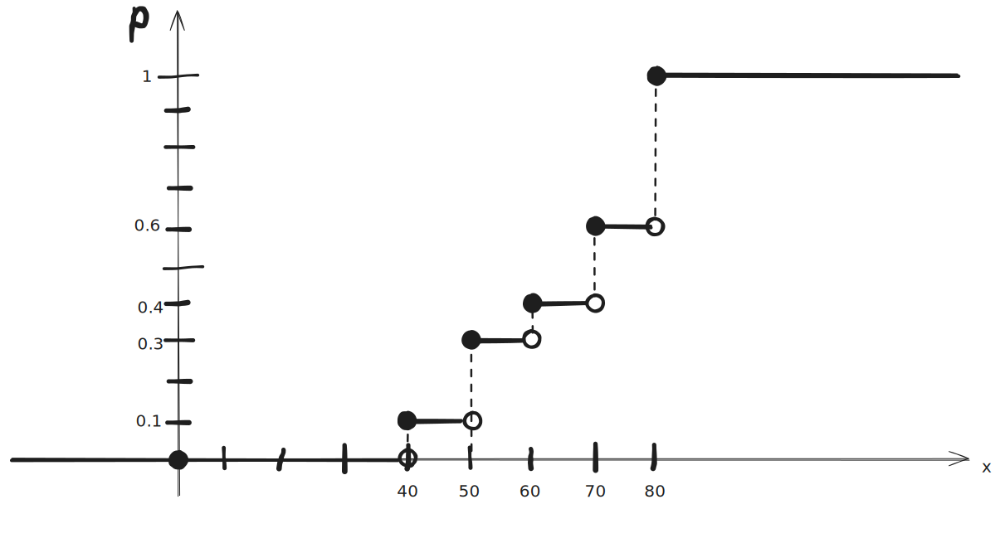
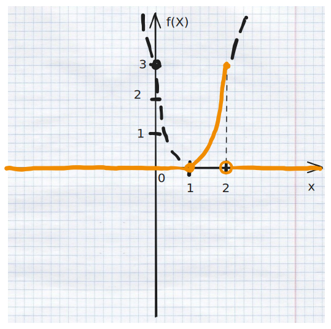
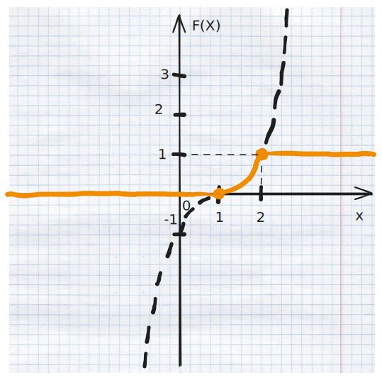

> Вариант 5

Задача 1
===

В новогодней лотерее 25 билетов, 10 из которых выигрывают.

Гражданин купил 4 билета.

Какова вероятность того, что
1) три будут выигрышными;
2) по крайней мере один из купленных билетов выигрышный?

Общее число исходов: сколькими способами можно купить 4 из 25 билетов?
```math
n = C ^4 _{25} =
\frac{25!}{4! (25-4)!} =
\frac{25!}{4 \cdot 3 \cdot 2 \cdot (21)!} =
\frac{25 \cdot 24 \cdot 23 \cdot 22}{4!} =
25 \cdot 23 \cdot 22 =
50 \cdot 23 \cdot 11 =
550 \cdot 23 =
12650
```

(билеты "расходуются", число уменьшается)

(если быть точнее, это условная вероятность)

1
---

4 - 3 = 1

<!-- Желаемое число исходов:
сколькими способами можно купить один из оставшихся 22 билетов?

(при условии что 3 билета уже определенно выигрышные) -->

<!-- ```math
m = C ^1 _{22} =
\frac{22!}{1!(22-1)!}
``` -->

Желаемое число исходов:
сколькими способами можно купить:
- 3 билета из 10 выигрышных `И`
- 1 билет из 15 не выигрышных?

Закон умножения!

```math
m = C ^3 _{10} \cdot C ^1 _{15} =
\frac{ 10! }{ 3! (10-3)! } \cdot 15 =
\frac{ 10 \cdot 9 \cdot 8 }{ 3! } \cdot 15 =
\frac{ 5 \cdot 3 \cdot 8 }{ 1 } \cdot 15 =
1800
```

$$P(A) = m / n = 1800 / 12650 = 36 / 253 \approx 0.1422924901$$

> $$P(A) \approx 0.1422924901$$

2
---

Пусть событие $\overline A$ - ни один из билетов не выигрышный.

<!--
Вероятность:
$$P(\overline A) = m / n$$
-->

<!-- где -->

$25 - 10 = 15$ не выигрышных билетов

```math
% m = C ^{15} _{25} \times C ^{14} _{24} \times C ^{13} _{23} \times C ^{12} _{22}
P(\overline A) = \frac{15}{25} \times \frac{14}{24} \times \frac{13}{23} \times \frac{12}{22}
```

```math
P(\overline A) = \frac{3}{5} \times \frac{7}{12} \times \frac{13}{23} \times \frac{6}{11}
```

```math
P(\overline A) = \frac{3}{5} \times \frac{7}{2} \times \frac{13}{23} \times \frac{1}{11}
```

```math
P(\overline A) = \frac{273}{10 \cdot 23 \cdot 11} = \frac{273}{2530}
```

$$P(\overline A) \approx 0.1079051383$$

<!--
```math
C ^{15} _{25} =
\frac{25!}{15!(25-15)!} =
\frac{25!}{15!(10)!} =
```
-->

тогда:

```math
P(A) = 1 - P(\overline A) \approx 0.8920948617 \approx 89.21 \%
```

---

Другой способ, основная формула вероятности:

$$P = \frac{ m }{ n }$$

$n = 12650$ (см. выше)

количество желаемых исходов:
сколькими способами можно купить 4 __не__ выигрышных билета?

```math
m = C ^4 _{15} =
\frac{ 15! }{ 4! (15-4)! } =
\frac{ 15! }{ 4! (11)! } =
\frac{ 15 \cdot 14 \cdot 13 \cdot 12 }{ 4! } =
\frac{ 15 \cdot 14 \cdot 13 \cdot 12 }{ 4 \cdot 3 \cdot 2 } =
\frac{ 15 \cdot 7 \cdot 13 }{ 1 } =
1365
```

$$P(\overline A) = \frac{ 1365 }{ 12650 } = \frac{273}{2530} \approx 0.1079051383$$

$$P(A) = 1 - P(\overline A) \approx 0.8920948617$$

---

> $$P(A) \approx 0.8920948617$$

Задача 2
===

Пусть событие $A_i \ (i = 1,2)$ - бесперебойная работа
i-го химического реактора в течение суток.

$$P(A_1) = 0.7$$
$$P(A_2) = 0.9$$

Другие события:
- $B$ - оба реактора в течение суток будут бесперебойно работать
- $C$ - будет работать бесперебойно в течение суток только один реактор

Формулы через $A_i$:

$$B = A_1 \cap A_2 = A_1 A_2$$

```math
C =
(A_1 \cup A_2) \setminus A_1 A_2 =
A_1 \overline {A_2} \cup \overline{A_1} A_2
```

Вероятности:

$$P(B) = P(A_1 A_2) = P(A_1) \cdot P(A_2) = 0.7 \cdot 0.9 = 0.63$$

(согласно теореме умножения.)

---

$$P(C) = P(A_1 \overline {A_2} \cup \overline{A_1} A_2)$$

согласно теореме сложения для несовместных событий:

```math
P(A_1 \overline {A_2} \cup \overline{A_1} A_2) =
P(A_1 \overline {A_2}) + P(\overline{A_1} A_2)
```

согласно теореме умножения:

```math
P(A_1 \overline {A_2}) =
P(A_1) \cdot P(\overline {A_2}) =
P(A_1) \cdot (1 - P({A_2})) =
0.7 \cdot (1 - 0.9) =
0.07
```

```math
P(\overline{A_1} A_2) =
P(\overline{A_1}) \cdot P(A_2) = \\ =
(1 - P({A_1})) \cdot P(A_2) =
(1 - 0.7) \cdot 0.9 = \\ =
0.3 \cdot 0.9 = 0.27
```

---

```math
P(C) =
P(A_1 \overline {A_2}) + P(\overline{A_1} A_2) =
0.07 + 0.27 = 0.34
```

> $$P(B) = 0.63$$
> $$P(C) = 0.34$$

Задача 3
===

а)
---

Вероятность того, что часы, сданные в ремонт,
будут отремонтированы в срок, равна 0.9

Событие $A$:
из восьми сданных в ремонт часов
более шести будут отремонтированы в срок.

Строго больше, т.е. либо 7 из 8, либо 8 из 8.

$$P(A) = P_8(7) + P_8(8)$$

- $P_8(7)$ - вероятность, что в срок отремонтируют ровно 7 из 8 часов
- $P_8(8)$ - вероятность, что в срок отремонтируют все 8 часов

Формула Бернулли:

$$P_n(k) = C ^k _n p ^k q ^{n - k}$$

Частный случай: при $n=k$:

$$P_n(k) = p ^k$$

$$p=0.9 \text{ -- вероятность благоприятного исхода в одном эксперименте}$$

$$q = 1 - 0.9 = 0.1 \text{ -- вероятность неблагоприятного исхода в одном эксперименте}$$

$$P _8 (8) = C ^8 _8 \cdot 0.9 ^8 \cdot 0.1 ^{8 - 8} = 0.9 ^8 = 0.43046721$$

```math
P _8 (7) = C ^7 _8 \cdot 0.9 ^7 \cdot 0.1 ^{8 - 7} = \\ =
\frac{8!}{7! (8-7)!} \cdot 0.9 ^7 \cdot 0.1 = \\ =
\frac{8}{(1)!} \cdot 0.9 ^7 \cdot 0.1 = \\ =
0.9 ^7 \cdot 0.8 = 0.4782969 \cdot 0.8 = 0.38263752
```

---

$$P(A) = P_8(7) + P_8(8) = 0.38263752 + 0.43046721 = 0.81310473 \approx 81.31 \%$$

> Ответ:
> $$P(A) = 0.81310473$$

б)
---

Вероятность того, что часы после ремонта сломаются, равна 0.02.

Определить по формуле Пуассона вероятность того,
что из 100 отремонтированных часов не более двух выйдут из строя
(обозначим это как событие A)

_Не более двух_ - нестрогое неравенство: т.е. либо 0, либо 1, либо 2;

$k = 0,1,2$

Формула Пуассона:

$$P_k(\alpha) = \frac { \alpha^k e^{-\alpha} } { k! }$$

$$\alpha = np \leq 10$$

$p = 0.02$ - вероятность что _одни_ часы сломаются

$n = 100$ - кол-во _повторов эксперимента_

$$\alpha = 100 \cdot 0.02 = 2 \leq 10$$

$$P(A) \approx P_0(2) + P_1 (2) + P_2 (2)$$

```math
P_0(2) =
\frac { 2^0 e^{-2} } { 0! } =
\frac { 1 \cdot e^{-2} } { 1 } =
e^{-2} \approx
0.1353352832
```

```math
P_1(2) =
\frac { 2^1 e^{-2} } { 1! } =
\frac { 2 \cdot e^{-2} } { 1 } =
2 e^{-2} \approx
0.2706705665
```

```math
P_2(2) =
\frac { 2^2 e^{-2} } { 2! } =
\frac { 4 \cdot e^{-2} } { 2 } =
2 e^{-2} \approx
0.2706705665
```

```math
P(A) \approx e^{-2} + 2 e^{-2} + 2 e^{-2} = 5 e^{-2}
```

```math
P(A) \approx 0.6766764162 \approx 67.67 \%
```

> Ответ:
> $$P(A) \approx 0.6766764162$$


Задача на защиту
===

В группе 70% юноши

Пусть событие B - студент юнош

Пусть событие F - то что это обладатель аффона

$$P(F/B) = 20\% = 0.2$$

$$P(F/\overline B) = 40 \% = 0.4$$

после занятий кем то был найден айфон

какова вероятность что он принадлежал дешувке

это обозначим как событие A

$$A = \overline B / F$$

$$P(B) = 0.7$$

$$P(\overline B) = 1 - 0.7 = 0.3$$

Согласно определению условной вероятности:

$$P(A/B) = P(AB) / P(B)$$

то есть

$$P(AB) = P(A/B) \cdot P(B)$$

$$P(F \overline B) = P(F/\overline B) \cdot P(\overline B) = 0.12$$

$$P(A) = P(\overline B / F) = \frac{ P(\overline B F) }{ P(F) }$$

по закону сложения для несовместных событий:

<!-- байеса -->

$$P(F) = P(FB) + P(F \overline B)$$

$$P(F) = P(F/B) \cdot P(B) + P(F/\overline B) \cdot P(\overline B)$$

$$P(F) = 0.2 \cdot 0.7 + 0.4 \cdot 0.3 = 0.26$$

---

$$P(\overline B / F) = \frac{ 0.12 }{ 0.26 } = \frac{ 6 }{ 13 } \approx 0.4615384615$$

Задача 4. Дискретная случайная величина
===

Величина X задана законом распределения:

| $i$   | 1          | 2   | 3   | 4   | 5   |
| ----- | ---------- | --- | --- | --- | --- |
| $x_i$ | 40         | 50  | 60  | 70  | 80  |
| $p_i$ | <u>0.1</u> | 0.2 | 0.1 | 0.2 | 0.4 |

известно свойство дискретных случайных величин:

$$\sum _{i=1} ^n p_i = 1$$

$$p_1 + 0.2 + 0.1 + 0.2 + 0.4 = 1$$

$$p_1 = 1 - 0.9 = 0.1$$

1а математическое ожидание
---

$$M[X] = \sum _{i=1} ^n x_i p_i$$

<!-- $$M[X] = 40 * 0.1 + 50 * 0.2 + 60 * 0.1 + 70 * 0.2 + 80 * 0.4$$ -->

```math
M[X] = 40 \cdot 0.1
+ 50 \cdot 0.2
+ 60 \cdot 0.1
+ 70 \cdot 0.2
+ 80 \cdot 0.4
```

$$M[X] = 4 + 10 + 6 + 14 + 32$$

$$\boxed{M[X] = 66}$$

1б дисперсия
---

$$D[X] = M[X^2] - (M[X])^2$$

$$M[X^2] = \sum _{i=1} ^n x _i ^2 p_i$$

| $i$      | 1          | 2    | 3    | 4    | 5    |
| -------- | ---------- | ---- | ---- | ---- | ---- |
| $x_i ^2$ | 1600       | 2500 | 3600 | 4900 | 6400 |
| $p_i$    | <u>0.1</u> | 0.2  | 0.1  | 0.2  | 0.4  |

```math
M[X^2] = 1600 * 0.1
+ 2500 * 0.2
+ 3600 * 0.1
+ 4900 * 0.2
+ 6400 * 0.4
```

$$M[X^2] = 160 + 500 + 360 + 980 + 2560 = 4560$$

$$(M[X])^2 = 66^2 = 4356$$

$$D[X] = 4560 - 4356 = \boxed{204}$$

2 функция распределения F(x)
---

```math
F(x) =
\begin{cases}
0, x < 40  \\
0 + 0.1, 40 \leqslant x < 50  \\
0 + 0.1 + 0.2, 50 \leqslant x < 60  \\
0 + 0.1 + 0.2 + 0.1, 60 \leqslant x < 70  \\
0 + 0.1 + 0.2 + 0.1 + 0.2, 70 \leqslant x < 80  \\
0 + 0.1 + 0.2 + 0.1 + 0.2 + 0.4, 80 \leqslant x  \\
%   \\
\end{cases}
```

```math
F(x) =
\begin{cases}
0, x < 40  \\
0.1, 40 \leqslant x < 50  \\
0.3, 50 \leqslant x < 60  \\
0.4, 60 \leqslant x < 70  \\
0.6, 70 \leqslant x < 80  \\
1, x \geqslant 80  \\
%   \\
\end{cases}
```



3 вероятность попадания в отрезок
---

$$P(x_2 \leqslant X \leqslant x_4) = F(x_4) - F(x_2)$$

$$P(50 \leqslant X \leqslant 70) = F(70) - F(50) = 0.6 - 0.3 = 0.3$$

> [!NOTE]
>
> а вот теорема суммы думает иначе:
>
> $$0.2 + 0.1 + 0.2 = 0.5$$
>
> может, стоило пойти так:
>
> $$P(x_2 \leqslant X \leqslant x_4) = F(x_4) - F(x_{2-1})$$
> 
> $$P(50 \leqslant X \leqslant 70) = F(70) - F(40) = 0.6 - 0.1 = 0.5$$
>
> тогда то что мы посчитали выше это на самом деле
>
> $$P(50 < X \leqslant 70) = 0.3 = 0.1 + 0.2$$
>
> (первое неравенство строгое!)

4 закон распределения случайной величины Y
---

$$Y = 3 - 4X$$

- $$y_1 = 3 - 4 \cdot 40 = -157$$
- $$y_2 = 3 - 4 \cdot 50 = -197$$
- $$y_3 = 3 - 4 \cdot 60 = -237$$
- $$y_4 = 3 - 4 \cdot 70 = -277$$
- $$y_5 = 3 - 4 \cdot 80 = -317$$

| $i$   | 1          | 2    | 3    | 4    | 5    |
| ----- | ---------- | ---- | ---- | ---- | ---- |
| $x_i$ | 40         | 50   | 60   | 70   | 80   |
| $y_i$ | -157       | -197 | -237 | -277 | -317 |
| $p_i$ | <u>0.1</u> | 0.2  | 0.1  | 0.2  | 0.4  |

5а при помощи свойств
---

> $$M[A + B] = M[A] + M[B]$$

$$M[Y] = M[3 + (-4X)] = M[3] + M[-4X]$$

> $$M[C] = C$$

$$M[3] = 3$$

> $$M[\alpha \cdot X] = \alpha M[X]$$

$$M[-4X] = -4M[X]$$

$$M[Y] = M[3] + M[-4X] = 3 - 4M[X]$$

$$M[Y] = 3 - 4 \cdot 66 = \boxed{-261}$$

---

> $$D[\alpha + X] = D[X]$$

$$D[Y] = D[3 + (-4X)] = D[-4X]$$

> $$D[\alpha \cdot X] = \alpha ^2 \cdot D[X]$$

$$D[Y] = D[-4X] = (-4)^2 \cdot D[X] = 16D[X]$$

$$D[Y] = 16 \cdot 204 = \boxed{3264}$$

5б непосредственно по закону распределения
---

$$M[Y] = \sum _{i=1} ^n y_i p_i$$

<!-- M[X] = - 157 * 0.1 - 197 * 0.2 - 237 * 0.1 - 277 * 0.2 - 317 * 0.4 -->

```math
M[Y] =
- 157 \cdot 0.1
- 197 \cdot 0.2
- 237 \cdot 0.1
- 277 \cdot 0.2
- 317 \cdot 0.4
```

$$M[Y] = - 15.7 - 39.4 - 23.7 - 55.4 - 126.8 = \boxed{-261}$$

---

$$D[X] = M[X^2] - (M[X])^2$$

$$M[Y^2] = \sum _{i=1} ^n y_i^2 p_i$$

| $i$     | 1     | 2     | 3     | 4     | 5      |
| ------- | ----- | ----- | ----- | ----- | ------ |
| $x_i$   | 40    | 50    | 60    | 70    | 80     |
| $x_i^2$ | 1600  | 2500  | 3600  | 4900  | 6400   |
| $y_i$   | -157  | -197  | -237  | -277  | -317   |
| $y_i^2$ | 24649 | 38809 | 56169 | 76729 | 100489 |
| $p_i$   | 0.1   | 0.2   | 0.1   | 0.2   | 0.4    |

```math
M[Y^2] = 24649 \cdot 0.1
+ 38809 \cdot 0.2
+ 56169 \cdot 0.1
+ 76729 \cdot 0.2
+ 100489 \cdot 0.4
```

```math
M[Y^2] = 2464.9
+ 7761.8
+ 5616.9
+ 15345.8
+ 40195.6
= +71385
```

$$D[Y] = +71385 - (-261)^2 = 71385 - 68121 = \boxed{3264}$$

Задача 5. Непрерывная случайная величина
===

функция плотности:

```math
f(x) =
\begin{cases}
C \cdot (x-1)^2, x \in [1; 2]  \\
0, x \notin [1;2]  \\
%   \\
\end{cases}
```

известно свойство функции плотности:

$$\int _{ -\infty } ^{ +\infty } f(x) dx = 1$$

$$\int _{ -\infty } ^{ a } f(x) dx = \int _{ b } ^{ +\infty } f(x) dx = 0$$

$$\int _{ a } ^{ b } f(x) dx = 1$$

$$0 + \int _{ 1 } ^{ 2 } f(x) dx + 0 = 1$$

$$\int _{ 1 } ^{ 2 } C (x-1)^2 dx = 1$$

$$C \cdot \int _{ 1 } ^{ 2 } (x^2-2x+1) dx = 1$$

$$\int (x-1)^2 dx = \int (x^2-2x+1) dx = \int x^2 dx - \int 2xdx + \int 1dx$$

$$\int (x-1)^2 dx = x^3/3 - x^2 + x + D$$

<!-- $$\int_1^2 x^2 dx - \int_1^2 2xdx + \int_1^2 1dx = 1/C$$ -->

$$\int _1 ^2 (x-1)^2 dx = \frac{ 2^3 - 1^3 }{ 3 } - (2^2 - 1^2) + (2 - 1)$$

$$\int _1 ^2 (x-1)^2 dx = \frac{ 8 - 1 }{ 3 } - (4 - 1) + 1$$

$$\int _1 ^2 (x-1)^2 dx = \frac{ 7 }{ 3 } - 3 + 1$$

$$\int _1 ^2 (x-1)^2 dx = \frac{ 7 }{ 3 } - \frac{ 6 }{ 3 } = 1/3$$

$$\frac{ 1 }{ 3 }C = 1$$

$$C=3$$

1 график функции плотности
---



2 интрегальная функция
---

$$F(x_0) = \int _{ -\infty } ^{ x_0 } f(x)dx$$

<!-- $$F(x_0) = \int _{ -\infty } ^{ 1 } f(x)dx + \int _{ 1 } ^{ 2 } f(x)dx + \int _{ 2 } ^{ x_0 } f(x)dx$$ -->

При $x_0 < 1$:

```math
\int _{-\infty} ^{x_0} f(x)dx = 0
```

При $x_0 \in [1; 2]$:

```math
\int 3(x-1)^2
= 3\int (x-1)^2
= 3(x^3/3 - x^2 + x + D)
= x^3 - 3x^2 + 3x + 3D
```

```math
\int _{-\infty} ^{x_0} f(x)dx
= \int _{-\infty} ^{1} f(x)dx
+ \int _{1} ^{x_0} 3(x-1)^2 dx
= 0 + (x_0^3 - 1^3) - 3(x_0^2 - 1^2) + 3(x_0 - 1)
```

```math
\int _{-\infty} ^{x_0} f(x)dx
= x_0^3 - 1 - 3x_0^2 + 3 + 3x_0 - 3
```

```math
\int _{-\infty} ^{x_0} f(x)dx
= x_0^3 - 3x_0^2 + 3x_0 - 1
```

При $x > 2$:

```math
\int _{-\infty} ^{x_0} f(x)dx
= \int _{-\infty} ^{1} f(x)dx
+ \int _{1} ^{2} 3(x-1)^2 dx
+ \int _{2} ^{x_0} f(x) dx
```

$$\int _{2} ^{x_0} f(x) dx = \int _{2} ^{x_0} 0 dx = 0$$

```math
\int _{-\infty} ^{x_0} f(x)dx
= 0 + 1 + 0 = 1
```

---

```math
F(x) =
\begin{cases}
0, x < 1  \\
x^3 - 3x^2 + 3x - 1, 1 \leqslant x \leqslant 2  \\
1, x > 2  \\
%   \\
\end{cases}
```

```math
F(x) =
\begin{cases}
0, x < 1  \\
(x-1)^3, 1 \leqslant x \leqslant 2  \\
1, x > 2  \\
%   \\
\end{cases}
```

