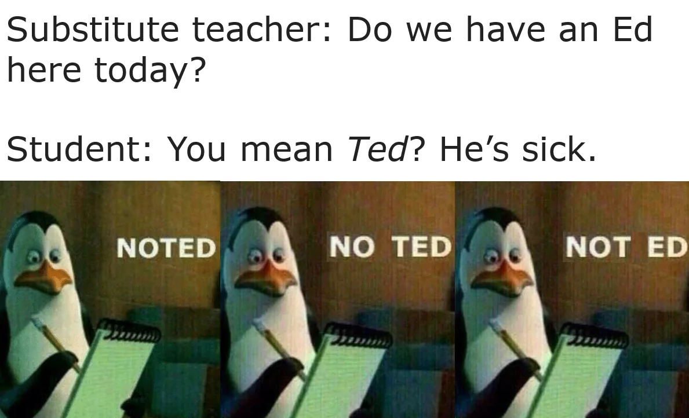

`null`'s public lecture notes
======

<!--  -->


- ооп [oop/](oop/)
- ассемблер [asm/](asm/)
- вычмат [compmat/](compmat/)
---
- матлогика [matlog/](matlog/)
- теория вероятностей [probtheo/](probtheo/)
- ~~ф~~ шизика [phys/](phys/)
---
- English [eng/](eng/)
  - > Vanechkin, do you speak it?
- право [legalese/](legalese/)
  - > канцелярит самый дурацкий язык програмирования
- экология [eco/](eco/)
- философия [philo/](philo/)
---
- расписание (старое! TODO) [sched/](sched/)
  <!-- > [!CAUTION]
  >
  > я его не обновлял! -->
- мусор всякий `misc/`

<!-- $D=b^2-4ac$ -->

<!-- |false|false|
|-----|-----|
|false|false -->

<!-- ```math
\left(
    \begin{matrix}
    1 2 & 3 4 \\
    5 6 & 7 8
    \end{matrix}
\right)
``` -->

<!-- ```math
\begin{array}
1 & 2 
\hline
3 & 4
\end{array}
``` -->

<!-- $$A \text{ AA } \dot{A} \mathring {\text A} \overset{\circ} A \mathring A$$ -->
